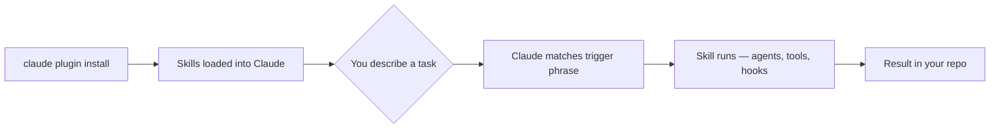

# Roxabi-plugins


Open-source Claude Code plugins by [Roxabi](https://github.com/Roxabi). Context engineering tools for teams using Claude Code.

## Why

Every team using Claude Code ends up reinventing the same things: documenting their workflow in `CLAUDE.md`, writing custom slash commands for code review, figuring out how to structure CI setup prompts, syncing docs after a refactor. It works, but it's disposable — none of it is reusable across projects.

Roxabi plugins are the reusable layer on top of Claude Code. Each plugin ships opinionated, battle-tested skills and agents for a specific domain. Install what you need, skip what you don't, and get consistent AI-assisted workflows across every project without starting from scratch.

## Quick Start

```bash
# 1. Add the marketplace (once per machine)
claude plugin marketplace add Roxabi/roxabi-plugins

# 2. Install the plugin you need
claude plugin install dev-core        # full dev lifecycle
claude plugin install web-intel       # URL research + analysis
claude plugin install compress        # token-efficient skill notation
```

Then trigger any skill by describing what you want — no slash commands to memorize:

```
"start working on issue #42"    → /dev
"improve readme"                → /readme-upgrade
"sync docs after this refactor" → /doc-sync
"scrape and summarize this URL" → /summarize
```

## How it works

Each plugin is self-contained: it ships **skills** (trigger-phrase workflows), **agents** (specialized sub-processes), and optionally **hooks** (automated guardrails that run on every tool call). Claude Code discovers and loads them automatically on install.



Plugins are project-agnostic: they read your stack from `.claude/stack.yml` at runtime and adapt to your framework, package manager, and file layout. The same `dev-core` plugin works on a NestJS monorepo and a Django service.

## Plugins

### Development lifecycle

| Plugin | Description |
|--------|-------------|
| [dev-core](plugins/dev-core/README.md) | Full dev workflow — frame, analyze, spec, plan, implement, review, ship. 28 skills, 9 agents, safety hooks. Project-agnostic via `stack.yml` |

### Research & analysis

| Plugin | Description |
|--------|-------------|
| [web-intel](plugins/web-intel/README.md) | Multi-platform URL scraper + 6 analysis skills (scrape, summarize, analyze, roast, benchmark, adapt) |

### Content & branding

| Plugin | Description |
|--------|-------------|
| [linkedin-post-generator](plugins/linkedin-post-generator/README.md) | Generate LinkedIn posts with best practices and visual identity |
| [image-prompt-generator](plugins/image-prompt-generator/README.md) | Generate AI image prompts with style consistency |

### Career tools

| Plugin | Description |
|--------|-------------|
| [cv](plugins/cv/README.md) | Generate and adapt CVs from structured data |
| [linkedin-apply](plugins/linkedin-apply/README.md) | Scrape and score LinkedIn job offers with LLM matching |

### Utilities

| Plugin | Description |
|--------|-------------|
| [compress](plugins/compress/README.md) | Rewrite agent/skill definitions using compact math/logic notation to reduce token usage |
| [1b1](plugins/1b1/README.md) | Walk through a list of items one by one — brief, decide, execute, repeat |
| [get-invoice-details](plugins/get-invoice-details/README.md) | Extract and store invoice details from documents |

### Endorsed marketplaces

External plugin marketplaces we endorse. Install them directly — no vendoring needed.

```bash
claude plugin marketplace add <source>
```

| Marketplace | Description | Source |
|-------------|-------------|--------|
| agent-browser | Headless browser automation CLI for AI agents — navigate, click, fill, screenshot, scrape | [vercel-labs/agent-browser](https://github.com/vercel-labs/agent-browser) |

### Wrapped plugins

High-quality external skills packaged as first-class installable plugins. Roxabi adds versioning, install support, and a README; the source is vendored via `git subtree`. Attribution is in each plugin's README.

| Plugin | Description | Source |
|--------|-------------|--------|
| [frontend-slides](plugins/frontend-slides/README.md) | Zero-dependency HTML presentations — 12 presets, PPT conversion | [zarazhangrui/frontend-slides](https://github.com/zarazhangrui/frontend-slides) |
| [visual-explainer](plugins/visual-explainer/README.md) | Self-contained HTML pages with diagrams and data tables | [nicobailon/visual-explainer](https://github.com/nicobailon/visual-explainer) |
| [react-best-practices](plugins/react-best-practices/README.md) | React/Next.js performance optimization — 58 rules, 8 categories | [vercel-labs/agent-skills](https://github.com/vercel-labs/agent-skills) |
| [composition-patterns](plugins/composition-patterns/README.md) | React composition patterns — compound components, context providers | [vercel-labs/agent-skills](https://github.com/vercel-labs/agent-skills) |
| [web-design-guidelines](plugins/web-design-guidelines/README.md) | Review UI code for Web Interface Guidelines compliance | [vercel-labs/agent-skills](https://github.com/vercel-labs/agent-skills) |

## Data storage

Data-producing plugins store user data in `~/.roxabi-vault/` — never in the repo. Override the location with the `ROXABI_VAULT_HOME` environment variable. Vault functionality is provided by [roxabi-memory](https://github.com/Roxabi/roxabi-memory).

| Plugin | Data location |
|--------|--------------|
| cv | `~/.roxabi-vault/cv/` |
| linkedin-post-generator | `~/.roxabi-vault/content/` (shared) |
| get-invoice-details | `~/.roxabi-vault/invoices/` |
| image-prompt-generator | `~/.roxabi-vault/config/`, `~/.roxabi-vault/image-prompts/` |
| linkedin-apply | `~/.roxabi-vault/linkedin-apply/` |

## Marketplace architecture

Two kinds of plugins live in this repo:

**Native plugins** — built and maintained by Roxabi. We own the full lifecycle: `dev-core`, `compress`, `1b1`, `web-intel`, `cv`, `linkedin-post-generator`, `image-prompt-generator`, `get-invoice-details`, `linkedin-apply`.

**Wrapped plugins** — high-quality external skills with no versioning or install mechanism in their source repo. Roxabi adds plugin structure and vendors the source (via `git subtree` or file copy) so they become installable. Existing wrapped plugins live in `plugins/`: `frontend-slides`, `visual-explainer`, `react-best-practices`, `composition-patterns`, `web-design-guidelines`. New wrapped plugins go into `external/`.

External plugin marketplaces we endorse are tracked in [`.claude-plugin/external-registry.json`](.claude-plugin/external-registry.json) (source of truth). [`.claude-plugin/curated-marketplaces.json`](.claude-plugin/curated-marketplaces.json) mirrors the curated list for runtime discovery — the `/dev-core ci-setup` skill reads it and offers installation — no skill edits needed to add a new endorsed source.

## Contributing

See [CONTRIBUTING.md](CONTRIBUTING.md) for how to add a plugin, wrap an external skill, or improve an existing one.

> [!TIP]
> The fastest way to add a plugin is to follow the step-by-step guide in [CLAUDE.md](CLAUDE.md) — it covers directory structure, frontmatter, marketplace registration, and the commit format.

## License

MIT
