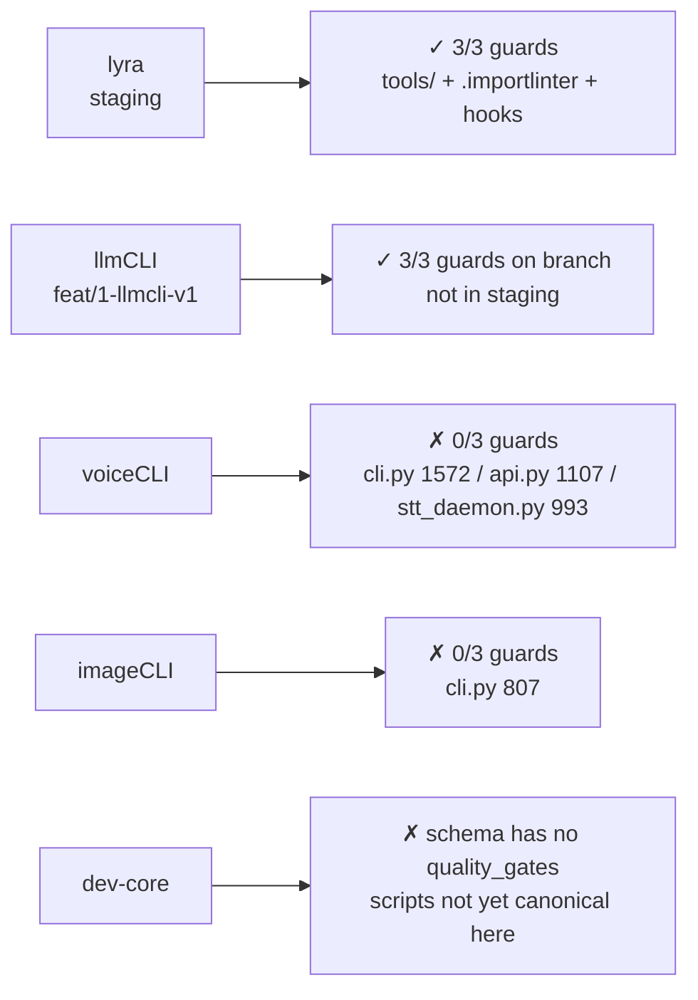
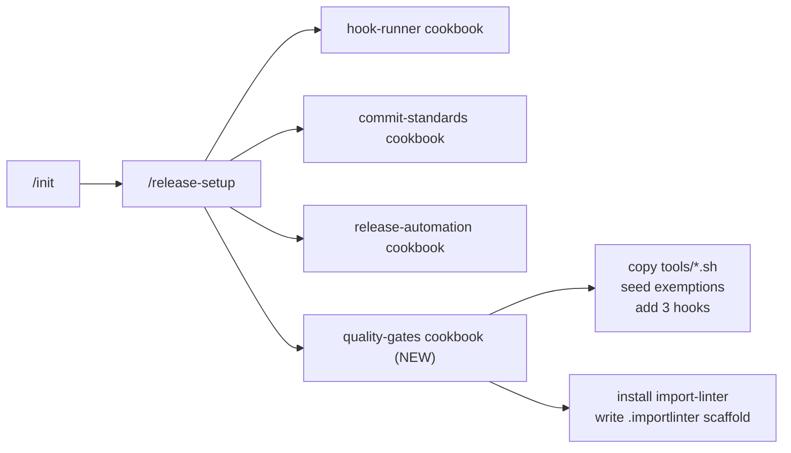

## Source

Issue #114 — "feat(dev-core): add quality_gates section to stack.yml — file length, folder size, import layers" — filed 2026-04-18. Body audits every Roxabi Python repo and flags voiceCLI (0/3 guards, 7 files > 300 LOC), imageCLI (0/3 guards, 7 files > 300 LOC), lyra (3/3, clean), llmCLI (claimed 3/3).

## Problem

Three code-hygiene guards — `check_file_length.sh` (max 300 LOC per Python source), `check_folder_size.sh` (max 12 `.py` files per folder), and `import-linter` (layer contracts) — exist only in `lyra` and on an unmerged `llmCLI` branch. Nothing in `stack.yml` or in `/init` / `/release-setup` declares these guards as a project contract, so scaffolding a new repo via `/init` silently produces a repo without them, and drift is caught late (cli.py 1572, api.py 1107, stt_daemon.py 993).

There is no canonical home for the two shell scripts; copying them per repo guarantees skew (one repo fixes a bug in `check_file_length.sh`, the others never see it).

## Outcome

- `.claude/stack.yml` has an optional `quality_gates:` section whose presence + `enabled: true` is the single trigger for installing each guard
- `plugins/dev-core/tools/` holds the canonical copies of `check_file_length.sh` and `check_folder_size.sh`; project-side copies are stamped from here on every `/release-setup --force`
- `/init` produces a fresh Python repo with the three guards wired and zero manual follow-up
- `/release-setup --force` is safe on a repo that already has all, some, or none of the guards — merges rather than clobbers
- `.importlinter` is generated as a commented-out layer scaffold keyed to the repo's actual `src/` layout (never as a contract that fails out-of-box)
- Acceptance item 5 ("each Roxabi Python repo has at minimum clean file-length + folder-size checks") is tracked via child issues filed against voiceCLI, imageCLI, lyra, llmCLI — each executed in its own `/dev` cycle

## Appetite

- This PR (roxabi-plugins dev-core only): ~2 days
- Coordinated follow-up across four repos: guard-install child issues ~1 day total; voiceCLI behavioral splits are a separate multi-day track

## Verification & Discrepancies

Chain: claim → evidence → source → confidence.

| Issue claim | Verified state | Source | Confidence |
|---|---|---|---|
| lyra has all 3 guards wired | ✓ confirmed — `tools/check_file_length.sh`, `tools/check_folder_size.sh`, `.importlinter`, 3 pre-commit hooks | read files on `staging` | high |
| llmCLI has all 3 guards wired, commit `b01a80b` | ✗ **staging has none** — scripts, `.importlinter` absent; hooks file has only `lint → typecheck → gitleaks → license`. Actual wiring lives on unmerged branch `feat/1-llmcli-v1`, commit `9c6e94f` "chore(quality): port lyra quality gates + split cli into subpackage (#1)" | `git log --all`, `ls`, read `.pre-commit-config.yaml` | high — issue body is factually wrong about sha and branch state |
| voiceCLI: cli.py 1572, api.py 1107, stt_daemon.py 993 | ✓ confirmed via `wc -l` | direct file read | high |
| voiceCLI `src/voicecli/` over 12-file budget | ✓ 19 `.py` files | `find -maxdepth 1` | high |
| imageCLI cli.py 807 | ✓ confirmed via `wc -l` | direct file read | high |
| Hook order: "after typecheck, before gitleaks" | ✗ imprecise — lyra uses `trufflehog` (not `gitleaks`) and the full order is `lint → typecheck → check-file-length → check-folder-size → import-layers → trufflehog → license` | read `.pre-commit-config.yaml` | high |

**Implication for the spec:** the "reference implementation" is lyra on staging, not llmCLI. The llmCLI feat branch is a second data point but not the canonical source. Hook-ordering language must be tool-agnostic (insert anchor = `id: typecheck`, not "before gitleaks/trufflehog").

## Current State Map



## Schema Proposal

```yaml
# .claude/stack.yml
quality_gates:
  file_length:
    enabled: true
    max_lines: 300
    globs: ["src/**/*.py"]
    exemptions_file: tools/file_exemptions.txt
  folder_size:
    enabled: true
    max_files: 12
    globs: ["src/**"]
    exemptions_file: tools/folder_exemptions.txt
  import_layers:
    enabled: true
    stage: pre-push                # pre-commit | pre-push (default pre-push; import-linter is slow)
    config: .importlinter
```

**Defaults.** `quality_gates:` section missing entirely → all three gates off (backwards-compatible, opt-in at the section level). Section present → **each sub-block must be declared explicitly to opt in**; omitting a sub-block means that gate is off (closes the "only wanted import_layers but file_length ran on an un-exempted repo" footgun). Sub-block present → `enabled` defaults to `true`, `max_lines: 300`, `max_files: 12`, default globs and exemption paths as shown.

**Validation behaviour** (in `release-setup` dispatch): unknown key under `quality_gates:` or a sub-block → warn and continue (forward-compatible); missing required sub-key when `enabled: true` → apply the listed default silently; no exception thrown in either case.

## Shapes

### Shape 1 — `/release-setup` cookbook (thin integration)



**How:** New cookbook `plugins/dev-core/skills/release-setup/cookbooks/quality-gates.md`. `release-setup/SKILL.md` gets a `Phase 4.5 — Quality Gates` dispatch line that reads the cookbook. `stack-setup` grows one block in Phase 4 that seeds the `quality_gates:` section when `runtime == python` (values default to `enabled: true`, so `/release-setup` installs automatically on the first run).

**Trade-offs:**
- Pro: matches existing skill architecture (release-setup already owns hook-runner / commit-standards / release-automation cookbooks) — one new cookbook + one dispatch line, small edit surface
- Pro: `/init` picks it up for free (init → release-setup already in the chain)
- Pro: standalone `/release-setup --force` rewires guards without re-running the full init
- Pro: cookbook dispatch pattern gives us idempotent re-run natively
- Con: `release-setup` becomes the de-facto owner of most Python-repo contracts
- Con: quality gates are orthogonal to "release setup" as a concept — name starts to lie

**Rough scope:** M

### Shape 2 — dedicated `/quality-gates` skill

**How:** New skill `plugins/dev-core/skills/quality-gates/SKILL.md`. `/init` and `/release-setup` both invoke it via the `Skill` tool. Standalone callable as `/quality-gates` for surgical re-install.

**Trade-offs:**
- Pro: clean domain — "quality gates" is a first-class concept, discoverable via trigger list
- Pro: standalone callable without the weight of `/release-setup` (which touches commit standards, release automation)
- Con: breaks the release-setup dispatch architecture — release-setup dispatches to *cookbooks* it reads as files, not to *skills* it invokes via the `Skill` tool; Shape 2 forces release-setup to grow a new invocation path just for this feature
- Con: third skill to invoke from `/init` chain — extra orchestration
- Con: new skill = new README, new SKILL.md frontmatter, new triggers — documentation tax

**Rough scope:** M+

### Shape 3 — inline in `stack-setup`

**How:** Push all install logic into `stack-setup` Phase 4 (writes stack.yml + copies scripts + seeds exemptions + wires hooks).

**Trade-offs:**
- Pro: one skill does everything
- Con: `stack-setup` is a schema-writer, not a file-copier — violates its single responsibility
- Con: `stack-setup` runs once at init; doesn't give us an idempotent re-install path (which is Acceptance item 3)
- Con: splits the `.pre-commit-config.yaml` concern between stack-setup and release-setup → double-write risk

**Rough scope:** M (but violates separation of concerns)

## Fit Check

**Recommended: Shape 1** (release-setup cookbook).

Alignment with constraints:

| Constraint | Shape 1 | Shape 2 | Shape 3 |
|---|---|---|---|
| Canonical scripts in `plugins/dev-core/tools/` | ✓ | ✓ | ✓ |
| Idempotent `/release-setup --force` (AC item 3) | ✓ native | ✓ (via delegation) | ✗ stack-setup runs once |
| Per-project exemption files | ✓ | ✓ | ✓ |
| `.importlinter` as scaffold, not a failing contract | ✓ | ✓ | ✓ |
| Hook ordering (tool-agnostic, anchored on `id: typecheck`) | ✓ cookbook merges into existing hooks | ✓ | partial — cross-skill coordination |
| Backwards-compat (opt-in) | ✓ default-off when section absent | ✓ | ✓ |
| Single source of install logic | ✓ | ✓ | ✗ shared with stack-setup |
| Fits release-setup dispatch pattern (cookbook, not Skill call) | ✓ | ✗ | ✓ |

**Shape 2 eliminated on dispatch-architecture mismatch:** release-setup dispatches to cookbook files it reads; introducing a Skill-tool call just for quality gates is a one-off break in the pattern that has no payoff (Shape 1 already delivers standalone re-run via `/release-setup --force`).

**Shape 3 eliminated on Acceptance item 3:** stack-setup runs once; AC item 3 explicitly mandates an idempotent re-install path.

## Decisions Locked (resolved open questions)

- **File-creation ownership:** `stack-setup` writes only the schema block; `release-setup` owns all file writes (scripts, exemption files, `.importlinter`, hook entries). `stack-setup` never touches the filesystem outside `.claude/`.
- **`import-layers` hook pass condition:** zero active contracts = pass. The `.importlinter` scaffold ships with all contracts commented out; `lint-imports` on a contract-less config returns 0.
- **`import-layers` hook stage:** defaults to `pre-push` in the generated `.pre-commit-config.yaml` (import-linter re-analyzes the whole graph on every commit; on voiceCLI post-split this grows). Overridable via `quality_gates.import_layers.stage: pre-commit` in `stack.yml` for small projects.
- **Exemption-file line format:** `<path> <issue-url>` — single space separator, not tab. Grep pattern in both shell scripts becomes `grep -qE "^${path_escaped}([[:space:]]|$)"` to avoid matching prefix paths. Seeded header comment documents the format.
- **uv dependency group:** `import-linter` goes into `[dependency-groups].dev` (matches lyra). The cookbook's GitHub Actions guidance must require `uv sync --group dev` (or `--all-groups`) in the CI install step, else `lint-imports` won't be on PATH in CI.

## Risks & Mitigations

| Risk | Severity | Mitigation |
|---|---|---|
| Behavior-preserving splits of voiceCLI `cli.py` (1572), `api.py` (1107), `stt_daemon.py` (993) | **high** | Out of scope for this PR. Filed as a separate voiceCLI "splits" child issue (not bundled with the guard-install child issue) |
| Hook insertion logic fails when `stages: [pre-push]` anchor absent | med | Insertion anchor is `id: typecheck` (universal), not a `stages:` scan. Fallback: if no `id: typecheck`, DP(A) asks user to confirm placement |
| `.importlinter` contracts that fail on fresh install | med | Ship `.importlinter` with every contract commented out + a `# TODO` block explaining how to model layers; contract-less config = pass (see Decisions Locked) |
| Idempotency collision on lyra (already has everything) | med | **With `--force`:** re-stamp `entry:` paths from canonical `plugins/dev-core/tools/` regardless of current content (drift correction). **Without `--force`:** any `id:` match is a no-op; `entry:` divergence is printed as a diff warning, not auto-fixed |
| Hook merge strategy is under-specified | med | Cookbook owns the concrete merge algorithm: parse `.pre-commit-config.yaml` as YAML; for each new hook, if `id:` exists under the same repo block, skip (or re-stamp under `--force`); otherwise insert after the `id: typecheck` entry. No text-substitution edits |
| Exemption file missing at hook runtime | low | Both shell scripts already guard with `[ ! -f "$EXEMPT_FILE" ] && return 1` in the lookup function (treats absent file as "no exemptions"). Cookbook seeds empty files with header anyway, so this is defense-in-depth |
| Schema `enabled` default for an omitted sub-block | low | Closed — absent sub-block = gate off. Presence of `quality_gates:` does NOT auto-enable gates whose sub-block is omitted (see Schema Proposal) |
| Schema unknown keys break older dev-core | low | `quality_gates:` is opt-in and the entire block is ignored by skills that don't know about it |
| llmCLI feat branch never merges | low | PR lands without depending on llmCLI state; llmCLI child issue is "merge feat branch, then run /release-setup --force" |
| `roxabi-plugins` itself (TypeScript/Bun) accidentally installs Python guards | low | Already prevented by opt-in schema (section absent = off). Cookbook's `runtime == python` guard is belt-and-suspenders, kept for defensive clarity |

## Files Impacted (this PR)

| File | Action | Notes |
|---|---|---|
| `plugins/dev-core/tools/check_file_length.sh` | create | Verbatim copy of lyra's; header comment notes "canonical source in dev-core" |
| `plugins/dev-core/tools/check_folder_size.sh` | create | Same |
| `plugins/dev-core/skills/release-setup/cookbooks/quality-gates.md` | create | New cookbook — canonical install logic, merge algorithm, idempotency rules |
| `plugins/dev-core/skills/release-setup/SKILL.md` | edit | Add Phase 4.5 dispatch + extend Phase 0 / 5 ledger |
| `plugins/dev-core/skills/release-setup/README.md` | edit | Document new phase |
| `plugins/dev-core/skills/stack-setup/SKILL.md` | edit | Phase 4 template: if python → seed `quality_gates:` block (all three sub-blocks enabled by default for a new python project) |
| `plugins/dev-core/skills/stack-setup/README.md` | edit | Document new schema field |
| `plugins/dev-core/stack.yml.example` | edit | Document `quality_gates:` section with commentary |
| `plugins/dev-core/README.md` | edit | Mention quality gates in feature list |
| `docs/CREATE-PLUGIN-GUIDE.md` | check-and-edit | `grep stack.yml docs/CREATE-PLUGIN-GUIDE.md`; if the guide references the schema, add `quality_gates:` to the example snippet; otherwise no-op |

Tests: cookbook changes exercised via manual smoke test — (a) fresh bun-free Python scratch repo, (b) lyra re-run (expect idempotent), (c) a mid-state repo (llmCLI-like: lint + typecheck + gitleaks + license, no guards) to verify insertion anchor + merge algorithm.

## Coordinated Follow-up (tracked, not executed in this PR)

Each repo gets two child issues to separate low-risk guard installation from high-risk behavioral splits:

| Repo | Child issue A (low risk, fast) | Child issue B (if needed, slower) |
|---|---|---|
| voiceCLI | Run `/release-setup --force`; seed `tools/file_exemptions.txt` + `tools/folder_exemptions.txt` entries referencing issue B | Behavior-preserving splits of `cli.py` / `api.py` / `stt_daemon.py` + `src/voicecli/` folder restructure — multi-day track, own `/dev` cycle |
| imageCLI | Run `/release-setup --force`; seed exemption for `cli.py` (807) referencing issue B | Split `cli.py`; evaluate 500+ LOC engine files; separate PRs per engine |
| lyra | Run `/release-setup --force` to pick up `quality_gates:` section + re-stamp scripts from dev-core; drift check | — (no splits expected) |
| llmCLI | Merge `feat/1-llmcli-v1` first; then `/release-setup --force` to re-stamp from canonical scripts; verify import-linter contracts still pass | — (splits already on branch) |

Tracking links are added to this issue on PR merge.

## Open Questions

1. **Re-stamp lyra's scripts from dev-core on the first `/release-setup --force` against lyra?** Frame's migration constraint says yes (dev-core becomes canonical). Confirming because lyra's scripts might have drifted post-copy; spec should lock the direction.
2. **Default import-layers stage in generated config: `pre-push` (recommended) vs `pre-commit` (matches current lyra)?** The `stage: pre-push` default is new guidance; spec must decide whether `/release-setup --force` on lyra also flips lyra's existing `pre-commit` → `pre-push` (correction) or leaves it alone (preserve).
