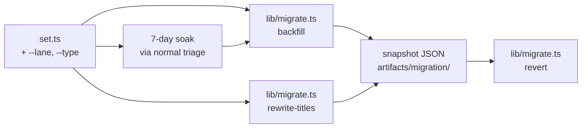

## Source

> "lets do all ! I want the final long term product now !" — frame approval, 2026-04-22.

Backed by parent spec `artifacts/specs/119-issue-taxonomy-migration-spec.mdx` §Phase 3–5 and the phase 0–2 deliverables already merged (#123, #124).

## Problem

Parent spec assumed `dev-core:issue-triage` writes legacy labels (`graph:lane/*`, `size:*`) and prepends conventional-commit prefixes to titles. **It does not.** Verified at `plugins/dev-core/skills/issue-triage/lib/set.ts`: the only write surface is `updateField` on the hub project (Status/Size/Priority). No label writes, no title mutation. Phase 0 (#123) shipped the SSoT and Phases 1+2 (#120 → PR #124) shipped the hub project + auto-add workflow + bootstrapped Issue Types.

Therefore "dual-write" as written in the parent spec is moot — there is no legacy write path to keep parallel. What is actually missing for the slice to deliver Phase 5 exit criteria:

| Gap | Where | Evidence |
|---|---|---|
| `Lane` field write missing | `set.ts` only writes Status/Size/Priority — no `--lane` arg, no `LANE_FIELD_ID` in `config-helpers.ts` | `grep -n "LANE\|lane" plugins/dev-core/skills/issue-triage/lib/set.ts` → 0 hits |
| `issueType` assignment missing | `set.ts` never calls `updateIssueIssueType`; mutation exists in `shared/queries.ts:436` but only used by `init/hub-bootstrap.ts` for type creation | `grep -n "updateIssueIssueType" plugins/dev-core/skills/issue-triage/` → 0 hits |
| Hub items lack `Lane`/`Size`/`Priority`/`issueType` for ~192 open issues | New project, fresh fields | See backfill volume table below |
| Title prefixes still embedded | Sample lyra issues: `chore(provision): …`, `feat(dep-graph): …`, `refactor(skills): …` | `gh issue list --repo Roxabi/lyra ... \| jq` |
| Source data for backfill is **heterogeneous** across repos | Only `lyra` + `voiceCLI` have any taxonomy labels; 5 others have none | `gh label list --repo Roxabi/<r> \| grep -E '^(graph:\|size:)'` |

Additional surprises that contradict the parent spec's assumptions:
- **`Roxabi/2ndBrain` does not exist as a GitHub repo** — `gh issue list --repo Roxabi/2ndBrain` returns `Could not resolve to a Repository`. Local-only project per `~/projects/CLAUDE.md`. **Real enrolled set is 7 repos, not 8.**
- **`voiceCLI` has `size:S/M`** (old scheme) — not `S/F-lite/F-full`. Mapping needed: `M → F-lite`. No `size:L/XL` observed → no mapping for `F-full` from labels.
- **`lyra` issues carry priority via `P0..P3-<name>` labels** (e.g. `P1-high`, `P2-medium`) — usable as Priority backfill source. Spec said no legacy source for Priority; this is wrong.
- **`lyra` also uses `area:*` labels** (e.g. `area:infra`) — orthogonal to taxonomy, not migrating.
- **`hub-bootstrap.ts` uses `SIZE_OPTIONS = ['S', 'F-lite', 'F-full']`** but `config-helpers.ts:DEFAULT_SIZE_OPTIONS = ['XS', 'S', 'M', 'L', 'XL']`. Two schemas coexist in code; need to reconcile so backfill writes the correct option set.

## Outcome

Closing #121 means production state matches parent spec Phase 5 exit criteria across **all 7 enrolled repos** (corrected from 8):

- `dev-core:issue-triage set` accepts `--lane <X>` and `--type <conventional-type>` and writes both to the hub project / org `issueType`.
- Hub project items for **every open issue** in the 7 repos have `Lane`, `Size`, `Priority`, `issueType` populated (or explicitly flagged as `null` after manual review for `Priority` where no label source exists).
- **No open issue title** matches `^(feat|fix|refactor|docs|test|chore|ci|perf)(\(.+\))?:` across the 7 repos.
- Snapshot JSON committed for both backfill and title-rewrite runs — full reversibility via `revert_*.ts` companions.
- `#122` (cutover + guardrail) is unblocked: dep-graph reader can rely on field values being present everywhere.

## Appetite

**3–4 active days of code work + 7-day wall-clock soak window.** Bulk of code is small (≤500 LOC across 3 surfaces); the bottleneck is the soak gate, not the implementation. After the soak completes, backfill + rewrite + verification ≤1 day.

## Shapes

### Shape A — Stick-to-spec: Python migration scripts, dual-write proper

Implement parent spec verbatim. Re-introduce legacy-label writes in `set.ts` so a true "dual-write" exists, then build `scripts/migrate/backfill_taxonomy.py`, `rewrite_titles.py`, `revert_backfill.py` in Python (PyGithub or hand-rolled GraphQL via `httpx`). Run 7-day window with both writes occurring. Backfill + rewrite via Python.

**Trade-offs:**
- Pro: matches the parent spec word-for-word; scripts/migrate/ stays Python (consistent with dep-graph in `lyra/scripts/dep-graph/`); legacy-label writes provide a real safety net (revert = drop project field updates).
- Con: re-adds legacy code that **never existed** so we can immediately tear it out in #122 — pure churn. Introduces Python toolchain to a Bun/TypeScript repo (new `pyproject.toml`, `uv` dep set, second test runner). 192 issues is well under what Python's batching helps with. Doesn't reuse the existing TS adapters (`getItemId`, `updateField`, `updateIssueIssueType`).

**Rough scope:** L (~800 LOC, 2 languages, 2 test setups).

### Shape B — Skill-resident migration: TypeScript end-to-end ← recommended

Extend `set.ts` with `--lane` and `--type` (implements Phase 3's *intent* — write the new fields the skill currently misses; "dual" collapses to "single new write path" because no legacy write exists). Add a new subcommand `bun triage.ts migrate <backfill|rewrite-titles> [--repo R] [--dry-run] [--snapshot path]` in `plugins/dev-core/skills/issue-triage/lib/migrate.ts` that reuses the same adapters. 7-day window becomes a **soak** of normal triage activity through the new write paths, not a parallel-write window.

**Trade-offs:**
- Pro: zero new deps, single language, reuses every existing adapter (`getItemId`, `updateField`, `getNodeId`, `updateIssueIssueType`); idempotent by construction (each mutation reads current field value, skips if set); dry-run + snapshot are 30 LOC of file IO; revert is symmetric. Accurate naming (no "dual" misnomer). One commit per concern (`feat(skill): --lane + --type` / `feat(skill): migrate backfill` / `feat(skill): migrate rewrite-titles`).
- Con: deviates from parent spec terminology — must justify the rename in the spec doc (small spec patch in #121's spec). Mixes one-shot migration code into the skill (lives at `lib/migrate.ts` — clearly named, deletable post-#122 if desired).

**Rough scope:** M (~500 LOC TS, single test runner, ≤4 commits).

### Shape C — Hybrid: skill change + standalone Python scripts

Extend `set.ts` with `--lane`/`--type` (Shape B's write path), but keep backfill/rewrite as new Python scripts in `scripts/migrate/` (Shape A's scripts).

**Trade-offs:**
- Pro: write-path lives in skill (clean); migration scripts live in `scripts/migrate/` (clean separation of concerns).
- Con: still introduces Python toolchain for ≤300 LOC of one-shot scripts. Two languages to maintain over the slice. Snapshot/revert duplicates serialization logic across TS (skill side) and Python (script side) if any of the migration logic ever needs to be re-runnable from triage.

**Rough scope:** M+ (~600 LOC across two languages).

## Fit Check

| Criterion | A | B | C |
|---|---|---|---|
| Matches reality (no legacy write to dual) | ✗ | ✓ | ✓ |
| Reuses existing adapters | ✗ | ✓ | partial |
| Zero new deps | ✗ | ✓ | ✗ |
| 7-day window meaningful | ✓ (true dual-write) | ✓ (soak burn-in) | ✓ (soak burn-in) |
| Reversible | ✓ | ✓ | ✓ |
| Total LOC | ~800 | ~500 | ~600 |
| Languages | 2 | 1 | 2 |
| Aligns with feedback memory ("reuse over add") | ✗ | ✓ | partial |

**Recommended: Shape B.** It delivers the same Phase 5 exit criteria with less code, one language, and zero churn (no legacy-write code added just to be removed). The deviation from spec wording is honest — the spec was written assuming code state that does not exist, so the spec for #121 must amend that assumption regardless of which shape we pick.

**Risks specific to Shape B:**

1. **Soak vs dual-write semantics.** Without a parallel legacy write, "rollback" during the 7-day window means: revert the skill commit (Lane/Type writes stop) — hub items keep their values. No data loss. **Mitigation:** spec the rollback explicitly; ensure `--lane` and `--type` are *additive* arguments (omitting them = old behavior), so rollback = "stop passing the args" or revert the binary.
2. **`area:*` labels in lyra and `voiceCLI` size:M.** Backfill must map known legacy → field values; unknowns flagged. **Mitigation:** ship a `LEGACY_LABEL_MAP` constant in `migrate.ts` with an explicit map; everything else flagged for manual review.
3. **`size:S/M/L/XL` ↔ `S/F-lite/F-full` reconciliation.** `config-helpers.ts:DEFAULT_SIZE_OPTIONS` and `hub-bootstrap.ts:SIZE_OPTIONS` disagree. Whichever schema is **live in the hub project** (verify via `gh project field-list 23 --owner Roxabi`) is canonical; backfill maps to that and `DEFAULT_SIZE_OPTIONS` is updated to match. **Mitigation:** include this reconciliation in the spec; surface as a one-line schema audit before backfill runs.
4. **Backfill volume = ~192 issues, lyra = 153 of them.** Rate limits on `updateProjectV2ItemFieldValue` are GraphQL-mutation limits — well below threshold for 192 calls × 4 fields × 2 (dry-run + live). **Mitigation:** none needed; mention in spec for completeness.
5. **`Roxabi/2ndBrain` ghost.** Spec, frame, and `~/projects/CLAUDE.md` all assume it exists as a GitHub repo. **Mitigation:** correct the enrolled-repos list to the real 7 in this slice's spec; surface the discrepancy in PR body so any future docs (`issue-taxonomy.md`) get patched once.

## Files Impacted

| Path | Change | LOC |
|---|---|---|
| `plugins/dev-core/skills/issue-triage/lib/set.ts` | add `--lane` + `--type` parsing + apply functions | ~60 |
| `plugins/dev-core/skills/shared/adapters/config-helpers.ts` | add `LANE_FIELD_ID`, `LANE_OPTIONS`, reconcile `DEFAULT_SIZE_OPTIONS` | ~30 |
| `plugins/dev-core/skills/issue-triage/triage.ts` | route `migrate` subcommand | ~10 |
| `plugins/dev-core/skills/issue-triage/lib/migrate.ts` (new) | `backfill`, `rewriteTitles`, `revert` with snapshot IO | ~280 |
| `plugins/dev-core/skills/shared/adapters/github-adapter.ts` | export `updateIssueIssueType` wrapper if not already exported | ~20 |
| `plugins/dev-core/skills/issue-triage/__tests__/migrate.test.ts` (new) | dry-run + snapshot + idempotency tests | ~120 |
| `plugins/dev-core/skills/issue-triage/__tests__/set.test.ts` | add `--lane` / `--type` cases | ~40 |
| `plugins/dev-core/skills/issue-triage/SKILL.md` | document `--lane`, `--type`, `migrate` | ~30 |
| `plugins/dev-core/references/issue-taxonomy.md` | patch enrolled-repos list (8 → 7), reconcile size schema note | ~10 |
| `artifacts/migration/` (new dir) | snapshot JSONs (committed) | data |

**Total ~600 LOC** including tests + doc patches.

## Open questions for spec

1. **Soak duration:** keep parent spec's 7 days, or shorten to 3 (since soak is just burn-in, not a parallel-write safety window)? **Suggested: keep 7 days** — small operational cost vs. confidence in write paths before mass backfill.
2. **Backfill ordering:** `roxabi-plugins` first → `lyra` → other 5 in parallel, OR all 7 at once via `--repo all`? **Suggested: serial per-repo with explicit order** — gives clean diff per commit, easier to bisect issues.
3. **Snapshot location:** `artifacts/migration/` (committed, repo-stable) vs `~/.roxabi-vault/migration/` (per global rule "zero personal data ∈ repo"). Issue numbers + titles + lane labels are not personal data → repo is fine. **Suggested: `artifacts/migration/`** committed for auditability.
4. **`area:*` labels:** untouched (not in taxonomy) or mapped somehow? **Suggested: untouched** — they're an orthogonal concern (lyra-only convention).
