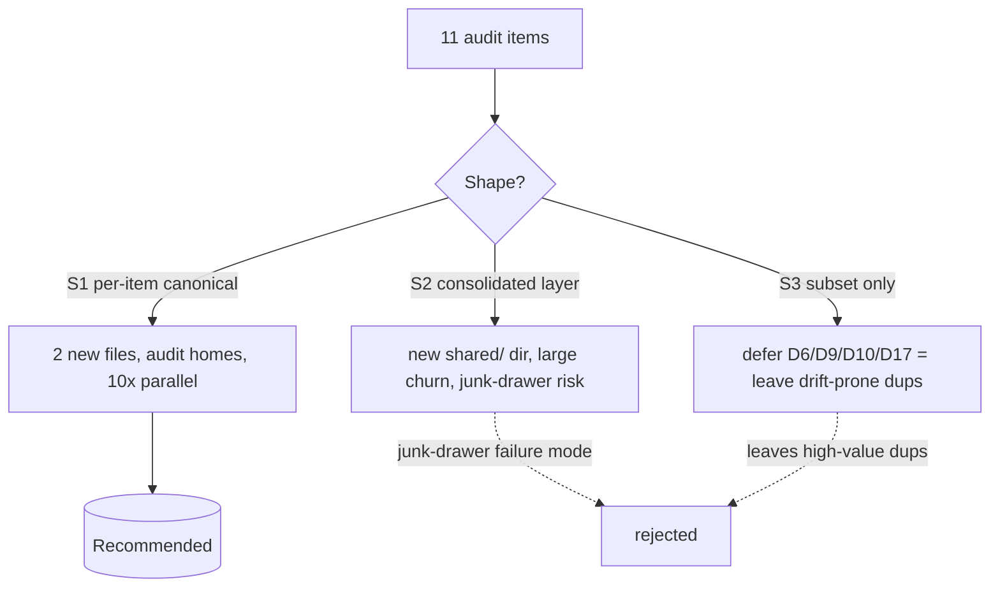

## Source

Issue #193 (`refactor`), body = a dev-core audit listing 11 duplicated helpers
(D5, D6, D8, D9, D10, D13, D14, D16, D17, D18, D19) with file:line + a one-line
resolution each. "Small duplications from dev-core audit, each extract is XS-S."

## Problem

11 helpers are duplicated across the `dev-core` plugin. Some byte-identical, some
same-algorithm/different-name, some already silently diverged. Each future edit to
a duplicated helper must be applied N times or drift. The audit pre-supplies
canonical targets, but 3 unknowns and several behavior nuances were unverified —
this analysis resolves them so `/spec` can commit safely.

## Outcome

Each in-scope helper has exactly one definition, imported at all former sites;
CLI output byte-identical (or, where a deliberate change is made, proven by test).
No new divergence-prone copies remain. The map below is precise enough that 11
extractions can run as conflict-free parallel work units.

## Appetite

Per-item XS–S; aggregate ≈ 1 short cycle. No appetite for a new shared-package
abstraction or cross-plugin unification.

## Unknowns — Resolved

**U1 · dev-init duplicate copies → LEAVE UNTOUCHED (dev-core only).**
`config-helpers.ts`, `migrate.ts`, `ports/workspace.ts` exist in both plugins, but
dev-init was extracted as an *intentional independent copy* in `f24474e`
("copies shared/ lib for self-contained imports"). No sync mechanism exists
(`tools/` = license+validate only; `lefthook.yml` = no cross-plugin copy).
`migrate.ts` is a *different file* (919-line taxonomy tool vs 68-line board
seeder). `config-helpers.ts` already diverged (Bun `spawnSync` vs node `execSync`;
dev-core has extra `getSizeOptionId`). `ports/workspace.ts` is incidentally
identical but nothing keeps it so. → #193 is dev-core-internal; dev-init excluded.

**U2 · D13 workspace divergence → DROP `vercel*` legacy (dead).**
`workspace-store.ts` re-declares `WorkspaceProject`/`Workspace`/`VercelProjectRef`
locally and carries two extra fields `vercelProjectId` / `vercelTeamId` not in
`ports/workspace.ts`. Both are **dead** — zero `.vercelProjectId`/`.vercelTeamId`
reads anywhere; an inline comment already says "Legacy single-project fields
removed — use vercelProjects[]". The array form `vercelProjects[]` is live
(`dashboard.ts:97,142`). → drop the 2 dead fields, delete local interfaces, import
from `ports/` (SSoT). 4 type-import sites to repoint (see map).

**U3 · D17 topo-sort → the two impls have DIFFERENT tie-break (behavior risk).**
`graph.ts:33` breaks ties by **input order** (stable); `table-formatter.ts:245`
breaks ties by **numeric ascending** (explicit `.sort()` each round + on cycle
dump). A naive single shared function WOULD change one caller's output ordering.
→ shared `topoSort` must parametrize the tie-break; each caller keeps its current
behavior. Cosmetic (SVG node column order / chain display order) but must be
test-locked.

## Shapes

### Shape 1: Per-item canonical extraction (audit-aligned)

Each helper moves to the audit's prescribed canonical home; only 2 genuinely new
files (`constants.ts`, `topo-sort.ts`). Extractions are mutually independent.

**Trade-offs:**
- Pro: smallest diff; honors the audit's per-item canonical decisions; 10 items
  parallelizable; avoids inventing a new abstraction (matches appetite).
- Pro: directly kills the divergence-prone dups (priority maps, workspace, sort).
- Con: shared helpers stay spread across existing `lib/` files (no single "shared
  helpers" home); doesn't answer the broader "where do helpers live" question.

**Rough scope:** M

### Shape 2: Consolidated shared helper layer

Invent `skills/issues/lib/shared/` (string.ts, format.ts, ci.ts…) and route ALL
extractions there uniformly, overriding the audit's scattered canonical homes.

**Trade-offs:**
- Pro: one discoverable home for shared helpers; less cross-`lib/` import spaghetti.
- Con: larger diff + more import churn; **risks the junk-drawer failure mode** the
  frame explicitly guards against; diverges from audit decisions for no functional
  gain; over-engineers a "each extract is XS-S" task.

**Rough scope:** L

### Shape 3: High-confidence subset only

Extract only the unambiguous behavior-preserving items (D5, D8, D14, D16, D18) +
D13; defer the nuanced ones (D6, D9, D10, D17).

**Trade-offs:**
- Pro: lowest risk, fastest, no behavior-change debate.
- Con: leaves the **most** drift-prone dups (priority maps, topo-sort) in place —
  the highest-value targets; only a partial solve, issue stays half-open.

**Rough scope:** S–M

## Fit Check

**Shape 1 — recommended.** It is the only option that (a) honors the audit's
canonical constraints, (b) fits the XS–S appetite, (c) avoids the frame's stated
junk-drawer failure mode, and (d) still removes the divergence-prone dups. Shape 2
over-engineers (the "simplest alternative" comparison from the frame eliminates
it). Shape 3 under-delivers (leaves priority-map + sort drift in place).

**Execution = risk-tiered batches** (drives the plan's parallel grouping):

| Tier | Items | Nature | Test need |
|------|-------|--------|-----------|
| A · trivial, behavior-preserving | D5, D8, D14, D16, D18 | byte-identical / inline move | existing suite |
| B · needs care (param/nuance) | D6, D9, D10 | output contract / subset differs | add focused unit tests |
| C · behavior-locked | D17 | algo change + tie-break param | **new order-equivalence tests** |
| D · reconciliation | D13 | drop dead fields, repoint types | type-check + dashboard test |
| ✗ · dropped | D19 | client-scope false positive | n/a |

## Extraction Map

| Item | Source (file:line) | Canonical target | Rewire sites | Risk |
|------|-------------------|------------------|--------------|------|
| D5 `parseBlockedBy` | digest-helpers.ts:38 (already `export`) = show.ts:17 | digest-helpers.ts | show.ts:136 → import; drop local | low |
| D6 `progressBar`/`bar` | digest-helpers.ts:57 vs show.ts:53 | digest-helpers.ts `progressBar` + **opts** | show.ts:181 passes `{suffix:true}`; check digest.ts callers | **med** — diff output contract (suffix; `''` vs `░░░░░` on 0) |
| D8 `formatRef` (inline ×11) | set.ts:210/220/230/240/255/265/291 · create.ts:127/136/145/154 | **existing** `shared/domain/parse-issue-ref.ts` (add `formatRef(ref: ParsedIssueRef)`) | 11 sites; import already wired (set.ts:34, create.ts:27) | low — *audit said "new file"; it already exists* |
| D9 cleaning chain | components.ts:44 `shortTitle` ≈ table-formatter.ts:217 `shortName` | extract `cleanTitle()` (the 4-replace chain); each keeps own truncate | shortName→cleanTitle; shortTitle→cleanTitle+truncate | **med** — `shortName`≠`shortTitle(_,N)` (thresh 20 vs max, slice 17 vs max-1). table-formatter.ts:34 `shortTitle` is a *different* truncate-only fn, **do not merge** (name trap) |
| D10 `PRIORITY_SHORT`/`_VALUES`/`_ALIASES` | config-helpers.ts:143/158/292 (canonical) vs components.ts:3/37 vs migrate.ts:157 | config-helpers.ts | components.ts:78,127 + page.ts:6,58,596 (via re-export) ; migrate.ts:157 | low (components) / **med** migrate.ts:157 is a 4-key *subset* of ALIASES, not equal — superset-substitution, add test |
| D13 `WorkspaceProject`/`Workspace` | ports/workspace.ts (SSoT) vs cli/lib/workspace-store.ts:9-24 | ports/workspace.ts | workspace-store.ts (drop local + `vercel*`); type imports: cwd-resolver.ts:2, issues.ts:7, github-discovery.ts:3 | med — drop dead fields |
| D14 `mapRawCheck` | fetch-github.ts:206 = :262 (identical) | **co-locate** in fetch-github.ts, export | both sites → `rawChecks.map(mapRawCheck)` | low — *audit said fetch-workflow.ts too; it has none (RawWorkflowRun, different)* |
| D16 `FIVE_MINUTES` | fetch-workflow.ts:19 `FIVE_MINUTES_WR` = fetch-vercel.ts:124 `FIVE_MIN` | **new** `constants.ts` `FIVE_MINUTES_MS` | fetch-workflow.ts:49, fetch-vercel.ts:137 | low |
| D17 topo-sort | graph.ts:33 (input-order) vs table-formatter.ts:245 (numeric-asc) | **new** `topo-sort.ts` `topoSort(ids, getUpstream, tieBreak)` | graph.ts:33→`'input-order'`; table-formatter.ts:245→`'numeric-asc'` | **med** — see U3; new tests |
| D18 `Row`→`BackfillRow` | migrate.ts:201 = :628 (byte-identical fields) | keep `BackfillRow` | migrate.ts:340 → `BackfillRow[]`; drop `Row` | low |
| D19 `escHtml` | components.ts:40 vs page.ts:636/649 | — **DROP** — | none | ✗ page.ts:636/649 are **client-side JS** inside a `<script>` template literal; server `escHtml` import impossible. False positive. |

**New files:** `skills/issues/lib/constants.ts`, `skills/issues/lib/topo-sort.ts`
(only 2 — `parse-issue-ref.ts` already exists; `mapRawCheck` co-located).

**Out of scope but noted:** `CICheck` type itself is duplicated (types.ts:22 vs
shared/domain/types.ts:34); `set.ts:120 subjectStr` is a primitive-arg cousin of
`formatRef`. Both absent from the audit → leave (optional follow-up issues).

## Expert Review

Architect pass (focused on the 3 introduced judgment calls): **ship as-is**, no
blocking concerns.
- D17 generic `topoSort(ids, getUpstream, tieBreak)` — correct; callback boundary
  is the exact seam where caller types diverge; two adapters would add indirection
  for zero gain.
- D9 `cleanTitle` lives in `components.ts` (not a new util) — 2 callers, same dir,
  consistent with existing exports; single parametrized shortener rejected (couples
  two display contracts).
- D14 `mapRawCheck` co-located — correct; moving it would force exporting the
  file-private `RawCheckNode` GraphQL shape.
- Import-direction check (raised, resolved): `components.ts` imports only `./types`
  → `lib/* → components.ts` is acyclic (`graph.ts:1` already imports from it). Safe.

## Open Question for /spec

D17 & D9 both *could* accept a tiny cosmetic behavior change to simplify
(single tie-break / single truncate) instead of parametrizing. Default
recommendation = **preserve behavior** (parametrize), but flag for the spec to
confirm whether the team prefers strict-preserve vs simplest-code.
