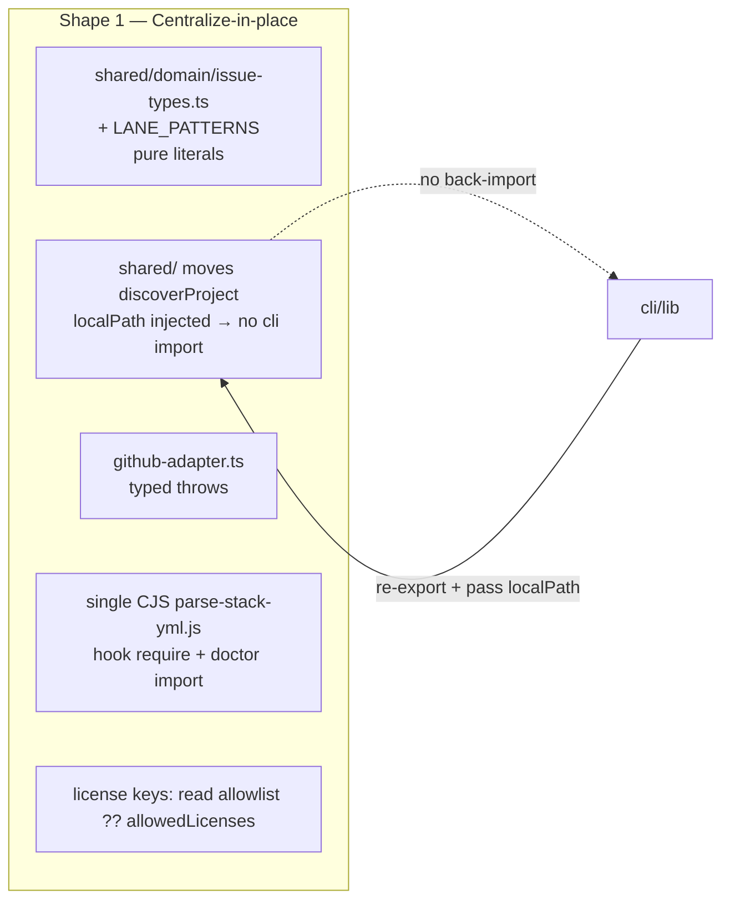

## Source

> Architectural / single-source-of-truth issues from dev-core audit. (Issue #195, 7 checklist items.)

## Problem

The dev-core shared layer carries debt in three shapes: an **architecture** violation
(`shared/adapters` ↔ `cli/lib` mutual import → cycle; a dead error hierarchy), three
**SSoT** divergences (issue-types, stack.yml parser ×3, license policy keys) that already
drifted, and one **portability** leak (Roxabi product strings hardcoded in an OSS plugin).

Finding #3 (`config-helpers` `execSync`) is **already resolved** in dev-core (commit
`1644dd8`) — verify-only.

## Outcome

Finding-level resolution (maps 1:1 to spec acceptance criteria):

| # | Resolved when |
|---|---------------|
| 1 | `shared/adapters/git-workspace.ts` has zero imports from `cli/` (import-graph cycle count = 0) |
| 2 | every throw in `github-adapter.ts` uses a typed class from `errors.ts`; 0 raw `new Error()` for GitHub/config failures |
| 3 | verify-only — `config-helpers.ts` confirmed `execSync`-free (already true) |
| 4 | one `ISSUE_TYPE_NAMES`/`EXTENDED_ISSUE_TYPES` source; `set.ts` + `migrate.ts` import it; duplicate-list count ≤ 1 |
| 5 | one stack.yml parser consumed by both the hook and doctor; parser count ≤ 1 |
| 6 | `lane()` reads patterns from a named constant (default preserved); 0 inline Roxabi strings in the function body |
| 7 | TS + Python license checkers accept the same policy key; deployed `.license-policy.json` still parse |

No behavior change for any skill, CLI command, or hook.

## Appetite

1 cycle (F-full). Pure debt paydown — no new features.

## Current-State Map (verified)

| # | Finding | Status | Exact site | Fix surface |
|---|---------|--------|-----------|-------------|
| 1 | dep inversion | valid | `git-workspace.ts:5-6` ↔ `cli/lib/{github-discovery,workspace-store}.ts` | move `discoverProject` + ws-store types **down** into `shared/`, **injecting `localPath` as a param** so the moved fn keeps zero cli import (see decision #5 below); cli re-exports for back-compat |
| 2 | dead error hierarchy | valid | `errors.ts` 5 classes, 0 thrown; `github-adapter.ts` 12× `new Error()` | wire `GitHubApiError`/`ConfigError`/`DevCoreError` at throw sites (additive — all extend Error) |
| 3 | execSync | **resolved** (dev-core) | `config-helpers.ts` 100% `Bun.spawnSync` | none in dev-core (dev-init copy still `execSync` — out of scope per frame) |
| 4 | issue-type SSoT | valid | `set.ts:163 VALID_TYPES` vs `github-infra.ts STANDARD_LABELS` vs `migrate.ts LEGACY_LABEL_MAP` | new **pure** module `shared/domain/issue-types.ts` exports the constants; `set.ts`+`migrate.ts` import it (NOT config-helpers — avoids its import-time `Bun.spawnSync` side-effect) |
| 5 | stack.yml parser ×3 | valid | `format.js`(JS hook) + `doctor.ts:244` + `doctor.ts` checkSecurity inline | single CJS helper consumed by both hook (`require`) and doctor (Bun import) — see decision #1 |
| 6 | Roxabi hardcode | valid | `digest-helpers.ts:86 lane()` regex `brand\|lora\|v23\|avatar\|pulid` | `LANE_PATTERNS` constant (pure module), default = current regex; `lane()` reads it |
| 7 | license key divergence | valid | `licenseChecker.ts allowedLicenses` vs `license_check.py allowlist` | TS reads `allowlist ?? allowedLicenses` for back-compat (deployed `.license-policy.json` exist) |

**~15 files in dev-core.** Inter-finding link: #1 and #4 both touch
`shared/` — keep #4's new `issue-types.ts` independent of #1's workspace-port moves.
**Constraint (architect):** any new constant must be a pure literal — no function call at
module scope (config-helpers already side-effects `GITHUB_REPO = detectGitHubRepo()` at import;
do not add to that surface).

## Shapes

### Shape 1: Centralize-in-place (minimal moves)

Put SSoT constants in small **pure** domain modules under `shared/domain/` (not the
side-effecting `config-helpers.ts`); break the cycle by injecting `localPath` so the moved
function keeps zero cli import; wire errors at existing throw sites; gate license keys with
back-compat read. New files are minimal and purpose-named (`issue-types.ts`, a lane-patterns
constant, one stack-yml parser).

**Trade-offs:**
- Pro: smallest diff, lowest regression risk, matches "no behavior change" + 1-cycle appetite.
- Pro: each fix is independently shippable / reviewable.
- Con: `config-helpers.ts` grows into a grab-bag of constants.

**Rough scope:** M

### Shape 2: Dedicated shared sub-modules

Create purpose-named modules: `shared/domain/issue-types.ts`, `shared/adapters/stack-config.ts`,
`shared/adapters/digest-config.ts`; move constants there instead of into config-helpers.

**Trade-offs:**
- Pro: cleaner long-term taxonomy, no grab-bag.
- Con: more new files + more import churn across call sites; larger review surface.
- Con: over-structures for 1-line constant lists.

**Rough scope:** L

### Shape 3: Full unification incl. cross-plugin share mechanism

Tackle the root cause the audit hints at: `dev-init` copy-pastes every shared file, so each
fix must be mirrored. Build a real shared package consumed by both plugins.

**Trade-offs:**
- Pro: kills the duplication class permanently.
- Con: out of #195's scope + appetite; the sync-script copy model is a deliberate plugin-cache
  design (per CLAUDE.md). High blast radius.

**Rough scope:** XL

## Fit Check

**Recommended: Shape 1.** Best fit for the 1-cycle appetite + "no behavior change"
constraint. Shape 2's taxonomy gain doesn't justify the extra churn for constant lists
(only #5 genuinely needs a new file). Shape 3 is explicitly out of scope (frame) and
collides with the plugin-cache copy design.

**dev-init:** out of scope per frame. Note for follow-up: #2/#3 fixes should later be
mirrored to `dev-init`'s diverged copies (separate issue).

## Decided constraints for /spec

Post-review, the open decisions are resolved into binding constraints:

1. **#5 — single CJS parser, both runtimes.** Author one plain-JS module (CommonJS exports,
   e.g. `hooks/lib/parse-stack-yml.js`) parsing every field the 3 current parsers read
   (`formatters`, `deploy.platform`, `frontend.framework`, `package_manager`, `standards`).
   `format.js` consumes it via `require`; `doctor.ts` (Bun) imports it directly (Bun imports
   CJS). **Fallback** if Bun↔CJS interop misbehaves at impl time: keep the JS module for the
   hook + a thin TS wrapper for doctor (two files, one logic source). Spec writes the AC against
   "≤1 parser logic"; impl picks single-vs-wrapper based on a quick interop check.
2. **#4 — two named pure constants.** In new `shared/domain/issue-types.ts`:
   `ISSUE_TYPE_NAMES = ['feat','fix','docs','test','chore','ci','perf','refactor']` (conventional-commit)
   and `EXTENDED_ISSUE_TYPES = ['epic','research']`. `set.ts` composes
   `VALID_TYPES = [...ISSUE_TYPE_NAMES, ...EXTENDED_ISSUE_TYPES]`; `migrate.ts` imports
   `ISSUE_TYPE_NAMES` only (legacy map intentionally excludes epic/research). Pure literals — no
   module-scope calls. `github-infra.ts STANDARD_LABELS` stays (GitHub labels ≠ issue-types).
3. **#1 — break cycle by parameter injection.** Move `discoverProject` into `shared/`, but strip
   its `detectLocalPath`/`cwd-resolver` import by accepting `localPath: string | undefined` as a
   parameter (callers in `cli/` pass `detectLocalPath()` in). This avoids dragging the cli-only,
   `Bun.spawnSync`-using `cwd-resolver` into shared. Verify post-move: `grep cli/ shared/` = ∅.
4. **#7 — back-compat key read.** TS `licenseChecker.ts` reads `policy.allowlist ?? policy.allowedLicenses`.
   No hard rename → deployed policy files keep working. Canonical key documented as `allowlist`.
5. **#6 — `LANE_PATTERNS` pure constant**, default = current regex. `lane()` reads it. Tests stay
   green (defaults unchanged); add a test that overriding the constant changes lane assignment.
