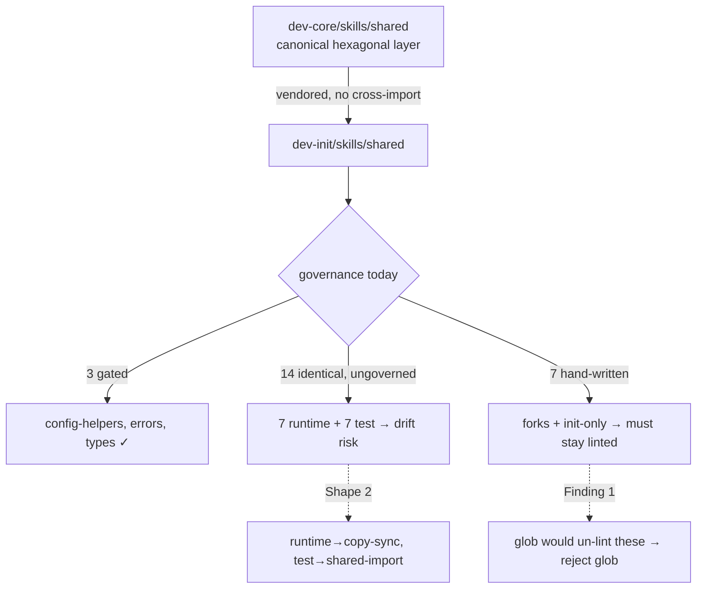

## Source

> #224 added `domain/errors.ts` + `domain/types.ts` to copy-sync (the byte-identical
> dependency closure of the gated `config-helpers.ts`). Two broader questions were
> deliberately deferred: (1) biome.json per-file list → glob? (2) the other 14
> byte-identical `dev-core ↔ dev-init` `shared/` pairs — copy-sync, or leave alone?
> — Issue #232

## Problem

`plugins/dev-init/skills/shared/` is a **vendored subset** of
`plugins/dev-core/skills/shared/` — dev-init's `init` skill imports the same
hexagonal `ports`/`adapters`/`domain` layer dev-core defines, but marketplace
self-containment forbids cross-plugin runtime imports, so the files are duplicated.
Today only **3 of 25** dev-init shared TS files are governed (copy-sync manifest:
`config-helpers.ts`, `domain/errors.ts`, `domain/types.ts`). The rest are
ungoverned, and they are **already drifting**.

This analysis corrects two premises in the issue body and reframes the decision.

### Finding 1 — the biome "subtree = generated-only" premise is FALSE

The issue states a glob (`plugins/dev-init/skills/shared/**/*.ts`) has "zero blast
radius today (the subtree is currently all copy-synced files)." A full
classification of the 24 dev-init shared TS files disproves this:

| Class | Count | Files | biome glob effect |
|-------|-------|-------|-------------------|
| Generated (manifest, `@generated`) | 3 | `config-helpers.ts`, `domain/errors.ts`, `domain/types.ts` | correct to suppress |
| Byte-identical, ungoverned | 14 | 7 runtime + 7 test (see Finding 2) | suppress = the open question |
| **Genuinely divergent (hand-written)** | **5** | `adapters/github-adapter.ts` (fork, +272 lines), `adapters/github-infra.ts`, `domain/parse-issue-ref.ts`, `ports/workspace.ts`, `__tests__/domain.test.ts` | **silently un-lints real code** |
| **dev-init-only (hand-written)** | **3** | `adapters/services.ts`, `ports/issue.ts`, `ports/project.ts` | **silently un-lints real code** |

(3 + 14 + 5 + 3 = 25 TS files.)

→ A blanket `**/*.ts` glob would suppress biome on **8 genuinely hand-written
files** (`github-adapter`, `github-infra`, `parse-issue-ref`, `ports/workspace`,
`__tests__/domain.test.ts`, `services`, `ports/issue`, `ports/project`). This is
the exact failure mode the frame warned about — and it is **non-zero today**, not a
future hypothetical.

### Finding 2 — the 7 runtime pairs are intentionally shared (and some siblings already drifted)

dev-init's `init` skill directly imports `github-adapter`, `github-infra`,
`workspace-store`, `domain/types`, `ports/workspace`, `prereqs`, `queries`,
`config-helpers`. Their transitive closure pulls in `env-config`, `ports/config`,
`ports/artifacts`, `types.ts`. The **7 byte-identical runtime pairs**
(`adapters/env-config.ts`, `adapters/workspace-store.ts`, `ports/artifacts.ts`,
`ports/config.ts`, `prereqs.ts`, `queries.ts`, `types.ts`) are part of this
vendored closure — **intentionally shared, currently in sync**.

Decisive evidence they are *meant* to track dev-core: three sibling files in the
same closure have **already drifted**, and in every case dev-init is the stale
copy lagging a dev-core improvement:

| File | Drift (dev-init vs dev-core) | Verdict |
|------|-----------------------------|---------|
| `adapters/github-infra.ts` | throws raw `Error` instead of `ConfigError` | dev-init **behind** — latent bug |
| `domain/parse-issue-ref.ts` | missing `formatRef()` export | dev-init **behind** |
| `ports/workspace.ts` | missing `vercelProjectId` / `vercelTeamId` fields | dev-init **behind** |

→ The 7 identical pairs are not coincidence; they are the unbroken part of a
vendored layer whose broken parts are already accruing silent bugs. "Leave alone"
keeps the drift door open.

### Finding 3 — the 7 test pairs are duplicated, not shared-import

Governance says test-only logic uses **shared-import** (single file under
`plugins/shared/__tests__/`). Today exactly one suite does this
(`detect-github-repo.suite.ts`). There are **7 byte-identical test pairs** total,
of which **6 are actionable** for shared-import — `github.test.ts`,
`parse-issue-ref.test.ts`, `prereqs.test.ts`, `priority-labels.test.ts`,
`resolveFieldIds.test.ts`, `resolveSize-legacy-schema.test.ts` — plus
`config.test.ts`, which is **fenced off** (#218/#225 caller-parity gate; a
`@generated` header would break its parity diff) and stays excluded. So: **6
actionable + 1 excluded = 7 test pairs**, matching the issue's "6 test files"
(it counts only the actionable ones).

## Outcome

A recorded governance decision (ADR + CLAUDE.md note) such that: every
byte-identical `shared/` pair has an explicit call; the biome generated-copy scope
has a single source of truth that cannot silently swallow hand-written files; and
the already-drifted siblings are visible (fixed or filed), not invisible.

## Appetite

Pure hygiene, not urgent (issue). Decision + low-risk mechanical application within
a single F-full cycle. Larger restructurings (Shape 3) are explicitly out of
appetite.

## Shapes

### Shape 1: Document-only (conservative)

Reject the glob; keep the explicit 3-entry biome list. Leave all 14 pairs as-is.
Write an ADR recording "dev-init/shared = best-effort vendored, may drift."

**Trade-offs:**
- Pro: zero mechanical risk; smallest diff.
- Con: ignores Finding 2 — silent drift continues, the `github-infra` bug class
  recurs; the biome list keeps accreting touchpoints by hand.

**Rough scope:** XS

### Shape 2: Govern to match the vendoring reality (recommended)

Three coordinated moves, each per-file and reversible:

1. **biome** — replace the hand-maintained 3-entry list with a list **derived from
   `tools/shared-sources.json`** (the copy-sync manifest), asserted by
   `tools/validate_plugins.py`. SSoT; auto-covers future copy-sync additions; **and
   it provably cannot suppress a hand-written file** because only manifest targets
   are emitted. Explicitly reject the broad `**/*.ts` glob (Finding 1).
2. **7 runtime pairs** — add to the copy-sync manifest (dev-core canonical, dev-init
   `@generated` copy, byte-gate). This freezes the in-sync closure and makes future
   drift a CI failure instead of a latent bug.
3. **7 test pairs** — convert to **shared-import** per existing governance (move the
   suite body to `plugins/shared/__tests__/`, both plugins import it).
   `config.test.ts` excluded (caller-parity).

Drifted siblings (`github-infra`, `parse-issue-ref`, `ports/workspace`) are **not**
silently swallowed: file a follow-up to reconcile dev-init→dev-core, then either add
to copy-sync (if reconciled) or document as intentional fork. `github-adapter.ts`
documented as an intentional fork (out of manifest).

**Trade-offs:**
- Pro: kills the silent-drift failure mode; aligns with the CLAUDE.md selection
  rule; biome scope gains a SSoT with no over-suppression.
- Con: more upfront work; grows the copy-sync gated set from 3 → 10 runtime files
  (the 3 existing + 7 new), plus 6 test pairs onto shared-import; per-file intent
  calls needed in `/spec`.

**Rough scope:** M

### Shape 3: Structural — generate dev-init/shared wholesale from dev-core

A build step generates dev-init's entire vendored subset from dev-core with an
explicit fork-exception list (`github-adapter`).

**Trade-offs:**
- Pro: eliminates duplication entirely; one canonical layer.
- Con: large change fighting the genuine fork; over-engineered for "pure hygiene";
  exceeds appetite.

**Rough scope:** L

## Fit Check

**Recommended: Shape 2.** It is the only shape that acts on Finding 2 (real drift)
while respecting Finding 1 (the glob is unsafe). The manifest-derived biome list is
strictly better than both the issue's options (hand list vs broad glob): it removes
per-file drift *and* is structurally incapable of swallowing hand-written files.
Shape 1 under-delivers (leaves the drift door open after we found it open). Shape 3
exceeds appetite and collides with the legitimate `github-adapter` fork.

**Open per-file calls deferred to `/spec`:**
- Confirm all 7 runtime pairs are wanted verbatim by dev-init (vs any latent
  intentional difference) before gating.
- Decide whether the 3 drifted siblings are reconciled **in this cycle** or filed as
  a follow-up (recommend: file follow-up; keep this cycle low-risk). To satisfy the
  frame's "every pair has a documented call," record an explicit governance value
  **`leave-alone-pending-reconciliation`** for each drifted sibling, and
  **`intentional-fork`** for `github-adapter.ts` — so divergent files have a recorded
  call, not just silence.
- Confirm the shared-import move for the 6 actionable test pairs is worth the churn
  now, or sequence it after the runtime gating.

**Operational notes for `/spec` (from devops review):**
- The biome SSoT mechanism is a **drift gate, not a generator**: `biome.json` stays
  hand-edited (or updated by a small helper); `validate_plugins.py` asserts
  `set(biome overrides.includes) == set(manifest targets)` (order-insensitive,
  repo-root-relative paths) and fails on mismatch. Do **not** spec auto-generation of
  `biome.json` — that is a larger change the current structure doesn't need.
- `shared-sources-sync` has **two independent implementations** that both read
  `tools/shared-sources.json`: lefthook pre-commit runs `bun run sync:shared --check`
  (TS, `lefthook.yml`), CI runs `python3 tools/validate_plugins.py --check
  shared-sources-sync` (`ci.yml`). Adding manifest entries propagates to both
  automatically, but verify the TS and Python paths use the **same 2-line
  `@generated` header-strip** before gating the 7 runtime pairs (unverified divergence
  risk flagged by devops).

## Files Impacted (Shape 2)

| File | Change |
|------|--------|
| `tools/shared-sources.json` | +7 runtime entries |
| `tools/validate_plugins.py` | derive biome list from manifest + assert |
| `biome.json` | `overrides.includes` ← generated from manifest |
| dev-init copies of the 7 runtime pairs: `adapters/env-config.ts`, `adapters/workspace-store.ts`, `ports/artifacts.ts`, `ports/config.ts`, `prereqs.ts`, `queries.ts`, `types.ts` | gain `@generated` header (copy-sync) |
| `plugins/shared/__tests__/*.suite.ts` (new) | extracted test suites (6 actionable) |
| 6 dev-init + 6 dev-core test files | → import shared suite |
| ADR + `CLAUDE.md` "Shared-source TS files" | record decision + biome invariant |
