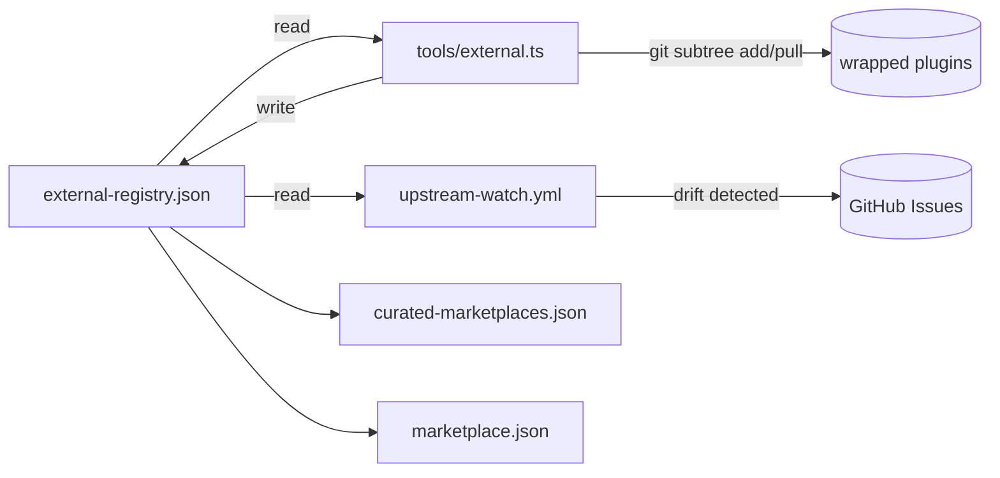

## Source

Issue #62 — "audit: review external plugins, wrapped candidates & curated-marketplaces.json"
Frame: `artifacts/frames/62-external-ecosystem-maintenance-frame.mdx`

User clarification: "We need first to decide a framework to handle the 3 cases, a way to maintain it automatically and watch if any skill were upgraded has plugins or deprecated. Then ensure that skill via subtree are easily maintained."

## Problem

The roxabi-plugins marketplace has no strategy for the external Claude Code ecosystem:

- `curated-marketplaces.json` is **empty** — no endorsed external marketplaces
- All 14 marketplace plugins are **native** — no wrapped/subtree plugins exist
- The git subtree wrapping workflow is documented in CLAUDE.md but never exercised
- **Ongoing maintenance is the real gap**: if an upstream changes, breaks, or deprecates, there is no detection, no policy, and no tooling to respond

Three cases need explicit handling: (1) curated marketplaces, (2) wrapped/subtree plugins, (3) native plugin lifecycle.

## Current Architecture

```
.claude-plugin/
  marketplace.json           ← 14 native plugins listed
  curated-marketplaces.json  ← EMPTY
plugins/
  {14 native plugins}/       ← all owned by Roxabi, no external dependencies
tools/
  validate_plugins.py        ← validates data.root uniqueness, no personal data
  sync-vercel-skills.sh
.github/workflows/
  ci.yml                     ← lint + typecheck + test only, no upstream watch
sync-plugins.sh              ← rsync to local+remote caches, no subtree management
```

**Key gap:** There is no registry of external sources and no CI that watches upstream repos. The `git subtree` workflow is documented but the squash commits lose the upstream URL unless preserved elsewhere.

## External Ecosystem Survey

> **⚠ Verification note:** The following repos were surfaced by automated research. **URLs have not been manually verified — some may not exist.** This is not a metadata quality caveat; it is a "may be fabricated" warning. Confirm each repo exists before any wrapping or endorsement decision. The Claude Code plugin ecosystem is young (2025–2026) and automated searches frequently hallucinate plausible-looking URLs.

Known ecosystem categories (to verify):
- **Official:** `anthropics/skills` — reference SKILL.md format/spec
- **Proper marketplaces:** repos with `plugin.json` + `marketplace.json` + versioned installs
- **Raw skill repos:** flat collections of SKILL.md files (no install mechanism) — wrapping candidates
- **Awesome lists:** meta-indices like `travisvn/awesome-claude-skills` — discovery only

The actual audit (which repos qualify for each case) is Step 5 of the framework and is implementation work, not analysis.

## Outcome

A framework that makes all three cases **explicit, low-friction, and self-monitoring**:
- A maintainer can add/wrap/deprecate an external plugin in one command
- CI alerts (not auto-merges) when upstreams have new commits
- All decisions are documented (criteria visible in CLAUDE.md)
- Solo-maintainer friendly: automation reduces toil but never forces a merge

## Appetite

1–2 day cycle. Framework design + tooling + CI workflow. No rushing the initial audit.

---

## Shapes

### Shape 1: Manifest-First (registry JSON + thin CI)

Add a single `external-registry.json` (or extend `curated-marketplaces.json`) that is the source of truth for all external sources. A thin CI workflow reads it and checks for upstream drift.

```json
// .claude-plugin/external-registry.json
{
  "curated_marketplaces": [
    {
      "name": "example-marketplace",
      "source": "https://github.com/owner/repo",
      "added": "2026-03-11",
      "criteria_met": ["versioned", "install_mechanism", "maintained"]
    }
  ],
  "wrapped_plugins": [
    {
      "plugin": "some-skill",
      "upstream_url": "https://github.com/owner/repo.git",
      "upstream_branch": "main",
      "last_sync_commit": "abc1234",
      "last_sync_date": "2026-03-11",
      "subtree_prefix": "plugins/some-skill"
    }
  ]
}
```

CI checks: `git ls-remote {upstream_url} HEAD` → compare to `last_sync_commit` → open issue if drift.

**Trade-offs:**
- Pro: Single source of truth. Machine-readable. CI reads directly. Easy to diff in PRs
- Pro: `last_sync_commit` solves the "lost upstream URL" problem of git squash subtrees
- Pro: Minimal new files — extends existing `.claude-plugin/` convention
- Con: Adds another JSON schema to maintain; must stay in sync with CLAUDE.md

**Rough scope:** M

---

### Shape 2: Script-Driven (extend sync-plugins.sh)

Extend `sync-plugins.sh` to also manage external plugins: `add-curated`, `add-wrapped`, `update-wrapped`, `check-upstream`. Script reads its own config from shell variables or a simple `.env`-style file.

```bash
./sync-plugins.sh --add-curated https://github.com/owner/repo
./sync-plugins.sh --wrap https://github.com/owner/repo.git --plugin-name some-skill
./sync-plugins.sh --check-upstream          # git ls-remote all wrapped upstreams
./sync-plugins.sh --update-wrapped some-skill  # git subtree pull for one plugin
```

**Trade-offs:**
- Pro: No new files — extends existing tooling; single script for all sync operations
- Pro: Bash is already used everywhere; no new dependency
- Con: State (upstream URLs, last sync) stored in comments or a separate file — less structured
- Con: CI can't easily parse shell scripts to extract upstream URLs for drift detection
- Con: Harder to review/audit than a JSON manifest

**Rough scope:** M

---

### Shape 3: Hybrid — Registry JSON + CI watch + TypeScript CLI (Recommended, two-step rollout)

JSON manifest as source of truth + a dedicated GitHub Actions workflow for upstream watch. TypeScript CLI deferred to Step B (when first real wrapped plugin or curated marketplace is added, so commands have a concrete use case before they're built).

**Step A (this cycle) — registry + CI:**
```
.claude-plugin/
  external-registry.json     ← source of truth (upstreams, criteria, sync state)
.github/workflows/
  upstream-watch.yml         ← weekly cron: check all upstreams, open issues on drift
CLAUDE.md                    ← add decision criteria + manual subtree commands
```

**Step B (triggered by first real entry) — TypeScript CLI:**
```
tools/
  external.ts                ← CLI: add-curated | add-wrapped | update | check | list
```
```bash
bun tools/external.ts list              # show all external sources + sync status
bun tools/external.ts check             # check all upstreams for new commits
bun tools/external.ts add-curated <url> # validate criteria, add to registry
bun tools/external.ts add-wrapped <url> --name <plugin>  # git subtree add + register
bun tools/external.ts update <plugin>   # git subtree pull + update last_sync_commit
bun tools/external.ts deprecate <plugin> # remove from registry + optional subtree removal
```
Note: "add-wrapped" is multi-step (subtree add + registry update + frontmatter + README). The CLI orchestrates these steps but wrapping is inherently multi-command — "one entry point" is more accurate than "one command."

**Registry schema — key additions from architect review:**
```json
{
  "wrapped_plugins": [
    {
      "plugin": "some-skill",
      "upstream_url": "https://github.com/owner/repo.git",
      "upstream_branch": "main",
      "last_sync_commit": "abc1234",
      "last_sync_date": "2026-03-11",
      "subtree_prefix": "plugins/some-skill",
      "status": "active"   // active | drift_detected | deprecated
    }
  ]
}
```

**upstream-watch.yml:**
- Runs weekly (cron) + on manual dispatch
- Reads `external-registry.json`, calls `git ls-remote refs/heads/{upstream_branch}` per entry (NOT bare HEAD — robust against default branch renames)
- Uses `GITHUB_TOKEN` for authenticated calls (5,000/hr limit vs 60 unauth)
- If drift detected: opens a GitHub issue + sets `status: drift_detected` in registry
- Labels: `upstream-update` + `wrapped-plugin` or `curated-marketplace`
- ¬auto-merges: human reviews all upstream changes

**Subtree conflict strategy:**
Roxabi wrapping changes (frontmatter, README, restructured paths) will conflict on every `git subtree pull`. Two approaches:
1. **Copy+track** (simpler): for simple SKILL.md upstreams (flat files, no directory structure), copy the file once and track drift via `last_sync_commit`. No subtree — no merge conflicts. Manual copy on update.
2. **True subtree**: for upstreams with meaningful directory structure worth preserving. Accept that maintainer must resolve conflicts on pull.
Decision should be per-plugin at wrapping time — record which strategy was used in `external-registry.json` as `sync_strategy: "subtree" | "copy"`.

**Trade-offs:**
- Pro: Step A is lean (2 files) — doesn't build tooling before it has real data
- Pro: Registry is machine-readable + human-editable; CI drift detection is solid
- Pro: `status` field makes drift state visible without reading GitHub issues
- Pro: Two-step rollout prevents "building a CLI with no entries to operate on"
- Con: Step B TypeScript CLI still needs to be built eventually; scope is deferred, not eliminated

**Rough scope:** Step A = S, Step B = M. Total M-L if done together.

---

## Fit Check



**Shape 3 wins** on all three constraints:
1. **Solo-maintainer friendly** — one CLI command per operation, no manual JSON editing
2. **No external services** — GitHub Actions + git ls-remote is all that's needed
3. **Manual override always possible** — JSON is human-editable; CI only opens issues, never merges

Shape 1 is a valid lightweight fallback if Shape 3 scope creeps — start with the registry, add the CLI incrementally.
Shape 2 is eliminated: bash state is hard to parse in CI, and the script is already doing too much.

## Files Impacted

| File | Change | Owner |
|------|--------|-------|
| `.claude-plugin/external-registry.json` | New — source of truth | New |
| `.claude-plugin/curated-marketplaces.json` | Update or fold into registry | Existing |
| `tools/external.ts` | New CLI tool | New |
| `.github/workflows/upstream-watch.yml` | New CI workflow | New |
| `CLAUDE.md` | Add decision criteria + quick-ref commands | Existing |
| `README.md` | Add external ecosystem section | Existing |
| `package.json` / `turbo.jsonc` | Add `external` script | Existing |
| `tools/validate_plugins.py` | Optionally extend to validate registry schema | Existing |

Estimated: 6–8 files touched.

## Decision Criteria (to encode in CLAUDE.md)

### Curated Marketplace — Qualify if ALL:
- [ ] Ships a proper `marketplace.json` with versioned plugins
- [ ] Has a working install mechanism (`claude plugin marketplace add <url>`)
- [ ] Actively maintained (commit within last 90 days)
- [ ] Content quality: reviewed skills with clear descriptions + trigger phrases
- [ ] No overlap with >50% of roxabi native plugins

### Wrapped Plugin — Qualify if ALL:
- [ ] High-quality SKILL.md files (clear instructions, scoped triggers)
- [ ] Actively maintained upstream: commit within last **90 days** (same threshold as curated)
- [ ] Fills a gap not covered by native plugins
- [ ] License is compatible (MIT, Apache 2.0, etc.)
- [ ] Upstream author notified/credited

### Deprecation — Trigger if ANY:
- Upstream archived/deleted and no suitable replacement
- >12 months since last commit (native or upstream) — any commit counts; "meaningful" is intentionally not required to avoid ambiguity
- Superseded by a better native or external alternative
- License change to incompatible terms

> Authoritative location for these criteria: this analysis → CLAUDE.md (on spec approval). `external-registry.json` will carry a `criteria_met` array per entry for inline auditability.

<!-- complexity: 7 -->
