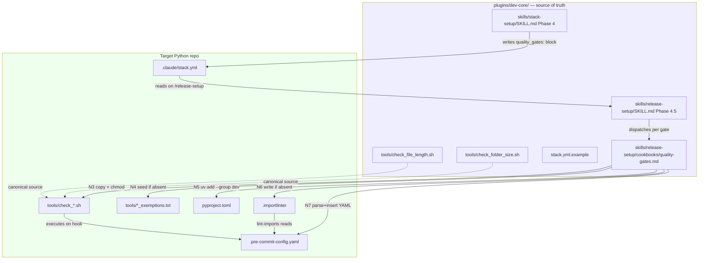
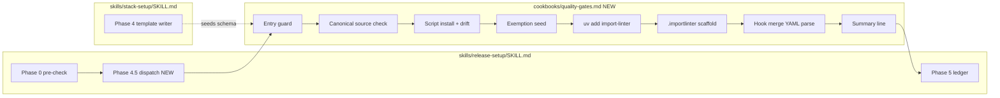

## Summary

Implement the roxabi-plugins side of issue #114 in one PR covering all 5 spec slices: ship canonical guard scripts under `plugins/dev-core/tools/`, teach `stack-setup` to seed `quality_gates:` for Python repos, add the `quality-gates` cookbook + Phase 4.5 dispatch to `release-setup`, run 5 smoke tests, and update docs. No behavior change in `roxabi-plugins` itself (it stays `runtime: bun` → guards inert).

## Architecture

### Data flow



### File × Function map



## Bootstrap Context

From analysis verification table (`artifacts/analyses/114-quality-gates-analysis.mdx`):
- **Canonical scripts live in `lyra/tools/`** — verbatim source for the dev-core copies (confirmed via file read)
- **llmCLI `feat/1-llmcli-v1` branch** has a reference port (commit `9c6e94f`) — second data point, not source of truth
- **YAML tooling constraint** — only Python stdlib `yaml` is portable on dev (Pop!_OS) + prod (Ubuntu Server); `yq` absent (confirmed via `which`)
- **uv behavior** — `uv add --group dev <pkg>` auto-creates `[dependency-groups]` if absent and atomically updates `uv.lock`
- **import-linter** — with `[importlinter]` + `root_packages` present and zero active contracts, `lint-imports` exits 0 (verified via tool docs)

## Reference Patterns

- **Cookbook structure:** `plugins/dev-core/skills/release-setup/cookbooks/commit-standards.md`, `hook-runner.md` — Let: block, Phase N heading, decision branches via DP(A), D✅/D⏭/D⚠ display macros
- **SKILL.md phase dispatch:** `plugins/dev-core/skills/release-setup/SKILL.md` line 72–74 (existing Phase 2–4 dispatch lines)
- **YAML section in stack.yml.example:** existing `build:`, `testing:`, `hooks:` blocks at `plugins/dev-core/stack.yml.example` lines 37–56 — mirror the comment style (inline `#` with default + valid values)
- **README feature table:** `plugins/dev-core/README.md` top-level feature list
- **Canonical scripts:** `/home/mickael/projects/lyra/tools/check_file_length.sh`, `check_folder_size.sh` — copy verbatim + prepend 1-line header

## Agents

| Agent | Task count | Files |
|---|---|---|
| devops | 13 | tools/*.sh, SKILL.md edits, cookbook, stack.yml.example, smoke tests |
| doc-writer | 5 | README.md (dev-core, stack-setup, release-setup), CREATE-PLUGIN-GUIDE.md grep |

Rationale: no backend/frontend split here — all work is plugin authoring (shell scripts, YAML schema, Markdown skill files, package manager interaction). Default agent is devops; doc-writer takes READMEs and the plugin guide. No tester (no unit-test framework in this plugin; smoke tests are bash-based and owned by devops). No architect — design is locked in the spec's Decisions table.

## Consistency Report

Bidirectional σ↔tasks trace:

| Spec success criterion | Task(s) |
|---|---|
| SC 1-1 check_file_length.sh exists + header | T1.1 |
| SC 1-2 check_folder_size.sh exists + header | T1.2 |
| SC 1-3 stack.yml.example quality_gates: section | T1.3 |
| SC 2-1 stack-setup seeds quality_gates for Python | T2.1 |
| SC 2-2 stack-setup skips quality_gates for Bun | T2.1 (negative test in Slice 4 Case d/e) |
| SC 3-1 cookbook specifies N1–N8 + decisions | T3.1 |
| SC 3-2 SKILL.md Phase 4.5 dispatch | T3.2 |
| SC 3-3 empty-contract .importlinter exits 0 | T3.4 (smoke) |
| SC 3-4 missing exemptions_file not an error | T3.4 (smoke) |
| SC 4-a fresh scratch smoke | T4.1 |
| SC 4-b llmCLI mid-state smoke | T4.2 |
| SC 4-c lyra full-state smoke | T4.3 |
| SC 4-d drift-detection smoke | T4.4 |
| SC 4-e typecheck-absent fallback smoke | T4.5 |
| SC 5-1 dev-core README quality_gates line | T5.1 |
| SC 5-2 CREATE-PLUGIN-GUIDE grep check | T5.2 |

Coverage: 16 / 16 SC items covered. Untraced tasks: 0. Exempted: 0.

## Slice Plan

| Slice | RED-GATE | Micro-tasks |
|---|---|---|
| V1 — Canonical scripts + schema docs | T1.4 | T1.1, T1.2, T1.3 |
| V2 — stack-setup seeds | T2.3 | T2.1, T2.2 |
| V3 — Cookbook + dispatch | T3.5 | T3.1, T3.2, T3.3, T3.4 |
| V4 — Smoke tests | T4.6 | T4.1, T4.2, T4.3, T4.4, T4.5 |
| V5 — Docs sweep | T5.4 | T5.1, T5.2, T5.3 |

## Micro-Tasks

### V1 — Canonical scripts + schema docs

**T1.1 [GREEN] [P with T1.2, T1.3] [devops] [diff 1]** — Copy check_file_length.sh into dev-core as canonical

- File: `plugins/dev-core/tools/check_file_length.sh`
- Content: verbatim copy of `/home/mickael/projects/lyra/tools/check_file_length.sh` with a 1-line header inserted immediately after the shebang:
  ```bash
  #!/usr/bin/env bash
  # Canonical source: plugins/dev-core/tools/ — do not edit project-side copies directly
  ```
- Set executable: `chmod +x plugins/dev-core/tools/check_file_length.sh`
- Verify: `diff --unified /home/mickael/projects/lyra/tools/check_file_length.sh plugins/dev-core/tools/check_file_length.sh`
- Expected: exactly 1 added line beginning with `# Canonical source:` (header), zero other changes; `ls -l plugins/dev-core/tools/check_file_length.sh` shows `-rwx` bits
- Time: 3 min
- Spec trace: SC 1-1
- Slice: V1

**T1.2 [GREEN] [P with T1.1, T1.3] [devops] [diff 1]** — Copy check_folder_size.sh into dev-core as canonical

- File: `plugins/dev-core/tools/check_folder_size.sh`
- Content: verbatim copy of `/home/mickael/projects/lyra/tools/check_folder_size.sh` with the same 1-line `# Canonical source:` header
- Set executable
- Verify: `diff --unified /home/mickael/projects/lyra/tools/check_folder_size.sh plugins/dev-core/tools/check_folder_size.sh` → 1 added header line, zero other changes
- Time: 3 min
- Spec trace: SC 1-2
- Slice: V1

**T1.3 [GREEN] [P with T1.1, T1.2] [devops] [diff 2]** — Document `quality_gates:` in stack.yml.example

- File: `plugins/dev-core/stack.yml.example`
- Edit: append a new `quality_gates:` block after the existing `docs:` section (around line 69), before `commands:`. Include all three sub-blocks with all keys, `enabled: true` per sub-block, inline comments explaining: (a) absent section = all gates off (opt-in), (b) absent sub-block = that gate off, (c) defaults (300 / 12 / pre-push), (d) exemption file format
- Snippet shape:
  ```yaml
  # Quality gates — Python code-hygiene contracts (opt-in).
  # When section is absent: all gates OFF (backwards-compatible).
  # When section is present but a sub-block is absent: that gate OFF.
  # Gates are installed/synced by /release-setup --force via the quality-gates cookbook.
  quality_gates:
    file_length:
      enabled: true
      max_lines: 300                        # default 300
      globs: ["src/**/*.py"]
      exemptions_file: tools/file_exemptions.txt   # format: <path> <issue-url> (space-separated)
    folder_size:
      enabled: true
      max_files: 12                         # default 12
      globs: ["src/**"]
      exemptions_file: tools/folder_exemptions.txt
    import_layers:
      enabled: true
      stage: pre-push                       # pre-commit | pre-push (default pre-push; lint-imports is slow)
      config: .importlinter
  ```
- Verify: `grep -c 'quality_gates:' plugins/dev-core/stack.yml.example && grep -c 'file_length:' plugins/dev-core/stack.yml.example && grep -c 'folder_size:' plugins/dev-core/stack.yml.example && grep -c 'import_layers:' plugins/dev-core/stack.yml.example`
- Expected: 1 1 1 1
- Time: 5 min
- Spec trace: SC 1-3
- Slice: V1

**T1.4 [RED-GATE] [devops] [diff 1]** — Verify V1 criteria

- Run the three verify commands from T1.1/T1.2/T1.3 in sequence
- Expected: all three pass (header-only diff; grep counts all 1)
- If fail: fix the offending task, re-run gate
- Time: 2 min
- Spec trace: SC 1-1..1-3
- Slice: V1

### V2 — stack-setup seeds quality_gates

**T2.1 [GREEN] [devops] [diff 2]** — stack-setup Phase 4 seeds quality_gates for Python

- File: `plugins/dev-core/skills/stack-setup/SKILL.md`
- Edit: in the Phase 4 template block (around lines 155–222), add a conditional section that includes `quality_gates:` when `{RUNTIME} == python`. Use the same comment style as neighboring sections. Insert after `testing:` / before `deploy:` to group with code-quality concerns.
- Reference block to follow: existing `# build:` / `# shared:` conditional comments at lines 170–175
- Include: all three sub-blocks, `enabled: true`, default thresholds, `stage: pre-push` on import_layers, default globs + exemption paths
- Ensure: runtime==bun / node → NO `quality_gates:` section emitted (verify by re-reading the template logic)
- Verify: `grep -A 20 'quality_gates:' plugins/dev-core/skills/stack-setup/SKILL.md` shows full block with python-only gating in the surrounding Phase 4 narrative
- Expected: quality_gates: block visible in template with all three sub-blocks
- Time: 8 min
- Spec trace: SC 2-1, SC 2-2
- Slice: V2

**T2.2 [GREEN] [P with T2.1] [doc-writer] [diff 1]** — stack-setup README documents quality_gates

- File: `plugins/dev-core/skills/stack-setup/README.md`
- Edit: add a one-paragraph note that on Python runtime the wizard seeds a full `quality_gates:` block; link to the cookbook for install behavior
- Verify: `grep -c 'quality_gates' plugins/dev-core/skills/stack-setup/README.md`
- Expected: ≥1
- Time: 3 min
- Spec trace: SC 2-1
- Slice: V2

**T2.3 [RED-GATE] [devops] [diff 1]** — Verify V2 criteria

- Read `plugins/dev-core/skills/stack-setup/SKILL.md` Phase 4 template. Confirm block only emits when python.
- Manual trace: simulate Phase 4 with RUNTIME=python → block included; with RUNTIME=bun → block absent.
- Verify: `grep -B 2 'quality_gates:' plugins/dev-core/skills/stack-setup/SKILL.md` shows python-guarded context
- Time: 2 min
- Spec trace: SC 2-1, SC 2-2
- Slice: V2

### V3 — Cookbook + release-setup dispatch

**T3.1 [GREEN] [devops] [diff 5]** — Create quality-gates cookbook with N1–N8 algorithm

- File: `plugins/dev-core/skills/release-setup/cookbooks/quality-gates.md` (new)
- Structure (mirror `hook-runner.md` / `commit-standards.md`):
  - Let: block defining F, σ, D✅/D⏭/D⚠, PRJ := `${CLAUDE_PLUGIN_ROOT}/tools/`
  - `## Phase 4.5 — Quality Gates`
  - `## Entry guard (N1)` — `runtime == python` ∧ `quality_gates:` present
  - `## Canonical source check (N2)` — `test -x` on PRJ paths; error out if absent
  - `## Per-gate install` — three subsections (file_length, folder_size, import_layers), each covering N3 (cp + chmod + drift diff), N4 (exemption seed with header), N5 (uv add for import_layers only), N6 (.importlinter scaffold for import_layers only with `[importlinter]` header + root_packages template)
  - `## Hook merge (N7)` — full Python snippet parsing `.pre-commit-config.yaml`, inserting after `id: typecheck`, falling back to DP(A). Preserves `stages:` on existing matches per D4.
  - `## Summary (N8)` — per-gate counters
  - `## Idempotency rules` — table mapping current-state × --force flag → action (install / no-op / re-stamp / warn)
  - `## .importlinter scaffold template` — copy the template from the spec verbatim, with `{PROJECT_PACKAGE_NAME}` substitution logic (read pyproject.toml via `tomllib`; fall back to `src/` directory name)
  - `## Edge cases` — all 11 cases from the spec
- Length target: ~200 lines (comparable to hook-runner.md at 128 lines but with more branching)
- Verify: `test -f plugins/dev-core/skills/release-setup/cookbooks/quality-gates.md && wc -l plugins/dev-core/skills/release-setup/cookbooks/quality-gates.md && grep -c '^## ' plugins/dev-core/skills/release-setup/cookbooks/quality-gates.md`
- Expected: file exists, 150–250 lines, ≥8 `##` headings covering N1–N8 + scaffold + edge cases
- Time: 40 min
- Spec trace: SC 3-1
- Slice: V3

**T3.2 [GREEN] [devops] [diff 2]** — release-setup Phase 4.5 dispatch

- File: `plugins/dev-core/skills/release-setup/SKILL.md`
- Edits:
  - Dispatch section (around line 72–74): add line `Phase 4.5 — Quality Gates → Read ${CLAUDE_SKILL_DIR}/cookbooks/quality-gates.md, execute.` between Phase 4 and Phase 5
  - Phase 0 Pre-check (line 38–42): add check `test -x tools/check_file_length.sh && echo "has_qg" || echo "no_qg"` to the parallel check block; derive `has_qg` boolean
  - Phase 1 stack detection (line 56): extend the σ read list with `quality_gates.*.enabled` (or equivalent summary)
  - Phase 5 summary table (line 82–90): add row `Quality gates        ✅ Configured / ⏭ Already configured / ⏭ Not applicable / ⏭ Skipped`
  - Generated files list (line 96–105): add `tools/check_file_length.sh`, `tools/check_folder_size.sh`, `tools/file_exemptions.txt`, `tools/folder_exemptions.txt`, `.importlinter` (Python + quality_gates only)
- Verify: `grep -c 'Phase 4.5' plugins/dev-core/skills/release-setup/SKILL.md && grep -c 'quality-gates.md' plugins/dev-core/skills/release-setup/SKILL.md && grep -c 'Quality gates' plugins/dev-core/skills/release-setup/SKILL.md`
- Expected: 1 1 ≥2 (dispatch line + summary row)
- Time: 10 min
- Spec trace: SC 3-2
- Slice: V3

**T3.3 [GREEN] [P with T3.1, T3.2] [doc-writer] [diff 1]** — release-setup README documents Phase 4.5

- File: `plugins/dev-core/skills/release-setup/README.md`
- Edit: add a section describing Phase 4.5 (what it does, when it triggers, what files it writes). Link to the cookbook.
- Verify: `grep -c 'quality-gates' plugins/dev-core/skills/release-setup/README.md && grep -c 'Phase 4.5' plugins/dev-core/skills/release-setup/README.md`
- Expected: ≥1 ≥1
- Time: 5 min
- Spec trace: SC 3-2
- Slice: V3

**T3.4 [GREEN] [devops] [diff 1]** — Pre-validate cookbook invariants on a scratch repo

- Setup: create a temp dir `/tmp/qg-scratch-v3/`, `cd` into it, `uv init --no-workspace`, `uv add --group dev import-linter`
- Write `.importlinter` using the scaffold template from T3.1 (with `root_packages = scratch_pkg` and all contracts commented)
- Run `uv run lint-imports`
- Expected: exit 0 (validates SC 3-3)
- Also: `rm -f tools/file_exemptions.txt && bash $(realpath plugins/dev-core/tools/check_file_length.sh)` on a file tree with a large file present to confirm missing exemptions_file is not an error (SC 3-4)
- Clean up the scratch dir after verification
- Time: 8 min
- Spec trace: SC 3-3, SC 3-4
- Slice: V3

**T3.5 [RED-GATE] [devops] [diff 1]** — Verify V3 criteria

- Run the verify commands from T3.1/T3.2/T3.3/T3.4 in sequence
- Expected: all pass
- Time: 2 min
- Spec trace: SC 3-1..3-4
- Slice: V3

### V4 — Smoke tests

Execute in order. Each generates output that gets pasted into the PR description.

**T4.1 [GREEN] [devops] [diff 0, smoke]** — Smoke Case (a): fresh scratch Python repo

- Create `/tmp/qg-smoke-a/`, `uv init --no-workspace`, write minimal `src/scratch_pkg/__init__.py`
- Run `/stack-setup` (or simulate Phase 4 output) → write `.claude/stack.yml` with `runtime: python` + `quality_gates:` block
- Run `/release-setup` (simulate Phase 4.5 dispatch on the stack.yml)
- Capture final state: `cat .pre-commit-config.yaml` — hooks must be in order `lint → typecheck → check-file-length → check-folder-size → import-layers (stages: [pre-push]) → license`
- Paste output into PR description under `## Smoke test: Case a`
- Time: 10 min
- Spec trace: SC 4-a
- Slice: V4

**T4.2 [GREEN] [devops] [diff 0, smoke]** — Smoke Case (b): llmCLI-pattern mid-state

- Create `/tmp/qg-smoke-b/`, write a `.pre-commit-config.yaml` matching llmCLI staging pattern: `lint → typecheck → gitleaks → license`
- Run `/release-setup` Phase 4.5 dispatch on it
- Verify final order: `lint → typecheck → check-file-length → check-folder-size → import-layers → gitleaks → license`
- Paste into PR description under `## Smoke test: Case b`
- Time: 8 min
- Spec trace: SC 4-b
- Slice: V4

**T4.3 [GREEN] [devops] [diff 0, smoke]** — Smoke Case (c): lyra-pattern full-state

- Copy `/home/mickael/projects/lyra/.pre-commit-config.yaml` → scratch dir; copy lyra `.importlinter` (with 5 active contracts) and its `tools/check_*.sh`
- Run `/release-setup` (no `--force`) → expect stdout "all three hooks present, no changes"
- Run `/release-setup --force` → expect: scripts re-stamped from canonical, hook `entry:` paths normalized, `.importlinter` unchanged (diff against original = empty), `stages:` unchanged
- Verify: `diff lyra_original/.importlinter scratch/.importlinter` returns empty
- Paste into PR description under `## Smoke test: Case c`
- Time: 12 min
- Spec trace: SC 4-c
- Slice: V4

**T4.4 [GREEN] [devops] [diff 0, smoke]** — Smoke Case (d): drift detection

- Continue from Case (a) scratch: manually edit `tools/check_file_length.sh`, change `MAX=300` to `MAX=250`
- Run `/release-setup` (no `--force`)
- Expected stdout: contains `drift` warning; no file modification (`md5sum tools/check_file_length.sh` unchanged before/after)
- Paste into PR description under `## Smoke test: Case d`
- Time: 5 min
- Spec trace: SC 4-d
- Slice: V4

**T4.5 [GREEN] [devops] [diff 0, smoke]** — Smoke Case (e): no `id: typecheck` anchor

- Create `/tmp/qg-smoke-e/` with a `.pre-commit-config.yaml` that has only `id: lint` (no typecheck hook)
- Run `/release-setup` → expect DP(A) with default "insert at end of `repo: local` block"
- Accept default → verify final file is valid YAML and hooks land at end of the `repo: local` block
- Paste into PR description under `## Smoke test: Case e`
- Time: 7 min
- Spec trace: SC 4-e
- Slice: V4

**T4.6 [RED-GATE] [devops] [diff 0]** — Assemble smoke-test summary

- Confirm all 5 cases passed
- Paste the full 5-case summary into the final PR description under `## Smoke tests`
- Time: 3 min
- Spec trace: SC 4-a..4-e
- Slice: V4

### V5 — Docs sweep

**T5.1 [GREEN] [doc-writer] [diff 1]** — dev-core README lists quality_gates

- File: `plugins/dev-core/README.md`
- Edit: add a row/line in the feature table (or equivalent list) referencing quality gates, linking to `skills/release-setup/cookbooks/quality-gates.md`
- Verify: `grep -c 'quality[_ -]\?gates' plugins/dev-core/README.md`
- Expected: ≥1
- Time: 4 min
- Spec trace: SC 5-1
- Slice: V5

**T5.2 [GREEN] [P with T5.1] [doc-writer] [diff 0 or 1]** — CREATE-PLUGIN-GUIDE check

- Run: `grep -l 'stack.yml' /home/mickael/projects/roxabi-plugins/docs/CREATE-PLUGIN-GUIDE.md`
- ∃ match with schema example → add `quality_gates:` to the example snippet
- ∄ schema example → PR description notes: "grepped CREATE-PLUGIN-GUIDE.md — no schema example present, no edit needed"
- Verify: either the file now contains `quality_gates:`, or a PR-description line confirms intentional skip
- Time: 5 min
- Spec trace: SC 5-2
- Slice: V5

**T5.3 [GREEN] [doc-writer] [diff 1]** — Root README feature mention (optional, low cost)

- File: `/home/mickael/projects/roxabi-plugins/README.md`
- Check existing plugin-index table for a dev-core feature list; if present and short, add one line noting quality gates
- If the root README is just an index without per-plugin features, skip (noted in PR description)
- Time: 3 min
- Spec trace: SC 5-1 (companion)
- Slice: V5

**T5.4 [RED-GATE] [doc-writer] [diff 1]** — Verify V5 criteria + run sync-plugins

- Run all V5 verify commands
- Run `./sync-plugins.sh --local` from the repo root — propagates plugin changes into `~/.claude/plugins/cache/roxabi-marketplace/`. Capture output.
- Time: 5 min
- Spec trace: SC 5-1, SC 5-2
- Slice: V5

## Totals

- Micro-tasks: 18 (13 GREEN + 5 RED-GATE)
- Estimated time: ~2–2.5 hours of focused agent work
- Files created: 3 (2 shell scripts + 1 cookbook)
- Files modified: 8 (stack.yml.example, 2 SKILL.md, 3 README.md, potentially CREATE-PLUGIN-GUIDE.md, root README)
- Commits: 5 (one per slice, chained by RED-GATE pass)

## Task IDs

<!-- Generated by /plan. Used by /implement to resume tasks on session restart. -->

- T1.1: 13 — Copy check_file_length.sh into dev-core as canonical
- T1.2: 14 — Copy check_folder_size.sh into dev-core as canonical
- T1.3: 15 — Document quality_gates in stack.yml.example
- T1.4: 16 — RED-GATE V1 verify criteria
- T2.1: 17 — stack-setup Phase 4 seeds quality_gates for Python
- T2.2: 18 — stack-setup README documents quality_gates
- T2.3: 19 — RED-GATE V2 verify criteria
- T3.1: 20 — Create quality-gates cookbook with N1-N8 algorithm
- T3.2: 21 — release-setup Phase 4.5 dispatch
- T3.3: 22 — release-setup README documents Phase 4.5
- T3.4: 23 — Pre-validate cookbook invariants on scratch repo
- T3.5: 24 — RED-GATE V3 verify criteria
- T4.1: 25 — Smoke Case (a): fresh scratch Python repo
- T4.2: 26 — Smoke Case (b): llmCLI mid-state
- T4.3: 27 — Smoke Case (c): lyra full-state
- T4.4: 28 — Smoke Case (d): drift detection
- T4.5: 29 — Smoke Case (e): no id:typecheck anchor
- T4.6: 30 — RED-GATE V4 assemble smoke-test summary
- T5.1: 31 — dev-core README lists quality_gates
- T5.2: 32 — CREATE-PLUGIN-GUIDE grep check
- T5.3: 33 — Root README feature mention (optional)
- T5.4: 34 — RED-GATE V5 verify + run sync-plugins
