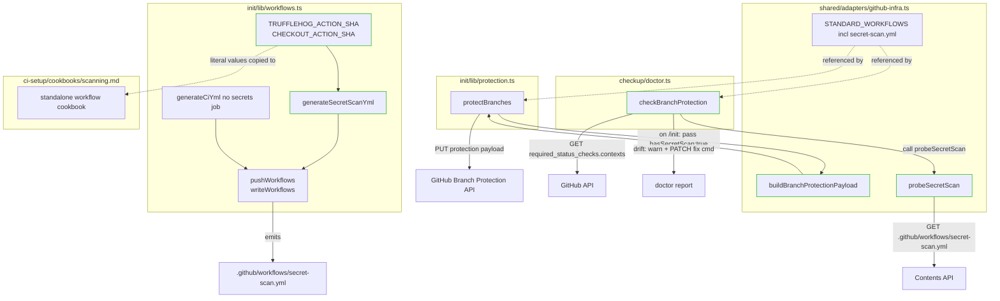
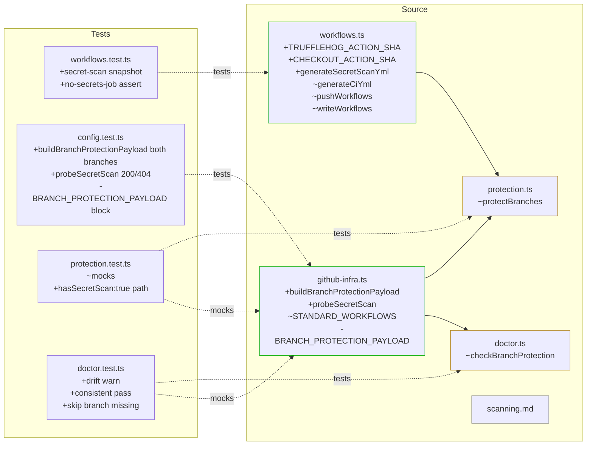

## Summary

Split TruffleHog from embedded `ci.yml` `secrets:` job into a standalone `secret-scan.yml` matching Lyra's reference; make branch protection contexts dynamic via `buildBranchProtectionPayload({ hasSecretScan })` + `probeSecretScan()` in `shared/adapters/github-infra.ts`; rewrite `checkup/doctor.ts:checkBranchProtection` to detect and fix drift.

## Architecture

### Data Flow



### File × Function Map



## Agents

| Agent | Tasks | Files |
|---|---|---|
| devops | T3, T4, T5, T6, T9, T10, T11, T15 | `workflows.ts`, `github-infra.ts`, `protection.ts`, `doctor.ts` |
| tester | T1, T2, T8, T12, T14 | `workflows.test.ts`, `config.test.ts`, `protection.test.ts`, `doctor.test.ts` |
| doc-writer | T17 | `scanning.md` (+ verify `ci-setup/SKILL.md` dispatch line intact) |

## Consistency Report

| | Count |
|---|---|
| Success criteria in spec | 21 |
| Criteria covered by tasks | 21 |
| Criteria uncovered | 0 |
| Tasks untraced | 0 |
| Exemptions | 0 |

**Mapping:** SC 1–5 (workflow split) → V1 (T1–T7). SC 6–12 (payload + probe) → V2 (T8–T13). SC 13–15 + 17–20 (doctor + idempotency + hygiene gates) → V3+V4 (T14–T17). SC 16 (stale ref grep) → T17. Typecheck/lint (SC 20–21) → RED-GATE sentinels re-run at end of each slice.

## Reference Patterns

| Purpose | File | Reason |
|---|---|---|
| YAML-as-template-string generator | `plugins/dev-core/skills/init/lib/workflows.ts` (`generateAutoMergeYml`, `generatePrTitleYml`) | Same function shape for new `generateSecretScanYml` |
| Snapshot test for generated YAML | `plugins/dev-core/skills/init/__tests__/workflows.test.ts` | Extend with new assertions |
| GitHub API probe (Contents API) | `pushWorkflowFile` in `workflows.ts:290` (`fetch` + `Bearer` header) | Pattern for `probeSecretScan` |
| Doctor Section emission | `checkBranchProtection` in `doctor.ts:388` | Extend existing function |
| `gh api` spawnSync helper | `spawnSync` in `doctor.ts:34` | Reuse for `required_status_checks` fetch |

## Bootstrap Context

No separate analysis artifact. Spec + frame + verified live Lyra API state (`gh api repos/Roxabi/lyra/branches/staging/protection` on 2026-04-21) provide all necessary context.

## Micro-Tasks

### V1 — Workflow split

**T1 [RED]** Add test in `workflows.test.ts` asserting `generateSecretScanYml()` output contains `name: Secret Scan`, `job id: trufflehog`, `cancel-in-progress: false`, both pinned SHAs, `--only-verified`, `push`+`pull_request`+`workflow_dispatch` triggers, `timeout-minutes: 5`. — tester — *File:* `plugins/dev-core/skills/init/__tests__/workflows.test.ts` — *Verify:* `bun test plugins/dev-core/skills/init/__tests__/workflows.test.ts 2>&1 | grep "secret-scan"` — *Expected:* test file parses, new test fails with `generateSecretScanYml is not a function`. — *Spec:* SC-1 — *Slice:* V1 — *Phase:* RED — *Difficulty:* 2 — *[P with T2]*

**T2 [RED]** Add test in `workflows.test.ts` asserting `generateCiYml({stack:'bun',test:'vitest',deploy:'none'})` output does NOT contain a `secrets:` key under `jobs:` (regex `/^\s{2}secrets:\s*$/m` must not match). — tester — *File:* `plugins/dev-core/skills/init/__tests__/workflows.test.ts` — *Verify:* `bun test plugins/dev-core/skills/init/__tests__/workflows.test.ts` — *Expected:* new `no secrets job` test fails against current `generateCiYml`. — *Spec:* SC-3 — *Slice:* V1 — *Phase:* RED — *Difficulty:* 1 — *[P with T1]*

**T3 [GREEN]** Add `TRUFFLEHOG_ACTION_SHA` + `CHECKOUT_ACTION_SHA` as named `export const` (with v-version inline comment) and `generateSecretScanYml(): string` in `workflows.ts`. YAML body mirrors Lyra reference. — devops — *File:* `plugins/dev-core/skills/init/lib/workflows.ts` — *Verify:* `bun test plugins/dev-core/skills/init/__tests__/workflows.test.ts -t "secret-scan"` — *Expected:* T1 now passes. — *Spec:* SC-1, SC-2 — *Slice:* V1 — *Phase:* GREEN — *Difficulty:* 3 — *depends:* T1

**T4 [GREEN]** Remove the `secrets:` job block (lines ~213–223) from `generateCiYml()` output in `workflows.ts`. — devops — *File:* `plugins/dev-core/skills/init/lib/workflows.ts` — *Verify:* `bun test plugins/dev-core/skills/init/__tests__/workflows.test.ts -t "no secrets job"` — *Expected:* T2 now passes. — *Spec:* SC-3 — *Slice:* V1 — *Phase:* GREEN — *Difficulty:* 1 — *depends:* T2

**T5 [GREEN]** Update `pushWorkflows` and `writeWorkflows` in `workflows.ts` to include `{ name: 'secret-scan.yml', content: generateSecretScanYml() }` in the files array (before `deploy-preview.yml` conditional). — devops — *File:* `plugins/dev-core/skills/init/lib/workflows.ts` — *Verify:* `grep -c "secret-scan.yml" plugins/dev-core/skills/init/lib/workflows.ts` — *Expected:* ≥2 (one in `pushWorkflows` files array, one in `writeWorkflows`). — *Spec:* SC-4 — *Slice:* V1 — *Phase:* GREEN — *Difficulty:* 2 — *depends:* T3

**T6 [GREEN]** Append `'secret-scan.yml'` to `STANDARD_WORKFLOWS` tuple in `github-infra.ts:31`. Also update the `config.test.ts` `STANDARD_WORKFLOWS` expectation to include the new entry. — devops — *File:* `plugins/dev-core/skills/shared/adapters/github-infra.ts`, `plugins/dev-core/skills/shared/__tests__/config.test.ts` — *Verify:* `bun test plugins/dev-core/skills/shared/__tests__/config.test.ts -t "STANDARD_WORKFLOWS"` — *Expected:* passes including new entry. — *Spec:* SC-5 — *Slice:* V1 — *Phase:* GREEN — *Difficulty:* 1 — *depends:* T5

**T7 [RED-GATE]** Run full V1 test suite. — tester — *File:* — — *Verify:* `bun test plugins/dev-core/skills/init/__tests__/workflows.test.ts && bun test plugins/dev-core/skills/shared/__tests__/config.test.ts -t "STANDARD_WORKFLOWS"` — *Expected:* all green. — *Spec:* SC-1..5 — *Slice:* V1 — *Phase:* RED-GATE — *Difficulty:* 1 — *depends:* T3, T4, T5, T6

### V2 — Dynamic branch protection + probe

**T8 [RED]** Replace the `describe('BRANCH_PROTECTION_PAYLOAD', ...)` block in `config.test.ts:225` with two new describes: (a) `buildBranchProtectionPayload` — two `it` blocks asserting `contexts: ['ci','trufflehog']` when `hasSecretScan:true` and `contexts: ['ci']` when `false`, both with `strict:true` + no `required_pull_request_reviews` + `enforce_admins:false` + `restrictions:null`; (b) `probeSecretScan` — mock `fetch` via `vi.spyOn(globalThis,'fetch')`, assert `false` on 404, `true` on 200, `false` on thrown error. — tester — *File:* `plugins/dev-core/skills/shared/__tests__/config.test.ts` — *Verify:* `bun test plugins/dev-core/skills/shared/__tests__/config.test.ts` — *Expected:* new describes fail (functions missing). — *Spec:* SC-6, SC-7, SC-12 — *Slice:* V2 — *Phase:* RED — *Difficulty:* 3 — *depends:* T7

**T9 [GREEN]** In `github-infra.ts`: remove `BRANCH_PROTECTION_PAYLOAD` const; add `export function buildBranchProtectionPayload(opts: { hasSecretScan: boolean })` returning `{ required_status_checks: { strict:true, contexts }, enforce_admins:false, restrictions:null }` where `contexts = opts.hasSecretScan ? ['ci','trufflehog'] : ['ci']`. — devops — *File:* `plugins/dev-core/skills/shared/adapters/github-infra.ts` — *Verify:* `bun test plugins/dev-core/skills/shared/__tests__/config.test.ts -t "buildBranchProtectionPayload"` — *Expected:* both cases pass. — *Spec:* SC-6, SC-7 — *Slice:* V2 — *Phase:* GREEN — *Difficulty:* 2 — *depends:* T8

**T10 [GREEN]** In `github-infra.ts`: add `export async function probeSecretScan(owner: string, repo: string, token?: string): Promise<boolean>` — does `GET /repos/{owner}/{repo}/contents/.github/workflows/secret-scan.yml` via `fetch`, returns `true` on 200, `false` on any non-200 or thrown error. Use existing Bearer-token pattern from `pushWorkflowFile` if `token` passed; fall back to no-auth GET for public repos. — devops — *File:* `plugins/dev-core/skills/shared/adapters/github-infra.ts` — *Verify:* `bun test plugins/dev-core/skills/shared/__tests__/config.test.ts -t "probeSecretScan"` — *Expected:* passes 200/404/error cases. — *Spec:* SC-8, SC-9 — *Slice:* V2 — *Phase:* GREEN — *Difficulty:* 3 — *depends:* T8

**T11 [GREEN]** In `protection.ts`: replace `BRANCH_PROTECTION_PAYLOAD` import with `buildBranchProtectionPayload`; compute `const payload = JSON.stringify(buildBranchProtectionPayload({ hasSecretScan: true }))` once before the branch loop (per spec decision: `/init` path passes `true` directly after a successful push, no probe). Add a code comment: `// Hardcoded true: /init's workflows step always emits secret-scan.yml. /checkup uses probeSecretScan for the read path.` — devops — *File:* `plugins/dev-core/skills/init/lib/protection.ts` — *Verify:* `bun run typecheck` — *Expected:* passes. — *Spec:* SC-10 — *Slice:* V2 — *Phase:* GREEN — *Difficulty:* 2 — *depends:* T9

**T12 [GREEN]** Update `protection.test.ts`: change the `BRANCH_PROTECTION_PAYLOAD` mock at line 5 to mock `buildBranchProtectionPayload` as `vi.fn(({ hasSecretScan }) => ({ required_status_checks: { strict:true, contexts: hasSecretScan ? ['ci','trufflehog'] : ['ci'] }, enforce_admins:false, restrictions:null }))`; add one `it` block asserting `buildBranchProtectionPayload` was called with `{ hasSecretScan: true }`. — tester — *File:* `plugins/dev-core/skills/init/__tests__/protection.test.ts` — *Verify:* `bun test plugins/dev-core/skills/init/__tests__/protection.test.ts` — *Expected:* all passes. — *Spec:* SC-11 — *Slice:* V2 — *Phase:* GREEN — *Difficulty:* 2 — *depends:* T9

**T13 [RED-GATE]** Run full V2 test suite. — tester — *Verify:* `bun test plugins/dev-core/skills/shared/__tests__/config.test.ts && bun test plugins/dev-core/skills/init/__tests__/protection.test.ts && bun run typecheck` — *Expected:* all green. — *Spec:* SC-6..12 — *Slice:* V2 — *Phase:* RED-GATE — *Difficulty:* 1 — *depends:* T9, T10, T11, T12

### V3 — Checkup drift detector

**T14 [RED]** In `doctor.test.ts`: add a describe block for `checkBranchProtection` drift scenarios — (a) workflow present + contexts missing `trufflehog` → expect a `warn` check with detail containing `gh api PATCH` and `required_status_checks`; (b) workflow present + `trufflehog` already in contexts → expect `pass`; (c) branch does not exist → expect existing `skip` behavior preserved; (d) workflow absent + contexts = `['ci']` → expect `pass` (no false-positive). Mock `spawnSync` + `probeSecretScan` per case. — tester — *File:* `plugins/dev-core/skills/checkup/__tests__/doctor.test.ts` — *Verify:* `bun test plugins/dev-core/skills/checkup/__tests__/doctor.test.ts -t "checkBranchProtection"` — *Expected:* 4 new cases fail on current doctor (no drift logic yet). — *Spec:* SC-13, SC-14, SC-15 — *Slice:* V3 — *Phase:* RED — *Difficulty:* 3 — *depends:* T13

**T15 [GREEN]** Rewrite `checkBranchProtection` in `doctor.ts`: after confirming protection exists, fetch `required_status_checks.contexts` via `gh api repos/{owner}/{repo}/branches/{branch}/protection/required_status_checks --jq '.contexts[]'`; call `probeSecretScan(owner, repo)`. Emit: `warn` (detail = copy-pasteable `gh api --method PATCH repos/{owner}/{repo}/branches/{branch}/protection/required_status_checks -f 'contexts[]=ci' -f 'contexts[]=trufflehog' -F strict=true` when workflow present but `trufflehog` ∉ contexts) / `pass` (consistent) / preserve existing `skip` when branch missing. — devops — *File:* `plugins/dev-core/skills/checkup/doctor.ts` — *Verify:* `bun test plugins/dev-core/skills/checkup/__tests__/doctor.test.ts -t "checkBranchProtection"` — *Expected:* all 4 cases pass. — *Spec:* SC-13, SC-14, SC-15 — *Slice:* V3 — *Phase:* GREEN — *Difficulty:* 4 — *depends:* T14, T10

**T16 [RED-GATE]** Run full V3 test suite + cross-slice typecheck. — tester — *Verify:* `bun test plugins/dev-core/skills/checkup/__tests__/doctor.test.ts && bun run typecheck` — *Expected:* all green. — *Spec:* SC-13..15 — *Slice:* V3 — *Phase:* RED-GATE — *Difficulty:* 1 — *depends:* T15

### V4 — Docs

**T17 [REFACTOR]** Rewrite `scanning.md` Phase 1b: document standalone `.github/workflows/secret-scan.yml` with literal pinned SHA values (copied verbatim from `TRUFFLEHOG_ACTION_SHA` and `CHECKOUT_ACTION_SHA` exports) — no reference to a `secrets:` job inside `ci.yml`. Verify `ci-setup/SKILL.md:27` dispatch line still points to `cookbooks/scanning.md`. Final grep check across `plugins/dev-core/**/*.md` for any stale `secrets:` job references. — doc-writer — *File:* `plugins/dev-core/skills/ci-setup/cookbooks/scanning.md` (+ grep-verify `plugins/dev-core/skills/ci-setup/SKILL.md`) — *Verify:* `grep -r "secrets:" plugins/dev-core/skills/ci-setup/cookbooks/ && grep "scanning.md" plugins/dev-core/skills/ci-setup/SKILL.md && ! grep -rE "'secrets' job|secrets: job" plugins/dev-core/skills/` — *Expected:* matches describe the new standalone pattern only; SKILL.md dispatch line matches; no stale refs. — *Spec:* SC-16, SC-17 — *Slice:* V4 — *Phase:* REFACTOR — *Difficulty:* 2 — *depends:* T3

## Parallelism & Dependencies

| Phase | Sequential chain | Parallel opportunities |
|---|---|---|
| V1 | T1,T2 → T3,T4,T5 → T6 → T7 | T1 ∥ T2 (same agent, different it blocks); T17 can start after T3 |
| V2 | T7 → T8 → T9,T10 → T11,T12 → T13 | T9 ∥ T10 (same file, same agent — sequential in practice); T11 ∥ T12 (different files, different agents) |
| V3 | T13 → T14 → T15 → T16 | — |
| V4 | T3 → T17 | runs ∥ V2 + V3 once T3 lands |

Agents: 3 distinct (devops, tester, doc-writer). Per F-lite / global-patterns.md §2, no intra-domain fan-out needed (<4 independent tasks in any single domain).

## Final Gate

After T7 + T13 + T16 + T17 → run full validation:

```bash
bun run lint
bun run typecheck
bun test plugins/dev-core/skills/
```

All three must exit 0 before `/implement` returns.

## Success Criteria

- [ ] All 17 micro-tasks completed with their individual `Expected` outputs observed
- [ ] Final gate (lint + typecheck + full test suite) green
- [ ] `artifacts/plans/118-trufflehog-workflow-align-plan.mdx` includes `## Task IDs` section post-seed

## Task IDs

<!-- Populated by Step 6b after TaskCreate at Step 6a. -->
