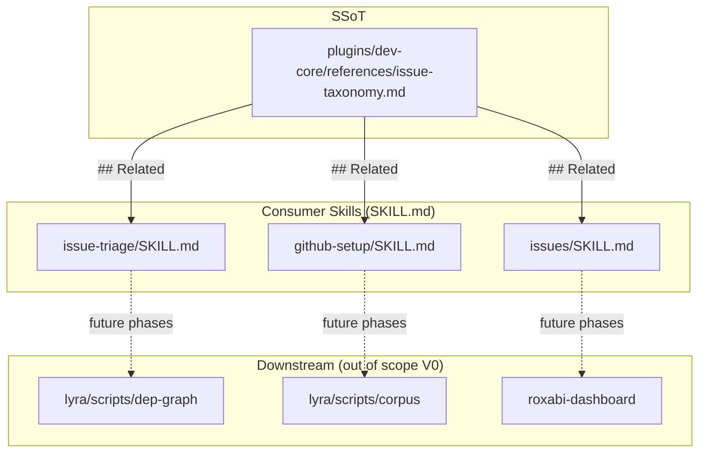
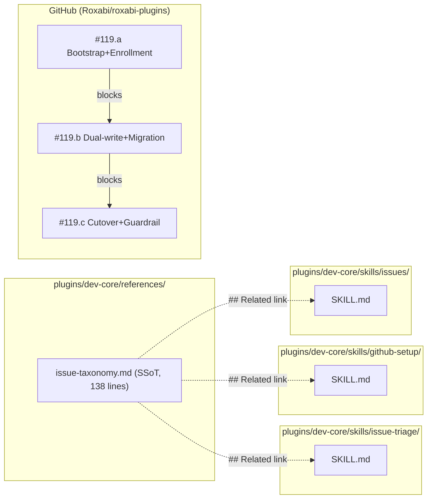

## Summary

Phase 0 of the 8-phase taxonomy migration: publish the SSoT reference `plugins/dev-core/references/issue-taxonomy.md`, cross-link it from the 3 consumer skills (`issue-triage`, `github-setup`, `issues`), and split the parent issue into 3 rollback-boundary children. Pure-docs slice inside an F-full parent — no code, no API calls, no schema mutations.

## Architecture

### Data Flow



### File x Function Map



## Bootstrap Context

No analysis artifact — spec approved directly (out-of-order state, user-accepted skip). Spec 119 is SSoT for phase decomposition. V0 Phase 0 was scoped down to docs-only so the F-full parent can land incrementally along rollback-stage children.

## Agents

| Agent | Task count | Files |
|-------|-----------|-------|
| doc-writer | 3 | `plugins/dev-core/skills/issue-triage/SKILL.md`, `plugins/dev-core/skills/github-setup/SKILL.md`, `plugins/dev-core/skills/issues/SKILL.md` |
| main ctx | 1 | GitHub issue-graph ops (create 3 children of #119) |

## Consistency Report

- Criteria covered: 2/8 (SC-0.1 SSoT doc + link-back, SC-0.2 child issue split). Remaining SC-1..SC-7 covered by children #119.a/#119.b/#119.c across subsequent V1..V7 slices.
- Uncovered criteria: none for V0 scope.
- Tasks without spec backing: none.
- Gold plating exemptions applied: 0.

## Micro-Tasks

### Slice V0: Phase 0 — Discoverability (docs-only)

#### Task 1: Create 3 children under #119 (a/b/c) via `dev-core:issue-triage` → main ctx
- **Files:** GitHub (Roxabi/roxabi-plugins) — no repo files
- **Snippet:**
  ```bash
  # each child created with parent=119, size=L, priority=High, status=Backlog
  bun triage.ts create \
    --title "refactor(dev-core): #119.a bootstrap + enrollment (phases 1+2)" \
    --parent 119 --size L --priority High
  bun triage.ts create \
    --title "refactor(dev-core): #119.b dual-write + migration (phases 3+4+5)" \
    --parent 119 --size L --priority High
  bun triage.ts create \
    --title "refactor(dev-core): #119.c cutover + guardrail (phases 6+7)" \
    --parent 119 --size L --priority High
  ```
- **Verify:** `bun ${CLAUDE_SKILL_DIR}/triage.ts list --json | jq '[.[] | select(.parent == 119)] | length'`
- **Expected:** `3`
- **Time:** 5 min
- **Difficulty:** 2
- **Traces:** SC-0.2
- **Phase:** GREEN
- **Parallel:** N (single actor, main ctx)

#### Task 2: Add `## Related` → SSoT link in `issue-triage/SKILL.md` [P] → doc-writer
- **File:** `plugins/dev-core/skills/issue-triage/SKILL.md`
- **Snippet:**
  ```markdown
  ## Related

  - Taxonomy SSoT → `plugins/dev-core/references/issue-taxonomy.md`
  ```
- **Verify:** `grep -c "references/issue-taxonomy.md" plugins/dev-core/skills/issue-triage/SKILL.md`
- **Expected:** `>= 1`
- **Time:** 3 min
- **Difficulty:** 1
- **Traces:** SC-0.1
- **Phase:** GREEN
- **Parallel:** Y

#### Task 3: Add `## Related` → SSoT link in `github-setup/SKILL.md` [P] → doc-writer
- **File:** `plugins/dev-core/skills/github-setup/SKILL.md`
- **Snippet:**
  ```markdown
  ## Related

  - Taxonomy SSoT → `plugins/dev-core/references/issue-taxonomy.md`
  ```
- **Verify:** `grep -c "references/issue-taxonomy.md" plugins/dev-core/skills/github-setup/SKILL.md`
- **Expected:** `>= 1`
- **Time:** 3 min
- **Difficulty:** 1
- **Traces:** SC-0.1
- **Phase:** GREEN
- **Parallel:** Y

#### Task 4: Add `## Related` → SSoT link in `issues/SKILL.md` [P] → doc-writer
- **File:** `plugins/dev-core/skills/issues/SKILL.md`
- **Snippet:**
  ```markdown
  ## Related

  - Taxonomy SSoT → `plugins/dev-core/references/issue-taxonomy.md`
  ```
- **Verify:** `grep -c "references/issue-taxonomy.md" plugins/dev-core/skills/issues/SKILL.md`
- **Expected:** `>= 1`
- **Time:** 3 min
- **Difficulty:** 1
- **Traces:** SC-0.1
- **Phase:** GREEN
- **Parallel:** Y

### Slice V0 Exit Gate

- `git ls-files plugins/dev-core/references/issue-taxonomy.md` → 1 hit (staged/committed)
- `grep -l "references/issue-taxonomy.md" plugins/dev-core/skills/{issue-triage,github-setup,issues}/SKILL.md | wc -l` → 3
- `bun triage.ts list --json | jq '[.[] | select(.parent == 119)] | length'` → 3

## Out-of-Scope (future slices)

| Slice | Child issue | Spec phases | Tier |
|---|---|---|---|
| V1 | #119.a | Phase 1 (bootstrap hub) + Phase 2 (opt-in enroll) | F-lite |
| V2 | #119.b | Phase 3 (dual-write) + Phase 4 (backfill) + Phase 5 (title rewrite) | F-full |
| V3 | #119.c | Phase 6 (cutover) + Phase 7 (guardrail) | F-lite |

Each child gets its own spec + plan when its parent unblocks.

## Task IDs

<!-- Generated by /plan. Used by /implement to resume tasks on session restart. -->
- T1: 8 — Create 3 children under #119 (a/b/c)
- T2: 9 — Add SSoT link to issue-triage/SKILL.md
- T3: 10 — Add SSoT link to github-setup/SKILL.md
- T4: 11 — Add SSoT link to issues/SKILL.md
