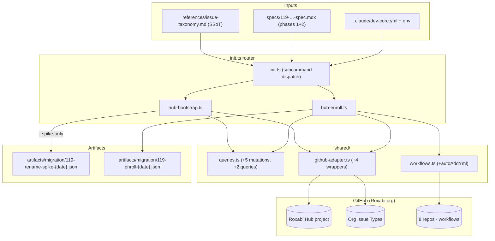
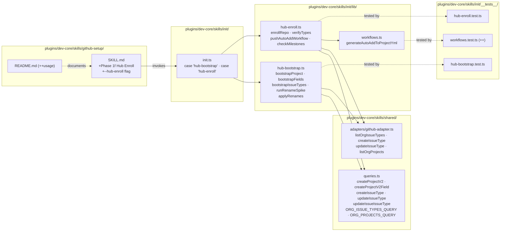

## Summary

Phases 1+2 of the 8-phase taxonomy migration: idempotent bootstrap of the `Roxabi Hub` Project V2 (Lane/Priority/Size + Status) + 7 missing org-level Issue Types + renames (`Bug→fix`, `Feature→feat`) + disable (`Task`), followed by opt-in per-repo enrollment via new `--hub-enroll` flag on `dev-core:github-setup`. Phase 1.7 pre-flight sub-spike runs as a RED-GATE before renames execute. Phase 2.2 milestone seed stays out of scope (external `make milestones-sync` dependency) — enrollment detects missing milestones and warns without mutating.

## Architecture

### Data Flow

### File x Function Map

## Bootstrap Context

Parent spec 119 is SSoT for phase decomposition. Issue #120 is child #119.a (phases 1+2 · rollback stage 1). Phase 0 (docs discoverability) already landed via PR #123. This slice delivers the executable substrate (idempotent TS + GraphQL) plus two human-driven RED-GATE execution steps. Renames (1.8–1.10) are gated behind a mandatory pre-flight spike (1.7) because GH does not document whether org-level `issueType` renames preserve existing assignments.

## Agents

| Agent | Task count | Files |
|---|---|---|
| backend-dev | 8 | queries.ts, github-adapter.ts, hub-bootstrap.ts, hub-enroll.ts, init.ts |
| devops | 1 | workflows.ts |
| doc-writer | 2 | github-setup/SKILL.md, github-setup/README.md |
| tester | 3 | __tests__/hub-bootstrap.test.ts, __tests__/hub-enroll.test.ts, __tests__/workflows.test.ts |
| (user, live-API) | 2 | RED-GATE T9 + T17 |

## Consistency Report

- Spec criteria covered (phases 1+2): 7/7 in-scope + 1/1 exempted (milestone seed)
- Uncovered: none
- Tasks without spec backing: none
- Gold-plating exemptions: 1 (Phase 2.2 milestone seed — explicit external dep on `make milestones-sync`; plan enforces detect+warn, no mutation)

### Spec trace

| Spec step | Plan task |
|---|---|
| 1.1 Create `Roxabi Hub` project | T4 |
| 1.2–1.4 Lane/Priority/Size fields | T4 |
| 1.5 Verify Status built-in | T4 |
| 1.6 Create 7 missing Issue Types | T5 |
| 1.7 Pre-flight sub-spike | T6 (tool) + T9 (execution) |
| 1.8–1.9 Rename `Bug→fix`/`Feature→feat` | T7 (code, gated) + T9 (execution) |
| 1.10 Disable `Task` | T7 + T9 |
| 2.1 Auto-add workflow × 8 repos | T12 + T13 + T17 |
| 2.2 Milestone seed | T13 (warn-only; external dep) |
| 2.3 Verify test issue in hub | T13 + T17 |
| `--hub-enroll` skill flag | T13–T16 |

## Micro-Tasks

### Slice V1: Phase 1 Bootstrap (code + spike tooling; live mutations at T9 only)

#### Task 1: Extend queries.ts with org-level mutations [P] → backend-dev
- **File:** plugins/dev-core/skills/shared/queries.ts
- **Snippet:** `export const CREATE_PROJECT_V2_MUTATION = \`mutation($ownerId:ID!, $title:String!){ createProjectV2(input:{ownerId:$ownerId, title:$title}){ projectV2{ id number } } }\`` — plus `CREATE_PROJECT_V2_FIELD_MUTATION`, `CREATE_ISSUE_TYPE_MUTATION`, `UPDATE_ISSUE_TYPE_MUTATION`, `UPDATE_ISSUE_ISSUE_TYPE_MUTATION`, `ORG_ISSUE_TYPES_QUERY`, `ORG_PROJECTS_QUERY`
- **Verify:** `bun run typecheck`
- **Expected:** 0 errors
- **Time:** 6 min · **Difficulty:** 2 · **Traces:** 1.1–1.10 · **Phase:** RED

#### Task 2: Add idempotent wrappers to github-adapter.ts [P] → backend-dev
- **File:** plugins/dev-core/skills/shared/adapters/github-adapter.ts
- **Snippet:** `export async function listOrgProjects(login:string){…}` + `listOrgIssueTypes(login)` + `createIssueType(ownerId,name,color)` + `updateIssueType(id,{name?,isEnabled?})`. Each wrapper queries first, skips if name already present.
- **Verify:** `bun run typecheck && bun test plugins/dev-core/skills/shared/__tests__`
- **Expected:** 0 errors · existing tests pass
- **Time:** 10 min · **Difficulty:** 3 · **Traces:** 1.1–1.10 · **Phase:** RED

#### Task 3: Write failing tests for hub-bootstrap [P] → tester
- **File:** plugins/dev-core/skills/init/__tests__/hub-bootstrap.test.ts
- **Snippet:** `it('is idempotent when project exists')`, `it('creates missing issue types only')`, `it('spike-only mode emits snapshot JSON')`, `it('aborts renames without --confirm-renames')`, `it('aborts renames without spike snapshot')`. Mock `ghGraphQL` with in-memory state.
- **Verify:** `bun test plugins/dev-core/skills/init/__tests__/hub-bootstrap.test.ts`
- **Expected:** All tests FAIL (RED)
- **Time:** 12 min · **Difficulty:** 3 · **Traces:** 1.1–1.10 · **Phase:** RED

#### Task 4: Implement bootstrapProject + bootstrapFields (Phase 1.1–1.5) → backend-dev
- **File:** plugins/dev-core/skills/init/lib/hub-bootstrap.ts
- **Snippet:** `export async function bootstrapProject(ownerLogin:string){ const ex = await listOrgProjects(ownerLogin); const hit = ex.find(p=>p.title==='Roxabi Hub'); if(hit) return hit; return createProjectV2(…) }` + `bootstrapFields(projectId)` creates Lane/Priority/Size (skip if same-name field exists) + verifies Status built-in.
- **Verify:** `bun test plugins/dev-core/skills/init/__tests__/hub-bootstrap.test.ts -t "idempotent when project exists"`
- **Expected:** PASS
- **Time:** 15 min · **Difficulty:** 3 · **Traces:** 1.1–1.5 · **Phase:** GREEN · **Deps:** T1, T2, T3

#### Task 5: Implement bootstrapIssueTypes (Phase 1.6) → backend-dev
- **File:** plugins/dev-core/skills/init/lib/hub-bootstrap.ts
- **Snippet:** `const target = ['feat','fix','refactor','docs','test','chore','ci','perf','epic','research']; const existing = await listOrgIssueTypes(login); for (const name of target) if(!existing.find(t=>t.name===name)) await createIssueType(ownerId,name,colorFor(name))`. Colors match SSoT.
- **Verify:** `bun test plugins/dev-core/skills/init/__tests__/hub-bootstrap.test.ts -t "creates missing issue types only"`
- **Expected:** PASS
- **Time:** 10 min · **Difficulty:** 2 · **Traces:** 1.6 · **Phase:** GREEN · **Deps:** T4

#### Task 6: Implement rename-spike tool (Phase 1.7) → backend-dev
- **File:** plugins/dev-core/skills/init/lib/hub-bootstrap.ts
- **Snippet:** `export async function runRenameSpike(){ const bug = await queryIssuesByType('Bug'); const feat = await queryIssuesByType('Feature'); const dummy = await createThrowawayIssue(); await updateIssueType(dummy,'_spike_rename_probe'); const readBack = await queryIssueType(dummy); const preserved = readBack.name==='_spike_rename_probe'; writeFile(snapshotPath,{preserved, bugCount:bug.length, featCount:feat.length, bugIds:bug.map(i=>i.id), featIds:feat.map(i=>i.id)}); await closeIssue(dummy); return snapshotPath }`
- **Verify:** `bun test plugins/dev-core/skills/init/__tests__/hub-bootstrap.test.ts -t "spike-only mode emits snapshot"`
- **Expected:** PASS; snapshot JSON contains `preserved` + counts + IDs
- **Time:** 18 min · **Difficulty:** 4 · **Traces:** 1.7 · **Phase:** GREEN · **Deps:** T5

#### Task 7: Implement applyRenames (Phase 1.8–1.10) → backend-dev
- **File:** plugins/dev-core/skills/init/lib/hub-bootstrap.ts
- **Snippet:** `export async function applyRenames(opts:{confirmRenames:boolean, spikeSnapshot?:string}){ if(!opts.confirmRenames) throw new Error('refusing renames without --confirm-renames'); if(!opts.spikeSnapshot||!existsSync(opts.spikeSnapshot)) throw new Error('spike snapshot required'); const snap = JSON.parse(readFileSync(opts.spikeSnapshot)); if(!snap.preserved) throw new Error('spike showed rename does NOT preserve assignments — abort'); await updateIssueType(BUG_ID,{name:'fix'}); await updateIssueType(FEATURE_ID,{name:'feat'}); await updateIssueType(TASK_ID,{isEnabled:false}); }`. Issue type IDs hardcoded from spec (`IT_kwDOB8J6DM4BJQ3X` etc).
- **Verify:** `bun test plugins/dev-core/skills/init/__tests__/hub-bootstrap.test.ts -t "aborts renames"`
- **Expected:** PASS; both abort paths throw with distinct messages
- **Time:** 12 min · **Difficulty:** 3 · **Traces:** 1.8, 1.9, 1.10 · **Phase:** GREEN · **Deps:** T6

#### Task 8: Wire hub-bootstrap into init.ts router → backend-dev
- **File:** plugins/dev-core/skills/init/init.ts
- **Snippet:** `case 'hub-bootstrap': { const { spikeOnly, confirmRenames, spikeSnapshot } = parseFlags(argv); const result = await runHubBootstrap({spikeOnly, confirmRenames, spikeSnapshot}); console.log(JSON.stringify(result)); break }`
- **Verify:** `bun plugins/dev-core/skills/init/init.ts hub-bootstrap --help 2>&1 | grep -q 'hub-bootstrap'`
- **Expected:** subcommand recognised
- **Time:** 6 min · **Difficulty:** 2 · **Traces:** 1.1–1.10 · **Phase:** REFACTOR · **Deps:** T7

#### RED-GATE T9: Execute Phase 1.7 spike + apply renames (live GH API, user-driven)
- **Verify:** `bun plugins/dev-core/skills/init/init.ts hub-bootstrap --spike-only` → review snapshot JSON → `--confirm-renames --spike-snapshot <path>` if `preserved===true`. Commit snapshot to `artifacts/migration/`.
- **Expected:** `Roxabi Hub` project ∃ with 4 fields; 10 Issue Types active; `Task` disabled; spike snapshot committed; renames preserved assignments.
- **Time:** 15 min (live) · **Difficulty:** 3 · **Traces:** 1.7, 1.8, 1.9, 1.10 · **Phase:** RED-GATE · **Deps:** T8
- **Rollback:** if spike shows `preserved===false` → STOP; open follow-up issue to redesign Phase 1.8/1.9 before touching prod. Project creation rollback via `deleteProjectV2`.

### Slice V2: Phase 2 Enrollment

#### Task 10: Add workflow generator tests [P] → tester
- **File:** plugins/dev-core/skills/init/__tests__/workflows.test.ts
- **Snippet:** `describe('generateAutoAddToProjectYml', () => { it('injects project URL'); it('uses actions/add-to-project@v1'); it('has required permissions'); })`
- **Verify:** `bun test plugins/dev-core/skills/init/__tests__/workflows.test.ts -t "generateAutoAddToProjectYml"`
- **Expected:** FAIL (RED)
- **Time:** 8 min · **Difficulty:** 2 · **Traces:** 2.1 · **Phase:** RED

#### Task 11: Write failing tests for hub-enroll [P] → tester
- **File:** plugins/dev-core/skills/init/__tests__/hub-enroll.test.ts
- **Snippet:** `it('per-repo loop is idempotent')`, `it('warns when milestones missing — no mutation')`, `it('verifies Issue Types exist before enrolling')`, `it('writes enroll snapshot')`. Mock `pushWorkflows` + `ghGraphQL`.
- **Verify:** `bun test plugins/dev-core/skills/init/__tests__/hub-enroll.test.ts`
- **Expected:** FAIL (RED)
- **Time:** 12 min · **Difficulty:** 3 · **Traces:** 2.1, 2.2, 2.3 · **Phase:** RED

#### Task 12: Implement generateAutoAddToProjectYml → devops
- **File:** plugins/dev-core/skills/init/lib/workflows.ts
- **Snippet:** `export function generateAutoAddToProjectYml(projectUrl:string){ return \`name: Add to Roxabi Hub\non:\n  issues: { types: [opened, transferred] }\n  pull_request: { types: [opened] }\npermissions: { repository-projects: write }\njobs:\n  add:\n    runs-on: ubuntu-latest\n    steps:\n      - uses: actions/add-to-project@v1\n        with:\n          project-url: \${projectUrl}\n          github-token: \${{ secrets.PAT }}\n\`}`
- **Verify:** `bun test plugins/dev-core/skills/init/__tests__/workflows.test.ts -t "generateAutoAddToProjectYml"`
- **Expected:** PASS
- **Time:** 8 min · **Difficulty:** 2 · **Traces:** 2.1 · **Phase:** GREEN · **Deps:** T10

#### Task 13: Implement hub-enroll.ts → backend-dev
- **File:** plugins/dev-core/skills/init/lib/hub-enroll.ts
- **Snippet:** `export async function enrollRepo(owner:string, repo:string, projectUrl:string){ await verifyTypesExist(); await pushWorkflow(owner,repo,'.github/workflows/hub-add.yml',generateAutoAddToProjectYml(projectUrl)); const missing = await checkMilestones(owner,repo,['M0','M1','M2']); if(missing.length) console.warn(\`[\${owner}/\${repo}] milestones missing: \${missing.join(',')} — run make milestones-sync\`); const hit = await verifyTestIssueInHub(owner,repo,projectUrl); return {enrolled:true, milestonesMissing:missing, verified:hit} }`
- **Verify:** `bun test plugins/dev-core/skills/init/__tests__/hub-enroll.test.ts`
- **Expected:** All PASS
- **Time:** 18 min · **Difficulty:** 4 · **Traces:** 2.1, 2.2, 2.3 · **Phase:** GREEN · **Deps:** T11, T12

#### Task 14: Wire hub-enroll into init.ts → backend-dev
- **File:** plugins/dev-core/skills/init/init.ts
- **Snippet:** `case 'hub-enroll': { const { owner, repo, dryRun } = parseFlags(argv); const result = dryRun ? await dryRunEnroll(owner,repo) : await enrollRepo(owner,repo,projectUrl); console.log(JSON.stringify(result)); break }`
- **Verify:** `bun plugins/dev-core/skills/init/init.ts hub-enroll --repo Roxabi/roxabi-plugins --dry-run`
- **Expected:** JSON output with `enrolled:true, dryRun:true`
- **Time:** 6 min · **Difficulty:** 2 · **Traces:** 2.1 · **Phase:** GREEN · **Deps:** T13

#### Task 15: Update github-setup SKILL.md (Phase 1f + --hub-enroll) → doc-writer
- **File:** plugins/dev-core/skills/github-setup/SKILL.md
- **Snippet:** new `### 1f. Hub Enroll` section after 1e; flag `--hub-enroll` in frontmatter `argument-hint`; delegate to `bun $I_TS hub-enroll --repo <owner/repo>`; document milestone warning.
- **Verify:** `grep -q 'hub-enroll' plugins/dev-core/skills/github-setup/SKILL.md && grep -q '### 1f' plugins/dev-core/skills/github-setup/SKILL.md`
- **Expected:** both matches
- **Time:** 8 min · **Difficulty:** 2 · **Traces:** 2.1–2.3 · **Phase:** GREEN · **Deps:** T14

#### Task 16: Update github-setup README.md → doc-writer
- **File:** plugins/dev-core/skills/github-setup/README.md
- **Snippet:** usage example block showing `github-setup --hub-enroll`; note external `milestones-sync` dep.
- **Verify:** `grep -q 'hub-enroll' plugins/dev-core/skills/github-setup/README.md`
- **Expected:** match
- **Time:** 5 min · **Difficulty:** 1 · **Traces:** 2.1 · **Phase:** GREEN · **Deps:** T15

#### RED-GATE T17: Pilot enrollment (live GH API, user-driven)
- **Verify:** `bun plugins/dev-core/skills/init/init.ts hub-enroll --repo Roxabi/roxabi-plugins` then `--repo Roxabi/lyra`. Verify a test issue in each appears as a hub project item via `projectV2.items` query. Commit enroll snapshot.
- **Expected:** 2 pilot repos enrolled; test issues visible in hub; milestone warnings logged but non-fatal.
- **Time:** 15 min (live) · **Difficulty:** 3 · **Traces:** 2.1, 2.3 · **Phase:** RED-GATE · **Deps:** T16
- **Rollback:** remove auto-add workflow via `gh api -X DELETE /repos/<o>/<r>/actions/workflows/hub-add.yml`. Hub items remain; delete per-item if needed.

## Rollback summary

| Scope | Action |
|---|---|
| Project creation (T4) | `deleteProjectV2(id)` |
| Field creation (T4) | `deleteProjectV2Field(id)` per field |
| New Issue Types (T5) | `updateIssueType(id, isEnabled:false)` — GH exposes no delete mutation for org types |
| Renames (T7/T9) | `updateIssueType` back to `Bug`/`Feature`/`Task enabled` using spike snapshot as recovery manifest |
| Auto-add workflows (T12/T13/T17) | Remove `.github/workflows/hub-add.yml` via API delete; hub items remain |

## Risks + gates

| Risk | Gate |
|---|---|
| Rename `Bug→fix`/`Feature→feat` orphans assignments | **RED-GATE T9:** refuses to run 1.8/1.9 unless spike JSON `preserved===true` |
| Missing milestones break dep-graph | Enrollment emits warnings; no mutation; follow-up issue tracks `milestones-sync` |
| Multi-repo drift during enrollment | Pilot on 2 repos (T17) before rolling out remaining 6 |
| Token scope insufficient for org mutations | Spike 2 (2026-04-21) confirmed `project` scope suffices — no `admin:org` refresh needed |

## Follow-up issues (out of scope here)

- `make milestones-sync` helper (external dep for Phase 2.2)
- Roll out `hub-enroll` to remaining 6 repos after pilot (T17 success)
- Phase 3 dual-write lands in child #121

## Task IDs

<!-- Generated by /plan. Used by /implement to resume tasks on session restart. -->
- T1: 9 — T1 RED: queries.ts — add 5 mutations + 2 queries
- T2: 10 — T2 RED: github-adapter.ts — 4 idempotent wrappers
- T3: 11 — T3 RED: hub-bootstrap.test.ts — failing specs
- T4: 12 — T4 GREEN: hub-bootstrap.ts — project + fields (1.1–1.5)
- T5: 13 — T5 GREEN: hub-bootstrap.ts — 7 Issue Types (1.6)
- T6: 14 — T6 GREEN: hub-bootstrap.ts — rename spike tool (1.7)
- T7: 15 — T7 GREEN: hub-bootstrap.ts — applyRenames (1.8–1.10)
- T8: 16 — T8 REFACTOR: init.ts — add hub-bootstrap subcommand
- T9: 17 — T9 RED-GATE: live spike + renames execution
- T10: 18 — T10 RED: workflows.test.ts — generateAutoAddToProjectYml cases
- T11: 19 — T11 RED: hub-enroll.test.ts — failing specs
- T12: 20 — T12 GREEN: workflows.ts — generateAutoAddToProjectYml
- T13: 21 — T13 GREEN: hub-enroll.ts — per-repo enrollment
- T14: 22 — T14 GREEN: init.ts — hub-enroll subcommand
- T15: 23 — T15 GREEN: github-setup/SKILL.md — Phase 1f + flag docs
- T16: 24 — T16 GREEN: github-setup/README.md — usage
- T17: 25 — T17 RED-GATE: pilot enrollment (roxabi-plugins + lyra)
