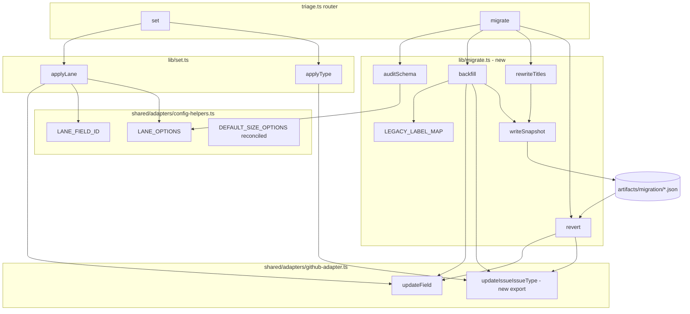
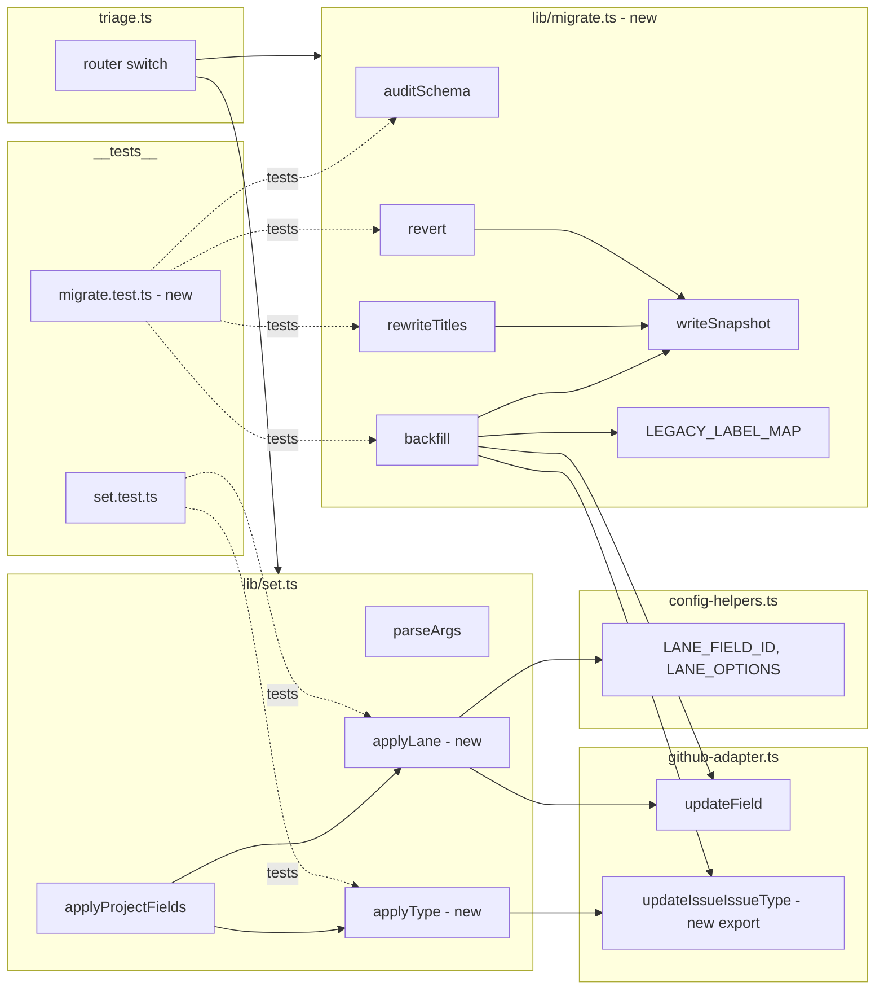

## Summary

Shape B implementation: extend `issue-triage` skill with `--lane`/`--type` write paths, then add a TS-resident `migrate` subcommand with `backfill`, `rewrite-titles`, `revert`, `audit-schema`. ~600 LOC across 9 files, 16 micro-tasks, 3 agents.

## Architecture

### Data flow

### File × Function map

## Agents

| Agent | Tasks | Files |
|---|---|---|
| backend-dev | 12 | `config-helpers.ts`, `github-adapter.ts`, `set.ts`, `triage.ts`, `lib/migrate.ts` |
| tester | 4 | `__tests__/set.test.ts`, `__tests__/migrate.test.ts` |
| doc-writer | 2 | `SKILL.md`, `references/issue-taxonomy.md` |

## Consistency Report

| Spec trace | Covered by | Status |
|---|---|---|
| SC: `--lane` validation | T3, T4 | ✓ |
| SC: `--type` validation | T3, T4 | ✓ |
| SC: `LANE_FIELD_ID`/`LANE_OPTIONS` | T1 | ✓ |
| SC: `DEFAULT_SIZE_OPTIONS` reconciled | T1, T5 | ✓ |
| SC: `updateIssueIssueType` exported | T2 | ✓ |
| SC: `migrate.ts` implements 4 commands | T5, T6, T9, T12 | ✓ |
| SC: router 4 first-class subcmds | T7, T10, T13 | ✓ |
| SC: `LEGACY_LABEL_MAP` + unit test | T6, T8 | ✓ |
| SC: snapshot path format | T6, T9 | ✓ |
| SC: revert idempotent | T12, T14 | ✓ |
| SC: unit test coverage | T4, T8, T11, T14 | ✓ |
| SC: `SKILL.md` docs | T15 | ✓ |
| SC: `issue-taxonomy.md` patch | T16 | ✓ |
| SC: typecheck + test + biome clean | RED-GATEs per slice | ✓ |

Operational criteria (soak, live backfill, live rewrite, GraphQL verification, snapshot commits) tracked in PR body — **not** in micro-tasks.

## Slices

### V1 — Write-path extension (S1)

| # | Task | File | Agent | Difficulty | Phase | Dep |
|---|---|---|---|---|---|---|
| T1 [P] | Add `LANE_FIELD_ID`, `LANE_OPTIONS` (20 values from `hub-bootstrap.ts`), reconcile `DEFAULT_SIZE_OPTIONS` to live schema (audit before editing) | `plugins/dev-core/skills/shared/adapters/config-helpers.ts` | backend-dev | 2 | GREEN | — |
| T2 [P] | Export `updateIssueIssueType(issueNodeId, typeId \| null)` wrapper; add `resolveIssueTypeId(typeName)` using existing `listOrgIssueTypes` | `plugins/dev-core/skills/shared/adapters/github-adapter.ts` | backend-dev | 2 | GREEN | — |
| T3 | Add `--lane L` + `--type T` to `parseArgs`; implement `applyLane`, `applyType`; wire into `applyProjectFields`; exit 1 on invalid | `plugins/dev-core/skills/issue-triage/lib/set.ts` | backend-dev | 3 | GREEN | T1, T2 |
| T4 | Test cases: `--lane` valid/invalid, `--type` valid/invalid, additive (omit both = old behavior), regression on `--size`/`--priority`/`--status` | `plugins/dev-core/skills/issue-triage/__tests__/set.test.ts` | tester | 2 | RED→GREEN | T3 |
| RED-GATE V1 | `bun run typecheck && bun run test --filter set.test && bunx biome check` | — | — | — | RED-GATE | T1..T4 |

### V2 — Schema audit + backfill (S3)

| # | Task | File | Agent | Difficulty | Phase | Dep |
|---|---|---|---|---|---|---|
| T5 | Create `lib/migrate.ts`. Implement `auditSchema()`: query `gh project field-list` via GraphQL, assert Size+Lane+Priority+Status fields exist and option IDs match constants; exit 1 with diff on mismatch | `plugins/dev-core/skills/issue-triage/lib/migrate.ts` | backend-dev | 3 | GREEN | T1 |
| T6 | Implement `backfill({repo, dryRun, snapshotPath})`: walk open issues, skip already-set fields, apply `LEGACY_LABEL_MAP` (graph:lane/*, size:*, P0-3, title-prefix), write snapshot + flagged.txt; invokes `auditSchema` as pre-flight | `plugins/dev-core/skills/issue-triage/lib/migrate.ts` | backend-dev | 5 | GREEN | T5 |
| T7 | Route `migrate <backfill\|audit-schema>` subcommands in `triage.ts` switch | `plugins/dev-core/skills/issue-triage/triage.ts` | backend-dev | 1 | GREEN | T5, T6 |
| T8 | Test cases: `auditSchema` mismatch exits 1; `backfill --dry-run` writes no mutations but writes snapshot; idempotency (2nd run = 0 mutations); `LEGACY_LABEL_MAP` assertions (each key→expected value); unknown labels → flagged.txt | `plugins/dev-core/skills/issue-triage/__tests__/migrate.test.ts` | tester | 3 | RED→GREEN | T6 |
| RED-GATE V2 | `bun run typecheck && bun run test --filter migrate.test && bunx biome check` | — | — | — | RED-GATE | T5..T8 |

### V3 — Title rewrite (S5)

| # | Task | File | Agent | Difficulty | Phase | Dep |
|---|---|---|---|---|---|---|
| T9 [P] | Implement `rewriteTitles({repo, dryRun})`: regex `^(feat\|fix\|refactor\|docs\|test\|chore\|ci\|perf)(\(.+\))?:\s*` strip, emit `rewrite-snapshot-<ts>.json`, call `gh issue edit --title` live | `plugins/dev-core/skills/issue-triage/lib/migrate.ts` | backend-dev | 3 | GREEN | T6 |
| T10 | Route `migrate rewrite-titles` in `triage.ts` | `plugins/dev-core/skills/issue-triage/triage.ts` | backend-dev | 1 | GREEN | T9 |
| T11 | Test cases: prefix regex stripping (all 8 types, with/without scope), false-positive guard (`foo: bar` without type keyword stays), dry-run emits snapshot no mutations | `plugins/dev-core/skills/issue-triage/__tests__/migrate.test.ts` | tester | 2 | RED→GREEN | T9 |
| RED-GATE V3 | `bun run typecheck && bun run test --filter migrate.test && bunx biome check` | — | — | — | RED-GATE | T9..T11 |

### V4 — Revert (S6)

| # | Task | File | Agent | Difficulty | Phase | Dep |
|---|---|---|---|---|---|---|
| T12 [P] | Implement `revert({snapshotPath})`: detect snapshot kind (backfill vs rewrite), apply inverse (`updateField(…, null)` for fields; `updateIssueIssueType(…, null)` for type; `gh issue edit --title <old>` for rewrite); idempotent (skip-already-reverted) | `plugins/dev-core/skills/issue-triage/lib/migrate.ts` | backend-dev | 4 | GREEN | T6, T9 |
| T13 | Route `migrate revert --snapshot <path>` in `triage.ts` | `plugins/dev-core/skills/issue-triage/triage.ts` | backend-dev | 1 | GREEN | T12 |
| T14 | Test cases: round-trip (write snapshot via dry-run-like stub → revert clears fields); idempotent 2nd revert logs skip; handles both snapshot kinds | `plugins/dev-core/skills/issue-triage/__tests__/migrate.test.ts` | tester | 3 | RED→GREEN | T12 |
| RED-GATE V4 | `bun run typecheck && bun run test && bunx biome check` | — | — | — | RED-GATE | T12..T14 |

### V5 — Docs

| # | Task | File | Agent | Difficulty | Phase | Dep |
|---|---|---|---|---|---|---|
| T15 [P] | Document `--lane`, `--type`, `migrate <backfill\|audit-schema\|rewrite-titles\|revert>` with examples; add "Soak window + migration" section referencing the spec | `plugins/dev-core/skills/issue-triage/SKILL.md` | doc-writer | 2 | REFACTOR | T13 |
| T16 [P] | Patch enrolled-repos list (8 → 7; remove `Roxabi/2ndBrain` with footnote); add size-schema reconciliation note (`hub-bootstrap.ts` vs `config-helpers.ts`); add `LEGACY_LABEL_MAP` mapping table | `plugins/dev-core/references/issue-taxonomy.md` | doc-writer | 2 | REFACTOR | T1 |

## Reference patterns

- **Field-write pattern:** `plugins/dev-core/skills/issue-triage/lib/set.ts:applySize` (canonical resolve → exit on invalid → `updateField`)
- **`updateIssueIssueType` usage:** `plugins/dev-core/skills/init/lib/hub-bootstrap.ts` (already imports; agent can lift import path + call shape)
- **Lane options source:** `plugins/dev-core/skills/init/lib/hub-bootstrap.ts:LANE_OPTIONS` — copy the 20-value array
- **Existing tests:** `plugins/dev-core/skills/issue-triage/__tests__/set.test.ts` for test shape + mocking approach

## Task IDs

<!-- Generated by /plan. Used by /implement to resume tasks on session restart. -->
- T1: 12 — add LANE_FIELD_ID + LANE_OPTIONS, reconcile DEFAULT_SIZE_OPTIONS
- T2: 13 — export updateIssueIssueType adapter + resolveIssueTypeId
- T3: 14 — add --lane + --type to set.ts
- T4: 15 — set.test.ts cases for --lane + --type
- T5: 16 — implement migrate.ts:auditSchema
- T6: 17 — implement migrate.ts:backfill + LEGACY_LABEL_MAP + snapshot writer
- T7: 18 — route migrate backfill + audit-schema in triage.ts
- T8: 19 — migrate.test.ts: audit, dry-run, idempotency, LEGACY_LABEL_MAP
- T9: 20 — implement migrate.ts:rewriteTitles
- T10: 21 — route migrate rewrite-titles in triage.ts
- T11: 22 — migrate.test.ts: rewriteTitles cases
- T12: 23 — implement migrate.ts:revert
- T13: 24 — route migrate revert in triage.ts
- T14: 25 — migrate.test.ts: revert round-trip
- T15: 26 — SKILL.md: --lane/--type + migrate subcommands
- T16: 27 — issue-taxonomy.md: patch 8→7, size-schema note, LEGACY_LABEL_MAP table
