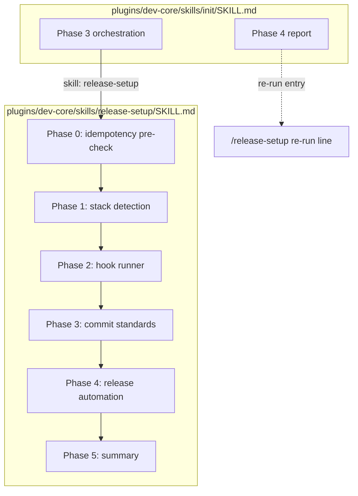
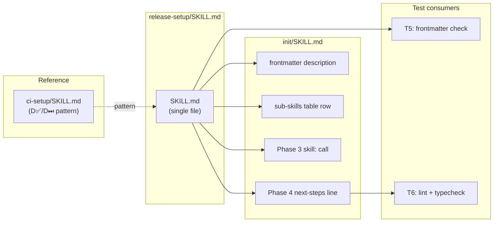

## Summary

Create `plugins/dev-core/skills/release-setup/SKILL.md` implementing a new dev-core sub-skill that
configures hook runners, commit standards (Node/TS), and release automation — then wire it into
`plugins/dev-core/skills/init/SKILL.md` as a fourth Phase 3 sub-skill call.

---

## Architecture





---

## Agents

| Agent | Tasks | Files |
|-------|-------|-------|
| doc-writer | T1, T2, T3, T4 | `release-setup/SKILL.md` (create), `init/SKILL.md` (edit) |
| tester | T5, T6 | — (validation only) |

---

## Consistency Report

| Criteria | Covered by tasks | Status |
|----------|-----------------|--------|
| SC-1: Lefthook on Node/TS generates `.lefthook.yml` with lint+typecheck from stack.yml | T1 | ✓ |
| SC-2: Lefthook on Python generates `.lefthook.yml` + `.pre-commit-config.yaml` | T1 | ✓ |
| SC-3: Existing `.lefthook.yml` not replaced — only commit-msg hook added | T1 | ✓ |
| SC-4: Commitizen generates `.commitlintrc.cjs` + `"commit": "cz"` script | T2 | ✓ |
| SC-5: Python skips commit standards with note | T2 | ✓ |
| SC-6: semantic-release generates `release.config.cjs` with git-detected branches | T3 | ✓ |
| SC-7: Release Please generates `release-please-config.json` + manifest | T3 | ✓ |
| SC-8: Idempotency — skips already-configured components (no `--force`) | T1 (Phase 0) | ✓ |
| SC-9: `/init` invokes `/release-setup` after `/ci-setup` + Phase 4 re-run entry | T4 | ✓ |
| SC-10: Package install failure → warn + continue | T3 (Phase 5) | ✓ |

Coverage: 10/10. Uncovered: 0. Exemptions: 0.

---

## Micro-Tasks

### S1 — Hook Runner Setup

---

**T1** `[doc-writer]` `[S1]` `[RED]`

Create `plugins/dev-core/skills/release-setup/SKILL.md` with:
- Frontmatter: name, description, version 0.1.0, allowed-tools
- Phase 0 (idempotency pre-check per component)
- Phase 1 (stack detection from stack.yml + detect_hook_runner + branch detection)
- Phase 2 (hook runner: Lefthook | Husky | Skip, Node/TS vs Python paths)
- Phase 5 stub (summary table + no-auto-commit pattern)

Pattern reference: `plugins/dev-core/skills/ci-setup/SKILL.md` (D✅/D⏭ display convention)

```markdown
---
name: release-setup
argument-hint: '[--force]'
description: 'Set up commit standards and release automation — Commitizen, commitlint,
  semantic-release, Release Please, Lefthook/Husky. Triggers: "release setup" |
  "setup releases" | "commit standards" | "setup release automation".'
version: 0.1.0
allowed-tools: Bash, ToolSearch, AskUserQuestion
---

# Release Setup

Let:
  F := `--force` flag present in `$ARGUMENTS`
  σ := `.claude/stack.yml`
  D✅(label) := Display: `{label} ✅ Configured`
  D⏭(label)  := Display: `{label} ⏭ Already configured`
  D⚠(label)  := Display: `{label} ⚠️ Install failed — check network/lockfile`

...
```

Verify:
```bash
grep -E 'name:|description:|version:|allowed-tools:' \
  plugins/dev-core/skills/release-setup/SKILL.md
```
Expected: 4 matching lines.

Spec trace: SC-1, SC-2, SC-3, SC-8
Time: 8 min | Difficulty: 2

---

**T5** `[tester]` `[S1]` `[GREEN]` `[P]`

Validate SKILL.md frontmatter completeness.

```bash
grep -c "name:\|description:\|version:\|allowed-tools:" \
  plugins/dev-core/skills/release-setup/SKILL.md
```
Expected output: `4`

Spec trace: SC-1
Time: 2 min | Difficulty: 1

---

**RED-GATE S1 → S2:** T1 complete, T5 passes (4 frontmatter fields present)

---

### S2 — Commit Standards

---

**T2** `[doc-writer]` `[S2]` `[RED]`

Extend `plugins/dev-core/skills/release-setup/SKILL.md` with Phase 3 (Commit Standards):
- Guard: `runtime == python` → D⏭ + informational note
- AskUserQuestion: Commitizen + commitlint | Skip
- Install steps + `.commitlintrc.cjs` generation
- Hook wiring (Lefthook merge OR Husky file)

```markdown
## Phase 3 — Commit Standards (Node/TS only)

| Affordance | Handler | Data |
|-----------|---------|------|
| `runtime == python` | D⏭("Commit standards — Python not supported") | — |
| AskUserQuestion: **Commitizen + commitlint** \| **Skip** | `setup_commits()` | choice |
...
```

Verify:
```bash
grep -c "Phase 3" plugins/dev-core/skills/release-setup/SKILL.md
```
Expected output: `1`

Spec trace: SC-4, SC-5
Time: 5 min | Difficulty: 2

---

**RED-GATE S2 → S3:** T2 complete, Phase 3 present in SKILL.md

---

### S3 — Release Automation

---

**T3** `[doc-writer]` `[S3]` `[RED]`

Extend `plugins/dev-core/skills/release-setup/SKILL.md` with:
- Phase 4 (Release Automation): semantic-release | Release Please | Skip
  - Branch detection: `git branch -r | grep -E 'staging|develop|main|master'`
  - semantic-release: `release.config.cjs` generation with detected branches
  - Release Please: `release-please-config.json` + `.release-please-manifest.json`
- Phase 5 (Summary — no auto-commit):
  - Generated files table (✅/⏭ per component)
  - Suggested commit command display
  - Package install failure handling in each phase (non-zero exit → D⚠ + continue)

Verify:
```bash
grep -c "Phase 4\|Phase 5" plugins/dev-core/skills/release-setup/SKILL.md
```
Expected output: `2`

Spec trace: SC-6, SC-7, SC-10
Time: 5 min | Difficulty: 2

---

**RED-GATE S3 → S4:** T3 complete, Phase 4 + Phase 5 present

---

### S4 — /init Integration

---

**T4** `[doc-writer]` `[S4]` `[RED]`

Edit `plugins/dev-core/skills/init/SKILL.md` — 4 targeted changes:

1. **Frontmatter description** — add `release-setup` to the description trigger list:
   ```
   old: 'orchestrates env-setup, github-setup, ci-setup'
   new: 'orchestrates env-setup, github-setup, ci-setup, release-setup'
   ```

2. **Sub-skills table** — add row after ci-setup:
   ```markdown
   | `/release-setup` | Commit standards (Commitizen), release automation (semantic-release / Release Please) |
   ```

3. **Phase 3 orchestration** — add call after `skill: "ci-setup"`:
   ```markdown
   ```
   skill: "release-setup", args: "{args}"
   ```
   ```

4. **Phase 4 Next steps** — add re-run line after `/ci-setup`:
   ```
   /release-setup         Re-run release setup only
   ```

Verify:
```bash
grep -c "release-setup" plugins/dev-core/skills/init/SKILL.md
```
Expected output: `≥4`

Spec trace: SC-9
Time: 3 min | Difficulty: 1

---

**T6** `[tester]` `[S4]` `[GREEN]`

Run quality gates:
```bash
bun run lint && bun run typecheck
```
Expected: exit 0

Spec trace: SC-1..10 (integration)
Time: 3 min | Difficulty: 1

---

## $ARGUMENTS
