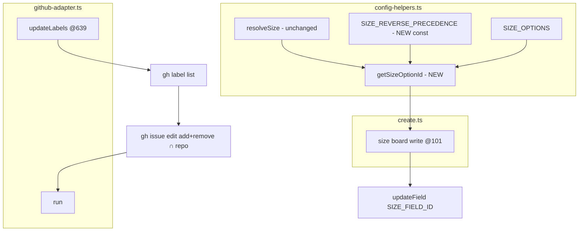
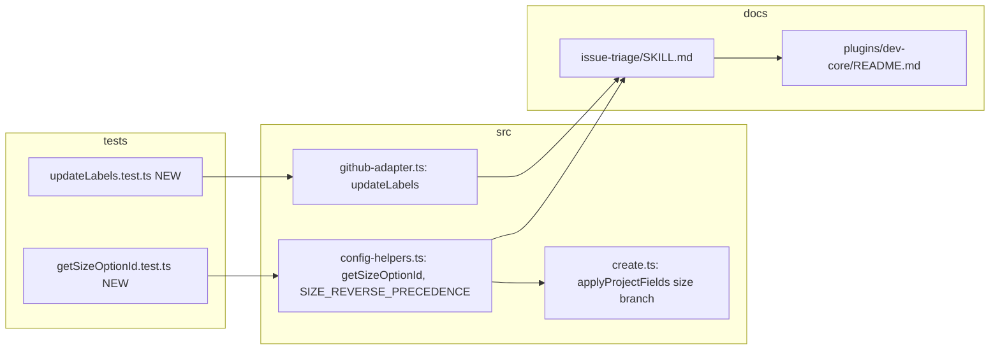

## Summary

Add a `getSizeOptionId` helper with reverse-precedence fallback so canonical size names map to a legacy board's option id, and make `updateLabels` filter its `--remove-label` set to labels that actually exist in the repo. TDD: tests first per slice.

## Architecture





## Agents

All paths below relative to `plugins/dev-core/skills/`.

| Agent instance | Tasks | Files |
|---|---|---|
| tester-A | T1 | `shared/__tests__/getSizeOptionId.test.ts` (new) |
| tester-B | T4 | `shared/__tests__/updateLabels.test.ts` (new) |
| backend-dev-A | T2, T3 | `shared/adapters/config-helpers.ts`, `issue-triage/lib/create.ts` |
| backend-dev-B | T5 | `shared/adapters/github-adapter.ts` |
| doc-writer-A | T6 | `issue-triage/SKILL.md`, `plugins/dev-core/README.md` |

## Wave Structure

3 waves, max 2 parallel agents. Elapsed ~1 short session vs ~sequential 6 steps.

| Wave | Trigger | Agents | Tasks |
|------|---------|--------|-------|
| 1 | start | 2 ∥ | tester-A: T1 (RED size) · tester-B: T4 (RED labels) |
| 2 | Wave 1 done | 2 ∥ | backend-dev-A: T2→T3 (GREEN size) · backend-dev-B: T5 (GREEN labels) |
| 3 | Wave 2 done | 1 | doc-writer-A: T6 (docs) |

### Budget — per task

| Task | Items | Class | Est. ops | Split? |
|------|-------|-------|----------|--------|
| T1 RED size tests | 1 file, ~9 cases | judgmental | 5 | — |
| T2 getSizeOptionId + const | 1 file | judgmental | 5 | — |
| T3 rewire create.ts | 1 file | bounded | 3 | — |
| T4 RED label tests | 1 file, ~3 cases | judgmental | 5 | — |
| T5 updateLabels filter | 1 file | judgmental | 5 | — |
| T6 docs | 2 files | bounded | 4 | — |

**Total estimated ops: ~27**

### Budget — per agent instance

| Instance | Tasks | Σ ops | Subjects | Split? |
|----------|-------|-------|----------|--------|
| tester-A | T1 | 5 | size | — |
| tester-B | T4 | 5 | labels | — |
| backend-dev-A | T2, T3 | 8 | size | — |
| backend-dev-B | T5 | 5 | labels | — |
| doc-writer-A | T6 | 4 | docs | — |

## Consistency Report

Covered: 12/12 success criteria. Untraced tasks: 0. Exemptions: live cross-repo lyra validation (out of scope per spec).

## Micro-Tasks

### Slice S1 — getSizeOptionId (size resolution)

**T1 [RED] — write `getSizeOptionId` tests** · `shared/__tests__/getSizeOptionId.test.ts` (new) · tester-A · subject: size · SC: 1-7 · difficulty 2
- **Copy the exact pattern from `shared/__tests__/resolveSize-legacy-schema.test.ts`**: vitest; `vi.mock('node:fs')` to throw ENOENT on `.claude/dev-core.yml`; per-test `vi.resetModules()` + set `process.env.SIZE_OPTIONS_JSON` + `process.env.GITHUB_REPO` + `await import('../adapters/config-helpers')` to pick up the env, then `delete process.env.SIZE_OPTIONS_JSON`.
- Cases: legacy `{XS,S,M,L,XL}` → `getSizeOptionId('F-full')`='size-xl', `'F-lite'`='size-m', `'S'`='size-s'; `{S,L}`-only (no XL) → `'F-full'`='size-l'; `{XS}`-only (no S) → `'S'`='size-xs'; `XS` anti-regression → 'size-xs' (not 'size-s'); canonical `{S,F-lite,F-full}` → direct ids; `'bogus'`→undefined; empty `{}`→undefined; stopgap-removable (legacy-5 map, no `F-lite`/`F-full` keys) → `'F-lite'`/`'F-full'` resolve to 'size-m'/'size-xl'.
- Verify: `bun run test getSizeOptionId` → RED (helper absent).

**T2 [GREEN] — add `SIZE_REVERSE_PRECEDENCE` + `getSizeOptionId`** · `plugins/dev-core/skills/shared/adapters/config-helpers.ts` · backend-dev-A · subject: size · SC: 1-7 · difficulty 2 · blockedBy T1
- New ordered const: `{ 'F-full': ['XL','L'], 'F-lite': ['M'], S: ['S','XS'] }`.
- New export:
  ```ts
  export function getSizeOptionId(input: string): string | undefined {
    const canonical = resolveSize(input)
    if (!canonical) return undefined
    if (SIZE_OPTIONS[canonical]) return SIZE_OPTIONS[canonical]
    for (const key of SIZE_REVERSE_PRECEDENCE[canonical] ?? []) {
      if (SIZE_OPTIONS[key]) return SIZE_OPTIONS[key]
    }
    return undefined
  }
  ```
- `resolveSize` untouched. Verify: `bun run test getSizeOptionId` → GREEN.

**T3 [GREEN] — rewire `create.ts` size board write** · `plugins/dev-core/skills/issue-triage/lib/create.ts` · backend-dev-A · subject: size · SC: 1,6 · difficulty 1 · blockedBy T2
- Replace `create.ts:101-108` body: `const optionId = getSizeOptionId(opts.size); if (!optionId) { console.error('Error: Invalid size'); process.exit(1) } await updateField(itemId, SIZE_FIELD_ID, optionId)`. Keep the size *label* path (`syncSizeLabel` via `resolveSize`) intact. Import `getSizeOptionId`; drop now-unused `SIZE_OPTIONS` import if no longer referenced.
- **Note `create.test.ts` mock**: its `vi.mock('config-helpers')` factory (create.test.ts:33-73) does NOT export `getSizeOptionId` and its mocked `resolveSize` only echoes uppercase legacy keys. T3 must extend that mock factory to add `getSizeOptionId` (mirroring the existing `SIZE_OPTIONS = {XS..XL}` so `'M'`→'size-m' still holds for the existing `'sets size on creation'` case) — else create.test.ts breaks.
- Verify: `bun run typecheck && bun run test create`.

**T3-GATE [RED-GATE] — S1 green** · backend-dev-A · blockedBy T3
- Verify: `bun run test getSizeOptionId create && bun run typecheck` all pass.

### Slice S2 — updateLabels tolerant removal

**T4 [RED] — write `updateLabels` filter tests** · `plugins/dev-core/skills/shared/__tests__/updateLabels.test.ts` (new) · tester-B · subject: labels · SC: 8,9 · difficulty 3 · blockedBy —
- `updateLabels` calls the **same-module** `run` (github-adapter.ts:390) which uses `Bun.spawn`. Two interception options — pick whichever is cleaner against the real export:
  (a) `vi.spyOn(globalThis as any, 'Bun'...)` is awkward; prefer **mocking `Bun.spawn`** via `vi.stubGlobal('Bun', { spawn: vi.fn(...) })` returning a fake proc (`{ stdout, stderr, exited: Promise.resolve(0) }`), so both the `gh label list` call and the `gh issue edit` call are captured; assert on `Bun.spawn.mock.calls`.
  (b) If module-internal `run` is hard to intercept, the implementer may extract the repo-label fetch into a tiny exported helper (e.g. `listRepoLabels()`) and `vi.mock` it — only if (a) proves impractical; note the choice in the PR.
- Set `process.env.GITHUB_REPO='Test/test-repo'` (GITHUB_REPO is module-const; set before import).
- Cases: repo labels `{present-label, target}`, `updateLabels(42,['target'],['missing-label','present-label'])` → first spawn = `gh label list ...`; second spawn = `gh issue edit 42 ... --add-label target --remove-label present-label` (no `missing-label`); resolves (no throw). `gh label list` exit≠0 → `updateLabels` rejects (propagates). `remove=[]` → add-only, single `gh issue edit`, no list call.
- Verify: `bun run test updateLabels` → RED.

**T5 [GREEN] — filter remove to repo-existing labels** · `plugins/dev-core/skills/shared/adapters/github-adapter.ts` · backend-dev-B · subject: labels · SC: 8,9 · difficulty 3 · blockedBy T4
- In `updateLabels` (line 639): when `remove.length`, fetch repo labels once via `run(['gh','label','list','--repo',GITHUB_REPO,'--limit','200','--json','name','--jq','.[].name'])`, split on newlines into a Set, intersect `remove` with it, push `--remove-label <intersection.join(',')>` only when the intersection is non-empty. Do **not** wrap the list call in try/catch (failure must propagate). `--add-label` pushed exactly as today. Keep it inside the existing single `run(args)` edit call.
- Verify: `bun run test updateLabels && bun run typecheck` → GREEN.

**T5-GATE [RED-GATE] — S2 green** · backend-dev-B · blockedBy T5
- Verify: `bun run test updateLabels priority-labels && bun run typecheck` pass (priority-labels.test.ts must stay green — it mocks `updateLabels` so is unaffected, but confirm).

### Slice S3 — docs

**T6 — document canonical-on-legacy + presentation drift** · `plugins/dev-core/skills/issue-triage/SKILL.md`, `plugins/dev-core/README.md` · doc-writer-A · subject: docs · SC: 11 · difficulty 2 · blockedBy T3,T5
- SKILL.md: size guidelines table + `--size` flag refs (create & set) note canonical `S`/`F-lite`/`F-full` accepted on legacy boards; add presentation-drift note (`F-full`→board `XL`). Mirror in plugin README where size is documented.
- Verify: `grep -n "F-lite\|F-full\|presentation" SKILL.md`.

## Task Seeding Blueprint

<!-- Used by /implement to seed TaskCreate calls. blockedBy refs T-numbers. -->

### Wave 1 — no deps, 2 agents ∥

| Task | Agent instance | blockedBy | Subject |
|------|---------------|-----------|---------|
| T1 | tester-A | — | size |
| T4 | tester-B | — | labels |

### Wave 2 — after Wave 1, 2 agents ∥

| Task | Agent instance | blockedBy | Subject |
|------|---------------|-----------|---------|
| T2 | backend-dev-A | T1 | size |
| T3 | backend-dev-A | T2 | size |
| T3-GATE | backend-dev-A | T3 | size |
| T5 | backend-dev-B | T4 | labels |
| T5-GATE | backend-dev-B | T5 | labels |

### Wave 3 — after Wave 2, 1 agent

| Task | Agent instance | blockedBy | Subject |
|------|---------------|-----------|---------|
| T6 | doc-writer-A | T3,T5 | docs |

## Task IDs

<!-- Generated by /plan. Used by /implement to resume tasks on session restart. -->
- T1: 13 — size (RED tests)
- T4: 14 — labels (RED tests)
- T2: 15 — size (getSizeOptionId)
- T3: 16 — size (create.ts rewire)
- T3-GATE: 17 — size
- T5: 18 — labels (updateLabels filter)
- T5-GATE: 19 — labels
- T6: 20 — docs
