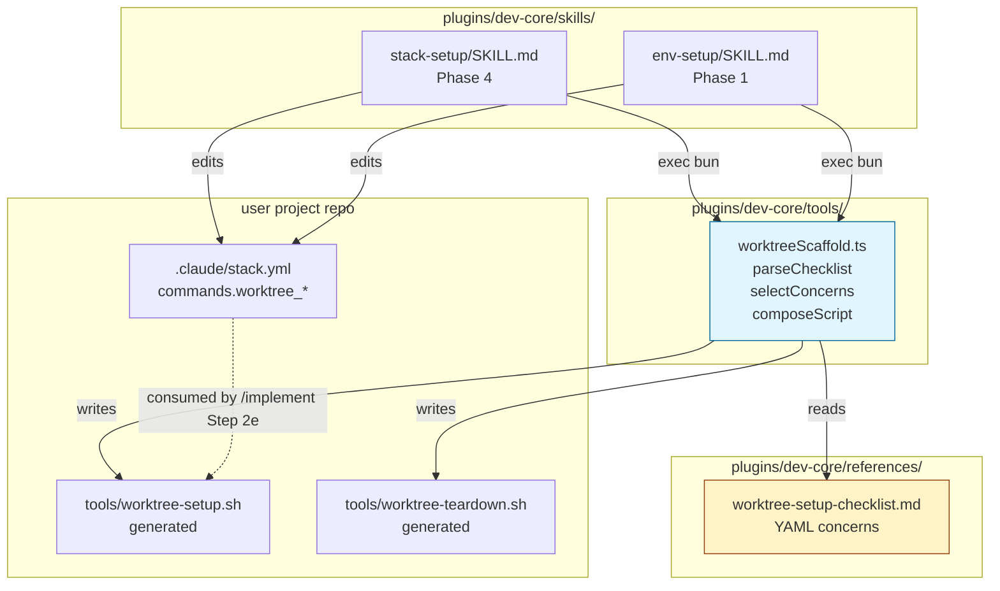

## Summary

Ship a checklist-driven worktree-setup scaffolder for dev-core. New TS helper `worktreeScaffold.ts` parses `references/worktree-setup-checklist.md`, selects concerns by ProjectContext, and composes `tools/worktree-setup.sh` + `tools/worktree-teardown.sh` for user projects. SKILL.md instructions in `stack-setup` (Phase 4) + `env-setup` (Phase 1) call the helper. Determinism comes from static snippets; tests assert shellcheck-clean output + correct concern selection.

## Architecture

### Data flow



### File × Function map

```mermaid
flowchart LR
    subgraph WS_TS["worktreeScaffold.ts"]
        parse[parseChecklist]
        select[selectConcerns]
        compose[composeScript]
        cli[main CLI<br/>compose|list-concerns]
    end
    subgraph WS_TEST["worktreeScaffold.test.ts"]
        t_parse[test_parse_schema]
        t_select[test_select_python_uv]
        t_select_bun[test_select_bun_neon]
        t_compose[test_compose_shellcheck]
        t_safety[test_safety_contract]
    end
    subgraph FIX["__fixtures__/"]
        FIX_PY[checklist-python.md]
        FIX_BUN[checklist-bun.md]
    end
    subgraph INT["scripts/test_scaffold_integration.sh"]
        int_py[fixture_python_uv]
        int_bun[fixture_bun_monorepo]
        int_retro[fixture_env_setup_retrofit]
    end

    cli --> parse
    cli --> select
    cli --> compose
    t_parse --> parse
    t_select --> select
    t_select_bun --> select
    t_compose --> compose
    t_safety --> compose
    t_parse -.reads.-> FIX_PY
    t_select -.reads.-> FIX_PY
    t_select_bun -.reads.-> FIX_BUN
    int_py --> cli
    int_bun --> cli
    int_retro --> cli
```

## Bootstrap Context

- Reference impls: `~/projects/lyra/tools/worktree-setup.sh` (uv symlink) · `~/projects/roxabi-boilerplate/scripts/prepare.sh` (bun lefthook fix)
- Existing dev-core TS pattern: `plugins/dev-core/tools/licenseChecker.ts` + `__tests__/licenseChecker.test.ts` (Bun + vitest, zero external deps, exported pure functions + CLI main)
- Existing SKILL.md auto-discovery: `stack-setup/SKILL.md` Phase 2 already detects `runtime` + `package_manager`
- Already-wired consumer: `plugins/dev-core/skills/implement/SKILL.md:126` (`# Optional: {commands.worktree_setup} <N>`)
- shellcheck available on dev workstations (verified — used by existing test infra)

## Agents

| Agent | Tasks | Files |
|---|---|---|
| backend-dev-A | T3, T4, T5 | `plugins/dev-core/tools/worktreeScaffold.ts`, `plugins/dev-core/tools/__tests__/worktreeScaffold.test.ts`, `plugins/dev-core/tools/__tests__/__fixtures__/*.md` |
| doc-writer-A | T1 | `plugins/dev-core/references/worktree-setup-checklist.md` |
| devops-A | T2, T6, T7 | `plugins/dev-core/stack.yml.example`, `plugins/dev-core/skills/stack-setup/SKILL.md`, `plugins/dev-core/skills/env-setup/SKILL.md` |
| tester-A | T8, T9, T10, T11 | `plugins/dev-core/tools/__tests__/scaffold-integration.test.ts`, `plugins/dev-core/tools/__tests__/__fixtures__/projects/*` |

## Wave Structure

3 waves, max 3 parallel agents. Elapsed ~3 sequential phases vs ~11 fully serial.

| Wave | Trigger | Agents | Tasks |
|------|---------|--------|-------|
| 1 | start | 3 ∥ | doc-writer-A: T1 · devops-A: T2 · backend-dev-A: T3 |
| 2 | Wave 1 done | 2 ∥ | backend-dev-A: T4→T5 · devops-A: T6→T7 |
| 3 | Wave 2 done | 1 | tester-A: T8→T9→T10→T11 |

### Budget

| Task | Items | Class | Est. ops | Split? |
|------|-------|-------|----------|--------|
| T1 checklist content | 1 doc, ~6 concerns | judgmental | 6 | — |
| T2 stack.yml.example edit | 1 file, 2 keys | trivial | 2 | — |
| T3 scaffolder skeleton + types + parser | 1 TS file | judgmental | 5 | — |
| T4 select+compose logic | extend T3 | judgmental | 5 | — |
| T5 unit tests + fixtures | 1 test file, 2 fixture md | bounded | 4 | — |
| T6 stack-setup SKILL.md Phase 4 | 1 SKILL.md section | bounded | 4 | — |
| T7 env-setup SKILL.md Phase 1 | 1 SKILL.md section | bounded | 3 | — |
| T8 integration test python/uv | 1 fixture + test | judgmental | 5 | — |
| T9 integration test bun monorepo | 1 fixture + test | judgmental | 5 | — |
| T10 integration test env-setup retrofit | 1 fixture + test | bounded | 4 | — |
| T11 RED-GATE: shellcheck + SC traceability | 1 verification pass | bounded | 3 | — |

**Total estimated ops: 46** (under 50 — no force-split required)

## Consistency Report

- SC1 → T2
- SC2 → T1
- SC3 → T3, T4, T6
- SC4 (setup safety contract) → T1 (snippet content), T5 (unit), T8/T9 (integration)
- SC5 (teardown safety contract) → T1 (snippet content), T5 (unit), T8/T9 (integration)
- SC6 (shellcheck-clean) → T11 (gate), T8/T9 (per-fixture)
- SC7 (preview gate) → T6 (SKILL.md instruction), T8/T9 (integration verifies prompt fires)
- SC8 (idempotency) → T6 (SKILL.md), T11 (gate verifies re-run behavior)
- SC9 (env-setup retrofit) → T7, T10
- SC10 (concern-ID assertions) → T5 (unit, both fixtures), T8/T9 (integration)

Covered: 10/10. Untraced tasks: 0. Exemptions: 0.

## Micro-Tasks

### V1 — Checklist + template (SC1, SC2)

**T1 [doc-writer-A] — Create `references/worktree-setup-checklist.md`** · Difficulty 3
- File: `plugins/dev-core/references/worktree-setup-checklist.md`
- Shape: Markdown doc with YAML frontmatter (`version: 1`) + `## Concerns` section containing a YAML list. Seed concerns: `env-files`, `uv-venv-symlink`, `bun-install-warmup`, `npm-install-warmup`, `lefthook-hookspath-fix`, `neon-db-branch` (placeholder). Each entry: `id`, `applies_when: ["runtime=python", ...]`, `setup_snippet: |`, `teardown_snippet: |`, `validation: "..."`. Include `## Extending the checklist` section with a worked example (the `neon-db-branch` entry doubles as the canonical example).
- Snippets must satisfy spec safety contract: `uv-venv-symlink` body mirrors `~/projects/lyra/tools/worktree-setup.sh` lines 7–28 (main-repo detect, skip-real-dir, replace-symlink, skip-in-main).
- Verify: `bun -e "import {parseChecklist} from './plugins/dev-core/tools/worktreeScaffold.ts'; const r = parseChecklist('plugins/dev-core/references/worktree-setup-checklist.md'); console.log(r.concerns.length)"` (Wave 2; for Wave 1 just `grep -c '^- id:' plugins/dev-core/references/worktree-setup-checklist.md`)
- Expected: 6 concerns counted
- Spec trace: SC2 | Phase: GREEN | Slice: V1 | Time: 8m | `[P]` (no deps)

**T2 [devops-A] — Update `stack.yml.example`** · Difficulty 1
- File: `plugins/dev-core/stack.yml.example`
- Edit: under existing `commands:` block (around line 207), append two keys with comments:
  ```yaml
    # Generated by /stack-setup when runtime ∈ {python, bun, node}.
    # See references/worktree-setup-checklist.md to add new concerns.
    worktree_setup: tools/worktree-setup.sh
    worktree_teardown: tools/worktree-teardown.sh
  ```
- Verify: `grep -E 'worktree_(setup|teardown)' plugins/dev-core/stack.yml.example | wc -l`
- Expected: `2`
- Spec trace: SC1 | Phase: GREEN | Slice: V1 | Time: 3m | `[P]`

**T3 [backend-dev-A] — `worktreeScaffold.ts` skeleton + parser** · Difficulty 3
- File: `plugins/dev-core/tools/worktreeScaffold.ts`
- Shape: zero-external-deps Bun script (follow `licenseChecker.ts` pattern). Exports:
  ```ts
  export interface Concern { id: string; applies_when: string[]; setup_snippet: string; teardown_snippet: string; validation: string }
  export interface Checklist { version: number; concerns: Concern[] }
  export interface ProjectContext { runtime: string; package_manager: string; monorepo: boolean; hooks_tool: string; env_files: string[]; database: string; backend_paths: string[] }
  export function parseChecklist(path: string): Checklist  // reads md, extracts YAML block under `## Concerns`, validates schema
  ```
- Use Bun's built-in YAML support via a minimal hand-rolled YAML-list parser (concerns are uniform shape — see existing `licenseChecker.ts` for JSON-only precedent; or import `yaml` if already in `package.json` — check first).
- Verify: `bun build plugins/dev-core/tools/worktreeScaffold.ts --outdir /tmp/build 2>&1 | grep -c error`
- Expected: `0`
- Spec trace: SC3 (foundation) | Phase: RED | Slice: V2 | Time: 10m | `[P]` (no deps)

**RED-GATE V1** — _(satisfied implicitly by T1+T2; no separate gate task)_

### V2 — stack-setup scaffolder (SC3, SC4, SC5, SC6, SC7, SC8, SC10)

**T4 [backend-dev-A] — `selectConcerns` + `composeScript`** · Difficulty 3
- File: `plugins/dev-core/tools/worktreeScaffold.ts` (extend T3)
- Add:
  ```ts
  export function selectConcerns(ctx: ProjectContext, checklist: Checklist): Concern[]
  // evaluates each concern.applies_when expression set against ctx; AND semantics within an expression, OR across the array
  // expression grammar: `key=value` (e.g. "runtime=python", "database=neon")
  export function composeScript(concerns: Concern[], mode: 'setup' | 'teardown'): string
  // returns full bash file body: shebang + `set -euo pipefail` + header comment listing selected concern IDs + concatenated snippets (setup_snippet or teardown_snippet) separated by blank lines + trailing newline
  ```
- CLI: `bun worktreeScaffold.ts compose --checklist <path> --context-json <path|inline> --mode setup|teardown` → prints script to stdout. `--list-selected` → prints concern IDs only.
- Verify: `bun plugins/dev-core/tools/worktreeScaffold.ts compose --checklist plugins/dev-core/references/worktree-setup-checklist.md --context-json '{"runtime":"python","package_manager":"uv","monorepo":false,"hooks_tool":"lefthook","env_files":[".env"],"database":"none","backend_paths":[]}' --mode setup | shellcheck -S warning -`
- Expected: exit 0 (no shellcheck warnings)
- Spec trace: SC3, SC4, SC5, SC6 | Phase: GREEN | Slice: V2 | Time: 12m | blockedBy: T1, T3

**T5 [backend-dev-A] — Unit tests + fixtures** · Difficulty 2
- Files: `plugins/dev-core/tools/__tests__/worktreeScaffold.test.ts` + `plugins/dev-core/tools/__tests__/__fixtures__/checklist-{python,bun}.md`
- Tests:
  - `test_parse_schema` — fixture parses, every concern has all 5 fields
  - `test_select_python_uv` — ctx `{runtime:python, pm:uv, hooks:lefthook, database:none}` → selected IDs ⊇ {`env-files`, `uv-venv-symlink`, `lefthook-hookspath-fix`}
  - `test_select_bun_neon` — ctx `{runtime:bun, pm:bun, hooks:lefthook, monorepo:true, database:neon}` → selected IDs ⊇ {`env-files`, `bun-install-warmup`, `lefthook-hookspath-fix`, `neon-db-branch`}
  - `test_compose_setup_shellcheck` — compose output piped through `shellcheck -S warning` exits 0 for both fixtures
  - `test_compose_teardown_shellcheck` — same for teardown
  - `test_safety_main_checkout_exit` — generated setup script run in a temp main-checkout (`git init && git worktree add`) exits 0 without modifying anything
- Verify: `cd /home/mickael/projects/roxabi-plugins && bun test plugins/dev-core/tools/__tests__/worktreeScaffold.test.ts`
- Expected: 6 tests pass
- Spec trace: SC4, SC5, SC6, SC10 | Phase: REFACTOR | Slice: V2 | Time: 12m | blockedBy: T4

**T6 [devops-A] — `stack-setup/SKILL.md` Phase 4 scaffolder integration** · Difficulty 3
- File: `plugins/dev-core/skills/stack-setup/SKILL.md`
- Edit Phase 4: after the `commands:` block emission, insert a new sub-phase "Phase 4b — Worktree-setup scaffold" that:
  1. Checks `runtime ∈ {python, bun, node}` from detected π; ¬→ skip with note
  2. Checks `tools/worktree-setup.sh` exists in user repo; ∃ ∧ ¬`--force` → silent skip
  3. ∃ ∧ `--force` → DP(A) **Regenerate** | **Keep existing** | **Abort**
  4. ¬∃ ∨ regenerate → builds `context-json` from detected π values; runs `bun "${CLAUDE_PLUGIN_ROOT}/tools/worktreeScaffold.ts" compose --list-selected` → echo preview `"Worktree-setup scaffold preview — {runtime}/{pm} · N concerns: {ids}"`
  5. DP(A) **Write scripts** | **Show diff** | **Abort**
  6. Write → run scaffolder twice (setup + teardown), `chmod +x`, append `worktree_setup:` + `worktree_teardown:` keys under `commands:` in the σ being written. Echo summary.
- Verify: `grep -A2 'Phase 4b' plugins/dev-core/skills/stack-setup/SKILL.md | head -5`
- Expected: section heading + leading lines visible
- Spec trace: SC3, SC7, SC8 | Phase: GREEN | Slice: V2 | Time: 10m | blockedBy: T2

**T7 [devops-A] — `env-setup/SKILL.md` Phase 1 retrofit** · Difficulty 2
- File: `plugins/dev-core/skills/env-setup/SKILL.md`
- Edit Phase 1: after step 6 (existing → skip), insert step 7 "Worktree-setup retrofit":
  1. Skip if σ ∄ (already handled by Phase 1)
  2. Read σ → if `commands.worktree_setup` ∃ → D⏭("worktree-setup retrofit — already configured"), skip
  3. If `runtime ∉ {python, bun, node}` → D⏭("worktree-setup retrofit — runtime not in scope"), skip
  4. If `tools/worktree-setup.sh` ∃ → D⏭("worktree-setup retrofit — script already present"), skip
  5. → DP(A) **Scaffold worktree-setup hook now** | **Skip**
  6. Scaffold → delegate to the same scaffolder workflow used by `/stack-setup` Phase 4b (link inline or extract to shared cookbook reference). Edit σ in place to add both `commands.worktree_*` keys.
- Verify: `grep -n 'Worktree-setup retrofit\|worktree-setup retrofit' plugins/dev-core/skills/env-setup/SKILL.md | wc -l`
- Expected: ≥2
- Spec trace: SC9 | Phase: GREEN | Slice: V3 | Time: 8m | blockedBy: T6 (shares scaffolder workflow reference)

**RED-GATE V2** — covered by T11

### V3 — env-setup retrofit (SC9) + final gate

**T8 [tester-A] — Integration test: Python/uv fixture** · Difficulty 3
- File: `plugins/dev-core/tools/__tests__/scaffold-integration.test.ts` + `__fixtures__/projects/python-uv/{pyproject.toml,.env.example}`
- Test: programmatically build a temp dir copying the fixture → run `bun worktreeScaffold.ts compose ... --mode setup > tools/worktree-setup.sh` → `chmod +x` → `git init && git worktree add <tmp-wt>` → run the generated script in the worktree → assert (a) `.venv` is a symlink, (b) script in main checkout exits 0 without changes, (c) shellcheck-clean. (Skip if `shellcheck` or `uv` not installed — mark test `skip` with reason; document required tools in test file header.)
- Verify: `bun test plugins/dev-core/tools/__tests__/scaffold-integration.test.ts -t 'python.uv'`
- Expected: pass (or skip with reason)
- Spec trace: SC4, SC6, SC10 | Phase: REFACTOR | Slice: V2 | Time: 12m | blockedBy: T4, T6

**T9 [tester-A] — Integration test: Bun monorepo + neon fixture** · Difficulty 3
- File: same as T8 + `__fixtures__/projects/bun-monorepo/{package.json,apps/api/package.json,.env.example}`
- Test: same harness, ctx `{runtime:bun, pm:bun, hooks:lefthook, monorepo:true, database:neon}` → assert (a) generated script contains expected concern bodies (env-files copy + `bun install` + lefthook hooksPath unset + db:branch:create-or-skip), (b) shellcheck-clean, (c) re-running script inside worktree is idempotent (no errors on second invocation).
- Verify: `bun test plugins/dev-core/tools/__tests__/scaffold-integration.test.ts -t 'bun.monorepo'`
- Expected: pass (or skip)
- Spec trace: SC4, SC5, SC6, SC10 | Phase: REFACTOR | Slice: V2 | Time: 12m | blockedBy: T4, T6

**T10 [tester-A] — Integration test: env-setup retrofit detection** · Difficulty 2
- File: same as T8 + `__fixtures__/projects/retrofit-bun/{package.json,bun.lockb,.claude/stack.yml}` (where σ has no `worktree_setup` key)
- Test: parse fixture σ → call env-setup retrofit predicate (extract to a helper `shouldOfferRetrofit(stack: Stack, repoRoot: string): boolean` in `worktreeScaffold.ts`) → assert returns `true`. Then simulate adding the key + script and assert returns `false`. (Pure-function test of the retrofit detection rule, ¬a live `/env-setup` invocation.)
- Verify: `bun test plugins/dev-core/tools/__tests__/scaffold-integration.test.ts -t 'retrofit'`
- Expected: pass
- Spec trace: SC9 | Phase: REFACTOR | Slice: V3 | Time: 8m | blockedBy: T7

**T11 [tester-A] — RED-GATE: spec traceability + shellcheck gate** · Difficulty 1
- Verifies all 10 SCs by running:
  - `grep -E 'worktree_(setup|teardown)' plugins/dev-core/stack.yml.example | wc -l` == 2 (SC1)
  - `test -f plugins/dev-core/references/worktree-setup-checklist.md && grep -c '^- id:' plugins/dev-core/references/worktree-setup-checklist.md` ≥ 6 (SC2)
  - `bun test plugins/dev-core/tools/__tests__/worktreeScaffold.test.ts` → all pass (SC3, SC4, SC5, SC6, SC10)
  - `bun test plugins/dev-core/tools/__tests__/scaffold-integration.test.ts` → all pass / skip-with-reason (SC4, SC5, SC6, SC10)
  - `grep -c 'preview\|Show diff\|Write scripts' plugins/dev-core/skills/stack-setup/SKILL.md` ≥ 1 (SC7)
  - `grep -c 'Already present\|Regenerate' plugins/dev-core/skills/stack-setup/SKILL.md` ≥ 1 (SC8)
  - `grep -c 'Worktree-setup retrofit\|worktree_setup' plugins/dev-core/skills/env-setup/SKILL.md` ≥ 2 (SC9)
- Verify: `bash artifacts/plans/178-gate.sh` (a one-off script the tester writes inline as part of this task; or run the checks manually and report)
- Expected: all 10 lines green
- Spec trace: ALL | Phase: RED-GATE | Slice: V3 | Time: 5m | blockedBy: T5, T8, T9, T10

## Task Seeding Blueprint

<!-- Used by /implement to seed TaskCreate calls. T-numbers ref this list only. -->

### Wave 1 — no deps, 3 agents ∥

| Task | Agent instance | blockedBy | Subject |
|------|---------------|-----------|---------|
| T1 | doc-writer-A | — | Create references/worktree-setup-checklist.md with 6 seed concerns + extension guide |
| T2 | devops-A | — | Add commands.worktree_setup + worktree_teardown to stack.yml.example |
| T3 | backend-dev-A | — | Scaffold worktreeScaffold.ts: types + parseChecklist |

### Wave 2 — after Wave 1, 2 agents ∥

| Task | Agent instance | blockedBy | Subject |
|------|---------------|-----------|---------|
| T4 | backend-dev-A | T1, T3 | Implement selectConcerns + composeScript + CLI |
| T5 | backend-dev-A | T4 | Unit tests for parse/select/compose + shellcheck assertions |
| T6 | devops-A | T2 | Wire stack-setup SKILL.md Phase 4b scaffolder workflow |
| T7 | devops-A | T6 | Wire env-setup SKILL.md Phase 1 retrofit |

### Wave 3 — after Wave 2, 1 agent

| Task | Agent instance | blockedBy | Subject |
|------|---------------|-----------|---------|
| T8 | tester-A | T4, T6 | Integration test: Python/uv fixture scaffolds + symlinks .venv |
| T9 | tester-A | T4, T6 | Integration test: Bun monorepo + neon fixture, shellcheck-clean + idempotent |
| T10 | tester-A | T7 | Integration test: env-setup retrofit detection predicate |
| T11 | tester-A | T5, T8, T9, T10 | RED-GATE: run all 10 SC verifications, report green |

## Task IDs

<!-- Generated by /plan. Used by /implement to resume tasks on session restart. -->
- T1: 12 — Create references/worktree-setup-checklist.md with 6 seed concerns + extension guide
- T2: 13 — Add commands.worktree_setup + worktree_teardown to stack.yml.example
- T3: 14 — Scaffold worktreeScaffold.ts: types + parseChecklist
- T4: 15 — Implement selectConcerns + composeScript + CLI
- T5: 16 — Unit tests for parse/select/compose + shellcheck assertions
- T6: 17 — Wire stack-setup SKILL.md Phase 4b scaffolder workflow
- T7: 18 — Wire env-setup SKILL.md Phase 1 retrofit
- T8: 19 — Integration test: Python/uv fixture scaffolds + symlinks .venv
- T9: 20 — Integration test: Bun monorepo + neon fixture, shellcheck-clean + idempotent
- T10: 21 — Integration test: env-setup retrofit detection predicate
- T11: 22 — RED-GATE: run all 10 SC verifications, report green
