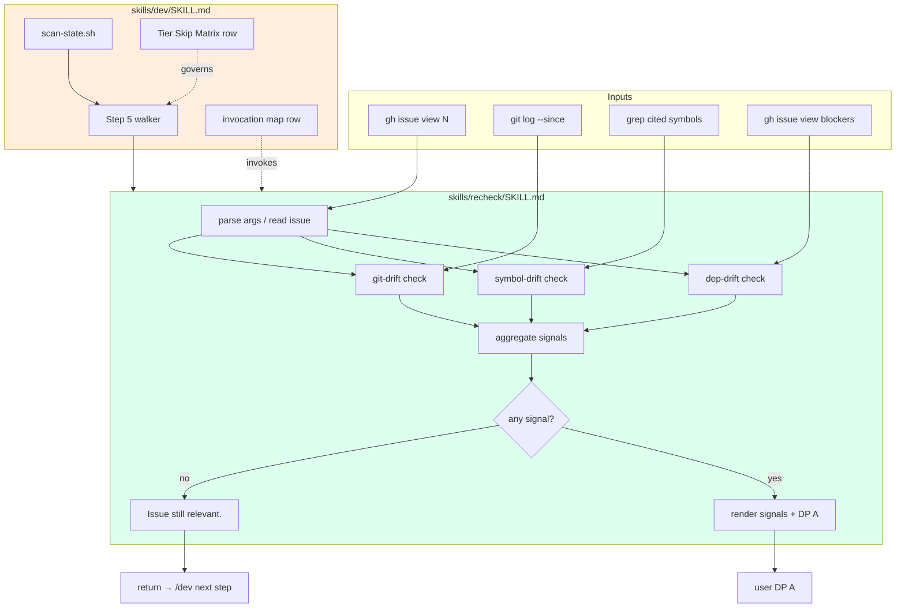
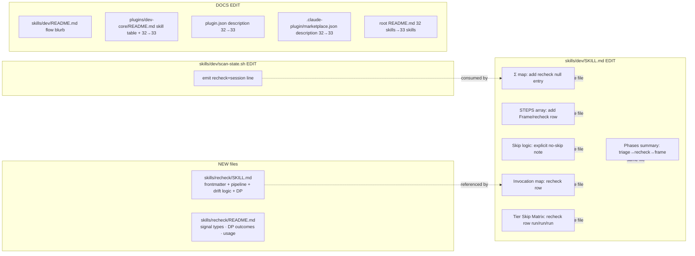

## Summary

Create a standalone `/recheck` skill (Slice 1) and integrate it into the `/dev` pipeline between `triage` and `frame` (Slice 2), then update the marketplace + skill-index docs (Slice 3). All work is in `plugins/dev-core/`. No new dependencies, no new test framework — verification via file-existence + frontmatter + `bash`/`grep` smoke checks.

## Architecture

### Data flow



### File × Function map



## Bootstrap Context

No analysis artifact (F-lite). Reference patterns:

- Skill template: `plugins/dev-core/skills/frame/SKILL.md` (similar shape — gate skill with pipeline table, Exit section, Task Integration block).
- Adv-skill pattern (for `/recheck` invocation in `/dev`): see `triage` row in `dev/SKILL.md` invocation map.
- README pattern: `plugins/dev-core/skills/frame/README.md` (Why / Usage / Triggers / How it works).
- `scan-state.sh` style: per-line `key=value` outputs, no JSON.

## Agents

| Agent instance | Files | Task count |
|---|---|---|
| `doc-writer-A` | `plugins/dev-core/skills/recheck/SKILL.md` (new) | 1 |
| `doc-writer-B` | `plugins/dev-core/skills/recheck/README.md` (new) | 1 |
| `doc-writer-C` | `plugins/dev-core/skills/dev/SKILL.md` (edit, 6 sections) | 1 |
| `devops-A` | `plugins/dev-core/skills/dev/scan-state.sh` (edit) | 1 |
| `doc-writer-D` | `plugins/dev-core/skills/dev/README.md` + `plugins/dev-core/README.md` + `plugins/dev-core/.claude-plugin/plugin.json` + `.claude-plugin/marketplace.json` + root `README.md` (skill count bumps + index row) | 1 |

No tester — verification is file-existence + grep + manual smoke. No security-auditor — no auth/validation surface. No architect — pattern is established.

## Wave Structure

2 waves, max 5 parallel agents. Elapsed ~1 session vs ~5 sequential.

| Wave | Trigger | Agents | Tasks |
|------|---------|--------|-------|
| 1 | start | 5 ∥ | doc-writer-A: T1 · doc-writer-B: T2 · doc-writer-C: T3 · devops-A: T4 · doc-writer-D: T5 |
| 2 | Wave 1 done | 1 | RED-GATE smoke: T6 |

### Budget

| Task | Items | Class | Est. ops | Split? |
|------|-------|-------|----------|--------|
| T1 create recheck SKILL.md | 1 | judgmental | 6 | — |
| T2 create recheck README.md | 1 | bounded | 3 | — |
| T3 edit dev/SKILL.md (6 sections) | 6 | judgmental | 8 | — |
| T4 edit scan-state.sh | 1 | bounded | 3 | — |
| T5 edit 5 doc files (counts + index) | 5 | bounded | 8 | — |
| T6 smoke verify | — | bounded | 4 | — |

**Total estimated ops: 32** — below the 50-op force-split threshold.

## Consistency Report

| Spec criterion | Covered by | Status |
|---|---|---|
| SC1 (SKILL.md frontmatter) | T1 | ✓ |
| SC2 (<5s e2e) | T1 (parallel checks) + T6 smoke | ✓ |
| SC3 (one-line clean print, no artifact) | T1 | ✓ |
| SC4 (pipeline DP 4 options) | T1 | ✓ |
| SC5 (standalone DP 3 options) | T1 | ✓ |
| SC6 (scan-state recheck=) | T4 + T3 (Σ map) | ✓ |
| SC7 (walker visits between triage and frame) | T3 | ✓ |
| SC8 (skip logic returns false; Tier Matrix run/run/run) | T3 | ✓ |
| SC9 (Update loop bounded to 1 iter) | T1 | ✓ |
| SC10 (Close → gh close + abort) | T1 | ✓ |
| SC11 (README signals + DP outcomes) | T2 | ✓ |
| SC12 (root + plugin README index row) | T5 | ✓ |
| SC13 (premise validation — deferred integration check) | T6 (smoke run + note for tracking) | partial — manual ongoing |

Uncovered: SC13 ongoing tracking is manual (no automated catch-rate metric in this issue's scope per frame Out-of-Scope).
Untraced: none.
Exemptions: SC13's "≥3 runs over 1 month" is not testable in CI; tracked as a follow-up reminder in the cleanup phase.

## Micro-Tasks

### Slice V1 — Standalone /recheck skill

**T1 [P] doc-writer-A — Create `plugins/dev-core/skills/recheck/SKILL.md`** *(judgmental, ~6 ops, 8 min, diff 3)*

- File: `plugins/dev-core/skills/recheck/SKILL.md`
- Skeleton:

```mdx
---
name: recheck
argument-hint: '[#N | --issue N]'
description: Drift-check an issue before work begins — fails fast when code has evolved (git-drift, symbol-missing, dep-resolved). Triggers: "recheck" | "is this issue still valid" | "check drift" | "check issue staleness".
version: 0.1.0
allowed-tools: Bash, Read, Grep, Glob, Skill, ToolSearch
---

# Recheck

## Success
I := signals computed ∧ (¬signals → silent return) ∨ (signals → DP A presented)

Let:
  N := issue number
  S := signal set { git-drift, symbol-missing, dep-resolved }
  M := mode ∈ { pipeline, standalone }
  

## Entry
/recheck #N            standalone, signal-fire DP has 3 options
(invoked by /dev)      pipeline, signal-fire DP has 4 options (adds Update)

## Pipeline
| Step | ID | Required | Notes |
|------|----|----------|-------|
| 0 | parse | ✓ | resolve N, detect M |
| 1 | fetch | ✓ | gh issue view N --json body,createdAt,labels,parent,blockedBy |
| 2 | extract | ✓ | cited paths, symbols, blocked-by from body |
| 3 | check | ✓ | run 3 drift checks in parallel |
| 4 | decide | ✓ | signal-clean → S1 ; signal-fire → S2 + DP |

## Step 3 — Drift checks (parallel)
git-drift   : git log --since=<createdAt> -- <cited paths> | wc -l > 0
symbol-drift: ∀ symbol ∈ extracted → grep -r symbol → flag if miss
dep-drift   : ∀ blocker ∈ blockedBy → gh issue view blocker --json state → flag if closed

## Step 4 — Decide
∀ signals == ∅ → print "Issue still relevant." (pipeline) or richer summary (standalone) ; exit 0.
∃ signal → print Signals summary + DP.

Pipeline DP options (4):
  Proceed anyway         /dev continues, no mutation
  Update issue first     re-invoke /issue-triage, re-run /recheck once
                         (signals persist on 2nd run → DP re-presents w/o Update)
  Close as resolved/obs. gh issue close N --reason completed ; abort /dev
  Abort                  exit /dev cleanly

Standalone DP options (3): Proceed | Close | Abort  (no Update — no /dev to loop)

## State
No on-disk artifact. /dev tracks recheck as Σ_s (session-only) like validate, ci-watch.

## Task Integration
- /dev owns the dev-pipeline task lifecycle externally
- This skill does NOT update its own dev-pipeline task

## Chain Position
- Phase: Frame
- Predecessor: /issue-triage
- Successor: /frame (F-lite, F-full) or /implement (S, frame skipped)
- Class: gate (when signals fire), adv (when clean)

## Exit
- Approved via /dev (clean): print one line → return silently
- Approved via /dev (Proceed on signals): return → /dev re-scans → next step
- Update via /dev: invoke skill: "issue-triage" then re-run self once
- Close: gh issue close + abort
- Standalone clean: print summary, return
- Standalone signal: render DP, apply outcome

$ARGUMENTS
```

- Verify: `test -f plugins/dev-core/skills/recheck/SKILL.md && head -8 plugins/dev-core/skills/recheck/SKILL.md | grep -E '^name: recheck$'`
- Expected output: `name: recheck`
- Pattern ref: `plugins/dev-core/skills/frame/SKILL.md`
- Spec trace: SC1, SC2, SC3, SC4, SC5, SC9, SC10
- Phase: GREEN

**T2 [P] doc-writer-B — Create `plugins/dev-core/skills/recheck/README.md`** *(bounded, ~3 ops, 5 min, diff 1)*

- File: `plugins/dev-core/skills/recheck/README.md`
- Skeleton:

```md
# recheck

Drift-check a GitHub issue before any work begins. Catches stale issues (code evolved, symbols renamed, blockers resolved) before /dev spends time on a premise that no longer holds.

## Why
Issues age. By the time /dev fires, the fix may already exist, symbols may be gone, or blockers may be resolved. /recheck is the fail-fast guard between /issue-triage and /frame, run for every tier (S, F-lite, F-full) with no skip path.

## Usage
/recheck #N            standalone — print drift signals, choose Proceed | Close | Abort
(invoked by /dev)      pipeline mode — 4-option DP with Update issue first

Triggers: "recheck" | "is this issue still valid" | "check drift" | "check issue staleness"

## How it works
3 deterministic checks run in parallel:

| Signal | What it checks | Means |
|---|---|---|
| git-drift | git log --since=<issue.created> on cited paths | code moved in the area |
| symbol-missing | grep cited symbols/error-strings | identifier vanished |
| dep-resolved | gh state of every blocked-by issue | dependency closed |

When **all clean**: prints `Issue still relevant.` and returns silently.

When **any fires**: presents a DP. Pipeline mode (via /dev) shows 4 options; standalone mode shows 3:

| Option | Pipeline | Standalone | Effect |
|---|---|---|---|
| Proceed anyway | ✓ | ✓ | continue with current premise |
| Update issue first | ✓ | — | re-run /issue-triage, re-check exactly once |
| Close as resolved/obsolete | ✓ | ✓ | gh issue close --reason completed + abort |
| Abort | ✓ | ✓ | exit cleanly, no mutation |

## State
No on-disk artifact (per frame Out-of-Scope). /dev tracks recheck as session-only state — a new /dev session re-runs the check.
```

- Verify: `test -f plugins/dev-core/skills/recheck/README.md && grep -q 'git-drift\|symbol-missing\|dep-resolved' plugins/dev-core/skills/recheck/README.md && grep -q 'Update issue first' plugins/dev-core/skills/recheck/README.md`
- Expected output: matches (exit 0)
- Pattern ref: `plugins/dev-core/skills/frame/README.md`
- Spec trace: SC11
- Phase: GREEN

### Slice V2 — /dev pipeline integration

**T3 [P] doc-writer-C — Edit `plugins/dev-core/skills/dev/SKILL.md`** *(judgmental, ~8 ops, 10 min, diff 3)*

6 distinct edits to the existing file:

1. **Σ map** (Step 1 — Scan State): insert `recheck: null,  # Σ_s only` between `triage:` and `frame:`.
2. **STEPS array** (Step 5): insert `(Frame, recheck, recheck),` between `(Frame, triage, ...)` and `(Frame, frame, ...)`.
3. **Skip logic** (Step 4): add explicit note `recheck → false (never skipped — explicit decision per frame #181)` before `default → false`.
4. **Invocation map** (Step 7): insert new row after `triage`:
   `| recheck | adv | skill: "recheck", args: "#N" | frame |`
5. **Tier Skip Matrix**: insert row after `triage`:
   `| recheck | run | run | run |`
6. **Phases + Gate Summary**: change `Frame | triage → frame` to `Frame | triage → recheck → frame`. Also update `Step 2b — Build active sequence` ordered list and `Step 3` Phase bar definition (`Frame:{triage,recheck,frame}`).

- File: `plugins/dev-core/skills/dev/SKILL.md`
- Verify (run all 6):

```bash
grep -nE 'recheck:\s+null' plugins/dev-core/skills/dev/SKILL.md
grep -nE '\(Frame,\s+recheck,\s+recheck\)' plugins/dev-core/skills/dev/SKILL.md
grep -nE 'recheck\s+→ false' plugins/dev-core/skills/dev/SKILL.md
grep -nE '\|\s+recheck\s+\|\s+adv\s+\|' plugins/dev-core/skills/dev/SKILL.md
grep -nE '\|\s+recheck\s+\|\s+run\s+\|\s+run\s+\|\s+run\s+\|' plugins/dev-core/skills/dev/SKILL.md
grep -nE 'triage\s+→\s+recheck\s+→\s+frame' plugins/dev-core/skills/dev/SKILL.md
```

- Expected output: each grep returns ≥1 line.
- Pattern ref: existing `frame`, `triage` rows in same file.
- Spec trace: SC6, SC7, SC8
- Phase: GREEN

**T4 [P] devops-A — Edit `plugins/dev-core/skills/dev/scan-state.sh`** *(bounded, ~3 ops, 4 min, diff 1)*

- File: `plugins/dev-core/skills/dev/scan-state.sh`
- Change: between the `# frame` block and the existing `# analyze` block, emit a recheck line. Since recheck has no on-disk artifact, the line is constant `recheck=session` — `/dev` reads this as "always run via session state".

```bash
# recheck (session-only state — no on-disk artifact)
echo "recheck=session"
```

- Verify:

```bash
bash plugins/dev-core/skills/dev/scan-state.sh 181 add-recheck-phase 2>/dev/null | grep -E '^recheck=session$'
```

- Expected output: `recheck=session`
- Pattern ref: existing `# frame` block in same file.
- Spec trace: SC6
- Phase: GREEN

### Slice V3 — Docs + marketplace metadata

**T5 [P] doc-writer-D — Bump skill count + add skill index row** *(bounded, ~8 ops total across 5 files, 8 min, diff 2)*

Files + edits:

1. `plugins/dev-core/.claude-plugin/plugin.json` — change `"32 skills"` → `"33 skills"` in `description`.
2. `.claude-plugin/marketplace.json` — same `32`→`33` in the dev-core entry's `description`.
3. `plugins/dev-core/README.md` — `32 skills` → `33 skills` (both occurrences: lead paragraph + `## Skills` section header). Add a row to the Skills table:
   `| recheck | Frame | Drift-check an issue (git/symbol/dep) before /dev work begins. No skip path. |`
4. `README.md` (root) — change `32 skills` → `33 skills` in the dev-core plugin description (within the Development lifecycle table).
5. `plugins/dev-core/skills/dev/README.md` — update the "How it works" sequence to mention recheck between triage and frame.

- Verify:

```bash
grep -c '33 skills' plugins/dev-core/.claude-plugin/plugin.json .claude-plugin/marketplace.json plugins/dev-core/README.md README.md
grep -cE '^\|\s*`?recheck`?\s*\|' plugins/dev-core/README.md
grep -ci 'recheck' plugins/dev-core/skills/dev/README.md
```

- Expected output: counts > 0 for each file; recheck row present in plugins/dev-core/README.md.
- Pattern ref: existing skill rows in `plugins/dev-core/README.md`.
- Spec trace: SC12
- Phase: GREEN

### Slice V1+V2+V3 — RED-GATE sentinel

**T6 devops-A — Smoke validate end-to-end** *(bounded, ~4 ops, 5 min, diff 1)*

After Wave 1, run a smoke check that the integration is wired correctly without actually executing `/dev` on a real issue (which would require human DP responses).

- Verify (composite):

```bash
# 1. recheck skill present + valid frontmatter
test -f plugins/dev-core/skills/recheck/SKILL.md
grep -E '^name: recheck$' plugins/dev-core/skills/recheck/SKILL.md

# 2. /dev SKILL.md has recheck wired in all 6 places
for pat in 'recheck:\s+null' '\(Frame,\s+recheck,\s+recheck\)' '\|\s+recheck\s+\|\s+adv\s+\|' '\|\s+recheck\s+\|\s+run\s+\|\s+run\s+\|\s+run\s+\|' 'triage\s+→\s+recheck\s+→\s+frame' 'recheck\s+→ false'; do
  grep -qE "$pat" plugins/dev-core/skills/dev/SKILL.md || { echo "MISSING: $pat" ; exit 1 ; }
done

# 3. scan-state emits recheck line
bash plugins/dev-core/skills/dev/scan-state.sh 181 add-recheck-phase 2>/dev/null | grep -q '^recheck=session$'

# 4. Skill index includes recheck
grep -qE '^\|\s*`?recheck`?\s*\|' plugins/dev-core/README.md

# 5. Count bumped in all 4 metadata files
for f in plugins/dev-core/.claude-plugin/plugin.json .claude-plugin/marketplace.json plugins/dev-core/README.md README.md; do
  grep -q '33 skills' "$f" || { echo "Count not bumped in $f" ; exit 1 ; }
done

echo "RED-GATE: all wiring checks pass"
```

- Expected output: `RED-GATE: all wiring checks pass`
- Spec trace: SC1-SC12 (smoke verifies wiring; SC13 deferred to manual ongoing)
- Phase: RED-GATE

## Task Seeding Blueprint

<!-- Used by /implement to seed TaskCreate calls on session start.
     Format: T{n} | agent-instance | blockedBy | subject
     blockedBy refs T-numbers within this list. -->

### Wave 1 — no deps, 5 agents ∥

| Task | Agent instance | blockedBy | Subject |
|------|---------------|-----------|---------|
| T1 | doc-writer-A | — | Create skills/recheck/SKILL.md (V1, GREEN) |
| T2 | doc-writer-B | — | Create skills/recheck/README.md (V1, GREEN) |
| T3 | doc-writer-C | — | Edit skills/dev/SKILL.md — 6 sections (V2, GREEN) |
| T4 | devops-A | — | Edit skills/dev/scan-state.sh — emit recheck=session (V2, GREEN) |
| T5 | doc-writer-D | — | Bump skill count + index row across 5 docs (V3, GREEN) |

### Wave 2 — after Wave 1, 1 agent

| Task | Agent instance | blockedBy | Subject |
|------|---------------|-----------|---------|
| T6 | devops-A | T1,T2,T3,T4,T5 | RED-GATE smoke verify wiring |

## Task IDs

<!-- Generated by /plan. Used by /implement to resume tasks on session restart. -->
- T1: 12 — Create skills/recheck/SKILL.md (V1, GREEN)
- T2: 13 — Create skills/recheck/README.md (V1, GREEN)
- T3: 14 — Edit skills/dev/SKILL.md — 6 sections (V2, GREEN)
- T4: 15 — Edit skills/dev/scan-state.sh — emit recheck=session (V2, GREEN)
- T5: 16 — Bump skill count + add recheck row across 5 docs (V3, GREEN)
- T6: 17 — RED-GATE smoke verify wiring
