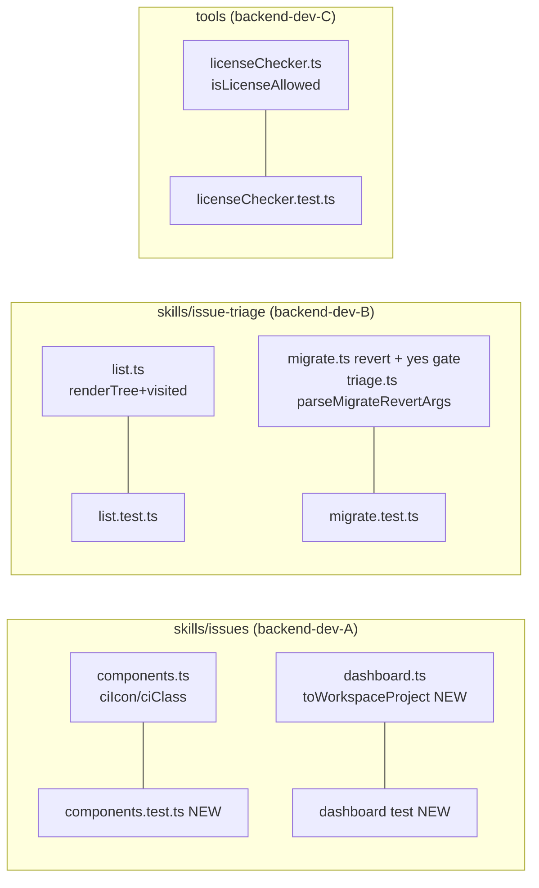

## Summary

Fix 5 independent latent-correctness bugs in `plugins/dev-core/`, each via TDD (failing
regression test → minimal fix → green). No inter-bug dependencies → one wave, 3 parallel
agent instances split by directory + subject.

## Architecture

## Agents

| Agent instance | Tasks | Files |
|----------------|-------|-------|
| backend-dev-A | T1, T2 | `skills/issues/lib/components.ts`, `skills/issues/dashboard.ts` (+ new tests) |
| backend-dev-B | T3, T4 | `skills/issue-triage/lib/list.ts`, `skills/issue-triage/lib/migrate.ts`, `skills/issue-triage/triage.ts` (+ tests) |
| backend-dev-C | T5 | `tools/licenseChecker.ts`, `tools/__tests__/licenseChecker.test.ts` |

Tester role is embedded: each instance writes its own regression tests (tightly coupled
characterization/unit tests for the function it changes — TDD, no handoff).

## Wave Structure

1 wave, max 3 parallel agents. Elapsed ~1 unit vs ~5 sequential.

| Wave | Trigger | Agents | Tasks |
|------|---------|--------|-------|
| 1 | start | 3 ∥ | backend-dev-A: T1, T2 · backend-dev-B: T3, T4 · backend-dev-C: T5 |

### Budget — per task

| Task | Items | Class | Est. ops | Split? |
|------|-------|-------|----------|--------|
| T1 Bug 1 ciIcon/ciClass | 1 | judgmental | 6 | — |
| T2 Bug 2 toWorkspaceProject | 1 | judgmental | 6 | — |
| T3 Bug 3 renderTree visited | 1 | bounded | 5 | — |
| T4 Bug 4 revert yes-gate | 1 | judgmental | 12 | — |
| T5 Bug 5 SPDX eval | 1 | judgmental | 10 | — |

**Total estimated ops: 39**

### Budget — per agent instance

| Instance | Tasks | Σ ops | Subjects | Split? |
|----------|-------|-------|----------|--------|
| backend-dev-A | T1, T2 | 12 | ci-render, workspace-map | — |
| backend-dev-B | T3, T4 | 17 | tree-recursion, migrate-revert | — |
| backend-dev-C | T5 | 10 | spdx | — |

All instances within caps (≤50 ops, ≤4 tasks, ≤2 subjects).

## Consistency Report

- Covered: 5/5 success-criteria bugs (SC Bug1→T1, Bug2→T2, Bug3→T3, Bug4→T4, Bug5→T5).
- Final SC ("suite green") = verified by `/validate` after all tasks.
- Uncovered: none. Untraced tasks: none. Exemptions: none.

## Micro-Tasks

### T1 — Bug 1: remove StatusContext/CheckRun conflation in ciIcon/ciClass `[P]`
- **File:** `plugins/dev-core/skills/issues/lib/components.ts` (+ NEW `skills/issues/__tests__/components.test.ts`)
- **Change:** drop `|| status === 'SUCCESS'` from the COMPLETED guards (L154, L171) so StatusContext rows route to the dedicated block (L164/L178).
- **RED:** new test asserts `ciIcon('SUCCESS','')==='✅'`, `ciIcon('FAILURE','')==='❌'`, `ciIcon('COMPLETED','SUCCESS')==='✅'`, and same-shape `ciClass` cases — written to pass on intended routing (characterization; output identical pre/post since fix is behavior-preserving).
- **GREEN:** apply the guard edits; output unchanged.
- **Verify:** `bun run test -- components` → pass. `grep -n "status === 'SUCCESS'" components.ts` shows only the StatusContext block (L164/L178) + ciSummary L189, not the COMPLETED guards.
- **Spec trace:** SC Bug 1 · **Subject:** ci-render · **Difficulty:** 2

### T2 — Bug 2: extract shared `toWorkspaceProject`, use in both wsProjects paths `[P]`
- **File:** `plugins/dev-core/skills/issues/dashboard.ts` (+ test)
- **Change:** add `toWorkspaceProject(p)` returning `{label, repo, projectId, type, fieldIds, vercelProjects, localPath}`; replace both inline maps (L243-251 multi, L296-303 single) with `ws.projects.map(toWorkspaceProject)`. Export the helper for testing.
- **RED:** test asserts `toWorkspaceProject({...localPath:'/x'})` includes `localPath:'/x'` (fails today for the single-path shape because it omitted the field).
- **GREEN:** extraction makes both paths include `localPath`.
- **Verify:** `bun run test -- dashboard` → pass. `bun run typecheck` green.
- **Spec trace:** SC Bug 2 · **Subject:** workspace-map · **Difficulty:** 2

### T3 — Bug 3: add `visited` cycle guard to renderTree `[P]`
- **File:** `plugins/dev-core/skills/issue-triage/lib/list.ts` (+ extend `__tests__/list.test.ts`)
- **Change:** thread `visited: Set<number>` through `renderTree`; skip a node already in `visited` (no re-expansion); add each rendered node to `visited`. Export `renderTree` for test.
- **RED:** test builds rows with a cycle (#1.subIssueNumbers=[2], #2.subIssueNumbers=[1]) and asserts `renderTree` returns without throwing and emits each node ≤ once. Fails today (stack overflow).
- **GREEN:** guard added.
- **Verify:** `bun run test -- list` → pass.
- **Spec trace:** SC Bug 3 · **Subject:** tree-recursion · **Difficulty:** 2

### T4 — Bug 4: warning + confirmation gate on issueType null-revert `[P]`
- **Files:** `plugins/dev-core/skills/issue-triage/lib/migrate.ts`, `plugins/dev-core/skills/issue-triage/triage.ts` (+ update/extend `__tests__/migrate.test.ts`)
- **Change:**
  - `revert(opts: { snapshotPath: string; yes?: boolean })`. Before the backfill loop, detect `issueType` rows that would revert (`field==='issueType' && !flagged && new_value!==null`). If any:
    - print a prominent warning naming the unverified `updateIssueIssueType(node,null)` op + affected issue numbers;
    - if `opts.yes` → proceed; else if `process.stdin.isTTY` → readline `Proceed? [y/N]`, non-`y` → skip issueType rows; else (non-interactive) → skip issueType rows, log skip, mark partial.
  - On any skipped issueType row in non-interactive/declined mode → set non-zero exit (e.g. `process.exitCode = 1`) after the summary so automation detects partial revert.
  - `parseMigrateRevertArgs` (triage.ts:67): parse `--yes`/`-y` → `{ snapshotPath, yes }`; pass to `revert`.
- **RED/updated tests:**
  - UPDATE existing `calls updateIssueIssueType(...)` test → pass `{ snapshotPath, yes: true }`.
  - NEW: non-interactive (`stdin.isTTY=false`), no yes → `updateIssueIssueType` NOT called, warning + skip logged, `process.exitCode` non-zero.
  - NEW: non-`issueType` rows unaffected by the gate.
- **GREEN:** implement gate.
- **Verify:** `bun run test -- migrate` → pass. `bun run typecheck` green.
- **Spec trace:** SC Bug 4 · **Subject:** migrate-revert · **Difficulty:** 4

### T5 — Bug 5: correct SPDX precedence/grouping in isLicenseAllowed `[P]`
- **File:** `plugins/dev-core/tools/licenseChecker.ts` (+ extend `tools/__tests__/licenseChecker.test.ts`)
- **Change:** replace the flatten-and-`.every()`/`.some()` logic in `isLicenseAllowed` (L309-319) with an evaluator that respects parentheses and AND-binds-tighter-than-OR. `A WITH B` = one opaque atom; strip a trailing `+` before atom match. Leave `parseSpdxExpression` unchanged (existing tests lock it).
- **RED:** tests —
  - `isLicenseAllowed('(MIT OR Apache-2.0) AND BSD-2-Clause', ['MIT','BSD-2-Clause'])` → `true` (fails today).
  - unsatisfiable nested group → `false`.
  - `A WITH B` opaque-atom + `GPL-2.0+`→`GPL-2.0` cases.
  - existing `parseSpdxExpression` + simple AND/OR `isLicenseAllowed` tests still pass.
- **GREEN:** implement evaluator.
- **Verify:** `bun run test -- licenseChecker` → pass.
- **Spec trace:** SC Bug 5 · **Subject:** spdx · **Difficulty:** 3

## Task Seeding Blueprint

<!-- Used by /implement to seed TaskCreate calls. T-numbers ref this list. -->

### Wave 1 — no deps, 3 agents ∥

| Task | Agent instance | blockedBy | Subject |
|------|---------------|-----------|---------|
| T1 | backend-dev-A | — | ci-render |
| T2 | backend-dev-A | — | workspace-map |
| T3 | backend-dev-B | — | tree-recursion |
| T4 | backend-dev-B | — | migrate-revert |
| T5 | backend-dev-C | — | spdx |

## Task IDs

<!-- Generated by /plan. Used by /implement to resume tasks on session restart. -->
- T1: 13 — ci-render
- T2: 14 — workspace-map
- T3: 15 — tree-recursion
- T4: 16 — migrate-revert
- T5: 17 — spdx
