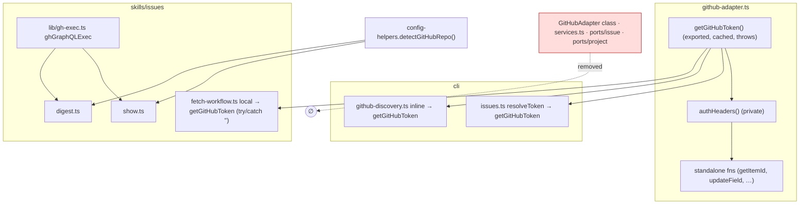
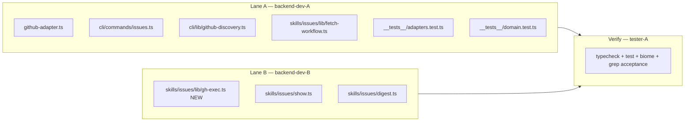

## Summary

Two parallel agent lanes consolidate duplicated GitHub-access code: Lane A owns `github-adapter.ts` (D1 canonical token → D2 drop dead class, sequential); Lane B owns `show.ts`/`digest.ts` (D3 extract `gh-exec.ts`, D4 reuse `detectGitHubRepo`). A tester verify-gate joins both lanes.

## Architecture

### Data flow

### File × Function map

## Agents

| Agent instance | Tasks | Files | Subjects |
|----------------|-------|-------|----------|
| backend-dev-A | T1–T7 | `github-adapter.ts`, `cli/commands/issues.ts`, `cli/lib/github-discovery.ts`, `skills/issues/lib/fetch-workflow.ts`, `adapters/services.ts`, `ports/issue.ts`, `ports/project.ts`, `__tests__/adapters.test.ts`, `__tests__/domain.test.ts` | auth, adapter-cleanup |
| backend-dev-B | T8–T10 | `skills/issues/lib/gh-exec.ts` (new), `skills/issues/show.ts`, `skills/issues/digest.ts` | gh-exec, repo-detect |
| tester-A | T11 | (verification only) | verify |

> Lane A and Lane B edit disjoint file sets → run ∥. Within each lane, one agent runs its tasks sequentially.

## Wave Structure

3 logical waves, 2 parallel agent lanes joined by a verify gate. Elapsed ≈ 1 working session vs ≈ 2 sequential.

| Wave | Trigger | Agents | Tasks |
|------|---------|--------|-------|
| 1 | start | 2 ∥ | backend-dev-A: T1→T2→T3→T4→T5→T6→T7 · backend-dev-B: T8→T9→T10 |
| 2 | Lane A ∧ Lane B done | 1 | tester-A: T11 (verify gate) |

(Lane A and Lane B are independent chains; T11 joins them.)

### Budget — per task

| Task | Items | Class | Est. ops | Split? |
|------|-------|-------|----------|--------|
| T1 export getGitHubToken | 1 | judgmental | 4 | — |
| T2 migrate issues.ts | 1 | bounded | 3 | — |
| T3 migrate github-discovery.ts | 1 | bounded | 3 | — |
| T4 migrate fetch-workflow.ts | 1 | judgmental | 4 | — |
| T5 remove GitHubAdapter class | 1 | judgmental | 5 | — |
| T6 delete services + ports | 3 | judgmental | 5 | — |
| T7 update 2 test files | 2 | judgmental | 5 | — |
| T8 create gh-exec.ts | 1 | bounded | 3 | — |
| T9 migrate show/digest ghGraphQL | 2 | judgmental | 4 | — |
| T10 reuse detectGitHubRepo | 2 | bounded | 3 | — |
| T11 verify gate | 1 | judgmental | 6 | — |

**Total estimated ops: ~45**

### Budget — per agent instance

| Instance | Tasks | Σ ops | Subjects | Split? |
|----------|-------|-------|----------|--------|
| backend-dev-A | T1,T2,T3,T4,T5,T6,T7 | 29 | auth, adapter-cleanup | — (2 subjects = cap; 7 tasks but trivial-bounded, single-file-centric chain) |
| backend-dev-B | T8,T9,T10 | 10 | gh-exec, repo-detect | — |
| tester-A | T11 | 6 | verify | — |

> backend-dev-A carries 7 tasks but they form one tight refactor of a single core file + its direct consumers, 2 subjects, 29 ops < 50 → no split. The auth (D1) and adapter-cleanup (D2) subjects are sequenced (D2 blocked by D1) and share `github-adapter.ts`, so a single owner is mandatory, not just allowed.

## Consistency Report

- Spec slices covered: V1(D1)→T1-T4, V2(D2)→T5-T7, V3(D3)→T8-T9, V4(D4)→T10. **4/4 covered.**
- Success criteria → tasks: SC token-single→T1-T4; SC no-class→T5-T7; SC gh-exec→T8-T9; SC no-detectRepo→T10; SC typecheck/test/biome/smoke→T11. **All traced.**
- Untraced tasks: none.
- Exemptions: ConfigPort/EnvConfigAdapter (deferred, out of scope per spec); `issues.ts` local token-param `ghGraphQL` (follow-up, out of scope).

## Micro-Tasks

### Slice V1 — D1 canonical token (backend-dev-A)

**T1** — Export canonical `getGitHubToken()` [auth · GREEN · diff 3]
- File: `plugins/dev-core/skills/shared/adapters/github-adapter.ts`
- Rename module-private `getToken()` (≈L359) → `export function getGitHubToken()`; keep `cachedToken` caching + throw on missing; standardized message `GITHUB_TOKEN env var required (or gh auth login for local dev)`. Update private `authHeaders()` to call `getGitHubToken()`. (Class-level copy removed in T5.)
- Verify: `grep -n "export function getGitHubToken" plugins/dev-core/skills/shared/adapters/github-adapter.ts`
- Expected: 1 match; `bun run typecheck` green.
- Spec trace: SC-1, SC-2 · Difficulty 3

**T2** — Migrate `cli/commands/issues.ts` [auth · GREEN · diff 2] — blockedBy T1
- Replace local `resolveToken()` (L14) with `import { getGitHubToken } from '...github-adapter'`; call site `const token = getGitHubToken()`. Leave local `ghGraphQL(query,vars,token)` untouched (out of scope).
- Verify: `grep -c "function resolveToken" plugins/dev-core/cli/commands/issues.ts` → 0
- Spec trace: SC-1 · Difficulty 2

**T3** — Migrate `cli/lib/github-discovery.ts` [auth · GREEN · diff 2] — blockedBy T1
- Replace inline token IIFE (≈L18) with `getGitHubToken()` import.
- Verify: `grep -c "gh auth token" plugins/dev-core/cli/lib/github-discovery.ts` → 0
- Spec trace: SC-1 · Difficulty 2

**T4** — Migrate `skills/issues/lib/fetch-workflow.ts` [auth · GREEN · diff 3] — blockedBy T1
- Replace local `getGitHubToken()` (≈L20) with import; wrap in `try { return getGitHubToken() } catch { return '' }` to preserve non-throwing `''` contract (caller returns `[]`).
- Verify: `grep -c "gh auth token" plugins/dev-core/skills/issues/lib/fetch-workflow.ts` → 0; behavior: missing-token path still returns `[]`.
- Spec trace: SC-1, SC-2 · Difficulty 3

### Slice V2 — D2 drop dead class (backend-dev-A)

**T5** — Remove `GitHubAdapter` class [adapter-cleanup · REFACTOR · diff 4] — blockedBy T1
- File: `github-adapter.ts`. Delete `class GitHubAdapter {...}` (L59-348) incl. static `parseProjectFields` ref (keep the standalone `parseProjectFields` export). Drop now-unused imports: `Issue`, `IssueFilters`, `IssuePort`, `ProjectPort`. Keep all standalone fns + query imports they use.
- Verify: `grep -c "class GitHubAdapter" plugins/dev-core/skills/shared/adapters/github-adapter.ts` → 0; `bun run typecheck` green.
- Spec trace: SC-3 · Difficulty 4

**T6** — Delete dead hexagonal files [adapter-cleanup · REFACTOR · diff 3] — blockedBy T5
- Grep-verify zero non-test importers, then `git rm`: `skills/shared/adapters/services.ts`, `skills/shared/ports/issue.ts`, `skills/shared/ports/project.ts`.
- Verify: `grep -rn "createServices\|ports/issue\|ports/project" plugins/dev-core --include='*.ts' | grep -v __tests__` → ∅
- Spec trace: SC-3, SC-4 · Difficulty 3

**T7** — Update affected tests [adapter-cleanup · REFACTOR · diff 3] — blockedBy T6
- `__tests__/adapters.test.ts`: remove `GitHubAdapter` describe blocks + their port imports; **keep the `EnvConfigAdapter` describe block verbatim**. `__tests__/domain.test.ts`: drop `IssuePort`/`ProjectPort` type references (keep `ConfigPort`).
- Verify: `grep -c "EnvConfigAdapter" plugins/dev-core/skills/shared/__tests__/adapters.test.ts` unchanged vs baseline; `bun run test` green.
- Spec trace: SC-4, SC-9 · Difficulty 3

### Slice V3 — D3 extract gh-exec (backend-dev-B)

**T8** — Create `gh-exec.ts` [gh-exec · GREEN · diff 2]
- New file `plugins/dev-core/skills/issues/lib/gh-exec.ts` exporting `export function ghGraphQLExec(query: string): unknown` — execSync + tmpfile (`gh-exec-` prefix) + `gh api graphql --input`, identical semantics to current show/digest copies.
- Verify: `grep -n "export function ghGraphQLExec" plugins/dev-core/skills/issues/lib/gh-exec.ts` → 1
- Spec trace: SC-5 · Difficulty 2

**T9** — Migrate show.ts + digest.ts to `ghGraphQLExec` [gh-exec · REFACTOR · diff 3] — blockedBy T8
- Remove local `ghGraphQL` from `skills/issues/show.ts` (≈L27) + `skills/issues/digest.ts` (≈L33); import `ghGraphQLExec` from `./lib/gh-exec`. Update call sites.
- Verify: `grep -rc "function ghGraphQL" plugins/dev-core/skills/issues/show.ts plugins/dev-core/skills/issues/digest.ts` → 0,0; `bun run typecheck` green.
- Spec trace: SC-5 · Difficulty 3

### Slice V4 — D4 reuse detectGitHubRepo (backend-dev-B)

**T10** — Replace local `detectRepo` [repo-detect · REFACTOR · diff 2] — blockedBy T9
- In `show.ts` (≈L19) + `digest.ts` (≈L44): delete local `detectRepo()`; import `detectGitHubRepo` from `../shared/adapters/config-helpers`; at call sites use `const [owner, repo] = detectGitHubRepo().split('/')`.
- Verify: `grep -rc "function detectRepo" plugins/dev-core/skills/issues/show.ts plugins/dev-core/skills/issues/digest.ts` → 0,0
- Spec trace: SC-6 · Difficulty 2

### Verify gate (tester-A)

**T11 [RED-GATE]** — Full verification [verify · diff 3] — blockedBy T7, T10
- Run: `bun run typecheck`, `bun run test`, `bunx biome check`. Then acceptance greps: exactly 1 `getGitHubToken` def; 0 `class GitHubAdapter`; 0 `createServices`/`IssuePort`/`ProjectPort` outside deleted files; 1 `ghGraphQLExec` def; 0 local `detectRepo` in show/digest; `EnvConfigAdapter`/`ConfigPort` untouched. Manual smoke per slice demo column where a gh session is available.
- Verify: all commands exit 0; all grep counts match SC.
- Spec trace: SC-7..SC-11 · Difficulty 3

## Task Seeding Blueprint

<!-- Used by /implement to seed TaskCreate calls on session start.
     Format: T{n} | agent-instance | blockedBy | subject -->

### Wave 1 — Lane A ∥ Lane B (2 agents)

| Task | Agent instance | blockedBy | Subject |
|------|---------------|-----------|---------|
| T1 | backend-dev-A | — | auth |
| T2 | backend-dev-A | T1 | auth |
| T3 | backend-dev-A | T1 | auth |
| T4 | backend-dev-A | T1 | auth |
| T5 | backend-dev-A | T1 | adapter-cleanup |
| T6 | backend-dev-A | T5 | adapter-cleanup |
| T7 | backend-dev-A | T6 | adapter-cleanup |
| T8 | backend-dev-B | — | gh-exec |
| T9 | backend-dev-B | T8 | gh-exec |
| T10 | backend-dev-B | T9 | repo-detect |

### Wave 2 — verify gate (1 agent)

| Task | Agent instance | blockedBy | Subject |
|------|---------------|-----------|---------|
| T11 | tester-A | T7, T10 | verify |

## Task IDs

<!-- Generated by /plan. Used by /implement to resume tasks on session restart. -->
- T1: 13 — auth (export getGitHubToken)
- T2: 14 — auth (issues.ts)
- T3: 15 — auth (github-discovery.ts)
- T4: 16 — auth (fetch-workflow.ts)
- T5: 17 — adapter-cleanup (remove class)
- T6: 18 — adapter-cleanup (delete services+ports)
- T7: 19 — adapter-cleanup (tests)
- T8: 20 — gh-exec (create gh-exec.ts)
- T9: 21 — gh-exec (migrate show/digest)
- T10: 22 — repo-detect (detectGitHubRepo)
- T11: 23 — verify (RED-GATE)
