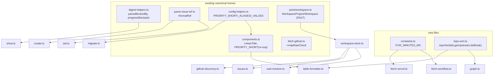

## Summary

Extract 10 duplicated helpers in the `dev-core` plugin into single canonical
definitions across 3 strictly-sequential slices (mechanical → nuanced →
locked+reconcile). Behavior-preserving; D19 dropped, dev-init untouched.

## Architecture

### Data flow — canonical surfaces post-refactor

### File × function map (edits per file)

```mermaid
flowchart LR
  subgraph S1["Slice 1 · mechanical"]
    show1["show.ts: drop parseBlockedBy → import (E1)"]
    pir1["parse-issue-ref.ts: +formatRef (E3)"]
    setcre["set.ts/create.ts: 11× inline → formatRef (E3)"]
    fg1["fetch-github.ts: +mapRawCheck, 2× map (E7)"]
    const1["constants.ts NEW + fetch-workflow/vercel (E8)"]
    mig1["migrate.ts: drop Row → BackfillRow (E10)"]
  end
  subgraph S2["Slice 2 · nuanced"]
    dh2["digest-helpers.ts: progressBar opts (E2)"]
    cmp2["components.ts: +cleanTitle, PRIORITY import (E4,E5)"]
    tf2["table-formatter.ts:217 shortName → cleanTitle (E4)"]
    test2["__tests__: progressBar/cleanTitle/priority (T9)"]
  end
  subgraph S3["Slice 3 · locked + reconcile"]
    topo3["topo-sort.ts NEW + graph.ts + table-formatter.ts:245 (E9)"]
    ws3["workspace-store.ts + 3 type-import sites (E6)"]
    test3["__tests__: topoSort order-equivalence (T12)"]
  end
  S1 --> S2 --> S3
```

## Bootstrap Context

From [analysis](../analyses/193-extract-shared-ts-helpers-analysis.mdx):
3 unknowns resolved — dev-init = independent copy (untouched); D13 `vercel*` dead
(drop); D17 topo-sorts differ on tie-break (parametrize). Architect-validated:
generic `topoSort` callback shape correct, `cleanTitle` lives in components.ts,
`mapRawCheck` co-located. Style: single quotes, no semicolons, biome-clean.

## Agents

| Agent | Instances | Tasks | Files |
|-------|-----------|-------|-------|
| backend-dev | A, B | T1–T8, T10, T11 | all `*.ts` source extractions |
| tester | A | T9, T12 + 3 RED-GATEs | `__tests__/`, quality gates |

## Wave Structure

3 waves (= 3 slices), max 2 parallel backend-dev + 1 tester. Waves enforce the
spec's S1→S2→S3 ordering guard. Elapsed ~3 sequential gate-cycles.

| Wave | Trigger | Agents | Tasks |
|------|---------|--------|-------|
| 1 | start | bd-A, bd-B ∥ → tester-A | bd-A: T1→T2 · bd-B: T3→T4→T5 · tester-A: T-G1 |
| 2 | T-G1 green | bd-A, bd-B ∥ → tester-A | bd-A: T6 · bd-B: T7→T8 · tester-A: T9, T-G2 |
| 3 | T-G2 green | bd-A, bd-B ∥ → tester-A | bd-A: T10 · bd-B: T11 · tester-A: T12, T-G3 |

### Budget — per task

| Task | Items | Class | Est. ops | Split? |
|------|-------|-------|----------|--------|
| T1 E1 | 1 | bounded | 3 | — |
| T2 E3 | 11 sites | judgmental | 10 | — |
| T3 E7 | 2 | bounded | 4 | — |
| T4 E8 | 3 files | bounded | 4 | — |
| T5 E10 | 1 | trivial | 3 | — |
| T6 E2 | 2 | judgmental | 5 | — |
| T7 E4 | 2 | judgmental | 6 | — |
| T8 E5 | 3 files | judgmental | 6 | — |
| T9 tests | 3 suites | judgmental | 8 | — |
| T10 E9 | 3 | judgmental | 8 | — |
| T11 E6 | 4 files | judgmental | 6 | — |
| T12 tests | 1 suite | judgmental | 6 | — |
| gates ×3 | — | bounded | 9 | — |

**Total estimated ops: ~78**

### Budget — per agent instance (per wave)

| Instance | Tasks | Σ ops | Subjects | Split? |
|----------|-------|-------|----------|--------|
| bd-A W1 | T1, T2 | 13 | blocked-by, issue-ref | — |
| bd-B W1 | T3, T4, T5 | 11 | ci-map, constants, backfill-type | **exempt** (3 subj — see note) |
| bd-A W2 | T6 | 5 | progress-bar | — |
| bd-B W2 | T7, T8 | 12 | title-clean, priority-map | — |
| bd-A W3 | T10 | 8 | topo-sort | — |
| bd-B W3 | T11 | 6 | workspace-type | — |
| tester-A | T9, T12, T-G1/2/3 | 23 | tests | — |

**Subject-cap exemption (bd-B W1):** 3 distinct subjects > 2 cap, but all three
are trivial single-edit string-replace/import-swap (<30 items), so the global
mechanical exception applies — clustering into a 3rd instance is not worth the
overhead. No correctness risk (file-disjoint: fetch-github.ts / constants+fetch-
workflow+fetch-vercel / migrate.ts).

## Consistency Report

- **Covered:** 10/10 E-items (E1–E10) traced to SC1–SC8; D19-drop + dev-init-
  exclusion traced to SC5.
- **Uncovered:** none.
- **Untraced tasks:** none (all 12 work-tasks map to an E-item; 3 gates map to SC7).
- **Exemptions:** bd-B W1 subject-cap (mechanical, documented above).

## Micro-Tasks

Style for all: single quotes, no semicolons, biome-clean. Verify from worktree root.

### Slice 1 — Mechanical (Wave 1) · RED-GATE: T-G1

**T1 · E1 parseBlockedBy** — `bd-A` · subject blocked-by · diff 1 · `[P]`
- File: `plugins/dev-core/skills/issues/show.ts`
- Delete local `function parseBlockedBy` (~:17–32); add `import { parseBlockedBy } from './lib/digest-helpers'`.
- Verify: `grep -rn 'function parseBlockedBy' plugins/dev-core` → 1 (digest-helpers.ts:38)
- Spec trace: SC1 / E1

**T2 · E3 formatRef** — `bd-A` (after T1) · subject issue-ref · diff 2
- Files: `plugins/dev-core/skills/shared/domain/parse-issue-ref.ts` (+export), `…/issue-triage/lib/set.ts` (×7: 210,220,230,240,255,265,291), `…/issue-triage/lib/create.ts` (×4: 127,136,145,154)
- Add `export function formatRef(ref: ParsedIssueRef): string { return ref.repo ? \`${ref.repo}#${ref.number}\` : \`#${ref.number}\` }`. Replace 11 inline ternaries; `formatRef` joins existing import (set.ts:34, create.ts:27). **Leave `set.ts:120 subjectStr` untouched.**
- Verify: `grep -rnE '\.repo \? .#' plugins/dev-core/skills/issue-triage/lib/{set,create}.ts` → 0 ; `bun run test`
- Spec trace: SC1, SC8 / E3

**T3 · E7 mapRawCheck** — `bd-B` · subject ci-map · diff 2 · `[P]`
- File: `plugins/dev-core/skills/issues/lib/fetch-github.ts`
- Add `export function mapRawCheck(node: RawCheckNode): CICheck {…}` (the 4-field fallback map); replace inline maps at :206–211 and :262–267 with `rawChecks.map(mapRawCheck)`.
- Verify: `grep -c 'mapRawCheck' plugins/dev-core/skills/issues/lib/fetch-github.ts` → 3
- Spec trace: SC1 / E7

**T4 · E8 FIVE_MINUTES_MS** — `bd-B` (after T3) · subject constants · diff 2
- Create `plugins/dev-core/skills/issues/lib/constants.ts`: `export const FIVE_MINUTES_MS = 5 * 60 * 1000`
- `fetch-workflow.ts`: drop `FIVE_MINUTES_WR` (:19), import + use FIVE_MINUTES_MS (:49). `fetch-vercel.ts`: drop fn-scope `FIVE_MIN` (:124), import + use (:137).
- Verify: `test -f …/lib/constants.ts` ; `grep -rn 'FIVE_MINUTES_MS =' plugins/dev-core` → 1 ; `bun run typecheck`
- Spec trace: SC1, SC6 / E8

**T5 · E10 Row→BackfillRow** — `bd-B` (after T4) · subject backfill-type · diff 1
- File: `plugins/dev-core/skills/issue-triage/lib/migrate.ts`
- Delete `interface Row` (:201); change :340 `const rows: Row[]` → `BackfillRow[]`.
- Verify: `grep -c 'interface Row ' plugins/dev-core/skills/issue-triage/lib/migrate.ts` → 0 ; `bun run typecheck`
- Spec trace: SC1 / E10 · *Note: migrate.ts also edited by T8 (W2) — different wave, safe.*

**T-G1 · RED-GATE S1** — `tester-A` (after T1–T5) · phase RED-GATE
- `bun run typecheck && bun run lint && bun run test` → all green.
- Single-def greps pass (parseBlockedBy, formatRef, mapRawCheck, FIVE_MINUTES_MS, Row removed). Blocks Wave 2.

### Slice 2 — Nuanced (Wave 2) · RED-GATE: T-G2

**T6 · E2 progressBar opts** — `bd-A` · subject progress-bar · diff 3 · `[P]`
- Files: `…/issues/lib/digest-helpers.ts` (:57), `…/issues/show.ts` (:53 def, :181 call)
- `progressBar(closed, total, opts: { suffix?: boolean; emptyBar?: boolean } = {})`. **Defaults reproduce current `progressBar` exactly**: `emptyBar` defaults true (`total===0`→`'░░░░░'`), `suffix` defaults false. Delete show.ts `bar`; repoint :181 → `progressBar(done, total, { suffix: true, emptyBar: false })`; import progressBar.
- Verify: `grep -c 'function bar' …/issues/show.ts` → 0 ; check digest.ts callers pass no opts (rely on defaults).
- Spec trace: SC1, SC3 / E2

**T7 · E4 cleanTitle** — `bd-B` · subject title-clean · diff 3 · `[P]`
- Files: `…/issues/lib/components.ts` (:44), `…/issues/lib/table-formatter.ts` (:217 shortName)
- Add `export function cleanTitle(title: string): string` = the 4-regex chain (use components' form incl. trailing `\s*` in last regex). Refactor `shortTitle` (:44) → `const cleaned = cleanTitle(title); return cleaned.length > max ? …`. `shortName` (:217) → `let s = cleanTitle(title); if (s.length > 20) s = \`${s.slice(0,17)}...\`; return s`. **Do NOT touch table-formatter.ts:34 `shortTitle`** (truncate-only).
- Verify: regex chain defined once (`grep -rn 'LATER:' plugins/dev-core/skills/issues/lib` → only cleanTitle) ; `grep -c 'function cleanTitle' components.ts` → 1
- Spec trace: SC1, SC3 / E4 · *Note: shortName's last regex was `/\s*\(.*?\)$/` (no trailing `\s*`); normalized to components' form — invisible post-truncation; T9 asserts no visible diff.*

**T8 · E5 priority maps** — `bd-B` (after T7, same components.ts) · subject priority-map · diff 3
- Files: `…/shared/adapters/config-helpers.ts`, `…/issues/lib/components.ts` (:3,:37), `…/issue-triage/lib/migrate.ts` (:157)
- config-helpers: add `export const PRIORITY_VALUES = ['P0 - Urgent','P1 - High','P2 - Medium','P3 - Low'] as const`. components.ts:3 drop local `PRIORITY_SHORT` → `import { PRIORITY_SHORT } from '../../shared/adapters/config-helpers'`; :37 → `export { PRIORITY_VALUES } from '../../shared/adapters/config-helpers'` (**preserve `as const`**). migrate.ts:157 → use `PRIORITY_ALIASES` (import from config-helpers; already imports it at 12–22) in place of the 4-key inline map.
- Verify: `grep -rn 'PRIORITY_SHORT: Record' plugins/dev-core/skills/issues` → 0 ; `bun run typecheck` (page.ts:58,596 ok)
- Spec trace: SC1, SC3 / E5

**T9 · S2 unit tests** — `tester-A` (after T6,T7,T8) · subject tests · diff 3 · phase GREEN
- New tests (co-locate with existing `__tests__/`): progressBar (`total=0` default→`░░░░░`; `{suffix:true,emptyBar:false}` total=0→`''`; suffix appends ` n/m`); cleanTitle (strips feat()/Feature:/LATER:/trailing parens; shortName 17@20 truncation; no visible diff vs old); priority (PRIORITY_ALIASES P0–P3 + URGENT/HIGH resolve; migrate label path).
- Verify: `bun run test` green.
- Spec trace: SC3

**T-G2 · RED-GATE S2** — `tester-A` (after T6–T9) · phase RED-GATE
- `bun run typecheck && bun run lint && bun run test` green; no command-output diff. Blocks Wave 3.

### Slice 3 — Locked + reconcile (Wave 3) · RED-GATE: T-G3

**T10 · E9 topoSort** — `bd-A` · subject topo-sort · diff 4 · `[P]`
- Create `plugins/dev-core/skills/issues/lib/topo-sort.ts`: `export function topoSort(ids: number[], getUpstream: (id: number) => number[], tieBreak: 'input-order' | 'numeric-asc'): number[]` — Kahn, `Set` for emitted, `filter` for remaining (no splice/indexOf). `numeric-asc` sorts each ready batch + cycle dump ascending; `input-order` keeps `ids` order.
- `graph.ts:33`: replace local sort → `topoSort(ids, getUpstream, 'input-order')` (adapt DepNode). `table-formatter.ts:245` `topologicalSort`: replace → `topoSort(blockers, getUpstream, 'numeric-asc')`.
- Verify: `grep -rn 'function topoSort' plugins/dev-core` → 1 ; both callers import it.
- Spec trace: SC1, SC2, SC6 / E9

**T11 · E6 workspace types** — `bd-B` · subject workspace-type · diff 4 · `[P]`
- Files: `plugins/dev-core/cli/lib/workspace-store.ts`, `cli/lib/cwd-resolver.ts` (:2), `cli/commands/issues.ts` (:7), `cli/lib/github-discovery.ts` (:3)
- workspace-store.ts: delete local `VercelProjectRef`/`WorkspaceProject`(incl dead `vercelProjectId`,`vercelTeamId`)/`Workspace`; `import type { WorkspaceProject, Workspace, VercelProjectRef } from '../../skills/shared/ports/workspace'` (**verify depth: cli/lib → ../../skills/shared/ports/workspace**). Repoint the 3 type-import sites to ports (keep `readWorkspace`/`writeWorkspace` fn imports from workspace-store).
- Verify: `grep -rn '\.vercelProjectId\|\.vercelTeamId' plugins/dev-core` → 0 ; `bun run typecheck`
- Spec trace: SC1, SC4 / E6

**T12 · S3 topoSort tests** — `tester-A` (after T10) · subject tests · diff 3 · phase GREEN
- order-equivalence: linear `[1,2,3]`; ties → `input-order` `[3,2,1]` vs `numeric-asc` `[2,3,1]`; independents; cycle dump. Assert expected orders reproduce graph.ts + table-formatter.ts current output.
- Verify: `bun run test` green.
- Spec trace: SC2

**T-G3 · RED-GATE S3 (final)** — `tester-A` (after T10–T12) · phase RED-GATE
- Full `bun run typecheck && bun run lint && bun run test` green. Verify all 8 SC: single-def greps; `vercel*` 0-hits; `git diff --stat` shows no `plugins/dev-init/**` and no `page.ts` escHtml edit; `constants.ts` + `topo-sort.ts` exist; `parse-issue-ref.ts` not newly created.

## Task Seeding Blueprint

<!-- Used by /implement to seed TaskCreate calls. T-numbers ref this list, not task IDs.
     Seed in wave order; within a wave all non-chained rows are parallel (∥). -->

### Wave 1 — no deps, 2 bd ∥ then tester

| Task | Agent instance | blockedBy | Subject |
|------|---------------|-----------|---------|
| T1 | backend-dev-A | — | blocked-by |
| T2 | backend-dev-A | T1 | issue-ref |
| T3 | backend-dev-B | — | ci-map |
| T4 | backend-dev-B | T3 | constants |
| T5 | backend-dev-B | T4 | backfill-type |
| T-G1 | tester-A | T1,T2,T3,T4,T5 | gate |

### Wave 2 — after T-G1, 2 bd ∥ then tester

| Task | Agent instance | blockedBy | Subject |
|------|---------------|-----------|---------|
| T6 | backend-dev-A | T-G1 | progress-bar |
| T7 | backend-dev-B | T-G1 | title-clean |
| T8 | backend-dev-B | T7 | priority-map |
| T9 | tester-A | T6,T7,T8 | tests |
| T-G2 | tester-A | T9 | gate |

### Wave 3 — after T-G2, 2 bd ∥ then tester

| Task | Agent instance | blockedBy | Subject |
|------|---------------|-----------|---------|
| T10 | backend-dev-A | T-G2 | topo-sort |
| T11 | backend-dev-B | T-G2 | workspace-type |
| T12 | tester-A | T10 | tests |
| T-G3 | tester-A | T10,T11,T12 | gate |

## Task IDs

<!-- Generated by /plan. Used by /implement to resume tasks on session restart. -->
- T1: 13 — blocked-by (bd-A)
- T2: 14 — issue-ref (bd-A)
- T3: 15 — ci-map (bd-B)
- T4: 16 — constants (bd-B)
- T5: 17 — backfill-type (bd-B)
- T-G1: 18 — gate (tester-A)
- T6: 19 — progress-bar (bd-A)
- T7: 20 — title-clean (bd-B)
- T8: 21 — priority-map (bd-B)
- T9: 22 — tests (tester-A)
- T-G2: 23 — gate (tester-A)
- T10: 24 — topo-sort (bd-A)
- T11: 25 — workspace-type (bd-B)
- T12: 26 — tests (tester-A)
- T-G3: 27 — gate (tester-A)
