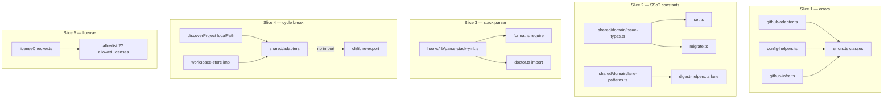
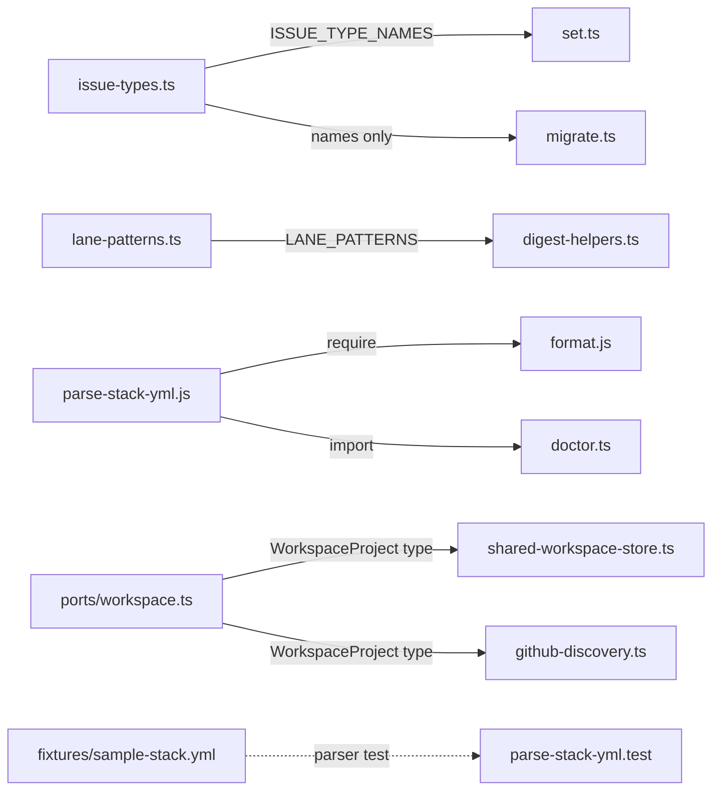

## Summary

Behavior-preserving refactor of the dev-core shared layer: wire the dead error hierarchy,
extract 3 SSoT concerns into pure modules, unify the stack.yml parser across the JS/TS
runtime boundary, break the shared→cli dependency cycle, and align license-policy keys. 12
micro-tasks across 5 agent instances, 6 waves.

## Architecture

## Bootstrap Context

From analysis (review-hardened constraints):
- **#1 cycle:** inject `localPath` param so moved `discoverProject` keeps zero cli import; move
  `readWorkspace`/`writeWorkspace`/`getWorkspacePath`/`parseWorkspace` into shared too (both
  cli imports must die); collapse duplicate `WorkspaceProject`/`Workspace`/`VercelProjectRef`
  interfaces → sole def in `shared/ports/workspace.ts`.
- **#2 throws:** also `config-helpers.ts:83,261` + `github-infra.ts:54`, not just github-adapter.
- **#4 constants:** PURE literals in `shared/domain/issue-types.ts` (NOT config-helpers — avoids
  its import-time `Bun.spawnSync` side-effect).
- **#5 parser:** single CJS module; Bun imports CJS. Fallback = JS module + thin TS wrapper.
- **#7 license:** `allowlist ?? allowedLicenses` back-compat read; no hard rename.

## Agents

| Agent instance | Tasks | Subjects | Files |
|----------------|-------|----------|-------|
| backend-dev-A | T1,T2,T3,T11 | errors, license | github-adapter.ts, config-helpers.ts, github-infra.ts, licenseChecker.ts, tests |
| backend-dev-B | T4,T5,T6 | issue-types, lane | issue-types.ts, lane-patterns.ts, set.ts, migrate.ts, digest-helpers.ts, tests |
| backend-dev-C | T9,T10 | workspace | shared/adapters (moves), cli/lib re-exports, git-workspace.ts, ports/workspace.ts |
| devops-A | T7,T8 | stack-parser | hooks/lib/parse-stack-yml.js, format.js, doctor.ts, fixture+test |
| tester-A | T12 | global | full suite + characterization |

## Wave Structure

6 waves, max 3 parallel agents. Elapsed ~3 wave-cycles vs ~12 sequential.

| Wave | Trigger | Agents | Tasks |
|------|---------|--------|-------|
| 1 | start | 3 ∥ | backend-dev-A: T1 · backend-dev-B: T4 · devops-A: T7 |
| 2 | W1 done | 3 ∥ | backend-dev-A: T2 · backend-dev-B: T5 · devops-A: T8 |
| 3 | W2 done | 2 ∥ | backend-dev-A: T3 (RED-GATE s1) · backend-dev-B: T6 (RED-GATE s2) |
| 4 | W3 done | 2 ∥ | backend-dev-C: T9 · backend-dev-A: T11 (RED-GATE s5) |
| 5 | W4 done | 1 | backend-dev-C: T10 (RED-GATE s4) |
| 6 | W5 done | 1 | tester-A: T12 (global RED-GATE) |

### Budget — per task

| Task | Items | Class | Est. ops | Split? |
|------|-------|-------|----------|--------|
| T1 | 12 throws | judgmental | 8 | — |
| T2 | 3 throws | bounded | 4 | — |
| T3 | 1 test | bounded | 3 | — |
| T4 | 1 file | trivial | 2 | — |
| T5 | 2 edits+test | judgmental | 6 | — |
| T6 | 1 file+edit+test | judgmental | 6 | — |
| T7 | 1 file+fixture+test | judgmental | 6 | — |
| T8 | 2 rewires | judgmental | 6 | — |
| T9 | moves+type collapse | judgmental | 10 | — |
| T10 | re-exports+verify | judgmental | 6 | — |
| T11 | 1 edit+test | bounded | 4 | — |
| T12 | full validate | bounded | 4 | — |

**Total estimated ops: ~65**

### Budget — per agent instance

| Instance | Tasks | Σ ops | Subjects | Split? |
|----------|-------|-------|----------|--------|
| backend-dev-A | T1,T2,T3,T11 | 19 | errors, license | — (4 tasks, 2 subj) |
| backend-dev-B | T4,T5,T6 | 14 | issue-types, lane | — |
| backend-dev-C | T9,T10 | 16 | workspace | — |
| devops-A | T7,T8 | 12 | stack-parser | — |
| tester-A | T12 | 4 | global | — |

## Consistency Report

- Covered: SC#1→T9,T10 · SC#2→T1,T2,T3 · SC#3→T12 (grep assert) · SC#4→T4,T5 · SC#5→T7,T8 · SC#6→T6 · SC#7→T11 · Global→T12
- Uncovered: none
- Untraced tasks: none
- Exemptions: SC#3 is verify-only (grep in T12, no code change)

## Micro-Tasks

### Slice 1 — Wire error hierarchy (SC#2)

**T1** — `github-adapter.ts`: import `GitHubApiError`/`ConfigError`/`DevCoreError`; replace the
~12 `new Error(...)` throws — HTTP/GraphQL failures → `GitHubApiError(msg, statusCode)`,
missing-config → `ConfigError`, remainder → `DevCoreError`.
- File: `plugins/dev-core/skills/shared/adapters/github-adapter.ts`
- Verify: `grep -cn "throw new Error" plugins/dev-core/skills/shared/adapters/github-adapter.ts` → only non-GitHub/config generic throws remain (ideally 0)
- Agent: backend-dev-A · Subject: errors · Phase: GREEN · Spec: SC-2 · Difficulty: 3

**T2** — wire `config-helpers.ts:83` (`Cannot detect GitHub repo`) + `:261` (`fieldIds.status required`) → `ConfigError`; `github-infra.ts:54` (`Invalid repo format`) → `ConfigError`. Import classes.
- Files: `config-helpers.ts`, `github-infra.ts`
- Verify: `grep -n "throw new Error" config-helpers.ts github-infra.ts` → 0 for these sites
- Agent: backend-dev-A · Subject: errors · Phase: GREEN · Spec: SC-2 · Difficulty: 2 · blockedBy: T1

**T3** [RED-GATE s1] — test: a `github-adapter` HTTP failure is `instanceof GitHubApiError` with populated `.statusCode`; existing `domain.test.ts` still green.
- File: `plugins/dev-core/skills/shared/__tests__/` (extend)
- Verify: `bun run test -- github-adapter` green
- Agent: backend-dev-A · Subject: errors · Phase: RED-GATE · Spec: SC-2 · Difficulty: 2 · blockedBy: T1,T2

### Slice 2 — SSoT constants (SC#4, SC#6)

**T4** — create `shared/domain/issue-types.ts` (pure literals): `ISSUE_TYPE_NAMES = ['feat','fix','docs','test','chore','ci','perf','refactor']`, `EXTENDED_ISSUE_TYPES = ['epic','research']`. No module-scope call.
- File: `plugins/dev-core/skills/shared/domain/issue-types.ts`
- Verify: `bun run typecheck` green
- Agent: backend-dev-B · Subject: issue-types · Phase: GREEN · Spec: SC-4 · Difficulty: 1

**T5** — `set.ts`: `VALID_TYPES = [...ISSUE_TYPE_NAMES, ...EXTENDED_ISSUE_TYPES]` (import); `migrate.ts`: import `ISSUE_TYPE_NAMES` only for its legacy map keys. Test `triage set --type` accepts the same 10 values.
- Files: `skills/issue-triage/lib/set.ts`, `skills/issue-triage/lib/migrate.ts`
- Verify: `grep -c "VALID_TYPES = \[" set.ts` = 0 (composed, not literal); type test green
- Agent: backend-dev-B · Subject: issue-types · Phase: GREEN · Spec: SC-4 · Difficulty: 3 · blockedBy: T4

**T6** [RED-GATE s2] — create `shared/domain/lane-patterns.ts` (`LANE_PATTERNS = {A: /…/, C: /…/}`, default = current regex); rewire `digest-helpers.ts lane()` to read it (no inline Roxabi literals). Test: default title→current lane AND overridden `LANE_PATTERNS`→different lane; existing `digest-helpers.test.ts` green.
- Files: `shared/domain/lane-patterns.ts`, `skills/issues/lib/digest-helpers.ts`, `__tests__/digest-helpers.test.ts`
- Verify: `grep -n "brand\|lora\|pulid\|avatar" digest-helpers.ts` = 0; `bun run test -- digest` green
- Agent: backend-dev-B · Subject: lane · Phase: RED-GATE · Spec: SC-6 · Difficulty: 3 · blockedBy: T5

### Slice 3 — Unify stack.yml parser (SC#5)

**T7** — create `hooks/lib/parse-stack-yml.js` (CommonJS) parsing all 5 fields (formatters, deploy.platform, frontend.framework, package_manager, standards). Commit fixture `skills/shared/__tests__/fixtures/sample-stack.yml`; unit test asserts all 5.
- Files: `plugins/dev-core/hooks/lib/parse-stack-yml.js`, `…/fixtures/sample-stack.yml`, parser test
- Verify: `bun run test -- parse-stack-yml` green (5 fields asserted)
- Agent: devops-A · Subject: stack-parser · Phase: GREEN · Spec: SC-5 · Difficulty: 3

**T8** [RED-GATE s3] — rewire `format.js` to `require('./lib/parse-stack-yml')`; `doctor.ts` to `import` it (Bun-CJS interop — fallback: thin TS wrapper if interop fails); delete the 3 inline parsers. Format hook + checkup output unchanged.
- Files: `hooks/format.js`, `skills/checkup/doctor.ts`
- Verify: `bun run test` green; manual `format`/`checkup` on fixture unchanged
- Agent: devops-A · Subject: stack-parser · Phase: RED-GATE · Spec: SC-5 · Difficulty: 4 · blockedBy: T7

### Slice 4 — Break dependency cycle (SC#1)

**T9** — move `discoverProject` into `shared/adapters/` accepting `localPath?: string` (strip `cwd-resolver` import); move `readWorkspace`/`writeWorkspace`/`getWorkspacePath`/`parseWorkspace` into `shared/adapters/workspace-store.ts`; delete duplicate `WorkspaceProject`/`Workspace`/`VercelProjectRef` interfaces → import from `shared/ports/workspace.ts`.
- Files: `shared/adapters/` (new/moved), `shared/ports/workspace.ts`
- Verify: `bun run typecheck` green; `grep -rc "export interface WorkspaceProject" plugins/dev-core` = 1
- Agent: backend-dev-C · Subject: workspace · Phase: GREEN · Spec: SC-1 · Difficulty: 4 · blockedBy: T5,T6

**T10** [RED-GATE s4] — `cli/lib/github-discovery.ts` + `workspace-store.ts` re-export the moved symbols and pass `detectLocalPath()` into `discoverProject`; update `git-workspace.ts` imports to shared. Verify no shared→cli import remains.
- Files: `cli/lib/github-discovery.ts`, `cli/lib/workspace-store.ts`, `skills/shared/adapters/git-workspace.ts`
- Verify: `grep -rEl "from '.*cli/" plugins/dev-core/skills/shared/` = ∅; `bun run test` green
- Agent: backend-dev-C · Subject: workspace · Phase: RED-GATE · Spec: SC-1 · Difficulty: 3 · blockedBy: T9

### Slice 5 — Align license policy keys (SC#7)

**T11** [RED-GATE s5] — `tools/licenseChecker.ts`: read `policy.allowlist ?? policy.allowedLicenses`. Add policy fixtures using each key; both pass. Python untouched.
- Files: `plugins/dev-core/tools/licenseChecker.ts`, test fixtures
- Verify: checker passes with `allowlist`-keyed and `allowedLicenses`-keyed policy
- Agent: backend-dev-A · Subject: license · Phase: RED-GATE · Spec: SC-7 · Difficulty: 2 · blockedBy: T3

### Global

**T12** [RED-GATE global] — run `bun run typecheck` + `bun run test` + `bun run lint`; assert SC#3 (`grep -cE "execSync|child_process" config-helpers.ts` = 0); confirm no skill/CLI/hook behavior change.
- Verify: all gates green; record SC#3 grep result in PR body
- Agent: tester-A · Subject: global · Phase: RED-GATE · Spec: Global,SC-3 · Difficulty: 2 · blockedBy: T3,T6,T8,T10,T11

## Task Seeding Blueprint

<!-- Used by /implement to seed TaskCreate calls. T-numbers ref this list. -->

### Wave 1 — no deps, 3 agents ∥
| Task | Agent instance | blockedBy | Subject |
|------|---------------|-----------|---------|
| T1 | backend-dev-A | — | errors |
| T4 | backend-dev-B | — | issue-types |
| T7 | devops-A | — | stack-parser |

### Wave 2 — after W1, 3 agents ∥
| Task | Agent instance | blockedBy | Subject |
|------|---------------|-----------|---------|
| T2 | backend-dev-A | T1 | errors |
| T5 | backend-dev-B | T4 | issue-types |
| T8 | devops-A | T7 | stack-parser |

### Wave 3 — after W2, 2 agents ∥
| Task | Agent instance | blockedBy | Subject |
|------|---------------|-----------|---------|
| T3 | backend-dev-A | T1,T2 | errors |
| T6 | backend-dev-B | T5 | lane |

### Wave 4 — after W3, 2 agents ∥
| Task | Agent instance | blockedBy | Subject |
|------|---------------|-----------|---------|
| T9 | backend-dev-C | T5,T6 | workspace |
| T11 | backend-dev-A | T3 | license |

### Wave 5 — after W4, 1 agent
| Task | Agent instance | blockedBy | Subject |
|------|---------------|-----------|---------|
| T10 | backend-dev-C | T9 | workspace |

### Wave 6 — after W5, 1 agent
| Task | Agent instance | blockedBy | Subject |
|------|---------------|-----------|---------|
| T12 | tester-A | T3,T6,T8,T10,T11 | global |

## Task IDs

<!-- Generated by /plan. Used by /implement to resume tasks on session restart. -->
- T1: 14 — errors (backend-dev-A)
- T2: 15 — errors (backend-dev-A)
- T3: 16 — errors (backend-dev-A, RED-GATE s1)
- T4: 17 — issue-types (backend-dev-B)
- T5: 18 — issue-types (backend-dev-B)
- T6: 19 — lane (backend-dev-B, RED-GATE s2)
- T7: 20 — stack-parser (devops-A)
- T8: 21 — stack-parser (devops-A, RED-GATE s3)
- T9: 22 — workspace (backend-dev-C)
- T10: 23 — workspace (backend-dev-C, RED-GATE s4)
- T11: 24 — license (backend-dev-A, RED-GATE s5)
- T12: 25 — global (tester-A, RED-GATE global)
