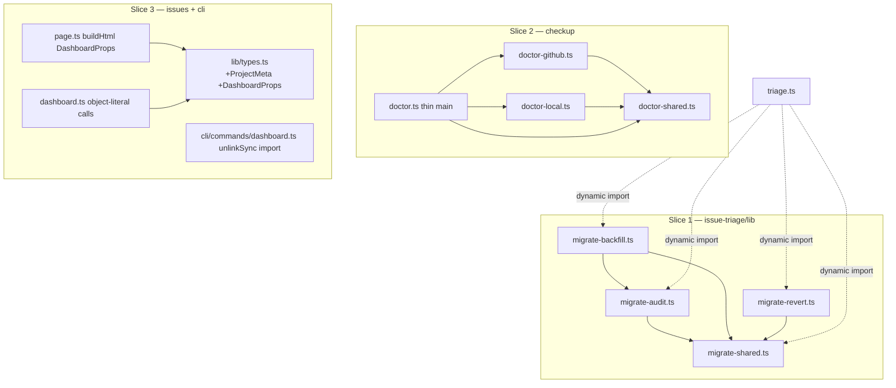
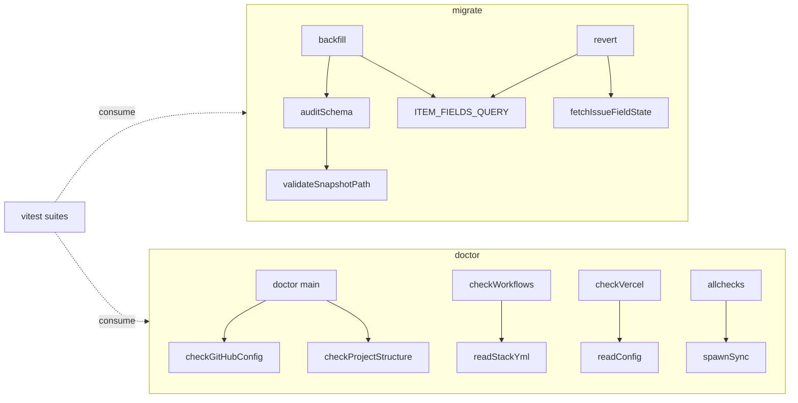

## Summary

Behavior-preserving decomposition of two oversized dev-core modules (migrate.ts 898 l, doctor.ts 946 l) plus two adjacent cleanups (DashboardProps interface + single ProjectMeta; inline `require('node:fs')` → ES imports). Three slices on disjoint file trees, each independently typecheck/test-verifiable.

## Architecture

### Data flow — new module structure

### File × Function map

## Agents

| Agent instance | Slice | Files | Tasks |
|---------------|-------|-------|-------|
| backend-dev-A | 1 | `issue-triage/lib/migrate*.ts`, `triage.ts` | T1 |
| backend-dev-B | 2 | `checkup/doctor*.ts` | T2 |
| backend-dev-C | 3 | `issues/lib/types.ts`, `page.ts`, `dashboard.ts`, `cli/commands/dashboard.ts` | T3 |
| tester-A | validation gate | (read-only verify across all) | T4 |

Disjoint file trees → T1/T2/T3 are parallel-safe. Agents **do not commit** (lead commits after each returns — avoids attribution races). T4 runs after all three land.

## Wave Structure

2 waves, max 3 parallel agents. Elapsed ~1 unit vs ~4 sequential.

| Wave | Trigger | Agents | Tasks |
|------|---------|--------|-------|
| 1 | start | 3 ∥ | backend-dev-A: T1 · backend-dev-B: T2 · backend-dev-C: T3 |
| 2 | Wave 1 done | 1 | tester-A: T4 |

### Budget — per task

| Task | Items | Class | Est. ops | Split? |
|------|-------|-------|----------|--------|
| T1 split migrate.ts | 4 new files + triage update + delete | judgmental | ~28 | — |
| T2 split doctor.ts + require fix | 3 new files + thin main + 13 require | judgmental | ~30 | — |
| T3 DashboardProps + ProjectMeta + cli | 4 files | judgmental | ~20 | — |
| T4 validation gate | typecheck+lint+test+greps | bounded | ~10 | — |

**Total estimated ops: ~88**

### Budget — per agent instance

| Instance | Tasks | Σ ops | Subjects | Split? |
|----------|-------|-------|----------|--------|
| backend-dev-A | T1 | 28 | migrate | — |
| backend-dev-B | T2 | 30 | doctor | — |
| backend-dev-C | T3 | 20 | dashboard | — |
| tester-A | T4 | 10 | validate | — |

All instances under caps (≤4 tasks, ≤2 subjects, Σ ops ≤ 50).

## Consistency Report

- Spec criteria covered: 6/6 (SC1→T1, SC2+SC3(checkup)→T2, SC3(cli)+SC4+SC5→T3, SC6→T4).
- Uncovered criteria: none.
- Untraced tasks: none.
- Exemptions: none.

## Micro-Tasks

### Slice 1 — Split migrate.ts (T1, backend-dev-A, subject: migrate)

**Description:** Decompose `skills/issue-triage/lib/migrate.ts` (898 l) into four modules; rewire `triage.ts`; delete the original. Preserve all behavior.

Steps:
1. Create `migrate-shared.ts`: `validateSnapshotPath`, `REPO_ROOT`, `migrationDir`, `formatTimestamp`, `ITEM_FIELDS_QUERY`, and cross-boundary types `BackfillRow`, `RewriteRow`, `ProjectItemFieldValues`, `BackfillSnapshot`, `RewriteSnapshot`, `RevertError`. Keep the `import.meta.url`-anchored REPO_ROOT logic intact.
2. Create `migrate-audit.ts`: `auditSchema`, `FieldSchema`, `PROJECT_FIELDS_QUERY`, `EXPECTED_FIELDS`.
3. Create `migrate-backfill.ts`: `backfill`, `rewriteTitles`, `LEGACY_LABEL_MAP`, `TITLE_PREFIX_RE`, `extractLegacyValues`, `GhIssueListItem`, `FlaggedEntry`, `LegacyValues`. Import `auditSchema` from `./migrate-audit`, shared symbols from `./migrate-shared`.
4. Create `migrate-revert.ts`: `revert`, `FIELD_ID_MAP`, `isValidBackfillRow`, `isValidRewriteRow`, `fetchIssueFieldState`, `revertBackfillRow`, `revertRewriteRow`. Import shared symbols/types from `./migrate-shared`.
5. Update `triage.ts`: each dynamic `import('./lib/migrate')` → the relevant `./lib/migrate-{audit,backfill,revert}`; import `validateSnapshotPath` from `./lib/migrate-shared`.
6. `git rm` (delete) `migrate.ts`.

**Verify:** `cd plugins/dev-core && bun run typecheck && wc -l skills/issue-triage/lib/migrate-*.ts`
**Expected:** typecheck clean; no `migrate-*.ts` > 550 l; `migrate.ts` gone.
**Spec trace:** SC1 · **Slice:** V1 · **Phase:** REFACTOR · **Difficulty:** 3

### Slice 2 — Split doctor.ts + require fix (T2, backend-dev-B, subject: doctor)

**Description:** Capture a baseline, then decompose `skills/checkup/doctor.ts` (946 l) into `doctor-{shared,github,local}.ts` + thin main; replace all 13 inline `require('node:fs')` with static ES imports.

Steps:
0. Baseline: `cd plugins/dev-core && bun skills/checkup/doctor.ts --json > /tmp/doctor-baseline.json` (uncommitted).
1. Create `doctor-shared.ts`: `Status`, `Check`, `Section` types; `spawnSync`, `readDevCoreYml`, `readEnvFile`, `readConfig`, `readStackYml`; `ICONS`, `formatText`. Add `import { existsSync, readFileSync } from 'node:fs'`.
2. Create `doctor-github.ts`: `checkGitHubConfig`, `checkLabels`, `checkWorkflows`, `checkSecrets`, `checkProjectWorkflows`, `checkBranchProtection`, `checkRulesets`, `checkCIPermissions`, `detectMissingContentsRead`. Static `node:fs` import where needed.
3. Create `doctor-local.ts`: `checkPrereqsSection`, `checkProjectStructure`, `checkSecurity`, `checkVercel`, `checkStandardsPaths`. Static `node:fs` import where needed.
4. Reduce `doctor.ts` to thin main: arg parse, `checkPrereqs`, assemble `sections` from imported builders, print (text/JSON), exit code.
5. Confirm zero `require('node:fs')` across checkup.

**Verify:** `cd plugins/dev-core && bun run typecheck && diff <(bun skills/checkup/doctor.ts --json) /tmp/doctor-baseline.json && grep -rc "require('node:fs')" skills/checkup`
**Expected:** typecheck clean; diff empty; grep count 0; each new file ≤ 550 l.
**Spec trace:** SC2, SC3 · **Slice:** V2 · **Phase:** REFACTOR · **Difficulty:** 4

### Slice 3 — DashboardProps + single ProjectMeta + cli require (T3, backend-dev-C, subject: dashboard)

**Description:** Introduce `DashboardProps`, dedupe `ProjectMeta` into `lib/types.ts`, refactor `buildHtml` to a single props arg, fix the cli `require`.

Steps:
1. In `skills/issues/lib/types.ts`: add+export `ProjectMeta` and `DashboardProps` (the 15 `buildHtml` params; `roadmapProject: { label: string; projectId: string }`).
2. `page.ts`: `buildHtml(p: DashboardProps)` (destructure inside); remove local `ProjectMeta` → import from `./types`. Update internal references.
3. `dashboard.ts` (issues): remove local `ProjectMeta` → import from `./lib/types`; both `buildHtml` call sites → single object literal.
4. `cli/commands/dashboard.ts`: add `unlinkSync` to the L1 `node:fs` import; replace both `require('node:fs').unlinkSync` (L47, L62) with `unlinkSync`.

**Verify:** `cd plugins/dev-core && bun run typecheck && grep -rn "ProjectMeta = {" skills/issues && grep -c "require('node:fs')" cli/commands/dashboard.ts`
**Expected:** typecheck clean; one `ProjectMeta` definition; require count 0.
**Spec trace:** SC3 (cli), SC4, SC5 · **Slice:** V3 · **Phase:** REFACTOR · **Difficulty:** 2

### Validation gate (T4, tester-A, subject: validate) — blockedBy T1, T2, T3

**Description:** Full-suite verification across all three slices.

**Verify:** `cd plugins/dev-core && bun run typecheck && bun run lint && bun run test` (from repo root run `bun run test` too if workspace-scoped).
**Expected:** all green; zero behavior change.
**Spec trace:** SC6 · **Slice:** —, **Phase:** RED-GATE · **Difficulty:** 2

## Task Seeding Blueprint

<!-- Used by /implement to seed TaskCreate calls. T-numbers ref this list. -->

### Wave 1 — no deps, 3 agents ∥

| Task | Agent instance | blockedBy | Subject |
|------|---------------|-----------|---------|
| T1 | backend-dev-A | — | migrate |
| T2 | backend-dev-B | — | doctor |
| T3 | backend-dev-C | — | dashboard |

### Wave 2 — after Wave 1, 1 agent

| Task | Agent instance | blockedBy | Subject |
|------|---------------|-----------|---------|
| T4 | tester-A | T1, T2, T3 | validate |

## Task IDs

<!-- Generated by /plan. Used by /implement to resume tasks on session restart. -->
- T1: 13 — migrate
- T2: 14 — doctor
- T3: 15 — dashboard
- T4: 16 — validate
