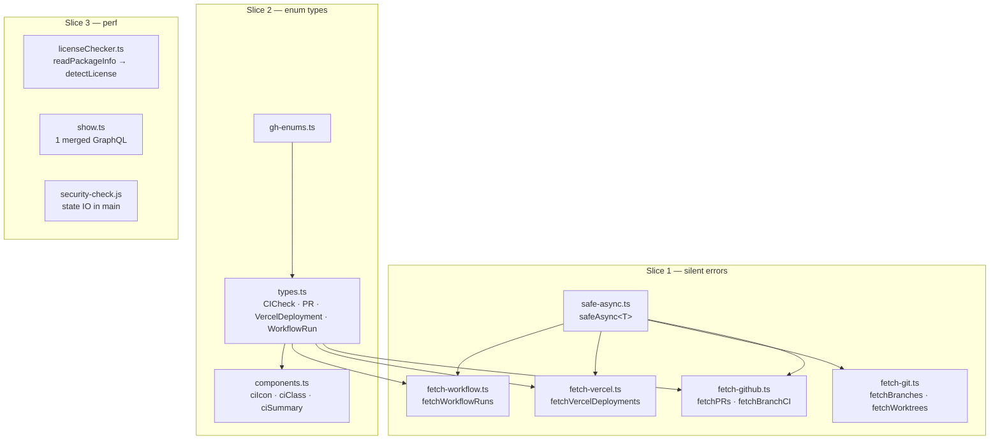
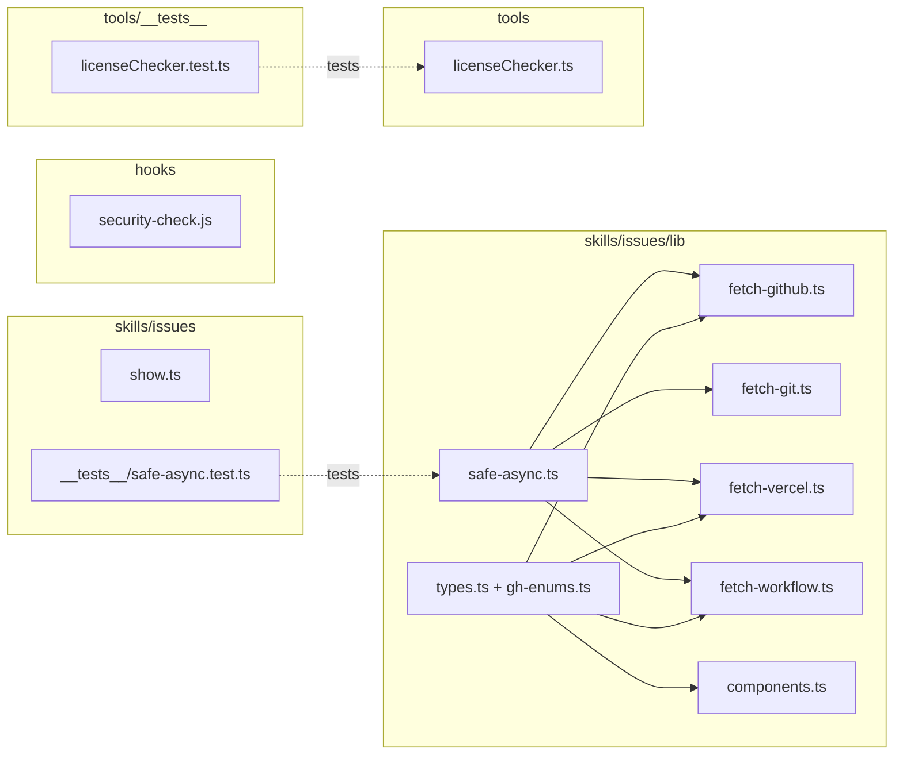

## Summary

Three independent dev-core cleanups: route 6 outer fetch catches through a new
`safeAsync<T>` helper (stderr-logged), replace 8 `string`-typed GitHub/Vercel/
workflow state fields with enum literal unions, and remove three redundant-IO
perf hotspots. Slices are file-disjoint where possible and individually
shippable.

## Architecture

### Data flow



### File × Function map



## Agents

| Agent instance | Tasks | Files |
|---|---|---|
| backend-dev-A | T1, T2, T4, T5 | `safe-async.ts` (new), `fetch-github.ts`, `fetch-git.ts`, `fetch-vercel.ts`, `fetch-workflow.ts`, `types.ts`, `gh-enums.ts` (new), `components.ts` |
| backend-dev-B | T6, T7, T8 | `tools/licenseChecker.ts`, `skills/issues/show.ts`, `hooks/security-check.js` |
| tester-A | T3, T9 | `skills/issues/__tests__/safe-async.test.ts` (new), `tools/__tests__/licenseChecker.test.ts` |

## Bootstrap Context

Ref patterns (read for conventions before writing):
- Test style: `plugins/dev-core/skills/issues/__tests__/topo-sort.test.ts`, `plugins/dev-core/tools/__tests__/licenseChecker.test.ts` (vitest, single quotes, no semicolons).
- Type style: `plugins/dev-core/skills/issues/lib/types.ts` (interfaces, exported).
- GraphQL exec: `plugins/dev-core/skills/issues/lib/gh-exec.ts` (`ghGraphQLExec`).
- vitest excludes `**/.claude/worktrees/**` and `**/cli/__tests__/**`; sets `GITHUB_REPO=Test/test-repo`.

## Wave Structure

2 waves, max 3 parallel agents. Elapsed ~1 session vs ~2 sequential.

| Wave | Trigger | Agents | Tasks |
|------|---------|--------|-------|
| 1 | start | 2 ∥ | backend-dev-A: T1 · backend-dev-B: T6, T7, T8 |
| 2 | Wave 1 done | 2 ∥ | backend-dev-A: T2→T4→T5 · tester-A: T3, T9 |

Slice 3 (B) is fully parallel with slices 1+2 (A) — disjoint file sets, zero shared state.

### Budget — per task

| Task | Items | Class | Est. ops | Split? |
|------|-------|-------|----------|--------|
| T1 create safe-async.ts | 1 | bounded | 2 | — |
| T2 convert 6 catches | 6 | judgmental | 6 | — |
| T3 safe-async test | 1 | bounded | 3 | — |
| T4 gh-enums + types.ts | 1 | judgmental | 5 | — |
| T5 reconcile consumers | 1 | judgmental | 6 | — |
| T6 licenseChecker reuse | 1 | judgmental | 5 | — |
| T7 show.ts merge GraphQL | 1 | judgmental | 4 | — |
| T8 security-check state | 1 | bounded | 3 | — |
| T9 extend licenseChecker test | 1 | judgmental | 4 | — |

**Total estimated ops: 38**

### Budget — per agent instance

| Instance | Tasks | Σ ops | Subjects | Split? |
|----------|-------|-------|----------|--------|
| backend-dev-A | T1, T2, T4, T5 | 19 | error-handling, types | — |
| backend-dev-B | T6, T7, T8 | 12 | perf | — |
| tester-A | T3, T9 | 7 | tests | — |

All instances ≤4 tasks, ≤2 subjects, ≤50 ops — no split required.

## Consistency Report

- Spec criteria covered: 8/8.
  - SC1 → T1, T3 · SC2 → T2 · SC3 → T4, T5 · SC4 → all (typecheck/lint/test) · SC5 → T6, T9 · SC6 → T7 · SC7 → T8 · SC8 → all.
- Uncovered criteria: none.
- Untraced tasks: none.
- Exemptions: T7 (show.ts) and T8 (security-check.js) verified by grep call-count / fixture run rather than a new unit test — both are I/O-shaped with output-identical guarantees; noted, not gaps.

## Micro-Tasks

### V1 — Silent errors

**T1 — Create `safeAsync<T>` helper** · backend-dev-A · RED→GREEN · diff 2
- File: `plugins/dev-core/skills/issues/lib/safe-async.ts` (new)
- Shape:
  ```ts
  export async function safeAsync<T>(fn: () => Promise<T>, fallback: T, context: string): Promise<T> {
    try {
      return await fn()
    } catch (err) {
      process.stderr.write(`[${context}] ${err instanceof Error ? err.message : String(err)}\n`)
      return fallback
    }
  }
  ```
- Verify: `bun run typecheck`
- Spec trace: SC1

**T2 — Route 6 outer catches through `safeAsync`** · backend-dev-A · GREEN · diff 3 · blockedBy T1
- Files: `fetch-github.ts` (`fetchPRs`, `fetchBranchCI`), `fetch-git.ts` (`fetchBranches`, `fetchWorktrees`), `fetch-vercel.ts` (`fetchVercelDeployments`), `fetch-workflow.ts` (`fetchWorkflowRuns`)
- Each: wrap the existing body in `safeAsync(async () => { ...body... }, [], 'fetchX')`. Do NOT touch the intentional inner guards in `fetchBuildLogs` / `getGitHubToken`.
- Verify: read the 6 functions — each delegates to `safeAsync` with a context tag; `bun run typecheck`
- Spec trace: SC2

**T3 — Unit test `safeAsync`** · tester-A · RED-GATE(V1) · diff 2 · blockedBy T1
- File: `plugins/dev-core/skills/issues/__tests__/safe-async.test.ts` (new)
- Cases: returns fn result on success; returns fallback + writes context-tagged line to stderr on throw (spy `process.stderr.write`).
- Verify: `bun run test safe-async`
- Spec trace: SC1

### V2 — Enum types

**T4 — Define enum unions + apply to `types.ts`** · backend-dev-A · REFACTOR · diff 3 · blockedBy T2
- Files: `plugins/dev-core/skills/issues/lib/gh-enums.ts` (new), `types.ts`
- Define the 8 unions (see spec Data Model table). Replace `string` on `CICheck.status`/`conclusion` (incl. `'' `), `PR.state`/`mergeable`, `VercelDeployment.state`, `WorkflowRun.status`/`conclusion`. Leave `BranchCI.overallState` as `string` (out of scope).
- Verify: `bun run typecheck`
- Spec trace: SC3

**T5 — Reconcile map sites + consumers** · backend-dev-A · REFACTOR · diff 4 · blockedBy T4
- Files: `fetch-github.ts`, `fetch-vercel.ts`, `fetch-workflow.ts` map sites; `components.ts` (`ciIcon`/`ciClass`/`ciSummary`)
- Ensure mapped values satisfy the unions (keep `?? ''` / `|| ''` fallbacks); keep consumer params `string`-compatible (union ⊆ string). Add a deliberately-invalid literal in a scratch check to confirm `tsc` rejects, then remove.
- Verify: `bun run typecheck && bun run lint`
- Spec trace: SC3, SC4

### V3 — Perf (parallel with V1/V2)

**T6 — licenseChecker single-read** · backend-dev-B · REFACTOR · diff 3
- File: `plugins/dev-core/tools/licenseChecker.ts`
- Extend `RawPackageInfo` with optional `license`/`licenses` extracted at parse time in `readPackageInfo` (keep defensive `Object.create(null)`). `detectLicense` consumes them; re-read only if absent.
- Verify: `bun run test licenseChecker`
- Spec trace: SC5

**T7 — show.ts merge GraphQL** · backend-dev-B · REFACTOR · diff 3
- File: `plugins/dev-core/skills/issues/show.ts`
- Merge the two `ghGraphQLExec` calls (subIssues + trackedInIssues) into one `repository{ issue{ subIssues{...} trackedInIssues{...} } }` query; destructure both from the single response.
- Verify: `grep -c 'ghGraphQLExec' plugins/dev-core/skills/issues/show.ts` → 1 (import line excluded — count call-sites); `bun run typecheck`
- Spec trace: SC6

**T8 — security-check.js state IO** · backend-dev-B · REFACTOR · diff 2
- File: `plugins/dev-core/hooks/security-check.js`
- Lift `loadState()`/`saveState()` to `main()`; pass `state` into `checkContent(content, path, state)`; track a dirty flag and call `saveState` only when a new warning was added.
- Verify: run hook with `CLAUDE_TOOL_INPUT` fixture containing a known secret pattern → blocks once, no state write on second clean run.
- Spec trace: SC7

**T9 — Extend licenseChecker test** · tester-A · RED-GATE(V3) · diff 3 · blockedBy T6
- File: `plugins/dev-core/tools/__tests__/licenseChecker.test.ts`
- Assert `package.json` read once per package (spy `readFileSync`) and `checkCompliance` output unchanged on a fixture tree.
- Verify: `bun run test licenseChecker`
- Spec trace: SC5

## Task Seeding Blueprint

<!-- Used by /implement to seed TaskCreate calls on session start.
     Format: T{n} | agent-instance | blockedBy | subject -->

### Wave 1 — no deps, 2 agents ∥

| Task | Agent instance | blockedBy | Subject |
|------|---------------|-----------|---------|
| T1 | backend-dev-A | — | error-handling |
| T6 | backend-dev-B | — | perf |
| T7 | backend-dev-B | — | perf |
| T8 | backend-dev-B | — | perf |

### Wave 2 — after Wave 1, 2 agents ∥

| Task | Agent instance | blockedBy | Subject |
|------|---------------|-----------|---------|
| T2 | backend-dev-A | T1 | error-handling |
| T4 | backend-dev-A | T2 | types |
| T5 | backend-dev-A | T4 | types |
| T3 | tester-A | T1 | tests |
| T9 | tester-A | T6 | tests |

## Task IDs

<!-- Generated by /plan. Used by /implement to resume tasks on session restart. -->
- T1: 13 — error-handling
- T2: 14 — error-handling
- T3: 15 — tests
- T4: 16 — types
- T5: 17 — types
- T6: 18 — perf
- T7: 19 — perf
- T8: 20 — perf
- T9: 21 — tests
