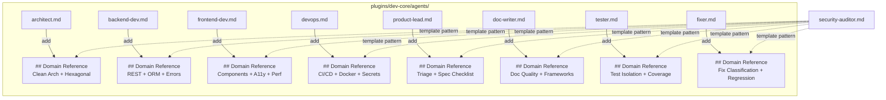

## Summary

Add a `## Domain Reference` section to each of the 8 non-security-auditor agents, using compressed notation (checklists, tables, anti-patterns) following the `security-auditor.md` pattern. Each section provides ≥30 lines of actionable fallback knowledge. All tasks are parallel-safe — no dependencies between files.

## Architecture

## Agents

| Agent | Tasks | Files |
|-------|-------|-------|
| doc-writer | 8 | `architect.md`, `backend-dev.md`, `frontend-dev.md`, `devops.md`, `product-lead.md`, `doc-writer.md`, `tester.md`, `fixer.md` |

## Consistency Report

- Covered: 12/12 success criteria
- SC-1 → T1 (architect), SC-2 → T2 (backend-dev), SC-3 → T3 (frontend-dev), SC-4 → T4 (devops)
- SC-5 → T5 (product-lead), SC-6 → T6 (doc-writer), SC-7 → T7 (tester), SC-8 → T8 (fixer)
- SC-9 (≤250 lines) → all tasks, SC-10 (fallback) → all tasks, SC-11 (unchanged behavior) → all tasks
- SC-12 (compressed notation) → all tasks
- Uncovered: 0, Untraced: 0

## Micro-Tasks

### Slice V1 — Core Architects

#### T1: architect.md — Domain Reference [P]
- **File:** `plugins/dev-core/agents/architect.md`
- **Agent:** doc-writer
- **Description:** Insert `## Domain Reference` between `## Boundaries` and `## Edge Cases`. Content: Clean Architecture layers + dependency rule, hexagonal patterns (ports/adapters/repository), domain model guidelines, anti-patterns to flag.
- **Spec trace:** SC-1, SC-9, SC-11, SC-12
- **Verify:** `wc -l plugins/dev-core/agents/architect.md` → ≤250; `grep -c "## Domain Reference" plugins/dev-core/agents/architect.md` → 1
- **Difficulty:** 2

#### T2: backend-dev.md — Domain Reference [P]
- **File:** `plugins/dev-core/agents/backend-dev.md`
- **Agent:** doc-writer
- **Description:** Insert `## Domain Reference` between `## Boundaries` and `## Edge Cases`. Content: RESTful conventions (status codes, resource naming, idempotency), ORM best practices (N+1, eager loading, transactions), domain exception → HTTP mapping table, error handling patterns.
- **Spec trace:** SC-2, SC-9, SC-11, SC-12
- **Verify:** `wc -l plugins/dev-core/agents/backend-dev.md` → ≤250; `grep -c "## Domain Reference" plugins/dev-core/agents/backend-dev.md` → 1
- **Difficulty:** 2

### Slice V2 — Interface Builders

#### T3: frontend-dev.md — Domain Reference [P]
- **File:** `plugins/dev-core/agents/frontend-dev.md`
- **Agent:** doc-writer
- **Description:** Insert `## Domain Reference` between `## Boundaries` and `## Edge Cases`. Content: component design (smart vs dumb, co-location), state management signals (local → shared → global), WCAG 2.1 AA baseline checklist, performance patterns (lazy loading, bundle splitting, image optimization).
- **Spec trace:** SC-3, SC-9, SC-11, SC-12
- **Verify:** `wc -l plugins/dev-core/agents/frontend-dev.md` → ≤250; `grep -c "## Domain Reference" plugins/dev-core/agents/frontend-dev.md` → 1
- **Difficulty:** 2

#### T4: devops.md — Domain Reference [P]
- **File:** `plugins/dev-core/agents/devops.md`
- **Agent:** doc-writer
- **Description:** Insert `## Domain Reference` between `## Boundaries` and `## Edge Cases`. Content: CI/CD pipeline stages + gate ordering, secret management rules, Docker best practices (multi-stage, non-root, layer caching), dependency update strategy (minor auto-merge, major manual).
- **Spec trace:** SC-4, SC-9, SC-11, SC-12
- **Verify:** `wc -l plugins/dev-core/agents/devops.md` → ≤250; `grep -c "## Domain Reference" plugins/dev-core/agents/devops.md` → 1
- **Difficulty:** 2

### Slice V3 — Process Owners

#### T5: product-lead.md — Domain Reference [P]
- **File:** `plugins/dev-core/agents/product-lead.md`
- **Agent:** doc-writer
- **Description:** Insert `## Domain Reference` between `## Boundaries` and `## Edge Cases`. Content: severity × impact triage matrix, spec completeness checklist (problem, constraints, criteria, out-of-scope), stakeholder escalation triggers, issue quality signals.
- **Spec trace:** SC-5, SC-9, SC-11, SC-12
- **Verify:** `wc -l plugins/dev-core/agents/product-lead.md` → ≤250; `grep -c "## Domain Reference" plugins/dev-core/agents/product-lead.md` → 1
- **Difficulty:** 2

#### T6: doc-writer.md — Domain Reference [P]
- **File:** `plugins/dev-core/agents/doc-writer.md`
- **Agent:** doc-writer
- **Description:** Insert `## Domain Reference` between `## Boundaries` and `## Edge Cases`. Content: documentation quality checklist, cross-reference validation rules, framework-specific patterns (MDX, Fumadocs, Docusaurus), API documentation standards.
- **Spec trace:** SC-6, SC-9, SC-11, SC-12
- **Verify:** `wc -l plugins/dev-core/agents/doc-writer.md` → ≤250; `grep -c "## Domain Reference" plugins/dev-core/agents/doc-writer.md` → 1
- **Difficulty:** 2

### Slice V4 — Quality Enforcers

#### T7: tester.md — Domain Reference [P]
- **File:** `plugins/dev-core/agents/tester.md`
- **Agent:** doc-writer
- **Description:** Insert `## Domain Reference` between `## Boundaries` and `## Edge Cases`. Content: test isolation patterns, mock boundary rules (what to mock vs real), coverage anti-patterns, flaky test classification + remediation, test naming conventions.
- **Spec trace:** SC-7, SC-9, SC-11, SC-12
- **Verify:** `wc -l plugins/dev-core/agents/tester.md` → ≤250; `grep -c "## Domain Reference" plugins/dev-core/agents/tester.md` → 1
- **Difficulty:** 2

#### T8: fixer.md — Domain Reference [P]
- **File:** `plugins/dev-core/agents/fixer.md`
- **Agent:** doc-writer
- **Description:** Insert `## Domain Reference` between `## Boundaries` and `## Edge Cases`. Content: fix classification (cosmetic vs behavioral vs security), scope violation detection rules, regression risk signals, minimal-change principle checklist.
- **Spec trace:** SC-8, SC-9, SC-11, SC-12
- **Verify:** `wc -l plugins/dev-core/agents/fixer.md` → ≤250; `grep -c "## Domain Reference" plugins/dev-core/agents/fixer.md` → 1
- **Difficulty:** 2

### Reference Pattern

All `## Domain Reference` sections follow `security-auditor.md` structure:
- Compressed notation (`¬`, `∃`, `→`, `∀`)
- Structured checklists (bullets with bold category + specific items)
- Tables for classification/severity matrices
- Concrete examples of what to flag vs what to ignore
- Anti-patterns list with explanations

### Placement Rule

Insert `## Domain Reference` **after** the last of `## Deliverables` / `## Boundaries` / `## Workflow` / `## Auto-Apply Rules` (whichever comes last in the file) and **before** `## Edge Cases`.
