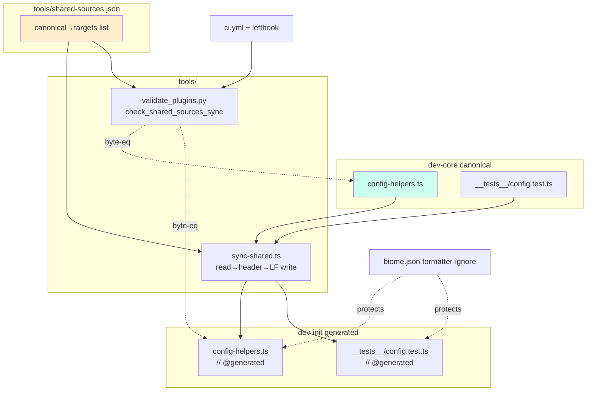
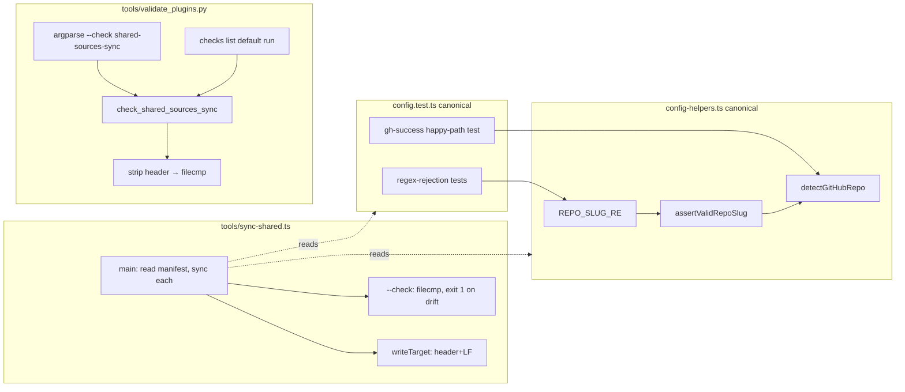

## Summary

Collapse the two `config-helpers.ts` (+ their `config.test.ts`) into one dev-core canonical
source synced into dev-init via `tools/sync-shared.ts`, gated by a `validate_plugins.py`
byte-equality check; fold in the residual regex tighten, test hygiene, happy-path coverage,
and docs. 12 micro-tasks, 5 agent instances, 3 waves.

## Architecture

### Data flow

### File × Function map

## Agents

| Agent instance | Type | Tasks | Files |
|----------------|------|-------|-------|
| devops-A | devops | T1,T2,T3,T4 | `tools/shared-sources.json`, `tools/sync-shared.ts`, `package.json`, `.gitattributes`, `biome.json`, generated copies |
| backend-dev-A | backend-dev | T5 | `plugins/dev-core/skills/shared/adapters/config-helpers.ts` |
| tester-A | tester | T6,T7,T8 | `plugins/dev-core/skills/shared/__tests__/config.test.ts` |
| doc-writer-A | doc-writer | T9 | `CLAUDE.md`, `docs/plugin-cache.md` |
| devops-B | devops | T10,T11,T12 | generated copies, `tools/validate_plugins.py`, `.github/workflows/ci.yml` |

## Wave Structure

3 waves, max 3 parallel agents. Elapsed ~1 day vs ~2 days sequential.

| Wave | Trigger | Agents | Tasks |
|------|---------|--------|-------|
| 1 | start | 1 | devops-A: T1→T2→T3→T4 |
| 2 | Wave 1 done | 3 ∥ | backend-dev-A: T5 · tester-A: T6, T7, T8(→T5) · doc-writer-A: T9 |
| 3 | Wave 2 done | 1 | devops-B: T10→T11→T12 |

### Budget — per task

| Task | Items | Class | Est. ops | Split? |
|------|-------|-------|----------|--------|
| T1 manifest | 1 | bounded | 3 | — |
| T2 sync-shared.ts | 1 | judgmental | 6 | — |
| T3 script+gitattributes+biome | 3 | judgmental | 6 | — |
| T4 run+verify | 1 | bounded | 4 | — |
| T5 regex tighten | 1 | trivial | 2 | — |
| T6 test hygiene | 1 | judgmental | 5 | — |
| T7 happy-path test | 1 | judgmental | 5 | — |
| T8 regex-rejection tests | 1 | bounded | 3 | — |
| T9 docs | 2 | judgmental | 6 | — |
| T10 re-sync | 1 | trivial | 2 | — |
| T11 validate_plugins check | 1 | judgmental | 6 | — |
| T12 ci.yml + gate verify | 1 | judgmental | 6 | — |

**Total estimated ops: 54**

### Budget — per agent instance

| Instance | Tasks | Σ ops | Subjects | Split? |
|----------|-------|-------|----------|--------|
| devops-A | T1,T2,T3,T4 | 19 | sync-infra | — |
| backend-dev-A | T5 | 2 | regex | — |
| tester-A | T6,T7,T8 | 13 | test-hygiene | — |
| doc-writer-A | T9 | 6 | docs | — |
| devops-B | T10,T11,T12 | 14 | ci-gate | — |

All instances ≤4 tasks, ≤2 subjects, <50 ops. No splits required.

## Consistency Report

Covered: 13/13 spec success criteria. Untraced tasks: 0. Exemptions: none.

| Spec criterion | Task(s) |
|----------------|---------|
| shared-sources.json single SSoT | T1 |
| sync-shared.ts + header + LF | T2, T3 |
| dev-init = canonical+header (both files) | T4, T10 |
| `--check` exits 0/1 | T2, T4 |
| biome ignores generated + .gitattributes LF | T3 |
| validate_plugins check + alias, fail on drift/missing | T11 |
| ci.yml `--check shared-sources-sync` + lefthook | T12 |
| REPO_SLUG_RE = cwd-resolver form | T5, T8 |
| no execSyncSpy / vi.mock child_process | T6 |
| env-var test no shadow/coercion | T6 |
| gh-success happy-path test | T7 |
| CLAUDE.md + plugin-cache.md docs | T9 |
| lint/typecheck/test/validate green, no API change | T4, T10, T12 |

## Micro-Tasks

### Slice 1 — canonical + manifest + sync + guards (devops-A, Wave 1)

**T1 — Create sync manifest** · `tools/shared-sources.json`
- Snippet: array of `{canonical, targets[]}` for `config-helpers.ts` and `config.test.ts` (see spec D2).
- Verify: `bun -e "console.log(require('./tools/shared-sources.json').length)"` → `2`
- Phase: GREEN · Difficulty 1 · Spec: D2

**T2 — Write sync-shared.ts** · `tools/sync-shared.ts` · blockedBy T1
- Snippet: read manifest (`with { type: 'json' }`); for each canonical→target, read canonical, prepend `// @generated` header, write LF; `--check` flag compares (header-stripped) and exits 1 on drift naming the file + `bun run sync:shared`.
- Verify: `bun run tools/sync-shared.ts --check; echo $?`
- Phase: GREEN · Difficulty 3 · Spec: sync-shared, --check

**T3 — Wire script + biome + gitattributes** · `package.json`, `.gitattributes`, `biome.json` · blockedBy T2
- Snippet: `package.json` add `"sync:shared": "bun run tools/sync-shared.ts"`; `.gitattributes` add `*.ts text eol=lf`; `biome.json` add generated target paths to formatter ignore (overrides/negated include).
- Verify: `grep sync:shared package.json && grep eol=lf .gitattributes`
- Phase: GREEN · Difficulty 2 · Spec: D3, biome/LF

**T4 — Initial sync + green-gate** · generated copies · blockedBy T3 · RED-GATE
- Run `bun run sync:shared`; confirm dev-init copies = canonical + header (cosmetic divergences overwritten, not merged); `bun run lint` does NOT modify generated copy; `bun run typecheck && bun run test` green; `bun run sync:shared --check` exits 0.
- Verify: `bun run sync:shared --check && bun run typecheck && bun run test`
- Phase: RED-GATE · Difficulty 2

### Slice 3 — regex tighten (backend-dev-A, Wave 2)

**T5 — Tighten REPO_SLUG_RE** · canonical `config-helpers.ts` · blockedBy T4
- Snippet: `const REPO_SLUG_RE = /^[A-Za-z0-9][A-Za-z0-9._-]*\/[A-Za-z0-9][A-Za-z0-9._-]*$/` (matches `cli/lib/cwd-resolver.ts:6`). Do NOT touch dev-init copy directly (synced in T10).
- Verify: `grep -n 'REPO_SLUG_RE =' plugins/dev-core/skills/shared/adapters/config-helpers.ts`
- Phase: GREEN · Difficulty 1 · Spec: D5

### Slice 4 — test hygiene + coverage (tester-A, Wave 2)

**T6 — Remove dead mock + fix env-var test** · canonical `config.test.ts` · blockedBy T4
- Remove `execSyncSpy` decl/setup/restore + `vi.mock('node:child_process')` block (sources are Bun.spawnSync-only). Fix `throws when no env var` test: drop inner self-shadowed `originalEnv` + `process.env.GITHUB_REPO = undefined`; rely on describe-level `beforeEach`/`afterEach`.
- Verify: `! grep -q "execSyncSpy\|node:child_process" plugins/dev-core/skills/shared/__tests__/config.test.ts`
- Phase: REFACTOR · Difficulty 3 · Spec: 2a, 2b

**T7 — Add gh-success happy-path test** · canonical `config.test.ts` · blockedBy T4
- Add a test asserting `detectGitHubRepo()` returns a valid `owner/repo` slug via the `gh repo view` (tier-3) branch when env/yaml absent and `Bun.spawnSync` succeeds (mock `Bun.spawnSync`).
- Verify: `bun run test plugins/dev-core/skills/shared/__tests__/config.test.ts`
- Phase: GREEN · Difficulty 3 · Spec: 3c

**T8 — Add regex-rejection tests** · canonical `config.test.ts` · blockedBy T5
- Add cases asserting the tightened `REPO_SLUG_RE` rejects `.foo/bar`, `-x/y`, `a/.b`, `a/-b`, and still accepts `Roxabi/roxabi-plugins`, `a.b/c.d`.
- Verify: `bun run test plugins/dev-core/skills/shared/__tests__/config.test.ts`
- Phase: GREEN · Difficulty 2 · Spec: D5

### Slice 5 — docs (doc-writer-A, Wave 2)

**T9 — Document sync convention** · `CLAUDE.md`, `docs/plugin-cache.md` · blockedBy T4
- CLAUDE.md "Editing Plugins (invariants)": add a bullet — shared-source files (`config-helpers.ts`, `config.test.ts`) require `bun run sync:shared` before commit; generated copies carry `// @generated` and must not be hand-edited. `docs/plugin-cache.md`: add a section distinguishing repo-source TS sync (canonical→generated via `sync-shared.ts`) from the SDK cache sync.
- Verify: `grep -q 'sync:shared' CLAUDE.md && grep -qi 'generated' docs/plugin-cache.md`
- Phase: GREEN · Difficulty 2 · Spec: docs

### Slice 2 — re-sync + drift gate (devops-B, Wave 3)

**T10 — Re-sync after canonical edits** · generated copies · blockedBy T5,T6,T7,T8
- Run `bun run sync:shared` so dev-init copies reflect T5–T8; `bun run test` green for both plugins.
- Verify: `bun run sync:shared --check && bun run test`
- Phase: GREEN · Difficulty 1

**T11 — Add drift check to validate_plugins.py** · `tools/validate_plugins.py` · blockedBy T10
- Add `check_shared_sources_sync()` (read manifest, strip header, `filecmp`; missing target → exit-1 message modeled on `check_vendored_paths`). Register in `checks` list + add `shared-sources-sync` to argparse `choices` + dispatch block.
- Verify: `python3 tools/validate_plugins.py --check shared-sources-sync; echo $?` → `0`; then tamper a generated copy → exit `1`.
- Phase: GREEN · Difficulty 3 · Spec: gate

**T12 — Wire CI + verify gate end-to-end** · `.github/workflows/ci.yml` · blockedBy T11
- Add step `python3 tools/validate_plugins.py --check shared-sources-sync` after the existing class-list-sync step. Confirm lefthook `taxonomy-sync` (bare run) also enforces it via the `checks` list. Verify: drift a copy → `python3 tools/validate_plugins.py` exits 1; re-sync → passes.
- Verify: `python3 tools/validate_plugins.py` (full run) exits 0 when synced
- Phase: RED-GATE · Difficulty 3 · Spec: ci wiring

## Task Seeding Blueprint

<!-- Used by /implement to seed TaskCreate calls. T-numbers ref this list, not session task IDs. -->

### Wave 1 — no deps, 1 agent

| Task | Agent instance | blockedBy | Subject |
|------|---------------|-----------|---------|
| T1 | devops-A | — | sync-infra |
| T2 | devops-A | T1 | sync-infra |
| T3 | devops-A | T2 | sync-infra |
| T4 | devops-A | T3 | sync-infra |

### Wave 2 — after T4, 3 agents ∥

| Task | Agent instance | blockedBy | Subject |
|------|---------------|-----------|---------|
| T5 | backend-dev-A | T4 | regex |
| T6 | tester-A | T4 | test-hygiene |
| T7 | tester-A | T4 | test-hygiene |
| T8 | tester-A | T5 | test-hygiene |
| T9 | doc-writer-A | T4 | docs |

### Wave 3 — after T5,T6,T7,T8, 1 agent

| Task | Agent instance | blockedBy | Subject |
|------|---------------|-----------|---------|
| T10 | devops-B | T5,T6,T7,T8 | ci-gate |
| T11 | devops-B | T10 | ci-gate |
| T12 | devops-B | T11 | ci-gate |

## Task IDs

<!-- Generated by /plan. Used by /implement to resume tasks on session restart. -->
- T1: 12 — sync-infra (devops-A)
- T2: 13 — sync-infra (devops-A)
- T3: 14 — sync-infra (devops-A)
- T4: 15 — sync-infra (devops-A)
- T5: 16 — regex (backend-dev-A)
- T6: 17 — test-hygiene (tester-A)
- T7: 18 — test-hygiene (tester-A)
- T8: 19 — test-hygiene (tester-A)
- T9: 20 — docs (doc-writer-A)
- T10: 21 — ci-gate (devops-B)
- T11: 22 — ci-gate (devops-B)
- T12: 23 — ci-gate (devops-B)

## Scope Correction (post-#215/#217, 2026-05-31)

**T5 (tighten REPO_SLUG_RE) and T8 (regex-rejection tests) are CANCELLED** — already shipped by
PR #217 (8c6d406). Seeded Claude Code tasks #16 (T5) and #19 (T8) were deleted.

**Remaining active tasks:** T1–T4 (sync infra + initial sync), T6 (remove dead `execSyncSpy` +
fix env-var self-shadow — still valid; sources are Bun.spawnSync-only), T7 (gh-CLI-**success**
happy-path test — still uncovered; #217 only added git-remote-fallback tests where `gh` fails),
T9 (docs), T10–T12 (re-sync, `validate_plugins.py` gate, CI).

**Updated wave structure:**
- Wave 1 = T1→T2→T3→T4 (devops-A, sequential) — unchanged
- Wave 2 = T6, T7 (tester-A) ∥ T9 (doc-writer-A) — `backend-dev-A` instance dropped (T5 gone); T8 dropped from tester-A
- Wave 3 = T10→T11→T12 (devops-B) — T10 now blocked only by T6, T7 (¬T5, ¬T8)

**Agent table delta:** remove `backend-dev-A` row. tester-A tasks = T6, T7 only.

**Budget delta:** −5 ops (T5: 2, T8: 3). New total: ~49 ops.
