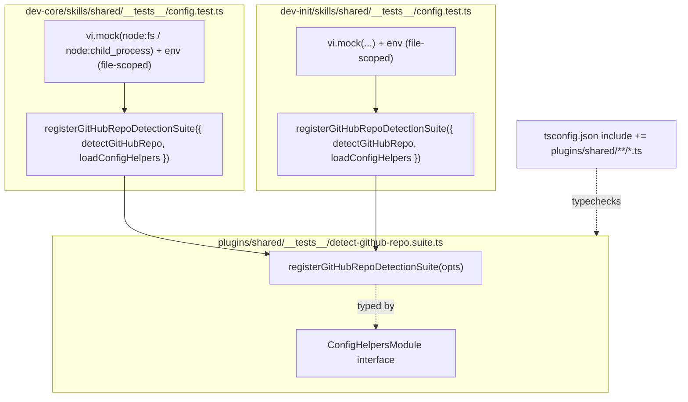
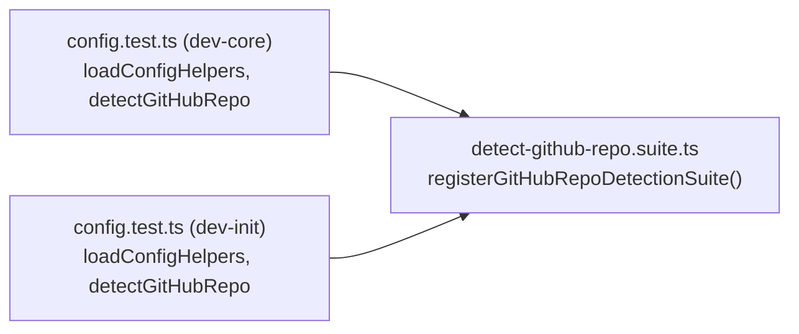

## Summary

Extract the byte-identical 259-line repo-detection test region (lines 255–513) from both
`config.test.ts` files into a parameterized vitest suite factory
`plugins/shared/__tests__/detect-github-repo.suite.ts`, wire both files to call it, and bring the
new module under typecheck. Existing tests are the safety net — behavior must be unchanged.

## Architecture

Data flow:



File × function map:



## Agents

| Agent | Instance | Task count | Files |
|-------|----------|-----------|-------|
| tester | tester-A | 5 | new suite, both config.test.ts, tsconfig.json |

Single cohesive test-domain change → one `tester` instance. Subjects: `test-dedup`, `tsconfig` (≤2, no split).

## Wave Structure

3 waves, 1 agent (sequential — shared safety-net file edits, small surface). Elapsed ~minutes.

| Wave | Trigger | Agents | Tasks |
|------|---------|--------|-------|
| 1 | start | tester-A | T1 (create suite factory) |
| 2 | Wave 1 done | tester-A | T2 (wire dev-core) → T3 (tsconfig) → T4 (wire dev-init) |
| 3 | Wave 2 done | tester-A | T5 (RED-GATE: verify all green + diff empty) |

### Budget — per task

| Task | Items | Class | Est. ops | Split? |
|------|-------|-------|----------|--------|
| T1 create suite factory | 1 | judgmental | 5 | — |
| T2 wire dev-core | 1 | bounded | 3 | — |
| T3 tsconfig include | 1 | trivial | 2 | — |
| T4 wire dev-init | 1 | bounded | 3 | — |
| T5 verify gate | 1 | bounded | 4 | — |

**Total estimated ops: 17**

### Budget — per agent instance

| Instance | Tasks | Σ ops | Subjects | Split? |
|----------|-------|-------|----------|--------|
| tester-A | T1–T5 | 17 | test-dedup, tsconfig | — |

## Consistency Report

- Success criteria covered: 8/8.
  - SC1 (suite exists/exports) → T1
  - SC2 (no inline blocks) → T2, T4
  - SC3 (files identical) → T2, T4, T5
  - SC4 (tests pass, count unchanged) → T5
  - SC5 (typecheck) → T3, T5
  - SC6 (biome) → T5
  - SC7 (config-helpers unchanged) → invariant (no task touches it)
  - SC8 (mocks/env stay per-file) → T1 (factory excludes them), T2, T4
- Uncovered: none. Untraced tasks: none.

## Micro-Tasks

### Wave 1 — V1

**T1 — Create the shared suite factory** · `[P:N]` · tester-A · subject: test-dedup · SC1/SC8 · REFACTOR · diff 4/5

- File: `plugins/shared/__tests__/detect-github-repo.suite.ts` (new)
- Shape:
  ```ts
  import { afterEach, beforeEach, describe, expect, it, vi } from 'vitest'

  interface ConfigHelpersModule {
    GH_PROJECT_ID: string
    detectGitHubRepo: () => string
  }

  export function registerGitHubRepoDetectionSuite(opts: {
    detectGitHubRepo: () => string
    loadConfigHelpers: () => Promise<ConfigHelpersModule>
  }) {
    const { detectGitHubRepo, loadConfigHelpers } = opts

    describe('gh_project_id auto-detect', () => {
      // ...verbatim body; replace `await import('../adapters/config-helpers')`
      //    with `await loadConfigHelpers()`
    })

    describe('detectGitHubRepo', () => {
      // ...verbatim body; uses injected detectGitHubRepo
    })
  }
  ```
- Source: copy lines 255–513 of either `config.test.ts` verbatim into the two `describe` blocks;
  the ONLY substitutions are `await import('../adapters/config-helpers')` → `await loadConfigHelpers()`
  (2 occurrences in block 1) and relying on the injected `detectGitHubRepo`.
- Verify: `bunx tsc --noEmit` (after T3) and `test -f plugins/shared/__tests__/detect-github-repo.suite.ts`
- Expected: file exists, exports `registerGitHubRepoDetectionSuite`.

### Wave 2 — V1 + V2

**T2 — Wire dev-core config.test.ts** · `[P:N]` · tester-A · subject: test-dedup · SC2/SC3/SC8 · REFACTOR · diff 2/5

- File: `plugins/dev-core/skills/shared/__tests__/config.test.ts`
- Add import near top: `import { registerGitHubRepoDetectionSuite } from '../../../../shared/__tests__/detect-github-repo.suite'`
- Replace lines 255–513 (the two `describe` blocks) with:
  ```ts
  registerGitHubRepoDetectionSuite({
    detectGitHubRepo,
    loadConfigHelpers: () => import('../adapters/config-helpers'),
  })
  ```
- Keep the file-scoped `vi.mock(...)`, `process.env` preamble, and static imports unchanged.
- Verify: `grep -c "describe('gh_project_id auto-detect'\|describe('detectGitHubRepo'" plugins/dev-core/skills/shared/__tests__/config.test.ts`
- Expected: `0`.

**T3 — Add plugins/shared to tsconfig include** · `[P:Y]` · tester-A · subject: tsconfig · SC5 · REFACTOR · diff 1/5

- File: `tsconfig.json`
- Add `"plugins/shared/**/*.ts"` to the `include` array.
- Verify: `bunx tsc --noEmit`
- Expected: exit 0 (new suite typechecked).

**T4 — Wire dev-init config.test.ts** · `[P:Y]` (vs T2/T3, different files) · tester-A · subject: test-dedup · SC2/SC3/SC8 · REFACTOR · diff 2/5

- File: `plugins/dev-init/skills/shared/__tests__/config.test.ts`
- Identical edit to T2 (same import path `../../../../shared/__tests__/detect-github-repo.suite`, same factory call).
- Verify: `grep -c "describe('gh_project_id auto-detect'\|describe('detectGitHubRepo'" plugins/dev-init/skills/shared/__tests__/config.test.ts`
- Expected: `0`.

### Wave 3 — RED-GATE

**T5 — Verify gate** · `[P:N]` · tester-A · subject: test-dedup · SC3/SC4/SC5/SC6 · RED-GATE · diff 2/5

- Verify (all must pass):
  - `bun run test` → both config suites green, `it` count for the two blocks unchanged vs pre-change.
  - `bunx tsc --noEmit` → exit 0.
  - `bunx biome check .` → exit 0.
  - `diff plugins/dev-init/skills/shared/__tests__/config.test.ts plugins/dev-core/skills/shared/__tests__/config.test.ts` → empty.
  - `git diff --stat -- '*config-helpers.ts'` → empty (impl untouched).
- Expected: all pass.

## Task Seeding Blueprint

<!-- Used by /implement to seed TaskCreate calls. T-numbers ref this list, not session IDs. -->

### Wave 1 — no deps, 1 agent

| Task | Agent instance | blockedBy | Subject |
|------|---------------|-----------|---------|
| T1 | tester-A | — | test-dedup |

### Wave 2 — after T1, 1 agent (T2→T3→T4 chained)

| Task | Agent instance | blockedBy | Subject |
|------|---------------|-----------|---------|
| T2 | tester-A | T1 | test-dedup |
| T3 | tester-A | T1 | tsconfig |
| T4 | tester-A | T1 | test-dedup |

### Wave 3 — after Wave 2

| Task | Agent instance | blockedBy | Subject |
|------|---------------|-----------|---------|
| T5 | tester-A | T2,T3,T4 | test-dedup |

## Task IDs

<!-- Generated by /plan. Used by /implement to resume tasks on session restart. -->
- T1: 12 — test-dedup (create suite factory)
- T2: 13 — test-dedup (wire dev-core)
- T3: 14 — tsconfig (include plugins/shared)
- T4: 15 — test-dedup (wire dev-init)
- T5: 16 — test-dedup (RED-GATE verify)
