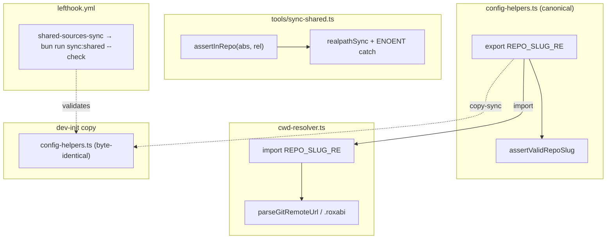
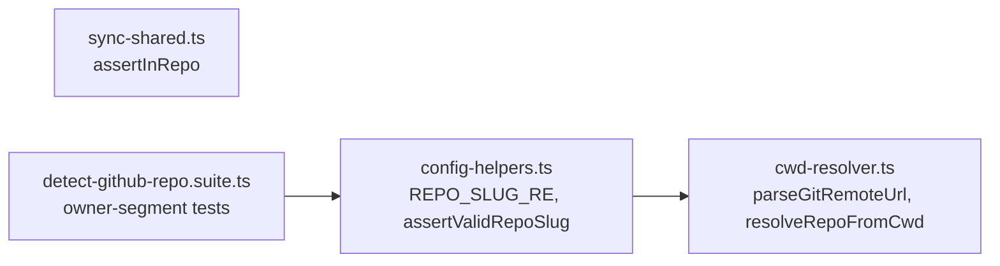

## Summary

Close three deferred parity gaps from #214: (1) symlink-deref `assertInRepo` in `sync-shared.ts`, (2) single-source `REPO_SLUG_RE` (export from `config-helpers.ts`, import in `cwd-resolver.ts`), (3) a bun-native `shared-sources-sync` lefthook hook. Three independent slices, mechanical.

## Architecture





## Agents

| Agent instance | Tasks | Files |
|---|---|---|
| backend-dev-A | T1, T2, T3, T4 | tools/sync-shared.ts, plugins/dev-core/skills/shared/adapters/config-helpers.ts, plugins/dev-core/cli/lib/cwd-resolver.ts, (sync run) |
| tester-A | T5 | plugins/shared/__tests__/detect-github-repo.suite.ts |
| devops-A | T6 | lefthook.yml |

## Wave Structure

3 waves, max 2 parallel agents. Elapsed ~1 short session vs ~1 sequential (small).

| Wave | Trigger | Agents | Tasks |
|------|---------|--------|-------|
| 1 | start | 2 ∥ | backend-dev-A: T1→T2 · devops-A: T6 |
| 2 | Wave 1 done | 1 | backend-dev-A: T3→T4 |
| 3 | Wave 2 done | 1 | tester-A: T5 |

### Budget — per task

| Task | Items | Class | Est. ops | Split? |
|------|-------|-------|----------|--------|
| T1 | 1 | judgmental | 5 | — |
| T2 | 1 | bounded | 3 | — |
| T3 | 1 | bounded | 3 | — |
| T4 | 1 | trivial | 2 | — |
| T5 | 1 | judgmental | 5 | — |
| T6 | 1 | bounded | 3 | — |

**Total estimated ops: ~21**

### Budget — per agent instance

| Instance | Tasks | Σ ops | Subjects | Split? |
|----------|-------|-------|----------|--------|
| backend-dev-A | T1, T2, T3, T4 | 13 | symlink, regex | — |
| tester-A | T5 | 5 | regex | — |
| devops-A | T6 | 3 | hook | — |

## Consistency Report

Covered: 7/7 success criteria. Untraced tasks: 0. Exemptions: none.

- SC1, SC2 → T1
- SC3 → T2, T3
- SC4 → T4
- SC5 → T5
- SC6 → T6
- SC7 → all (validate gate)

## Micro-Tasks

### Slice V1 — symlink deref parity

**T1** — `realpathSync` deref in `assertInRepo` (both call sites)
- File: `tools/sync-shared.ts`
- Shape: in `assertInRepo`, resolve real path: `let real = abs; try { real = realpathSync(abs) } catch (e) { if (e.code !== 'ENOENT') throw }` then run the existing containment check on `real`. Import `realpathSync` from `node:fs`.
- Verify: `bun run typecheck && bun run sync:shared --check`
- Expected: typecheck clean; check exits 0 (no drift). Out-of-repo symlink would throw `Refusing path outside repo`.
- Agent: backend-dev-A · Subject: symlink · Spec trace: SC1, SC2 · Phase: GREEN · Difficulty: 3 · `[P]`

### Slice V2 — regex single-source + copy-sync + tests

**T2** — export canonical `REPO_SLUG_RE`
- File: `plugins/dev-core/skills/shared/adapters/config-helpers.ts`
- Shape: `export const REPO_SLUG_RE = /^[A-Za-z0-9][A-Za-z0-9-]*\/[A-Za-z0-9][A-Za-z0-9._-]*$/` (was `/^[A-Za-z0-9-]+\/[A-Za-z0-9._-]+$/`, line 98). Update the doc-comment to describe the leading-alphanumeric rule.
- Verify: `bun run typecheck`
- Expected: clean.
- Agent: backend-dev-A · Subject: regex · Spec trace: SC3 · Phase: GREEN · Difficulty: 2 · `[P]`

**T3** — import in cwd-resolver, delete local const
- File: `plugins/dev-core/cli/lib/cwd-resolver.ts`
- Shape: `import { REPO_SLUG_RE } from '../../skills/shared/adapters/config-helpers'`; delete local `const REPO_SLUG_RE` (line 6). Keep the explanatory comment, point it at the canonical.
- Verify: `bun run typecheck && grep -c 'const REPO_SLUG_RE' plugins/dev-core/cli/lib/cwd-resolver.ts`
- Expected: typecheck clean; grep count 0.
- Agent: backend-dev-A · Subject: regex · Spec trace: SC3 · Phase: GREEN · Difficulty: 2 · blockedBy: T2

**T4** — re-sync dev-init copy
- File: `plugins/dev-init/skills/shared/adapters/config-helpers.ts` (generated)
- Shape: run `bun run sync:shared`
- Verify: `bun run sync:shared --check`
- Expected: exits 0, "All shared sources are in sync."
- Agent: backend-dev-A · Subject: regex · Spec trace: SC4 · Phase: GREEN · Difficulty: 1 · blockedBy: T2,T3

**T5** — extend owner-segment tests
- File: `plugins/shared/__tests__/detect-github-repo.suite.ts`
- Shape: add a test asserting a leading-special-char owner/name (e.g. `-bad/repo`, `owner/-bad`) throws `Expected "owner/repo" format`. Confirm existing dot/underscore-owner rejection + `my.repo_name` acceptance + numeric-only still pass.
- Verify: `bun run test`
- Expected: full suite green incl. new case.
- Agent: tester-A · Subject: regex · Spec trace: SC5 · Phase: RED-GATE · Difficulty: 3 · blockedBy: T3,T4

### Slice V3 — scoped lefthook hook

**T6** — add `shared-sources-sync` hook
- File: `lefthook.yml`
- Shape: under `pre-commit.commands`, add:
  ```yaml
  shared-sources-sync:
    run: bun run sync:shared --check
    glob: "**/skills/shared/adapters/config-helpers.ts"
  ```
- Verify: stage a shared-source file edit and run the hook locally; `grep -A2 shared-sources-sync lefthook.yml`
- Expected: hook present; fires on shared-source edits without `.venv`.
- Agent: devops-A · Subject: hook · Spec trace: SC6 · Phase: GREEN · Difficulty: 2 · `[P]`

## Task Seeding Blueprint

<!-- Used by /implement to seed TaskCreate calls on session start.
     Format: T{n} | agent-instance | blockedBy | subject -->

### Wave 1 — no deps, 2 agents ∥

| Task | Agent instance | blockedBy | Subject |
|------|---------------|-----------|---------|
| T1 | backend-dev-A | — | symlink |
| T2 | backend-dev-A | — | regex |
| T6 | devops-A | — | hook |

### Wave 2 — after Wave 1, 1 agent

| Task | Agent instance | blockedBy | Subject |
|------|---------------|-----------|---------|
| T3 | backend-dev-A | T2 | regex |
| T4 | backend-dev-A | T2,T3 | regex |

### Wave 3 — after Wave 2, 1 agent

| Task | Agent instance | blockedBy | Subject |
|------|---------------|-----------|---------|
| T5 | tester-A | T3,T4 | regex |

## Task IDs

<!-- Generated by /plan. Used by /implement to resume tasks on session restart. -->
- T1: 11 — symlink (backend-dev-A)
- T2: 12 — regex (backend-dev-A)
- T3: 13 — regex (backend-dev-A)
- T4: 14 — regex (backend-dev-A)
- T5: 15 — regex (tester-A)
- T6: 16 — hook (devops-A)
