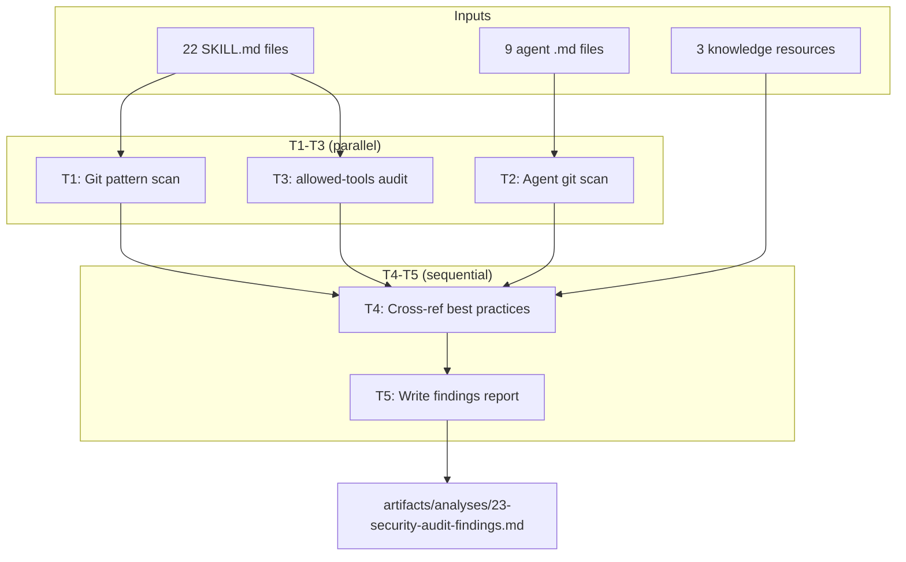
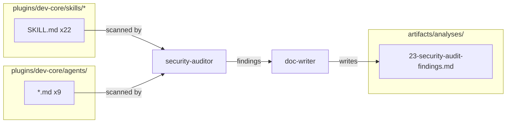

## Summary

Audit all 22 dev-core skills and 9 agents for dangerous git patterns, allowed-tools excess, and compliance with Claude Code security best practices. Produce a structured findings report.

## Architecture

## Agents

| Agent | Tasks | Files |
|-------|-------|-------|
| security-auditor | T1, T2, T3, T4 | `plugins/dev-core/skills/*/SKILL.md`, `plugins/dev-core/agents/*.md` |
| doc-writer | T5 | `artifacts/analyses/23-security-audit-findings.md` |

## Consistency Report

| Metric | Value |
|--------|-------|
| Spec criteria covered | 4/9 (S1 covers SC-1, SC-2, SC-6, SC-9; SC-3..5,7..9 are S2) |
| Uncovered (deferred to S2) | SC-3, SC-4, SC-5, SC-7, SC-8 (fix/template/docs tasks) |
| Untraced tasks | 0 |

## Micro-Tasks

### T1 — Scan skills for dangerous git patterns [P]
- **Agent:** security-auditor
- **Description:** Grep all 22 SKILL.md files for: `--no-verify`, `--force`, `--hard`, `--amend`, `git push`, `gh pr merge`, `git branch -D`, `git reset`. Record: skill name, pattern, line number, whether AskUserQuestion gate exists before the pattern.
- **Files:** `plugins/dev-core/skills/*/SKILL.md`
- **Verify:** `grep -rn '\-\-no-verify\|--force\|--hard\|--amend\|git push\|gh pr merge\|git branch -D\|git reset' plugins/dev-core/skills/*/SKILL.md | wc -l`
- **Expected output:** Count of pattern matches (baseline for comparison after S2 fixes)
- **Spec trace:** SC-1
- **Difficulty:** 2

### T2 — Scan agents for git command usage [P]
- **Agent:** security-auditor
- **Description:** Grep all 9 agent definition files for any `git` or `gh` command usage. Agents should not execute git commands directly.
- **Files:** `plugins/dev-core/agents/*.md`
- **Verify:** `grep -rn 'git \|gh ' plugins/dev-core/agents/*.md | wc -l`
- **Expected output:** 0 matches (agents delegate to skills)
- **Spec trace:** SC-2
- **Difficulty:** 1

### T3 — Audit allowed-tools minimality [P]
- **Agent:** security-auditor
- **Description:** For each of 22 skills, extract `allowed-tools` from frontmatter. Check each listed tool appears in the body text (as a tool name reference). Atomic pair rule: `ToolSearch` + `AskUserQuestion` count as one unit. Flag any excess tools.
- **Files:** `plugins/dev-core/skills/*/SKILL.md`
- **Verify:** Manual review of flagged excess tools per skill
- **Expected output:** List of skills with excess tools (if any)
- **Spec trace:** SC-6
- **Difficulty:** 3

### T4 — Cross-reference with best practices
- **Agent:** security-auditor
- **Description:** Using findings from T1-T3, cross-reference against the 3 knowledge resources (IDs: `32be5f8e`, `4e56c7f3`, `47a21af1`). Enumerate best practices from resources, check each against current skill set, note gaps.
- **Files:** Knowledge resources (external), T1-T3 findings
- **Verify:** Each best practice has a status: compliant / gap / not applicable
- **Expected output:** Best practices compliance matrix
- **Spec trace:** SC-1, SC-2, SC-6, SC-9
- **Deps:** T1, T2, T3
- **Difficulty:** 3

### T5 — Write findings report
- **Agent:** doc-writer
- **Description:** Aggregate all findings into structured report at `artifacts/analyses/23-security-audit-findings.md`. Sections: Executive Summary, Per-Skill Findings (table), Allowed-Tools Audit, Best Practices Compliance Matrix, Recommendations for S2.
- **File:** `artifacts/analyses/23-security-audit-findings.md`
- **Verify:** File exists and contains all required sections
- **Expected output:** Complete findings report ready for S2 consumption
- **Spec trace:** U2
- **Deps:** T4
- **Difficulty:** 2
