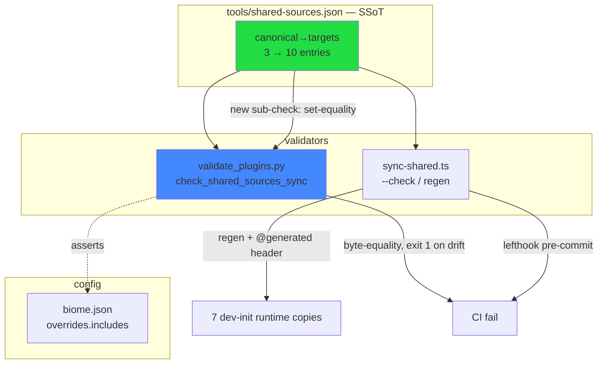
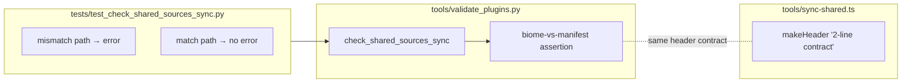

## Summary

Govern dev-init's vendored `shared/` layer: derive biome's generated-copy suppression
from the copy-sync manifest (drift-gated, glob rejected), add the 7 byte-identical
runtime pairs to copy-sync, and record every pair's governance call in an ADR +
CLAUDE.md. Test shared-import execution and drifted-file reconciliation are split to
follow-up issues. One PR, 3 slices.

## Architecture

## Bootstrap Context

From analysis (Shape 2): dev-init/skills/shared = vendored subset of dev-core; 3/25
gated, 14 byte-identical ungoverned, 8 hand-written. The 7 runtime pairs are the
in-sync part of a drifting closure (siblings github-infra/parse-issue-ref/ports-workspace
already lag dev-core). biome glob rejected — would un-lint 8 hand-written files.

**Reference patterns:**
- `tools/validate_plugins.py::check_shared_sources_sync` (lines 340–390) — extend here.
- `tests/test_check_taxonomy_sync.py` — pytest precedent for a validate_plugins check.
- `tools/sync-shared.ts::makeHeader` (line 24) — `// @generated …\n\n` = 2-line header.
- `plugins/shared/__tests__/detect-github-repo.suite.ts` — shared-import precedent (for the deferred follow-up only).

## Agents

| Agent instance | Tasks | Files |
|----------------|-------|-------|
| devops-A | T1, T2, T4, T5 | validate_plugins.py, biome.json, shared-sources.json, sync-shared.ts, 7 dev-init copies |
| tester-A | T3 | tests/test_check_shared_sources_sync.py |
| doc-writer-A | T6, T7 | docs/architecture/adr/014-*.mdx, CLAUDE.md |
| product-lead-A | T8 | (GitHub issues — no repo files) |

## Wave Structure

4 waves, max 3 parallel agents. Elapsed ~1 short cycle vs ~sequential 8 steps.

| Wave | Trigger | Agents | Tasks |
|------|---------|--------|-------|
| 1 | start | 3 ∥ | devops-A: T1→T2 · product-lead-A: T8 |
| 2 | Wave 1 done | 2 ∥ | tester-A: T3 · devops-A: T4 |
| 3 | T4 done | 2 ∥ | devops-A: T5 · doc-writer-A: T6 |
| 4 | T6 done | 1 | doc-writer-A: T7 |

### Budget — per task

| Task | Items | Class | Est. ops | Split? |
|------|-------|-------|----------|--------|
| T1 biome-vs-manifest gate | 1 | judgmental | 6 | — |
| T2 biome baseline rewrite | 1 | trivial | 2 | — |
| T3 pytest mismatch/match | 2 | judgmental | 6 | — |
| T4 +7 manifest entries | 7 | bounded | 3 | — |
| T5 regen + biome→10 + header comment | 9 | judgmental | 6 | — |
| T6 ADR 014 | 1 | judgmental | 6 | — |
| T7 CLAUDE.md update | 1 | bounded | 4 | — |
| T8 file 2 follow-up issues | 2 | bounded | 4 | — |

**Total estimated ops: ~37**

### Budget — per agent instance

| Instance | Tasks | Σ ops | Subjects | Split? |
|----------|-------|-------|----------|--------|
| devops-A | T1, T2, T4, T5 | 17 | copy-sync-gate, copy-sync-runtime | — (2 subjects, 4 tasks; shared files biome.json/validate_plugins.py force single instance) |
| tester-A | T3 | 6 | copy-sync-gate | — |
| doc-writer-A | T6, T7 | 10 | governance-doc | — |
| product-lead-A | T8 | 4 | follow-ups | — |

## Consistency Report

Covered: SC1→T1,T3 · SC2(glob rejected)→T6 · SC3→T4,T5 · SC4→T1,T5 · SC5→T3,T5(test/lint/typecheck),unchanged config.test→(no task touches it) · SC6→T6,T7 · SC7→T8. 8/8 criteria traced. No untraced tasks. Exemption: `config.test.ts` intentionally untouched (caller-parity).

## Micro-Tasks

### Slice V1 — biome SSoT gate

**T1 — biome-vs-manifest assertion** · devops-A · subject: copy-sync-gate · [P with T8] · GREEN · diff 3
- File: `tools/validate_plugins.py`
- In `check_shared_sources_sync()`, after the byte-equality loop, load `biome.json`,
  read `overrides[0].includes`, compare `set(includes) == set(flatten(manifest targets))`
  (repo-root-relative). On mismatch append a drift error (joins the returned error
  list → exit 1, NOT exit 2). Add a comment documenting the 2-line `@generated`
  header contract (must mirror `makeHeader()` in sync-shared.ts).
- Verify: `python3 tools/validate_plugins.py --check shared-sources-sync; echo $?` → `0` (current biome==manifest)
- Spec trace: SC1, SC4

**T2 — biome baseline = manifest targets** · devops-A · subject: copy-sync-gate · GREEN · diff 1
- File: `biome.json`
- Rewrite `overrides[0].includes` to exactly the (sorted) manifest target paths.
  No-op today (same 3 entries) — establishes the asserted invariant.
- Verify: `python3 tools/validate_plugins.py --check shared-sources-sync; echo $?` → `0`
- Spec trace: SC1

**T3 — pytest for the gate** · tester-A · subject: copy-sync-gate · blockedBy T1 · RED→GREEN · diff 3
- File: `tests/test_check_shared_sources_sync.py` (new)
- Mirror `tests/test_check_taxonomy_sync.py`. Two cases via tmp_path/monkeypatch of
  manifest + biome.json: (a) biome includes ≠ manifest targets → assert returned
  error list is non-empty (drift); (b) equal → assert empty. Exercise the
  set-equality path specifically.
- Verify: `python3 -m pytest tests/test_check_shared_sources_sync.py -v` → all pass
- Spec trace: SC1

### Slice V2 — runtime gating

**T4 — +7 runtime entries to manifest** · devops-A · subject: copy-sync-runtime · blockedBy T2 · GREEN · diff 2
- File: `tools/shared-sources.json`
- Add 7 entries, each `canonical: plugins/dev-core/skills/shared/<f>` →
  `targets: [plugins/dev-init/skills/shared/<f>]` for: `adapters/env-config.ts`,
  `adapters/workspace-store.ts`, `ports/artifacts.ts`, `ports/config.ts`,
  `prereqs.ts`, `queries.ts`, `types.ts`.
- Verify: `python3 -c "import json;print(len(json.load(open('tools/shared-sources.json'))))"` → `10`
- Spec trace: SC3

**T5 — regen copies + biome→10 + header contract** · devops-A · subject: copy-sync-runtime · blockedBy T4 · GREEN · diff 3
- Files: 7 dev-init runtime copies, `biome.json`, `tools/sync-shared.ts`
- Run `bun run sync:shared` (regenerates the 7 dev-init copies WITH `@generated`
  header). Update `biome.json overrides[0].includes` to all 10 manifest targets.
  Add the 2-line header-contract comment to `sync-shared.ts::makeHeader`.
- Verify: `bun run sync:shared --check && python3 tools/validate_plugins.py --check shared-sources-sync && echo OK` → `OK`; biome has 10 includes.
- Spec trace: SC3, SC4

### Slice V3 — governance doc + follow-ups

**T6 — ADR 014** · doc-writer-A · subject: governance-doc · blockedBy T4 · REFACTOR · diff 3
- File: `docs/architecture/adr/014-shared-ts-governance-scope.mdx` (new)
- Record: biome SSoT (glob REJECTED + 8-hand-written-files rationale); runtime
  copy-sync expansion (3→10); test shared-import call (deferred to follow-up);
  divergent-file call values — `intentional-fork` (github-adapter), 
  `leave-alone-pending-reconciliation` (github-infra, parse-issue-ref, ports/workspace,
  __tests__/domain.test). Follow ADR frontmatter+redirect convention of existing ADRs.
- Verify: `ls docs/architecture/adr/014-*.mdx`
- Spec trace: SC2, SC6

**T7 — CLAUDE.md "Shared-source TS files"** · doc-writer-A · subject: governance-doc · blockedBy T6 · REFACTOR · diff 2
- File: `CLAUDE.md`
- Update the "Shared-source TS files" bullet: list the now-10 copy-synced runtime
  files, the biome SSoT (manifest-derived, gated) note, the deferred test
  shared-import call, and the divergent-file values. Link ADR 014.
- Verify: `grep -c "shared-sources.json\|SSoT\|014" CLAUDE.md` ≥ 1
- Spec trace: SC6

**T8 — file 2 follow-up issues** · product-lead-A · subject: follow-ups · [P with T1] · diff 2
- Via `issue-triage`: (a) "Execute test shared-import for 6 byte-identical shared/
  test pairs" ; (b) "Reconcile 4 drifted/divergent dev-init↔dev-core shared/ files".
  Both reference #232 in body. Use the issue-triage skill (¬raw gh) per global rule.
- Verify: both issues created, numbers captured, linked to #232.
- Spec trace: SC7

## Task Seeding Blueprint

<!-- Used by /implement to seed TaskCreate calls. T-numbers ref this list. -->

### Wave 1 — no deps, 3 agents ∥

| Task | Agent instance | blockedBy | Subject |
|------|---------------|-----------|---------|
| T1 | devops-A | — | copy-sync-gate |
| T2 | devops-A | T1 | copy-sync-gate |
| T8 | product-lead-A | — | follow-ups |

### Wave 2 — after Wave 1, 2 agents ∥

| Task | Agent instance | blockedBy | Subject |
|------|---------------|-----------|---------|
| T3 | tester-A | T1 | copy-sync-gate |
| T4 | devops-A | T2 | copy-sync-runtime |

### Wave 3 — after T4, 2 agents ∥

| Task | Agent instance | blockedBy | Subject |
|------|---------------|-----------|---------|
| T5 | devops-A | T4 | copy-sync-runtime |
| T6 | doc-writer-A | T4 | governance-doc |

### Wave 4 — after T6, 1 agent

| Task | Agent instance | blockedBy | Subject |
|------|---------------|-----------|---------|
| T7 | doc-writer-A | T6 | governance-doc |

## Task IDs

<!-- Generated by /plan. Used by /implement to resume tasks on session restart. -->
- T1: 14 — copy-sync-gate (devops-A)
- T2: 15 — copy-sync-gate (devops-A)
- T3: 16 — copy-sync-gate (tester-A)
- T4: 17 — copy-sync-runtime (devops-A)
- T5: 18 — copy-sync-runtime (devops-A)
- T6: 19 — governance-doc (doc-writer-A)
- T7: 20 — governance-doc (doc-writer-A)
- T8: 21 — follow-ups (product-lead-A)
