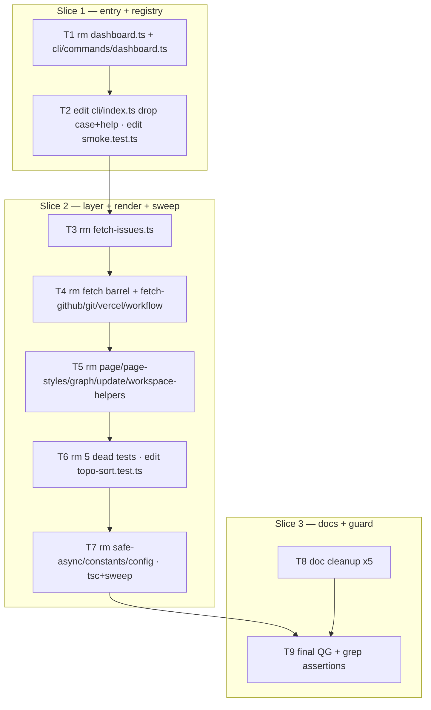
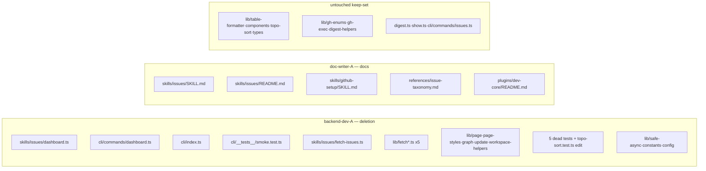

## Summary

Atomic, mechanical removal of the `roxabi dashboard` command, its ProjectV2 data
+ render layer, and the legacy `fetch-issues.ts` CLI. No new code (no RED/GREEN);
verification is `tsc` + grep assertions + full QG. Code deletions run as a
sequential chain on one `backend-dev` instance; the 5-file doc cleanup runs in
parallel on `doc-writer`.

## Architecture

### Removal flow (TD)

### File × ownership map (LR)

## Agents

| Agent instance | Tasks | Files |
|----------------|-------|-------|
| backend-dev-A | T1–T7, T9 | dashboard surface + ProjectV2 fetch/render layer + orphan sweep + QG |
| doc-writer-A | T8 | 5 docs referencing dashboard/fetch-issues |

## Wave Structure

2 waves, max 2 parallel agents. Elapsed ~1 session vs ~1 session sequential
(deletion is fast; parallelism only overlaps docs with code).

| Wave | Trigger | Agents | Tasks |
|------|---------|--------|-------|
| 1 | start | 2 ∥ | backend-dev-A: T1→T2→T3→T4→T5→T6→T7 · doc-writer-A: T8 |
| 2 | W1 done | 1 | backend-dev-A: T9 (final QG + grep guards) |

### Budget — per task

| Task | Items | Class | Est. ops | Split? |
|------|-------|-------|----------|--------|
| T1 | 2 files | trivial | 2 | — |
| T2 | 2 edits | bounded | 3 | — |
| T3 | 1 file | trivial | 1 | — |
| T4 | 5 files | trivial | 2 | — |
| T5 | 5 files | trivial | 2 | — |
| T6 | 5 rm + 1 edit | judgmental | 4 | — |
| T7 | 3 rm + sweep | judgmental | 5 | — |
| T8 | 5 docs | judgmental | 10 | — |
| T9 | QG + 3 greps | bounded | 4 | — |

**Total estimated ops: ~33**

### Budget — per agent instance

| Instance | Tasks | Σ ops | Subjects | Split? |
|----------|-------|-------|----------|--------|
| backend-dev-A | T1,T2,T3,T4,T5,T6,T7,T9 | 23 | deletion | No — mechanical exception: trivial rm/edit, 1 subject, Σops≪50; sequential-on-shared-dir makes splitting riskier (tsc gating + index.ts contention) |
| doc-writer-A | T8 | 10 | docs | — |

## Consistency Report

- Spec criteria covered: 12/12. Each SC maps to ≥1 task:
  SC1,SC3→T1,T2 · SC2→T2 · SC4→T3 · SC5→T4,T5 · SC6→T6,T7 · SC7,SC8→T7,T9 ·
  SC9→T9 (keep-set guard) · SC10→T9 (issues.test.ts) · SC11→T9 (QG) · SC12→T8.
- Untraced tasks: none.
- Exemptions: no RED/GREEN phase (removal, not addition) — test-first inapplicable;
  verification is QG + grep, owned by T9.

## Micro-Tasks

### Slice 1 — entry + registry (backend-dev-A)

**T1 [N1] — Remove dashboard entry points**
- Files: `plugins/dev-core/skills/issues/dashboard.ts`, `plugins/dev-core/cli/commands/dashboard.ts`
- Action: `git rm` both.
- Verify: `test ! -e plugins/dev-core/skills/issues/dashboard.ts && test ! -e plugins/dev-core/cli/commands/dashboard.ts && echo OK`
- Subject: deletion · Slice: S1 · Difficulty: 1

**T2 [N2] — Drop `dashboard` command + smoke test**
- Files: `plugins/dev-core/cli/index.ts`, `plugins/dev-core/cli/__tests__/smoke.test.ts`
- Action: remove `case 'dashboard': { ... }` block + the `dashboard   Launch the live project dashboard` help line in `index.ts`; remove the `it('dashboard --help prints usage ...')` block in `smoke.test.ts`.
- Verify: `! grep -q "case 'dashboard'" plugins/dev-core/cli/index.ts && ! grep -q "'dashboard'" plugins/dev-core/cli/__tests__/smoke.test.ts && echo OK`
- Subject: deletion · Slice: S1 · Difficulty: 2

### Slice 2 — layer + render + sweep (backend-dev-A)

**T3 [N3] — Remove legacy ProjectV2 CLI**
- Files: `plugins/dev-core/skills/issues/fetch-issues.ts`
- Action: `git rm`.
- Verify: `test ! -e plugins/dev-core/skills/issues/fetch-issues.ts && echo OK`
- Subject: deletion · Slice: S2 · Difficulty: 1

**T4 [N4] — Remove ProjectV2 fetch layer**
- Files: `lib/fetch.ts`, `lib/fetch-github.ts`, `lib/fetch-git.ts`, `lib/fetch-vercel.ts`, `lib/fetch-workflow.ts` (under `plugins/dev-core/skills/issues/`)
- Action: `git rm` all five.
- Verify: `! ls plugins/dev-core/skills/issues/lib/fetch*.ts 2>/dev/null | grep -q fetch && echo OK`
- Subject: deletion · Slice: S2 · Difficulty: 1

**T5 [N5] — Remove dashboard render/write**
- Files: `lib/page.ts`, `lib/page-styles.ts`, `lib/graph.ts`, `lib/update.ts`, `lib/workspace-helpers.ts`
- Action: `git rm` all five.
- Verify: `for f in page page-styles graph update workspace-helpers; do test ! -e plugins/dev-core/skills/issues/lib/$f.ts || { echo "FAIL $f"; exit 1; }; done; echo OK`
- Subject: deletion · Slice: S2 · Difficulty: 1

**T6 [N6] — Remove dead tests + fix shared test**
- Files: `__tests__/dashboard.test.ts`, `__tests__/fetch-github.test.ts`, `__tests__/safe-async.test.ts`, `lib/page.test.ts`, `lib/update.test.ts`; edit `__tests__/topo-sort.test.ts`
- Action: `git rm` the 5 dead tests; in `topo-sort.test.ts` remove `import { buildDepGraph } from '../lib/graph'` and any `describe/it` block exercising `buildDepGraph`, keeping all `topoSort` cases.
- Verify: `! grep -q "lib/graph" plugins/dev-core/skills/issues/__tests__/topo-sort.test.ts && grep -q "topoSort" plugins/dev-core/skills/issues/__tests__/topo-sort.test.ts && echo OK`
- Subject: deletion · Slice: S2 · Difficulty: 3

**T7 [N7] — Orphan sweep**
- Files: `lib/safe-async.ts`, `lib/constants.ts`, `lib/config.ts`
- Action: `git rm` the three; then run `bunx tsc --noEmit` and assert no `skills/issues/**` source file has zero non-test importers.
- Verify: `bunx tsc --noEmit && for f in $(find plugins/dev-core/skills/issues -name '*.ts' -not -path '*__tests__*' -not -name '*.test.ts'); do b=$(basename $f .ts); imp=$(grep -rl "/$b'" plugins/dev-core --include='*.ts' | grep -v "$f" | grep -v __tests__ | grep -v '.test.ts' | wc -l); [ "$imp" -eq 0 ] && echo "ORPHAN: $f"; done | tee /tmp/orphans-252; test ! -s /tmp/orphans-252 && echo OK` (entry scripts `digest.ts`/`show.ts` are CLI entrypoints — exempt; tune the find filter to exclude them)
- Subject: deletion · Slice: S2 · Difficulty: 3

### Slice 3 — docs + guard

**T8 [N8] — Doc cleanup (doc-writer-A, ∥)**
- Files: `skills/issues/SKILL.md`, `skills/issues/README.md`, `skills/github-setup/SKILL.md`, `references/issue-taxonomy.md`, `plugins/dev-core/README.md`
- Action: remove all live `roxabi dashboard` / `fetch-issues.ts` instructions, daemon blocks, `--dashboard` flags, and `dashboard` consumer rows in `issue-taxonomy.md`. Leave incidental unrelated "dashboard" mentions (fix/test/ci-watch/frame SKILLs) untouched.
- Verify: `! grep -rn 'roxabi dashboard\|fetch-issues' plugins/dev-core/skills/issues plugins/dev-core/skills/github-setup plugins/dev-core/references plugins/dev-core/README.md && echo OK`
- Subject: docs · Slice: S3 · Difficulty: 2

**T9 [N9] — Final QG + guards (backend-dev-A)**
- Action: `bun run lint && bun run typecheck && bun run test`; assert zero ProjectV2 coupling in `skills/issues`; assert keep-set intact.
- Verify: `bun run lint && bun run typecheck && bun run test && ! grep -rn 'ProjectV2\|GH_PROJECT_ID\|fetchAllItems\|fetchAllProjects' plugins/dev-core/skills/issues && for f in table-formatter components topo-sort types gh-enums gh-exec digest-helpers; do test -e plugins/dev-core/skills/issues/lib/$f.ts || { echo "MISSING $f"; exit 1; }; done && echo OK`
- Subject: deletion · Slice: S3 · Difficulty: 2

## Task Seeding Blueprint

<!-- Used by /implement to seed TaskCreate calls. blockedBy refs T-numbers. -->

### Wave 1 — start, 2 agents ∥

| Task | Agent instance | blockedBy | Subject |
|------|---------------|-----------|---------|
| T1 | backend-dev-A | — | deletion |
| T2 | backend-dev-A | T1 | deletion |
| T3 | backend-dev-A | T2 | deletion |
| T4 | backend-dev-A | T3 | deletion |
| T5 | backend-dev-A | T4 | deletion |
| T6 | backend-dev-A | T5 | deletion |
| T7 | backend-dev-A | T6 | deletion |
| T8 | doc-writer-A | — | docs |

### Wave 2 — after T7 + T8, 1 agent

| Task | Agent instance | blockedBy | Subject |
|------|---------------|-----------|---------|
| T9 | backend-dev-A | T7, T8 | deletion |

## Task IDs

<!-- Generated by /plan. Used by /implement to resume tasks on session restart. -->
- T1: 37 — deletion (backend-dev-A)
- T2: 38 — deletion (backend-dev-A)
- T3: 39 — deletion (backend-dev-A)
- T4: 40 — deletion (backend-dev-A)
- T5: 41 — deletion (backend-dev-A)
- T6: 42 — deletion (backend-dev-A)
- T7: 43 — deletion (backend-dev-A)
- T8: 44 — docs (doc-writer-A)
- T9: 45 — deletion (backend-dev-A)
