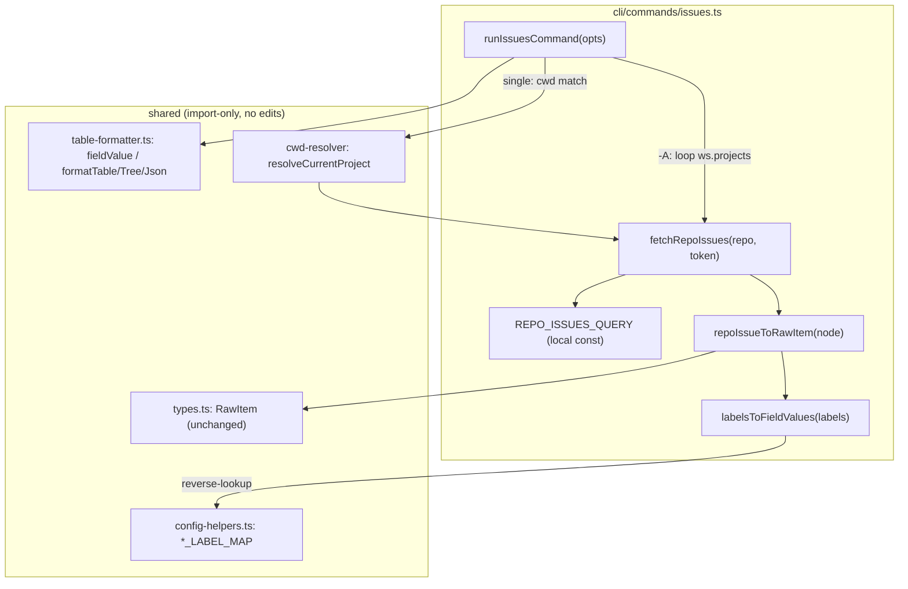
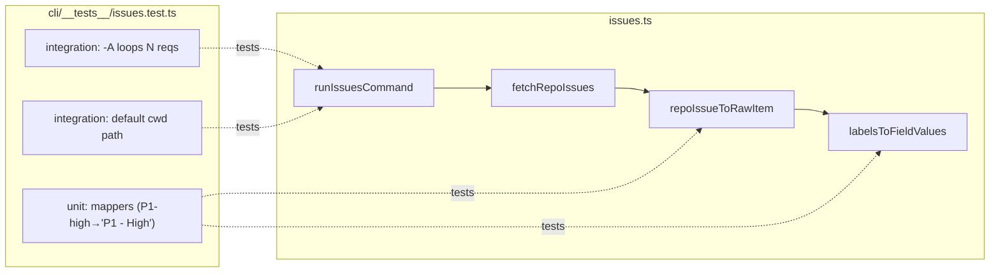

## Summary

Replace the ProjectV2-board read path in `cli/commands/issues.ts` with a repo-centric
`repository.issues` fetch. Synthesize `RawItem.fieldValues` from issue labels so every
formatter keeps working unchanged. Two files: `issues.ts` (impl), `cli/__tests__/issues.test.ts`
(fixtures). Zero edits to copy-synced / #240-held shared files.

## Architecture





## Agents

| Agent instance | Tasks | Files |
|----------------|-------|-------|
| backend-dev-A | T2, T3 | `cli/commands/issues.ts` |
| tester-A | T1, T4, T5 | `cli/__tests__/issues.test.ts` |

## Wave Structure

5 waves, max 1 parallel agent (2 files, each single-owner → sequential RED→GREEN→REFACTOR).
Elapsed ~same as sequential (small surface; serialization is inherent — both impl tasks edit
the one source file, both test tasks edit the one test file).

| Wave | Trigger | Agents | Tasks |
|------|---------|--------|-------|
| 1 | start | tester-A | T1 (RED: unit tests for mappers) |
| 2 | T1 done (RED-GATE) | backend-dev-A | T2 (GREEN: mappers + query) |
| 3 | T2 done | backend-dev-A | T3 (GREEN: fetchRepoIssues + rewire + delete old path) |
| 4 | T3 done | tester-A | T4 (integration tests rewrite) |
| 5 | T4 done | tester-A | T5 (REFACTOR: golden parity + QG) |

### Budget — per task

| Task | Items | Class | Est. ops | Split? |
|------|-------|-------|----------|--------|
| T1 unit tests (mappers) | 1 | judgmental | 6 | — |
| T2 mappers + REPO_ISSUES_QUERY | 1 | judgmental | 6 | — |
| T3 fetch + rewire + delete | 1 | judgmental | 8 | — |
| T4 integration tests rewrite | 1 | judgmental | 8 | — |
| T5 golden parity + QG | 1 | bounded | 4 | — |

**Total estimated ops: 32**

### Budget — per agent instance

| Instance | Tasks | Σ ops | Subjects | Split? |
|----------|-------|-------|----------|--------|
| backend-dev-A | T2, T3 | 14 | fetch, mapping | — |
| tester-A | T1, T4, T5 | 18 | mapping-tests, integration | — |

No splits required (per-instance ops ≤ 50, |tasks| ≤ 4, subjects ≤ 2).

## Consistency Report

- Success criteria covered: 8/8.
  - SC1 (fetchRepoIssues + delete fetchProjectItems) → T3
  - SC2 (read path grep = 0) → T3 + T5 verify
  - SC3 (labelsToFieldValues reverse-lookup) → T2 (impl) + T1 (test)
  - SC4 (RawItem unchanged; golden parity) → T2 + T5
  - SC5 (zero diff in shared types/queries/workspace) → T2/T3 design + T5 verify
  - SC6 (issues.test.ts updated) → T1 + T4
  - SC7 (no-projectId repo returns open issues) → T4
  - SC8 (QG green) → T5
- Uncovered: none. Untraced tasks: none.

## Micro-Tasks

### Slice S1 — Pure mapping layer

**T1 [RED] — unit tests for label mappers** · tester-A · subject: mapping-tests · SC3/SC4 · difficulty 3
- File: `plugins/dev-core/cli/__tests__/issues.test.ts`
- Add a `describe('labelsToFieldValues / repoIssueToRawItem')` block (imports from `../commands/issues`).
- Cases (assert canonical field values, **not** label strings):
  - `status:In Progress` → `{field:{name:'Status'}, name:'In Progress'}`
  - `size:F-lite` → `{field:{name:'Size'}, name:'F-lite'}`
  - `P1-high` → `{field:{name:'Priority'}, name:'P1 - High'}`  ← **reverse-lookup guard**
  - `graph:lane/a1` → `{field:{name:'Lane'}, name:'a1'}`
  - unknown label (e.g. `bug`) → ignored (no field value)
  - `repoIssueToRawItem(node)` → `RawItem` with synthesized `fieldValues.nodes` + `content` passthrough
- Verify: `cd worktree && bun test cli/__tests__/issues.test.ts 2>&1 | grep -E 'labelsToFieldValues'` — tests present; **fail pre-impl** (functions not yet exported) = valid RED.
- Expected: test names appear; failures reference missing export.

**RED-GATE-S1** — T1 committed/failing before T2 implements.

**T2 [GREEN] — mappers + local repo query** · backend-dev-A · subject: mapping · SC3/SC4/SC5 · difficulty 3
- File: `plugins/dev-core/cli/commands/issues.ts`
- Add `const REPO_ISSUES_QUERY` (local, NOT in shared/queries.ts):
  ```graphql
  query($owner: String!, $repo: String!, $cursor: String) {
    repository(owner: $owner, name: $repo) {
      issues(first: 100, after: $cursor, states: [OPEN], orderBy: {field: CREATED_AT, direction: DESC}) {
        pageInfo { hasNextPage endCursor }
        nodes {
          number title state url
          labels(first: 20) { nodes { name } }
          subIssues(first: 50) { nodes { number state title } }
          parent { number state }
          # blockedBy/blocking: GitHub exposes via timelineItems; if unavailable repo-side,
          # emit empty nodes[] to preserve RawContent shape (deps render as none).
        }
      }
    }
  }
  ```
  Note: `blockedBy`/`blocking` are ProjectV2/issue-dependency fields. If the repo-issue GraphQL
  cannot supply them, default to `{ nodes: [] }` in `repoIssueToRawItem` so `computeBlockStatus`
  stays well-defined. (Acceptable: dep arrows degrade to "none" in repo-centric mode; documented
  in spec's behavior delta.)
- Implement `labelsToFieldValues(labels: {name:string}[]): RawFieldValue[]`:
  - import `PRIORITY_LABEL_MAP, SIZE_LABEL_MAP, STATUS_LABEL_MAP, LANE_LABEL_MAP` from
    `../../skills/shared/adapters/config-helpers`.
  - Build a single reverse index `label → {field, value}` once (module scope): for each map,
    `Object.entries(M).forEach(([canonical, label]) => idx.set(label, {field, value: canonical}))`
    with field = 'Status'|'Size'|'Priority'|'Lane'. Then `labels.map(l => idx.get(l.name)).filter(Boolean)`
    → `{field:{name:field}, name:value}`.
  - **Priority is reverse-lookup, not prefix-strip** (`P1-high`→`P1 - High`).
- Implement `repoIssueToRawItem(node): RawItem` — map `content` fields, default missing dep
  collections to `{nodes:[]}`, set `fieldValues: { nodes: labelsToFieldValues(node.labels?.nodes ?? []) }`.
- Verify: `cd worktree && bun test cli/__tests__/issues.test.ts 2>&1 | tail -5` — T1 mapper tests pass.

### Slice S2 — Fetch + wire

**T3 [GREEN] — fetchRepoIssues + rewire + delete old path** · backend-dev-A · subject: fetch · SC1/SC2/SC5 · difficulty 4
- File: `plugins/dev-core/cli/commands/issues.ts`
- Add `async function fetchRepoIssues(repo: string, token: string): Promise<RawItem[]>`:
  split `repo` into `owner/name`, cursor-paginate `REPO_ISSUES_QUERY` via existing `ghGraphQL`,
  map each node through `repoIssueToRawItem`, accumulate across pages.
- Rewire `runIssuesCommand`:
  - single path: `const items = await fetchRepoIssues(matched.repo, token)` (was `fetchProjectItems(matched.projectId, token)`).
  - `-A` path: `for (const p of ws.projects) byProject.set(p.label, await fetchRepoIssues(p.repo, token))`
    (replaces `buildBatchedQuery`/`buildBatchedVariables` block).
- Delete `fetchProjectItems`; remove imports `buildBatchedQuery, buildBatchedVariables, ISSUES_QUERY`
  from `../../skills/shared/queries`. Keep `formatJson/Table/Tree`, `getGitHubToken`, resolver imports.
- Verify: `cd worktree && grep -E 'ISSUES_QUERY|buildBatched|node\.items|\.projectId' plugins/dev-core/cli/commands/issues.ts | grep -v REPO_ISSUES_QUERY` → **empty**. Then `bun run typecheck`.
- Expected: grep empty; typecheck clean.

### Slice S3 — Tests

**T4 [RED→GREEN] — integration test rewrite** · tester-A · subject: integration · SC6/SC7 · difficulty 4
- File: `plugins/dev-core/cli/__tests__/issues.test.ts`
- Replace `makeIssueNode` body: emit a **repository.issues node** with `labels: { nodes: [{name:'status:Backlog'},{name:'P1-high'},{name:'size:F-lite'}] }` (no `fieldValues`).
- Replace `makeBatchedResponse` with `makeRepoResponse(nodes)` → `{ data: { repository: { issues: { nodes, pageInfo:{hasNextPage:false,endCursor:null} } } } }`.
- Rewrite `-A` tests:
  - was SC-10 "exactly 1 HTTP request" → now **N requests (one per repo)**: `expect(fetchMock).toHaveBeenCalledTimes(2)` for the 2-project workspace.
  - SC-11 grouping (`## frontend` before `#1`, etc.) — keep, fed by per-repo mock (route by call index or by `variables.repo`).
- Rewrite default-path test: response shape = `repository.issues.nodes`; assert `## current-project` + `#42`.
- Add SC7 test: a workspace project with **no `projectId`** (omit the field) still returns `#42` (read path never touches projectId).
- Decide on `buildBatchedQuery`/`buildBatchedVariables` unit tests: **keep** (functions still exported from queries.ts for #252) — they are orthogonal to issues.ts and still pass.
- Verify: `cd worktree && bun test cli/__tests__/issues.test.ts 2>&1 | tail -8` — all green.

**T5 [REFACTOR] — golden parity + QG** · tester-A · subject: integration · SC2/SC4/SC8 · difficulty 2
- Add a golden test: build one `RawItem` via `repoIssueToRawItem` (label-based) and one hand-built
  with equivalent explicit `fieldValues`; assert `formatTable([labelItem],opts) === formatTable([fieldItem],opts)`.
- Run full QG: `cd worktree && bun run lint && bun run typecheck && bun run test`.
- Verify: all three exit 0; golden assertion passes.
- Expected: `Result: All checks passed`.

## Task Seeding Blueprint

<!-- Used by /implement to seed TaskCreate calls on session start.
     T-numbers are blueprint-local, not session task IDs. Seed in wave order. -->

### Wave 1 — no deps, 1 agent

| Task | Agent instance | blockedBy | Subject |
|------|---------------|-----------|---------|
| T1 | tester-A | — | mapping-tests |

### Wave 2 — after T1 (RED-GATE-S1), 1 agent

| Task | Agent instance | blockedBy | Subject |
|------|---------------|-----------|---------|
| T2 | backend-dev-A | T1 | mapping |

### Wave 3 — after T2, 1 agent

| Task | Agent instance | blockedBy | Subject |
|------|---------------|-----------|---------|
| T3 | backend-dev-A | T2 | fetch |

### Wave 4 — after T3, 1 agent

| Task | Agent instance | blockedBy | Subject |
|------|---------------|-----------|---------|
| T4 | tester-A | T3 | integration |

### Wave 5 — after T4, 1 agent

| Task | Agent instance | blockedBy | Subject |
|------|---------------|-----------|---------|
| T5 | tester-A | T4 | integration |

## Task IDs

<!-- Generated by /plan. Used by /implement to resume tasks on session restart. -->
- T1: 20 — mapping-tests (tester-A)
- T2: 21 — mapping (backend-dev-A)
- T3: 22 — fetch (backend-dev-A)
- T4: 23 — integration (tester-A)
- T5: 24 — integration (tester-A)
