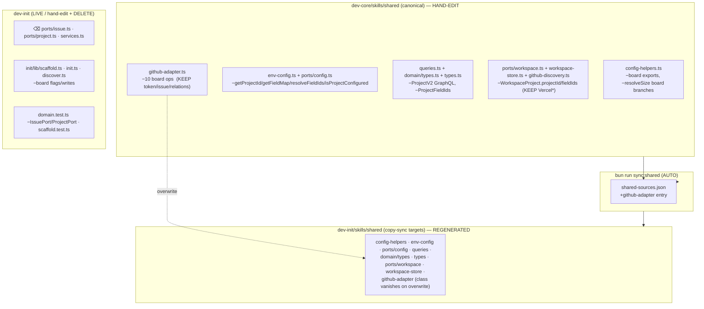
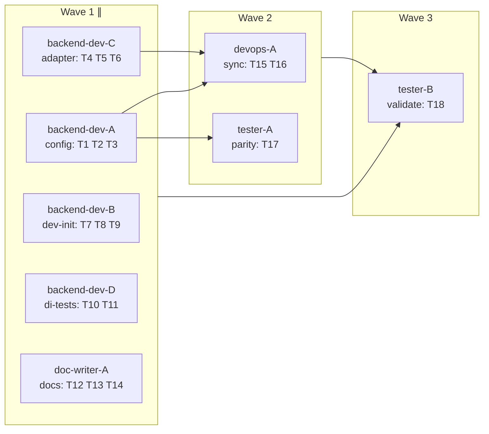

## Summary

Purge dead ProjectV2-board plumbing across both plugins **and** retire dev-init's abandoned
hexagonal ports (ADR-015). Most dev-init purge is automatic: 8 board-bearing files are copy-sync, so
the canonical dev-core edits propagate via `bun run sync:shared`. Manual dev-init work = delete 3
port/DI files + scaffold/init/discover + 2 tests. Pure subtraction, no live-skill behaviour change.

## Architecture

### Data flow — what purges where

### File × responsibility map

## Agents

| Agent instance | Tasks | Files | Subject |
|---|---|---|---|
| backend-dev-A | T1, T2, T3 | dev-core config-helpers, env-config, ports/config, queries, domain/types, types | config |
| backend-dev-C | T4, T5, T6 | dev-core ports/workspace, workspace-store, github-discovery, github-adapter + 3 tests | adapter |
| backend-dev-B | T7, T8, T9 | dev-init ports/{issue,project} + services (delete), scaffold.ts, init.ts, discover.ts | dev-init |
| backend-dev-D | T10, T11 | dev-init scaffold.test.ts, domain.test.ts | di-tests |
| doc-writer-A | T12, T13, T14 | checkup cookbooks, stack-setup SKILL, dev-init SKILL/README, checkup tests | docs |
| devops-A | T15, T16 | tools/shared-sources.json, CLAUDE.md, ADR-014 | sync |
| tester-A | T17 | config.test.ts (both copies) | parity |
| tester-B | T18 | — (gate runner) | validate |

## Bootstrap Context

- **Copy-sync is the lever** — `tools/shared-sources.json` lists 13 canonical→target pairs. Purge dev-core canonical, run `bun run sync:shared`, dev-init copies follow byte-for-byte. ¬hand-edit any dev-init copy-sync target.
- **Vercel ≠ board** — `ports/workspace.ts` `VercelProjectRef.projectId` (L7) + `vercelProjectId/vercelTeamId/vercelProjects` (L17-20) are KEEP. Only `WorkspaceProject.projectId` (L13) + `fieldIds` (L16) purge. Same trap: `github-discovery.ts:37`.
- **resolveSize keeps** but loses its `SIZE_OPTIONS` board branches; `DEFAULT_*_OPTIONS`/`CANONICAL_*`/`*_LABEL_MAP` are static issues-only data — KEEP.
- **caller-parity** — `__tests__/config.test.ts` is NOT copy-sync; both dev-core + dev-init copies kept byte-identical by hand + CI diff gate (#218). Edit both in lockstep (T17).
- **github-adapter convergence** — adding it to the manifest (T15) makes `sync:shared` overwrite dev-init's copy with dev-core's functional version → the `GitHubAdapter` class + dead `ports/issue|project` imports vanish automatically. No manual class deletion.
- **Stale governance** — CLAUDE.md §leave-alone-pending-reconciliation (#240) lists `ports/workspace`/`github-infra`/`parse-issue-ref` as leave-alone, but ADR-014 already moved them to copy-sync. Fix in T16.

## Wave Structure

3 waves, max 5 parallel agents. Elapsed ~3 sequential-equivalent passes vs ~18 fully sequential.

| Wave | Trigger | Agents | Tasks |
|---|---|---|---|
| 1 | start | 5 ∥ | A: T1→T2→T3 · C: T4→T5→T6 · B: T7→T8→T9 · D: T10→T11 · DOC: T12→T13→T14 |
| 2 | Wave 1 done | 2 ∥ | devops-A: T15→T16 · tester-A: T17 |
| 3 | Wave 2 done | 1 | tester-B: T18 (final RED-GATE) |

RED-GATE after Wave 1: dev-core unambiguous board tokens = 0 (`grep -E 'ProjectV2|GH_PROJECT_ID|_FIELD_ID|isProjectConfigured|getBoardIssueNumbers|addToProject'`).
RED-GATE after Wave 2: `bun run typecheck` + `bun run sync:shared --check` green (both plugins compile).

### Budget — per task

| Task | Items | Class | Est. ops | Split? |
|---|---|---|---|---|
| T1 config-helpers | 1 | judgmental | 5 | — |
| T2 env-config+ConfigPort | 2 | judgmental | 4 | — |
| T3 queries+types | 3 | judgmental | 4 | — |
| T4 workspace (Vercel disambig) | 3 | judgmental | 6 | — |
| T5 github-adapter board ops | 1 | judgmental | 5 | — |
| T6 dev-core tests | 3 | bounded | 3 | — |
| T7 delete ports+services | 3 | trivial | 2 | — |
| T8 scaffold.ts | 1 | judgmental | 4 | — |
| T9 init+discover | 2 | bounded | 3 | — |
| T10 scaffold.test | 1 | bounded | 2 | — |
| T11 domain.test | 1 | bounded | 2 | — |
| T12 cookbooks+stack-setup | 2 | bounded | 3 | — |
| T13 dev-init SKILL/README | 2 | judgmental | 4 | — |
| T14 checkup tests | 2 | bounded | 3 | — |
| T15 manifest+sync | 1 | bounded | 5 | — |
| T16 CLAUDE.md+ADR-014 | 2 | judgmental | 4 | — |
| T17 config.test parity (both) | 2 | judgmental | 4 | — |
| T18 final gate | 1 | bounded | 4 | — |

**Total estimated ops: ~67**

### Budget — per agent instance

| Instance | Tasks | Σ ops | Subjects | Split? |
|---|---|---|---|---|
| backend-dev-A | T1,T2,T3 | 13 | config | — |
| backend-dev-C | T4,T5,T6 | 14 | adapter | — |
| backend-dev-B | T7,T8,T9 | 9 | dev-init | — |
| backend-dev-D | T10,T11 | 4 | di-tests | — |
| doc-writer-A | T12,T13,T14 | 10 | docs | — |
| devops-A | T15,T16 | 9 | sync | — |
| tester-A | T17 | 4 | parity | — |
| tester-B | T18 | 4 | validate | — |

No per-instance cap exceeded (≤3 tasks, ≤1 subject each).

## Consistency Report

- **Covered:** 9/9 spec success criteria → traced to tasks below.
- **Spec refinement (1):** SC grep drops bare `projectId`/`fieldIds`/`SIZE_OPTIONS` (they have legit Vercel/static keeps) → those purges verified by `typecheck`, not grep. Unambiguous board tokens still grep=0.
- **New surfaces vs spec (3):** `github-discovery.ts:37` (T4), `branch-protection-context.test.ts` (T14), CLAUDE.md §leave-alone stale-fix (T16). `infra-checks.md` dropped (false positive).
- **Untraced tasks:** 0.

## Micro-Tasks

### Slice S1 — dev-core canonical purge

**T1 — Purge board from config-helpers.ts** · `plugins/dev-core/skills/shared/adapters/config-helpers.ts` · backend-dev-A · config · SC1 · RED→GREEN · diff 4
Drop: `GH_PROJECT_ID`, `*_FIELD_ID`, runtime `{STATUS,SIZE,PRIORITY,LANE}_OPTIONS`, `FIELD_MAP`, `isProjectConfigured`, `resolveFieldIds`, `getSizeOptionId`, `fieldIdForSlot`, `SIZE_REVERSE_PRECEDENCE`, `NOT_CONFIGURED_MSG`. Trim `resolveSize` board branches (L257-258 region). KEEP `detectGitHubRepo`, `GITHUB_REPO`, `resolve{Status,Priority,Size,Lane}`, `DEFAULT_*_OPTIONS`, `CANONICAL_*`, `*_LABEL_MAP`.
Verify: `grep -cE 'GH_PROJECT_ID|_FIELD_ID|isProjectConfigured|resolveFieldIds|getSizeOptionId|NOT_CONFIGURED_MSG' plugins/dev-core/skills/shared/adapters/config-helpers.ts` → `0`

**T2 — Purge board from env-config + ConfigPort** · `adapters/env-config.ts` + `ports/config.ts` · backend-dev-A · config · SC4 · RED→GREEN · diff 3
Drop `getProjectId`, `getFieldMap`, `resolveFieldIds`, `isProjectConfigured` from both the `ConfigPort` interface and the `EnvConfigAdapter` impl (atomic — same commit). KEEP `getRepo`, `resolveStatus/Priority/Size`.
Verify: `grep -cE 'getProjectId|getFieldMap|resolveFieldIds|isProjectConfigured' plugins/dev-core/skills/shared/ports/config.ts plugins/dev-core/skills/shared/adapters/env-config.ts` → `0`

**T3 — Purge ProjectV2 GraphQL + board types** · `queries.ts` + `domain/types.ts` + `types.ts` · backend-dev-A · config · SC1 · RED→GREEN · diff 4
Remove ProjectV2 GraphQL query/fragment strings from `queries.ts`; remove `ProjectFieldIds` + board option types from `domain/types.ts`/`types.ts`. KEEP issue/relation queries. (A owns `domain/types.ts` — other agents must not touch it.)
Verify: `grep -cE 'ProjectV2|ProjectFieldIds' plugins/dev-core/skills/shared/queries.ts plugins/dev-core/skills/shared/domain/types.ts` → `0`

**T4 — Surgical workspace purge (keep Vercel)** · `ports/workspace.ts` + `adapters/workspace-store.ts` + `adapters/github-discovery.ts` · backend-dev-C · adapter · SC4 · RED→GREEN · diff 4
`ports/workspace.ts`: remove `WorkspaceProject.projectId` (L13) + `fieldIds` (L16) + the `ProjectFieldIds` import. **KEEP** `VercelProjectRef.projectId` (L7) + `vercelProjectId/vercelTeamId/vercelProjects`. `workspace-store.ts`: drop `projectId` persistence. `github-discovery.ts`: remove the `projectId: n.id` assignment (L37).
Verify: `bunx tsc --noEmit` (no dangling `WorkspaceProject.projectId` consumers) + `grep -n 'vercelProjectId' plugins/dev-core/skills/shared/ports/workspace.ts` (still present)

**T5 — Purge board ops from github-adapter.ts** · `plugins/dev-core/skills/shared/adapters/github-adapter.ts` · backend-dev-C · adapter · SC1 · RED→GREEN · diff 4
Remove `getBoardIssueNumbers`, `addToProject`, `removeFromProject`, `getProjectTitle`, `getItemId`, `updateField`, `clearField`, `linkProjectToRepo`, `listOrgProjects`, `parseProjectFields`. KEEP `getGitHubToken`, `run`, `ghGraphQL`, `getNodeId`, `createGitHubIssue`, `add/removeBlockedBy`, `add/removeSubIssue`.
Verify: `grep -cE 'getBoardIssueNumbers|addToProject|linkProjectToRepo|parseProjectFields' plugins/dev-core/skills/shared/adapters/github-adapter.ts` → `0`

**T6 — Trim dev-core shared tests** · `__tests__/{adapters,github-adapter,github}.test.ts` · backend-dev-C · adapter · SC10 · RED→GREEN · diff 3
Remove board/field assertions; keep issues-only coverage (`resolveStatus/Priority/Size`, `detectGitHubRepo`, blockedBy, subIssue). Suites removed, not `.skip`ped.
Verify: `cd plugins/dev-core && bunx vitest run skills/shared/__tests__/adapters.test.ts skills/shared/__tests__/github-adapter.test.ts` → pass

**RED-GATE S1** · backend-dev-C · `grep -rEl 'ProjectV2|GH_PROJECT_ID|_FIELD_ID|getBoardIssueNumbers|addToProject' plugins/dev-core/skills/shared` excluding regenerated copies → only intended-empty.

### Slice S2 — dev-init port removal + scaffold

**T7 — Delete abandoned ports + DI** · `dev-init/shared/ports/issue.ts`, `ports/project.ts`, `adapters/services.ts` · backend-dev-B · dev-init · SC2,SC3 · RED · diff 1
`git rm` the three files. Then grep dev-init for residual `IssuePort`/`ProjectPort`/`createServices` importers (besides `github-adapter.ts`, which T15 sync overwrites). Clean any found.
Verify: `test ! -e plugins/dev-init/skills/shared/ports/issue.ts && grep -rl 'createServices' plugins/dev-init/skills | grep -v github-adapter` → empty

**T8 — Purge board flags from scaffold.ts** · `plugins/dev-init/skills/init/lib/scaffold.ts` · backend-dev-B · dev-init · SC5 · RED→GREEN · diff 4
Remove `--project-id`/`--status-field-id`/`--size-field-id`/… CLI flags and the `gh_project_id`/`*_FIELD_ID` writes to `dev-core.yml`/`.env`. Keep repo/labels scaffolding.
Verify: `grep -cE 'project.id|_FIELD_ID|gh_project' plugins/dev-init/skills/init/lib/scaffold.ts` → `0`

**T9 — Purge board from init.ts + discover.ts** · `init/init.ts` + `init/lib/discover.ts` · backend-dev-B · dev-init · SC5 · RED→GREEN · diff 3
Remove board-field discovery/wiring; keep repo discovery.
Verify: `grep -cE 'projectId|GH_PROJECT_ID|_FIELD_ID' plugins/dev-init/skills/init/init.ts plugins/dev-init/skills/init/lib/discover.ts` → `0`

**T10 — Trim scaffold.test.ts** · `init/__tests__/scaffold.test.ts` · backend-dev-D · di-tests · SC10 · RED→GREEN · diff 2
Remove board-field scaffold assertions; keep repo/label cases.
Verify: `cd plugins/dev-init && bunx vitest run skills/init/__tests__/scaffold.test.ts` → pass

**T11 — Trim domain.test.ts (port type checks)** · `dev-init/shared/__tests__/domain.test.ts` · backend-dev-D · di-tests · SC3 · RED→GREEN · diff 2
Remove the `IssuePort`/`ProjectPort` type-level checks (the only reason this file was `intentional-fork`).
Verify: `grep -cE 'IssuePort|ProjectPort' plugins/dev-init/skills/shared/__tests__/domain.test.ts` → `0`

### Slice S4 — docs + /init bug (Wave 1, independent)

**T12 — Scrub board remediation docs** · `checkup/cookbooks/devcore-checks.md` + `stack-setup/SKILL.md` · doc-writer-A · docs · SC5 · REFACTOR · diff 2
Remove board-setup/remediation steps referencing `GH_PROJECT_ID`/field IDs.
Verify: `grep -cE 'GH_PROJECT_ID|_FIELD_ID|project board' plugins/dev-core/skills/checkup/cookbooks/devcore-checks.md plugins/dev-core/skills/stack-setup/SKILL.md` → `0`

**T13 — Fix /init orchestration doc + dep** · `dev-init/skills/init/SKILL.md` + `dev-init/README.md` · doc-writer-A · docs · SC5 · REFACTOR · diff 4
Remove the `github-setup` orchestration line (skill deleted #267); remove board mentions from README; declare the dev-core dependency (`/init` invokes `env-setup`/`ci-setup`/`release-setup`, which live in dev-core).
Verify: `grep -c 'github-setup' plugins/dev-init/skills/init/SKILL.md` → `0`

**T14 — Update checkup board-gone tests** · `checkup/__tests__/doctor.test.ts` + `branch-protection-context.test.ts` · doc-writer-A · docs · SC10 · RED→GREEN · diff 3
These assert the board is gone via literal `GH_PROJECT_ID`. Keep the "absent" intent valid post-purge, or drop the now-obsolete assertion. Suites green, not skipped.
Verify: `cd plugins/dev-core && bunx vitest run skills/checkup/__tests__/doctor.test.ts` → pass

### Slice S3 — converge + governance (Wave 2)

**T15 — Add github-adapter to copy-sync + regenerate** · `tools/shared-sources.json` + `bun run sync:shared` · devops-A · sync · SC7 · GREEN · diff 5 · blockedBy T1,T2,T3,T4,T5,T7
Append a manifest entry mapping dev-core `github-adapter.ts` → dev-init target. Run `bun run sync:shared` to regenerate all dev-init copy-sync targets (incl github-adapter; its `GitHubAdapter` class + dead port imports vanish on overwrite). Confirm `@generated` headers.
Verify: `bun run sync:shared --check` → clean ∧ `grep -c 'class GitHubAdapter' plugins/dev-init/skills/shared/adapters/github-adapter.ts` → `0`

**T16 — Reconcile governance docs** · `CLAUDE.md` + `docs/architecture/adr/014-shared-ts-governance-scope.mdx` · devops-A · sync · SC7 · REFACTOR · diff 4 · blockedBy T15
CLAUDE.md §shared-source: move `github-adapter` from intentional-fork → copy-sync; fix stale §leave-alone-pending (#240) — `ports/workspace`/`github-infra`/`parse-issue-ref` are already copy-sync per ADR-014; note `domain.test` no longer divergent. ADR-014 table: update the two rows.
Verify: `grep -c 'intentional-fork' CLAUDE.md` reflects only remaining forks (≈0)

**T17 — Caller-parity config.test.ts (both copies)** · dev-core + dev-init `__tests__/config.test.ts` · tester-A · parity · SC10 · RED→GREEN · diff 4 · blockedBy T2
Purge board-field assertions from BOTH copies, keeping them byte-identical (the #218 diff gate). 
Verify: `diff plugins/dev-core/skills/shared/__tests__/config.test.ts plugins/dev-init/skills/shared/__tests__/config.test.ts` → empty ∧ both suites pass

**RED-GATE S3** · devops-A · `bun run typecheck` + `bun run sync:shared --check` green (both plugins compile post-sync).

### Slice — final gate (Wave 3)

**T18 — Final validation gate** · — · tester-B · validate · SC1,SC8,SC9,SC11 · RED-GATE · diff 4 · blockedBy T6,T10,T11,T12,T13,T14,T15,T16,T17
`bun run typecheck` ✓ · `bun test` ✓ (board/port suites removed, not skipped) · `bun run sync:shared --check` ✓ · `grep -rEl 'ProjectV2|GH_PROJECT_ID|_FIELD_ID|isProjectConfigured|getBoardIssueNumbers|addToProject|linkProjectToRepo|class GitHubAdapter|IssuePort|ProjectPort' plugins/dev-core/skills plugins/dev-init/skills` → `0`.
Verify: all four commands exit 0 / empty.

## Task Seeding Blueprint

<!-- Used by /implement to seed/resume TaskCreate calls. Seed in wave order; within a wave all rows are ∥. -->

### Wave 1 — no deps, 5 agents ∥

| Task | Agent instance | blockedBy | Subject |
|------|---------------|-----------|---------|
| T1 | backend-dev-A | — | config |
| T2 | backend-dev-A | T1 | config |
| T3 | backend-dev-A | T2 | config |
| T4 | backend-dev-C | — | adapter |
| T5 | backend-dev-C | T4 | adapter |
| T6 | backend-dev-C | T5 | adapter |
| T7 | backend-dev-B | — | dev-init |
| T8 | backend-dev-B | T7 | dev-init |
| T9 | backend-dev-B | T8 | dev-init |
| T10 | backend-dev-D | — | di-tests |
| T11 | backend-dev-D | T10 | di-tests |
| T12 | doc-writer-A | — | docs |
| T13 | doc-writer-A | T12 | docs |
| T14 | doc-writer-A | T13 | docs |

### Wave 2 — after Wave 1, 2 agents ∥

| Task | Agent instance | blockedBy | Subject |
|------|---------------|-----------|---------|
| T15 | devops-A | T1,T2,T3,T4,T5,T7 | sync |
| T16 | devops-A | T15 | sync |
| T17 | tester-A | T2 | parity |

### Wave 3 — after Wave 2, 1 agent

| Task | Agent instance | blockedBy | Subject |
|------|---------------|-----------|---------|
| T18 | tester-B | T6,T10,T11,T12,T13,T14,T15,T16,T17 | validate |

## Task IDs

<!-- Generated by /plan. Used by /implement to resume tasks on session restart. -->
- T1: 6 — config (backend-dev-A)
- T2: 7 — config (backend-dev-A)
- T3: 8 — config (backend-dev-A)
- T4: 9 — adapter (backend-dev-C)
- T5: 10 — adapter (backend-dev-C)
- T6: 11 — adapter (backend-dev-C)
- T7: 12 — dev-init (backend-dev-B)
- T8: 13 — dev-init (backend-dev-B)
- T9: 14 — dev-init (backend-dev-B)
- T10: 15 — di-tests (backend-dev-D)
- T11: 16 — di-tests (backend-dev-D)
- T12: 17 — docs (doc-writer-A)
- T13: 18 — docs (doc-writer-A)
- T14: 19 — docs (doc-writer-A)
- T15: 20 — sync (devops-A)
- T16: 21 — sync (devops-A)
- T17: 22 — parity (tester-A)
- T18: 23 — validate (tester-B)
