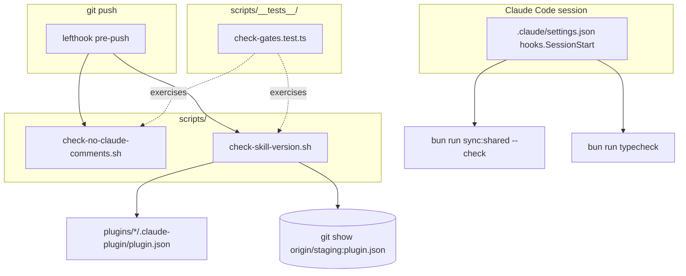
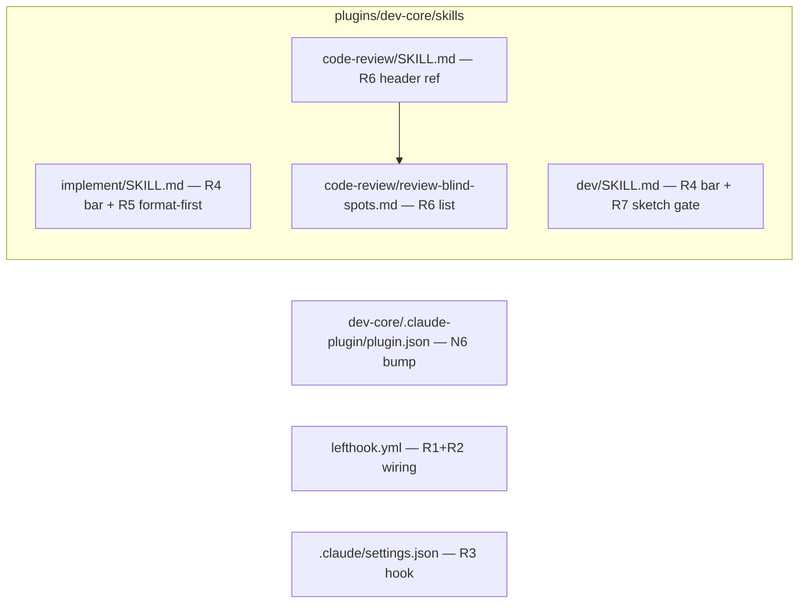

## Summary

Ship 7 foldkit patterns in one PR: R1/R2 pre-push gates (with committed vitest fixtures), R3 SessionStart drift hook, R4/R5/R7 dev-core skill calibration, R6 code-review blind-spots resource, N6 dev-core version bump (which makes the PR pass its own R2 gate). Test-first for the logic-bearing scripts; inline/review verification for config + prose.

## Architecture

### Data flow



### File × responsibility map



## Agents

| Instance | Subject(s) | Tasks | Files |
|---|---|---|---|
| tester-A | gate-tests | T1, T11 | `scripts/__tests__/check-gates.test.ts` |
| devops-A | gates, session-hook | T2, T3, T4, T5 | `scripts/check-no-claude-comments.sh`, `scripts/check-skill-version.sh`, `lefthook.yml`, `.claude/settings.json` |
| doc-writer-A | dev-core-skills | T6, T7, T8 | `implement/SKILL.md`, `dev/SKILL.md`, `dev-core/.claude-plugin/plugin.json` |
| doc-writer-B | review-blind-spots | T9, T10 | `code-review/review-blind-spots.md`, `code-review/SKILL.md` |

## Wave Structure

3 waves, max 4 parallel agents. Elapsed ~1 session vs ~4 sequential.

| Wave | Trigger | Agents | Tasks |
|------|---------|--------|-------|
| 1 | start | 4 ∥ | tester-A: T1 (RED) · devops-A: T5 · doc-writer-A: T6→T7→T8 · doc-writer-B: T9→T10 |
| 2 | RED-GATE-1 (T1 landed) | 1 | devops-A: T2, T3 → T4 |
| 3 | all GREEN done | 1 | tester-A: T11 (verify) |

### Budget — per task

| Task | Items | Class | Est. ops | Split? |
|------|-------|-------|----------|--------|
| T1 vitest fixtures (R1+R2) | 1 | exploratory | 10 | — |
| T2 R1 script | 1 | bounded | 3 | — |
| T3 R2 script | 1 | judgmental | 6 | — |
| T4 lefthook wiring | 1 | bounded | 2 | — |
| T5 settings.json hook | 1 | bounded | 2 | — |
| T6 implement/SKILL.md | 1 | judgmental | 5 | — |
| T7 dev/SKILL.md | 1 | judgmental | 6 | — |
| T8 version bump | 1 | trivial | 1 | — |
| T9 blind-spots resource | 1 | judgmental | 5 | — |
| T10 code-review wiring | 1 | bounded | 2 | — |
| T11 verify + QG | 1 | judgmental | 6 | — |

**Total estimated ops: 48**

### Budget — per agent instance

| Instance | Tasks | Σ ops | Subjects | Split? |
|----------|-------|-------|----------|--------|
| tester-A | T1, T11 | 16 | gate-tests | — |
| devops-A | T2, T3, T4, T5 | 13 | gates, session-hook | — (4 tasks ≤ 4, 2 subjects ≤ 2) |
| doc-writer-A | T6, T7, T8 | 12 | dev-core-skills | — |
| doc-writer-B | T9, T10 | 7 | review-blind-spots | — |

No splits required.

## Consistency Report

Spec criteria → tasks: 16/16 covered.

| Criterion | Task(s) |
|---|---|
| R1a, R1b | T1 (tests) + T2 (script) |
| R2a, R2b, R2c, R2d | T1 (tests) + T3 (script) |
| N3 | T4 |
| R3a, R3b | T5 + T11 (shadow-bun) |
| R4 | T6 + T7 |
| R5 | T6 |
| R6 | T9 + T10 |
| R7a, R7b | T7 |
| N6 | T8 |
| QG | T11 |

Untraced tasks: none. Exemptions: none.

## Micro-Tasks

### T1 — RED: gate test suite [tester-A · gate-tests · RED · diff 3]
- **File:** `scripts/__tests__/check-gates.test.ts`
- **Snippet:** vitest using `node:child_process execSync` + `node:fs`/`node:os` temp dirs. Per the `worktreeScaffold.test.ts` / `scaffold-integration.test.ts` pattern. Build a temp git repo with a bare `origin` remote + `staging` branch for R2 cases.
  - R1: plant `# CLAUDE: x` in a tracked `.ts` → expect exit 1; plant `CLAUDE:` only in a `.md` → expect exit 0.
  - R2: fixture plugin with `version` unchanged vs origin/staging + changed `skills/` → exit 1; plugin without `version` field + changed skills → exit 0; version bumped above base → exit 0.
- **Verify:** `bun run test scripts/__tests__/check-gates.test.ts` → fails (scripts absent).
- **Trace:** R1a/R1b/R2a-d · Slice S1

### RED-GATE-1 [sentinel]
- T1 test file committed/landed → unblocks T2, T3 GREEN.

### T2 — R1 gate script [devops-A · gates · GREEN · diff 2]
- **File:** `scripts/check-no-claude-comments.sh`
- **Snippet:**
  ```bash
  #!/usr/bin/env bash
  set -euo pipefail
  # R1: block leftover AI-instruction comments in SOURCE (not prose).
  hits=$(git grep -nE '(#|//|/\*)[[:space:]]*CLAUDE:' -- \
    '*.ts' '*.tsx' '*.js' '*.jsx' '*.py' '*.sh' \
    ':(exclude)scripts/check-no-claude-comments.sh' || true)
  if [ -n "$hits" ]; then echo "Unresolved CLAUDE: comments:"; echo "$hits"; exit 1; fi
  ```
- **Verify:** `bash scripts/check-no-claude-comments.sh; echo $?` → 0 on clean tree.
- **Trace:** R1a/R1b · S1

### T3 — R2 gate script [devops-A · gates · GREEN · diff 3]
- **File:** `scripts/check-skill-version.sh`
- **Snippet:**
  ```bash
  #!/usr/bin/env bash
  set -euo pipefail
  # R2: versioned plugin's skills/ or commands/ changed without a version bump → block.
  # Constraints (documented): plugin rename may not fire on the renaming push;
  # commands/ dir is forward-compatible (absent today); requires fetched origin/staging.
  git fetch origin staging --quiet 2>/dev/null || true
  changed=$(git diff --name-only origin/staging...HEAD -- 'plugins/*/skills/' 'plugins/*/commands/' || true)
  plugins=$(echo "$changed" | sed -nE 's#^plugins/([^/]+)/.*#\1#p' | sort -u)
  fail=0
  for p in $plugins; do
    pj="plugins/$p/.claude-plugin/plugin.json"
    [ -f "$pj" ] || continue
    cur=$(jq -r '.version // empty' "$pj" 2>/dev/null || true)
    [ -n "$cur" ] || continue   # SHA-based plugin → skip
    base=$(git show "origin/staging:$pj" 2>/dev/null | jq -r '.version // empty' 2>/dev/null || true)
    if [ "$base" = "$cur" ]; then
      echo "$p: skills/commands changed without version bump (still $cur) — bump $pj"; fail=1
    fi
  done
  [ "$fail" -eq 0 ]
  ```
- **Verify:** `bash scripts/check-skill-version.sh; echo $?` (in worktree, dev-core not yet bumped vs origin/staging but skills changed → should report; passes once T8 bumps).
- **Trace:** R2a-d · S1

### T4 — lefthook wiring [devops-A · gates · GREEN · diff 2]
- **File:** `lefthook.yml` (`pre-push.commands`)
- **Snippet:** add alongside `test`/`trufflehog`:
  ```yaml
  check-no-claude-comments:
    run: scripts/check-no-claude-comments.sh
  check-skill-version:
    run: scripts/check-skill-version.sh
  ```
- **Verify:** `grep -A1 check-no-claude-comments lefthook.yml` + `grep -A1 check-skill-version lefthook.yml`.
- **Trace:** N3 · S1

### T5 — SessionStart hook [devops-A · session-hook · GREEN · diff 2]
- **File:** `.claude/settings.json` (add `hooks` key, preserve `enabledPlugins` + `extraKnownMarketplaces`)
- **Snippet:**
  ```json
  "hooks": {
    "SessionStart": [
      { "matcher": "", "hooks": [
        { "type": "command",
          "command": "bun run sync:shared --check && bun run typecheck || echo 'SKIP: R3 drift check (toolchain absent or drift)' >&2" }
      ] }
    ]
  }
  ```
- **Verify:** `jq '.hooks.SessionStart' .claude/settings.json` non-null; `jq empty .claude/settings.json` (valid JSON).
- **Trace:** R3a · S2

### T6 — implement/SKILL.md: R4 + R5 [doc-writer-A · dev-core-skills · GREEN · diff 3]
- **File:** `plugins/dev-core/skills/implement/SKILL.md`
- **R4:** after the `QG :=` Let-block — add quality-bar line: the output must read as if hand-authored by the dev-core maintainer; reference `plugins/dev-core/` as calibration; frame lint/typecheck/test as the mechanical floor.
- **R5:** at every `{commands.lint}`/`{lint}` site (grep to locate: `QG :=` Let-block, Pre-flight `V :=` line, Step 5 bash block) prepend `{commands.format} &&` → `format → lint → typecheck → test`; add a one-line rationale (format before lint to avoid format-induced lint noise).
- **Verify:** `grep -n 'commands.format' plugins/dev-core/skills/implement/SKILL.md` → ≥3 sites; `grep -c 'dev-core maintainer' …` ≥1.
- **Trace:** R4, R5 · S3

### T7 — dev/SKILL.md: R4 + R7 [doc-writer-A · dev-core-skills · GREEN · diff 4]
- **File:** `plugins/dev-core/skills/dev/SKILL.md`
- **R4:** in the Step 1 context block — same quality-bar reference to `plugins/dev-core/`.
- **R7a:** add a new pre-plan gate row to the Step 6 gate-table (or a clearly labeled pre-plan block) firing only for `τ == F-full`, BEFORE the plan skill: present arch sketch (component boundaries, data flow per layer, state ownership, integration points) → wait for user confirm → then plan.
- **R7b:** in Step 6b note the F-full sketch gate is excluded from the `--audit`-replaces-gate rule (audit cannot bypass it).
- **Verify:** `grep -n 'sketch' plugins/dev-core/skills/dev/SKILL.md` covers boundaries/data flow/state ownership; `grep -n 'audit' …` shows the exclusion note.
- **Trace:** R4, R7a, R7b · S3

### T8 — dev-core version bump [doc-writer-A · dev-core-skills · GREEN · diff 1]
- **File:** `plugins/dev-core/.claude-plugin/plugin.json`
- **Snippet:** `"version": "0.6.2"` → `"version": "0.7.0"` (new reviewer blind-spots + arch-sketch gate + format-first = feature-level).
- **Verify:** `jq -r .version plugins/dev-core/.claude-plugin/plugin.json` → `0.7.0`.
- **Trace:** N6 · S3

### T9 — blind-spots resource [doc-writer-B · review-blind-spots · GREEN · diff 3]
- **File:** `plugins/dev-core/skills/code-review/review-blind-spots.md`
- **Snippet:** ≥15 Python/infra failure modes (table: pattern → why it bites → what to check). Seed from spec/analysis: bare `except` w/o re-raise, `subprocess.run` w/o `check=True`, f-string shell injection, missing DB transaction boundary, missing `RETURNING`/rowcount check, hard-coded creds, `os.path.join` vs `pathlib`, `print` in non-CLI (use logger), unbounded loop / no timeout, mutable default arg, broad `# type: ignore`, missing `await`, swallowed errors (`|| true` masking real failures), unvalidated external input, path traversal, race on file write w/o atomic rename, missing `set -euo pipefail` in bash, unquoted shell vars.
- **Verify:** `grep -c '^|' …` or count enumerated items ≥15.
- **Trace:** R6 · S4

### T10 — wire blind-spots into code-review [doc-writer-B · review-blind-spots · GREEN · diff 2]
- **File:** `plugins/dev-core/skills/code-review/SKILL.md` (shared spawn-prompt header, § "Spawn template")
- **Snippet:** add one header line to the shared agent prompt: "Additionally audit each chunk against the systematic blind spots in `${CLAUDE_PLUGIN_ROOT}/skills/code-review/review-blind-spots.md` — address each applicable one explicitly." (all agents receive it).
- **Verify:** `grep -n 'review-blind-spots' plugins/dev-core/skills/code-review/SKILL.md`.
- **Trace:** R6 · S4

### T11 — Verify: QG + R3 + final [tester-A · gate-tests · Verify · diff 3]
- **Files:** all
- **Checks:**
  - `bunx biome check --write` → `bunx biome check .` → `tsc --noEmit` → `bun run test` (format-first, matching R5).
  - R3 shadow-bun: run the SessionStart command with `bun` shadowed → prints SKIP, exit 0.
  - R1/R2 vitest (T1) now green.
  - R2 self-host sanity: with T8 bump present, `bash scripts/check-skill-version.sh` exits 0.
- **Verify:** all exit 0.
- **Trace:** R3b, QG · S1-S4

## Task Seeding Blueprint

<!-- Used by /implement to seed TaskCreate calls. T-numbers ref this list, not session task IDs. -->

### Wave 1 — no deps, 4 agents ∥

| Task | Agent instance | blockedBy | Subject |
|------|---------------|-----------|---------|
| T1 | tester-A | — | gate-tests |
| T5 | devops-A | — | session-hook |
| T6 | doc-writer-A | — | dev-core-skills |
| T7 | doc-writer-A | T6 | dev-core-skills |
| T8 | doc-writer-A | T7 | dev-core-skills |
| T9 | doc-writer-B | — | review-blind-spots |
| T10 | doc-writer-B | T9 | review-blind-spots |

### Wave 2 — after RED-GATE-1 (T1), devops-A

| Task | Agent instance | blockedBy | Subject |
|------|---------------|-----------|---------|
| T2 | devops-A | T1 | gates |
| T3 | devops-A | T1 | gates |
| T4 | devops-A | T2, T3 | gates |

### Wave 3 — final verify

| Task | Agent instance | blockedBy | Subject |
|------|---------------|-----------|---------|
| T11 | tester-A | T2, T3, T4, T5, T6, T7, T8, T9, T10 | gate-tests |

## Task IDs

<!-- Generated by /plan. Used by /implement to resume tasks on session restart. -->
- T1: 10 — gate-tests (RED)
- T2: 11 — gates (R1 script)
- T3: 12 — gates (R2 script)
- T4: 13 — gates (lefthook wiring)
- T5: 14 — session-hook (R3)
- T6: 15 — dev-core-skills (implement R4+R5)
- T7: 16 — dev-core-skills (dev R4+R7)
- T8: 17 — dev-core-skills (version bump)
- T9: 18 — review-blind-spots (resource)
- T10: 19 — review-blind-spots (wiring)
- T11: 20 — gate-tests (verify)
