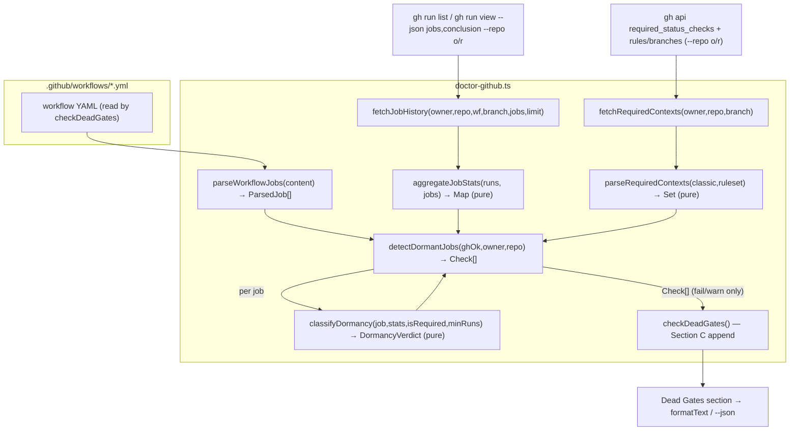
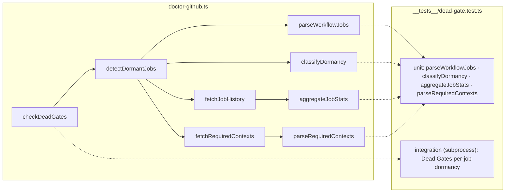

## Summary

Extend `checkDeadGates()` in `plugins/dev-core/skills/checkup/doctor-github.ts` with sub-check **C**
(per-job dormancy): a pure static job parser + a pure verdict function + pure history/required-context
aggregators wrapped by thin `gh` fetchers, orchestrated by `detectDormantJobs()` and rendered into the
existing `Dead Gates` section. Single source file + co-located tests in `__tests__/dead-gate.test.ts`.

## Architecture

### Data flow

### File × Function map

## Agents

| Agent instance | Tasks | Files | Subjects |
|---|---|---|---|
| backend-dev-A | T1, T2, T3, T4, T5 | `doctor-github.ts` (+ co-located unit tests in `dead-gate.test.ts`) | parser, verdict, history, required-checks, orchestrator |
| tester-A | T6, T7 | `dead-gate.test.ts` | integration, coverage |

## Wave Structure

1 wave (sequential chain — all source in one file; parallel split would conflict). ~7 chained tasks.
Elapsed ≈ sequential (no parallelism gain possible on a single file); 2 named instances for impl/test split.

| Wave | Trigger | Agents | Tasks |
|------|---------|--------|-------|
| 1 | start | 1 (backend-dev-A) | T1→T2→T3→T4→T5 |
| 2 | Wave 1 done | 1 (tester-A) | T6→T7 |

### Budget — per task

| Task | Items | Class | Est. ops | Split? |
|------|-------|-------|----------|--------|
| T1 parseWorkflowJobs + tests | 1 | judgmental | 5 | — |
| T2 classifyDormancy + tests | 1 | judgmental | 5 | — |
| T3 aggregateJobStats + tests | 1 | judgmental | 6 | — |
| T4 required-contexts + fetchers + tests | 2 | judgmental | 6 | — |
| T5 detectDormantJobs + wire | 1 | judgmental | 5 | — |
| T6 integration test | 1 | judgmental | 5 | — |
| T7 coverage audit + QG | 1 | bounded | 3 | — |

**Total estimated ops: ~35**

### Budget — per agent instance

| Instance | Tasks | Σ ops | Subjects | Split? |
|----------|-------|-------|----------|--------|
| backend-dev-A | T1–T5 | 27 | parser, verdict, history, required-checks, orchestrator (5) | **OVERRIDE — no split**: all tasks target the single file `doctor-github.ts`; parallel split conflicts, sequential handoff loses file context. Per skill's "shared file → merge into single agent". Ops 27 < 50. |
| tester-A | T6–T7 | 8 | integration, coverage (2) | — |

## Consistency Report

Covered: 11/11 success criteria.

| Criterion | Task(s) |
|---|---|
| AC-6 (wiring warn) | T2, T6 |
| AC-7 (required fail) | T2, T6 |
| AC-8 (conditional unflagged) | T2 |
| AC-9 (grace window) | T2, T5, T6 |
| AC-10 (renders sub-grouped, read-only) | T5, T6 |
| AC-11 (required-context union + 404) | T4 |
| Parser (ParsedJob fields, `( )`-name) | T1 |
| Eligibility semantics | T3 |
| Clean-state pass | T6 |
| `--repo` correctness | T4, T7 |
| lint + typecheck + test green | T7 (RED-GATE) |

Untraced tasks: none. Exemptions: none.

## Micro-Tasks

### Slice S1 — parseWorkflowJobs (parser)

**T1** · backend-dev-A · subject: parser · difficulty 3 · ~5 min · spec trace: Parser AC / N1 / S1
- **File:** `plugins/dev-core/skills/checkup/doctor-github.ts` (+ `__tests__/dead-gate.test.ts`)
- **Do:** add `export interface ParsedJob { id; displayName; hasIf; matrixEmpty; needs }` and
  `export function parseWorkflowJobs(content: string): ParsedJob[]` — walk `jobs:` (2-space headers,
  reuse the header-scan idiom from `detectUnsafeTokenInTriggeredWorkflow`); per job detect `if:`,
  `strategy.matrix` static-empty (`matrix: {}`/`[]`/an axis `[]`), `needs:` (scalar or list),
  `name:` → displayName (fallback id). Add unit tests incl. a job whose `name:` contains ` (`.
- **Verify:** `bun test dead-gate -t parseWorkflowJobs` → green
- **Phase:** RED→GREEN (co-located)

### Slice S2 — classifyDormancy (verdict)

**T2** · backend-dev-A · subject: verdict · difficulty 3 · ~5 min · trace: AC-6/7/8/9 / N6 / S2 · blockedBy T1
- **Do:** add `DORMANCY_MIN_RUNS = 5`, `DORMANCY_RUN_LIMIT = 10`; `export type DormancyVerdict`
  (`alive | dormant_required | dormant_wiring | conditional_ok`); `export function classifyDormancy(job, stats, isRequired, minRuns): DormancyVerdict`
  implementing the pinned ladder (considered<min→alive; executed>0→alive; required→dormant_required;
  matrixEmpty||!hasIf→dormant_wiring; else conditional_ok). Unit-test the full matrix incl.
  `{considered:10,executed:0,skipped:8}` + hasIf + !required → conditional_ok, and same + required → dormant_required.
- **Verify:** `bun test dead-gate -t classifyDormancy` → green

### Slice S3 — history + required-context aggregation

**T3** · backend-dev-A · subject: history · difficulty 4 · ~6 min · trace: Eligibility AC / N2 / S3 · blockedBy T2
- **Do:** add `JobRunStats { considered; executed; skipped }` + a `RunRecord` shape
  (`{ runConclusion; jobs: {name; conclusion}[] }`); pure
  `export function aggregateJobStats(runs: RunRecord[], jobs: ParsedJob[]): Map<string, JobRunStats>` —
  exclude run-level `skipped`/`cancelled`; per static job match history by `name === displayName ||
  name.startsWith(displayName + ' (')`; considered = retained runs where job present; executed =
  present∧conclusion≠skipped; skipped = present∧conclusion===skipped. Unit-test eligibility semantics
  + anchored matrix-leg (incl. `Build (debug)` not collapsing).
- **Verify:** `bun test dead-gate -t aggregateJobStats` → green

**T4** · backend-dev-A · subject: required-checks · difficulty 4 · ~6 min · trace: AC-11, `--repo` AC / N2,N3 / S3 · blockedBy T3
- **Do:** pure `export function parseRequiredContexts(classicJson: string, rulesetJson: string): Set<string>`
  — union classic `.required_status_checks.contexts[]` + `.checks[].context` + ruleset
  `required_status_checks` rule contexts; tolerate empty/invalid (404→`''`)→∅. Thin gh wrappers
  `fetchJobHistory(owner,repo,wf,branch,jobs,limit)` (uses `aggregateJobStats`; **`--repo owner/repo`**
  on `gh run list` AND `gh run view --json jobs,conclusion`; inline comment re matrix-leg display
  convention fragility) + `fetchRequiredContexts(owner,repo,branch)` (uses `parseRequiredContexts`,
  memo by caller). Unit-test `parseRequiredContexts`: each source, union, 404→∅.
- **Verify:** `bun test dead-gate -t parseRequiredContexts` → green

### Slice S4 — orchestrate + wire

**T5** · backend-dev-A · subject: orchestrator · difficulty 4 · ~5 min · trace: AC-10 / N4,N5 / S4 · blockedBy T4
- **Do:** `export function detectDormantJobs(ghOk, owner, repo): Check[]` — guard `!ghOk`/`!repoAgeOk`→[];
  ∀ branch∈PROTECTED_BRANCHES (exists) × wf∈STANDARD_WORKFLOWS with `countPushRuns>0` ∧ `workflowAgeOk`:
  read file→parseWorkflowJobs; required=fetchRequiredContexts(memo/branch); stats=fetchJobHistory;
  ∀ job→classifyDormancy→push Check ONLY for dormant_required(`fail`)/dormant_wiring(`warn`), named
  `"<wf>:<branch>:<job> dormancy"`. Wire into `checkDeadGates`: `checks.push(...detectDormantJobs(ghOk, owner, repo))`
  AFTER sub-check B, BEFORE the `checks.length === 0` pass fallback.
- **Verify:** `bun run typecheck` clean ∧ `bun test dead-gate` green

**T6** · tester-A · subject: integration · difficulty 3 · ~5 min · trace: AC-10, clean-state / S4 · blockedBy T5
- **Do:** add subprocess integration tests in the existing `checkDeadGates (integration via subprocess)`
  describe block: (a) a fixture workflow with a never-running job renders a `… dormancy` check
  sub-grouped by job; (b) clean state → single `pass` covering B+C; (c) read-only guard (no mutation /
  no run state change), mirroring the existing AC-1 read-only test.
- **Verify:** `bun test dead-gate` → green

**T7** · tester-A · subject: coverage · difficulty 2 · ~3 min · trace: QG / RED-GATE · blockedBy T6
- **Do:** audit the suite against AC-6…AC-11 + parser/eligibility/clean-state/`--repo`; add any missing
  case; confirm `--repo` present in N2. Run full QG.
- **Verify (RED-GATE):** `bun run lint && bun run typecheck && bun test` → all green

## Task Seeding Blueprint

<!-- Used by /implement to seed TaskCreate calls on session start.
     Format: T{n} | agent-instance | blockedBy | subject -->

### Wave 1 — start, backend-dev-A (sequential chain)

| Task | Agent instance | blockedBy | Subject |
|------|---------------|-----------|---------|
| T1 | backend-dev-A | — | parser |
| T2 | backend-dev-A | T1 | verdict |
| T3 | backend-dev-A | T2 | history |
| T4 | backend-dev-A | T3 | required-checks |
| T5 | backend-dev-A | T4 | orchestrator |

### Wave 2 — after Wave 1, tester-A (sequential chain)

| Task | Agent instance | blockedBy | Subject |
|------|---------------|-----------|---------|
| T6 | tester-A | T5 | integration |
| T7 | tester-A | T6 | coverage |

## Task IDs

<!-- Generated by /plan. Used by /implement to resume tasks on session restart. -->
- T1: 11 — parser
- T2: 12 — verdict
- T3: 13 — history
- T4: 14 — required-checks
- T5: 15 — orchestrator
- T6: 16 — integration
- T7: 17 — coverage
