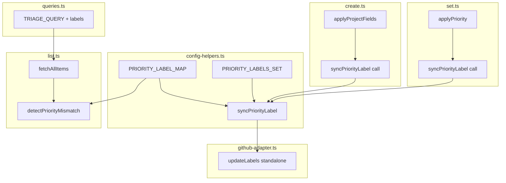
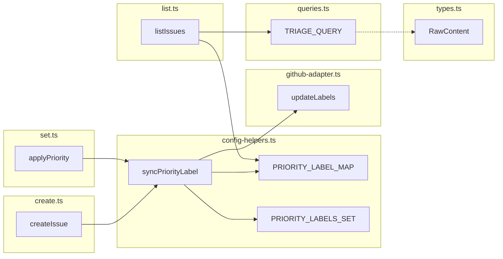

## Summary

Add priority label sync to `triage.ts create` and `set` commands, and mismatch detection to `list`. Four slices: constants/helper → create sync → set sync → list mismatch. All changes within `issue-triage/` and `shared/`.

## Architecture

### Data flow



### File x function map



## Agents

| Agent | Tasks | Files |
|-------|-------|-------|
| backend-dev | 7 | config-helpers.ts, github-adapter.ts, create.ts, set.ts, list.ts, queries.ts, types.ts |
| tester | 4 | create.test.ts, set.test.ts, list.test.ts, priority-labels.test.ts (new) |

## Consistency Report

| Metric | Value |
|--------|-------|
| Success criteria covered | 8/8 |
| Uncovered | 0 |
| Untraced tasks | 0 |

| SC | Task(s) |
|----|---------|
| SC-1: create applies label | T3 |
| SC-2: set removes stale + adds new | T5 |
| SC-3: set idempotent | T5 |
| SC-4: non-fatal label sync | T1 (syncPriorityLabel try/catch) |
| SC-5: list mismatch marker | T7 |
| SC-6: create without priority unchanged | T3 (no-op path) |
| SC-7: existing tests pass | T8 |
| SC-8: new unit tests | T8, T9, T10, T11 |

## Micro-Tasks

### Slice 1: Constants + Helper

#### T1 — Add PRIORITY_LABEL_MAP, PRIORITY_LABELS_SET, syncPriorityLabel to config-helpers.ts [P]

- **Agent:** backend-dev
- **File:** `plugins/dev-core/skills/shared/adapters/config-helpers.ts`
- **Spec trace:** SC-1, SC-2, SC-4
- **Phase:** RED → GREEN
- **Difficulty:** 1

```ts
// After PRIORITY_SHORT definition (~line 146)
export const PRIORITY_LABEL_MAP: Record<string, string> = {
  'P0 - Urgent': 'P0-critical',
  'P1 - High': 'P1-high',
  'P2 - Medium': 'P2-medium',
  'P3 - Low': 'P3-low',
}

export const PRIORITY_LABELS_SET = new Set(Object.values(PRIORITY_LABEL_MAP))
```

`syncPriorityLabel(issueNumber, canonical)`:
- Lookup `PRIORITY_LABEL_MAP[canonical]` → target label
- Compute stale = `PRIORITY_LABELS_SET` minus target
- Call `updateLabels(issueNumber, [target], [...stale])`
- Wrap in try/catch → `console.error` warning on failure (non-fatal)

**Verify:** `bun test -- --run plugins/dev-core/skills/shared/__tests__/priority-labels.test.ts`

#### T2 — Add standalone updateLabels export to github-adapter.ts [P]

- **Agent:** backend-dev
- **File:** `plugins/dev-core/skills/shared/adapters/github-adapter.ts`
- **Spec trace:** SC-1, SC-2
- **Phase:** RED → GREEN
- **Difficulty:** 1

```ts
// After existing standalone exports
export async function updateLabels(issueNumber: number, add: string[], remove: string[]): Promise<void> {
  const args = ['gh', 'issue', 'edit', String(issueNumber), '--repo', GITHUB_REPO]
  if (add.length) args.push('--add-label', add.join(','))
  if (remove.length) args.push('--remove-label', remove.join(','))
  await run(args)
}
```

Note: `GITHUB_REPO` needs to be imported from config-helpers (already exported there). The standalone function uses the module-level `run()` already exported.

**Verify:** `bun typecheck`

---
**RED-GATE V1:** `bun test -- --run plugins/dev-core/skills/shared/__tests__/priority-labels.test.ts` must pass.

---

### Slice 2: Create Sync

#### T3 — Wire syncPriorityLabel into create.ts

- **Agent:** backend-dev
- **File:** `plugins/dev-core/skills/issue-triage/lib/create.ts`
- **Spec trace:** SC-1, SC-6
- **Phase:** GREEN
- **Difficulty:** 1

After `applyProjectFields` call in `createIssue()` (~line 193), add:

```ts
import { syncPriorityLabel } from '../../shared/adapters/config-helpers'

// After applyProjectFields, before applyRelationships
if (opts.priority) {
  const canonical = resolvePriority(opts.priority)
  if (canonical) await syncPriorityLabel(issueNumber, canonical)
}
```

Note: `resolvePriority` is already imported. The sync runs regardless of whether the project board is configured (labels are independent).

**Verify:** `bun test -- --run plugins/dev-core/skills/issue-triage/__tests__/create.test.ts`

---
**RED-GATE V2:** Create test (T9) + existing create tests must pass.

---

### Slice 3: Set Sync

#### T5 — Wire syncPriorityLabel into set.ts

- **Agent:** backend-dev
- **File:** `plugins/dev-core/skills/issue-triage/lib/set.ts`
- **Spec trace:** SC-2, SC-3
- **Phase:** GREEN
- **Difficulty:** 1

After `applyPriority` call in `applyProjectFields()` (~line 157), add label sync:

```ts
import { syncPriorityLabel } from '../../shared/adapters/config-helpers'

// In applyProjectFields, after the priority field update
if (opts.priority) {
  const canonical = resolvePriority(opts.priority)
  if (canonical) await syncPriorityLabel(opts.issueNumber, canonical)
}
```

Alternative: call `syncPriorityLabel` at the top level in `setIssue()` after `applyProjectFields()` — either works since sync is non-fatal.

**Verify:** `bun test -- --run plugins/dev-core/skills/issue-triage/__tests__/set.test.ts`

---
**RED-GATE V3:** Set test (T10) + existing set tests must pass.

---

### Slice 4: List Mismatch

#### T6 — Extend TRIAGE_QUERY + RawContent with labels [P]

- **Agent:** backend-dev
- **Files:** `plugins/dev-core/skills/shared/queries.ts`, `plugins/dev-core/skills/shared/types.ts`
- **Spec trace:** SC-5
- **Phase:** RED
- **Difficulty:** 1

In `TRIAGE_QUERY` (queries.ts line 49), add `labels(first: 10) { nodes { name } }` inside the Issue fragment:
```graphql
... on Issue { number title body state labels(first: 10) { nodes { name } } }
```

In `RawContent` (types.ts), add:
```ts
labels?: { nodes: { name: string }[] }
```

**Verify:** `bun typecheck`

#### T7 — Add mismatch detection to list.ts

- **Agent:** backend-dev
- **File:** `plugins/dev-core/skills/issue-triage/lib/list.ts`
- **Spec trace:** SC-5
- **Phase:** GREEN
- **Difficulty:** 2

Add `detectPriorityMismatch(item)` function:
- Extract project priority from `fieldValues` (existing `fieldValue` helper)
- Extract label priority: find first label in `PRIORITY_LABELS_SET`, reverse-map via `PRIORITY_LABEL_MAP`
- Compare: if both exist and disagree → `⚠`; if one exists and other doesn't → `⚠`
- If neither exists → no marker

Update table output: add `⚠` column or append marker to Pri column.

**Verify:** `bun test -- --run plugins/dev-core/skills/issue-triage/__tests__/list.test.ts`

---
**RED-GATE V4:** `bun test && bun typecheck` — all tests pass, no type errors.

---

### Tests

#### T8 — Unit tests for PRIORITY_LABEL_MAP + syncPriorityLabel [P]

- **Agent:** tester
- **File:** `plugins/dev-core/skills/shared/__tests__/priority-labels.test.ts` (new)
- **Spec trace:** SC-8
- **Phase:** RED → GREEN
- **Difficulty:** 2

Tests:
- `PRIORITY_LABEL_MAP` has 4 entries, values match expected label names
- `PRIORITY_LABELS_SET` has 4 entries, derived from map values
- `syncPriorityLabel('P1 - High')` calls `updateLabels` with add=['P1-high'], remove=['P0-critical','P2-medium','P3-low']
- `syncPriorityLabel` with failing `updateLabels` → logs warning, does not throw
- `syncPriorityLabel` with invalid canonical → no-op

#### T9 — Add label sync test to create.test.ts

- **Agent:** tester
- **File:** `plugins/dev-core/skills/issue-triage/__tests__/create.test.ts`
- **Spec trace:** SC-1, SC-6, SC-8
- **Phase:** GREEN
- **Difficulty:** 1

Tests:
- `create --priority P1` → `syncPriorityLabel` called with (99, 'P1 - High')
- `create` without `--priority` → `syncPriorityLabel` not called

#### T10 — Add label sync test to set.test.ts

- **Agent:** tester
- **File:** `plugins/dev-core/skills/issue-triage/__tests__/set.test.ts`
- **Spec trace:** SC-2, SC-3, SC-8
- **Phase:** GREEN
- **Difficulty:** 1

Tests:
- `set 42 --priority P2` → `syncPriorityLabel` called with (42, 'P2 - Medium')
- Label sync failure → project field still updated (non-fatal)

#### T11 — Add mismatch test to list.test.ts

- **Agent:** tester
- **File:** `plugins/dev-core/skills/issue-triage/__tests__/list.test.ts`
- **Spec trace:** SC-5, SC-8
- **Phase:** GREEN
- **Difficulty:** 2

Tests:
- Issue with matching field + label → no `⚠`
- Issue with field `P1 - High` but label `P2-medium` → `⚠`
- Issue with field but no label → `⚠`
- Issue with label but no field → `⚠`
