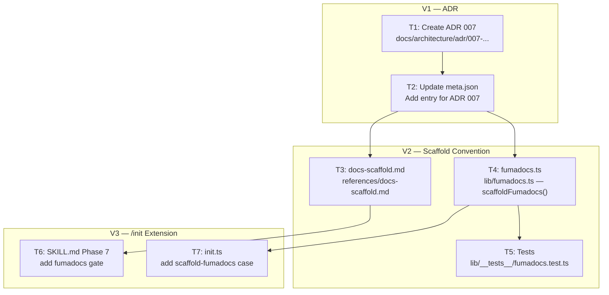
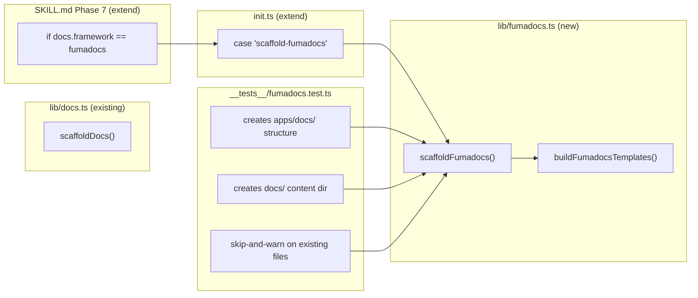

## Summary

Write ADR 007 documenting the per-project Fumadocs architecture decision, define a scaffold convention reference, implement `scaffoldFumadocs()` in a new `lib/fumadocs.ts`, and extend `/init` Phase 7 to invoke it when `docs.framework: fumadocs` is set in `stack.yml`. Reference implementation: `roxabi_boilerplate` (`apps/docs/` + `docs/`).

## Architecture





## Agents

| Agent | Tasks | Files |
|-------|-------|-------|
| doc-writer | T1, T2, T3, T6 | `adr/007-...`, `meta.json`, `docs-scaffold.md`, `SKILL.md` |
| backend-dev | T4 | `lib/fumadocs.ts` |
| tester | T5 | `lib/__tests__/fumadocs.test.ts` |
| devops | T7 | `skills/init/init.ts` |

## Consistency Report

| | Count |
|--|--|
| Success criteria covered | 11/11 |
| Uncovered | 0 |
| Tasks without spec trace | 0 |

## Micro-Tasks

---

### V1 — Write ADR

**T1** — Create ADR 007 [doc-writer] [parallel-safe: N]
- **File:** `docs/architecture/adr/007-documentation-strategy.mdx`
- **Description:** Write ADR 007 following the established pattern (see ADR 006). Sections: Status (Accepted), Context, Options Considered (centralized portal / per-project / hybrid), Decision (per-project with `apps/docs/` + `docs/` monorepo split, matching `roxabi_boilerplate`), Consequences. Note that Fumadocs is a pre-existing constraint. Reference all five projects (roxabi-plugins, lyra, voiceCLI, roxabi-dashboard, roxabi_site) in scope.
- **Skeleton:**
  ```mdx
  ---
  title: "ADR-007: Documentation Strategy — Per-Project Fumadocs with apps/docs/ Split"
  description: Establishes the standard documentation architecture for all Roxabi projects...
  ---

  ## Status

  Accepted

  ## Context

  Five Roxabi projects lack a shared documentation strategy...

  ## Options Considered

  ### Option A: Centralized Fumadocs Portal
  ...

  ### Option B: Per-Project Fumadocs (apps/docs/ split)
  ...

  ### Option C: Hybrid (per-project source, aggregated portal)
  ...

  ## Decision

  **Option B** — per-project `apps/docs/` Next.js app + `docs/` content directory...

  ## Consequences
  ...

  ## Migration Notes

  Existing projects can adopt this pattern by following the scaffold convention...
  ```
- **Verify:** `ls docs/architecture/adr/007-documentation-strategy.mdx`
- **Expected:** file exists, status: Accepted, 3 options evaluated
- **Time:** 8 min | **Difficulty:** 2 | **Spec trace:** SC-1, SC-2, SC-3, SC-10
- **Phase:** GREEN | **Slice:** V1

**T2** — Update ADR meta.json [doc-writer] [parallel-safe: N, after T1]
- **File:** `docs/architecture/adr/meta.json`
- **Description:** Add `"007-documentation-strategy"` to the `pages` array.
- **Skeleton:**
  ```json
  {
    "title": "ADRs",
    "pages": [
      "001-user-data-storage-convention-roxabi-vault",
      "002-cli-plugin-boundary-multi-project-workspace",
      "003-typed-workspace-projects-field-resolution",
      "004-reasoning-audit-and-context-cleanup-consolidation",
      "005-clean-architecture-hexagonal-migration",
      "006-slice-v1-port-boundary-review",
      "007-documentation-strategy"
    ]
  }
  ```
- **Verify:** `cat docs/architecture/adr/meta.json | grep 007`
- **Expected:** `007-documentation-strategy` present
- **Time:** 2 min | **Difficulty:** 1 | **Spec trace:** SC-1
- **Phase:** GREEN | **Slice:** V1

---

### RED-GATE: V1 must pass before V2 begins

Verify: `ls docs/architecture/adr/007-documentation-strategy.mdx && grep '"007-documentation-strategy"' docs/architecture/adr/meta.json`

---

### V2 — Define Scaffold Convention

**T3** — Create scaffold convention reference [doc-writer] [parallel-safe: Y with T4]
- **File:** `plugins/dev-core/references/docs-scaffold.md`
- **Description:** Write a reference doc listing the exact files the fumadocs scaffold generates, their target paths, and the required package versions. This is the human-readable specification of the scaffold — referenced by the ADR and consumed by implementers.
- **Skeleton:**
  ```md
  # Fumadocs Scaffold Convention

  When `docs.framework: fumadocs` is set in `stack.yml`, `/init` Phase 7 generates
  the following monorepo split layout (matching `roxabi_boilerplate`):

  ## Directory Layout

  \`\`\`
  {project-root}/
  ├── apps/
  │   └── docs/
  │       ├── app/
  │       │   ├── layout.tsx
  │       │   ├── page.tsx                  # redirects to /docs
  │       │   └── docs/
  │       │       ├── layout.tsx            # DocsLayout
  │       │       └── [[...slug]]/
  │       │           └── page.tsx          # dynamic doc page
  │       ├── src/lib/source.ts             # fumadocs-core loader
  │       ├── source.config.ts              # fumadocs-mdx config
  │       ├── next.config.ts
  │       └── package.json
  └── docs/
      ├── index.mdx                         # home doc
      └── meta.json                         # root navigation
  \`\`\`

  ## Required Packages (installed in apps/docs/)

  | Package | Version |
  |---------|---------|
  | fumadocs-core | ^15.0.0 |
  | fumadocs-ui | ^15.0.0 |
  | fumadocs-mdx | ^11.0.0 |
  | next | ^15.0.0 |
  | react | ^19.0.0 |
  | react-dom | ^19.0.0 |

  ## source.config.ts

  Points `dir` to `../../docs` (two levels up from `apps/docs/`).

  ## Additive-only rule

  If a file already exists, scaffold skips it and emits a warning. Never overwrites.
  ```
- **Verify:** `ls plugins/dev-core/references/docs-scaffold.md`
- **Expected:** file exists with directory layout + package versions table
- **Time:** 5 min | **Difficulty:** 1 | **Spec trace:** SC-4
- **Phase:** GREEN | **Slice:** V2

**T4** — Implement `scaffoldFumadocs()` [backend-dev] [parallel-safe: Y with T3]
- **File:** `plugins/dev-core/skills/init/lib/fumadocs.ts`
- **Description:** Create a new `fumadocs.ts` module (separate from `docs.ts`). Implements `scaffoldFumadocs(projectRoot: string): FumadocsScaffoldResult`. Generates the full `apps/docs/` Next.js app + `docs/` content directory, matching `roxabi_boilerplate`. Includes Mermaid (theme-aware, DOMPurify-sanitized), Shiki (experimentalJSEngine, dual themes, 19 langs), Tailwind v4, toc, generateMetadata, and `NEXT_PUBLIC_APP_URL` back-link defaulting to `https://roxabi.com`. Additive-only: skip existing files with a warning.

**Files generated by `scaffoldFumadocs()`:**

| Path | Description |
|------|-------------|
| `apps/docs/source.config.ts` | fumadocs-mdx config + remarkMdxMermaid + shikiOptions |
| `apps/docs/next.config.ts` | Next.js config with createMDX + output: standalone |
| `apps/docs/postcss.config.mjs` | Tailwind v4 PostCSS plugin |
| `apps/docs/globals.css` | Tailwind + fumadocs-ui preset + neutral theme |
| `apps/docs/mdx-components.tsx` | useMDXComponents with defaultMdxComponents + Mermaid |
| `apps/docs/tsconfig.json` | paths: @/* → ./src/*, @/.source → .source/index.ts |
| `apps/docs/package.json` | Full dep list (see below) |
| `apps/docs/src/lib/source.ts` | fumadocs-core loader with files() unwrap workaround |
| `apps/docs/src/lib/shiki.ts` | experimentalJSEngine, github-light/dark, 19 langs |
| `apps/docs/src/components/mdx/Mermaid.tsx` | Client component, next-themes, DOMPurify sanitization |
| `apps/docs/app/layout.tsx` | RootProvider + NEXT_PUBLIC_APP_URL back-link (default: https://roxabi.com) |
| `apps/docs/app/page.tsx` | redirect('/docs') |
| `apps/docs/app/docs/layout.tsx` | DocsLayout with source.pageTree |
| `apps/docs/app/docs/[[...slug]]/page.tsx` | toc, generateMetadata, Mermaid component |
| `docs/index.mdx` | Home doc placeholder |
| `docs/meta.json` | Root navigation |

**package.json deps:**
```json
{
  "dependencies": {
    "fumadocs-ui": "^15.4.2",
    "fumadocs-core": "^15.4.2",
    "fumadocs-mdx": "^11.6.7",
    "next": "^15.3.4",
    "react": "^19.2.4",
    "react-dom": "^19.2.4",
    "dompurify": "^3.3.2",
    "mermaid": "^11.4.1",
    "next-themes": "^0.4.6",
    "shiki": "^3.4.0",
    "tailwindcss": "^4.1.0"
  },
  "devDependencies": {
    "@tailwindcss/postcss": "^4.1.0",
    "@types/dompurify": "^3.2.0",
    "@types/mdx": "^2.0.13",
    "@types/node": "^24.11.0",
    "@types/react": "^19.2.14",
    "@types/react-dom": "^19.2.3",
    "typescript": "^5.9.3"
  }
}
```

- **Verify:** `bun tsc --noEmit 2>&1 | head -5` (no type errors in fumadocs.ts)
- **Expected:** no type errors; `scaffoldFumadocs('/tmp/test-fd')` returns `filesCreated` with all 16 paths
- **Time:** 20 min | **Difficulty:** 4 | **Spec trace:** SC-5, SC-6, SC-7, SC-8, SC-11
- **Phase:** GREEN | **Slice:** V2

**T5** — Write tests for `scaffoldFumadocs()` [tester] [parallel-safe: N, after T4]
- **File:** `plugins/dev-core/skills/init/__tests__/fumadocs.test.ts`
- **Description:** Vitest tests. Use a temp directory (`os.tmpdir()`). Three test cases: (1) creates all expected files in `apps/docs/` and `docs/`; (2) skips `docs/` dirs if they already exist (additive-only); (3) returns warnings for skipped files.
- **Verify:** `bun test plugins/dev-core/skills/init/__tests__/fumadocs.test.ts`
- **Expected:** all tests pass
- **Time:** 8 min | **Difficulty:** 2 | **Spec trace:** SC-5, SC-8, SC-11
- **Phase:** GREEN | **Slice:** V2

---

### RED-GATE: V2 must pass before V3 begins

Verify: `bun test plugins/dev-core/skills/init/__tests__/fumadocs.test.ts && ls plugins/dev-core/references/docs-scaffold.md`

---

### V3 — Extend /init Phase 7

**T6** — Update Phase 7 in SKILL.md [doc-writer] [parallel-safe: N, after T3]
- **File:** `plugins/dev-core/skills/init/SKILL.md`
- **Description:** Extend Phase 7 to add a Fumadocs gate. After the existing generic scaffold step, add: "If `docs.framework: fumadocs` in stack.yml → AskUserQuestion: **Scaffold Fumadocs app (apps/docs/)** | **Skip**. If yes: `bun "${CLAUDE_PLUGIN_ROOT}/skills/init/init.ts" scaffold-fumadocs --root <project-root>`". Display result. Mention that `bun install` must be run in `apps/docs/` afterward.
- **Verify:** `grep -n "scaffold-fumadocs\|fumadocs" plugins/dev-core/skills/init/SKILL.md`
- **Expected:** fumadocs gate present in Phase 7
- **Time:** 5 min | **Difficulty:** 2 | **Spec trace:** SC-6, SC-9
- **Phase:** GREEN | **Slice:** V3

**T7** — Add `scaffold-fumadocs` case to `init.ts` [devops] [parallel-safe: N, after T4]
- **File:** `plugins/dev-core/skills/init/init.ts`
- **Description:** Add a new `case 'scaffold-fumadocs':` block following the pattern of the existing `case 'scaffold-docs':`. Import `scaffoldFumadocs` from `./lib/fumadocs`. Parse `--root` flag (default: `process.cwd()`). Call `scaffoldFumadocs(root)`. Output JSON result.
- **Skeleton:**
  ```typescript
  case 'scaffold-fumadocs': {
    const { scaffoldFumadocs } = await import('./lib/fumadocs')
    const root = parseFlag('--root', process.cwd())
    const result = scaffoldFumadocs(root)
    console.log(JSON.stringify(result, null, 2))
    break
  }
  ```
- **Verify:** `bun plugins/dev-core/skills/init/init.ts scaffold-fumadocs --root /tmp/test-fumadocs 2>&1 | head -10`
- **Expected:** JSON output with `filesCreated` array
- **Time:** 5 min | **Difficulty:** 2 | **Spec trace:** SC-6, SC-7, SC-8
- **Phase:** GREEN | **Slice:** V3
