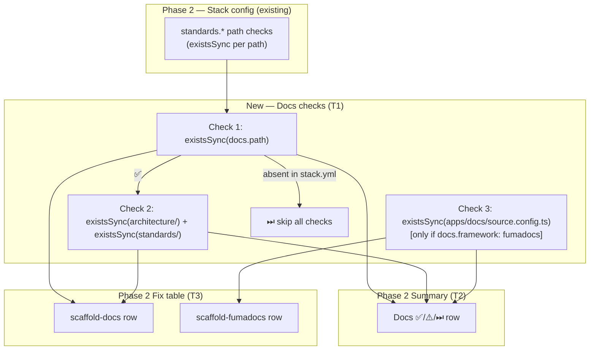
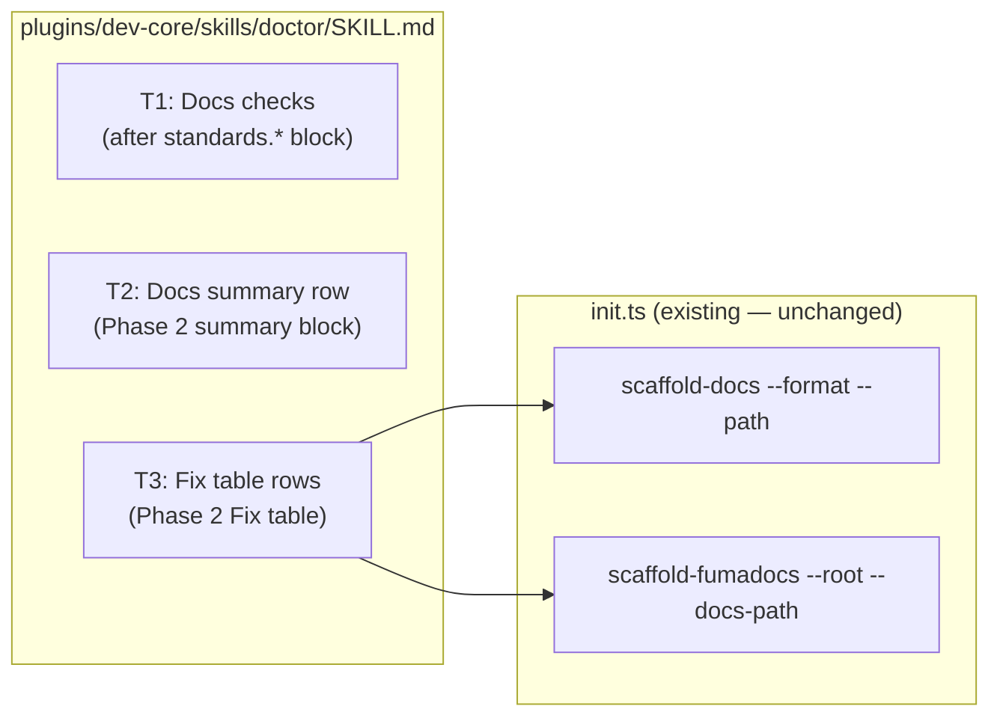

## Summary

Extend `/doctor` Phase 2 with three doc-health checks (docs.path dir, architecture/standards dirs, Fumadocs app), a Docs summary row, and two Phase 2 Fix repair rows — all in a single SKILL.md edit.

## Architecture





## Agents

| Agent | Tasks | Files |
|-------|-------|-------|
| doc-writer | T1, T2, T3 | `plugins/dev-core/skills/doctor/SKILL.md` |

## Consistency Report

| | Count |
|--|--|
| Success criteria covered | 11/11 |
| Uncovered | 0 |
| Tasks without spec trace | 0 |

## Micro-Tasks

---

### V1 — Docs Checks + Summary Row

**T1** — Add docs checks to Phase 2 [doc-writer] [parallel-safe: N]
- **File:** `plugins/dev-core/skills/doctor/SKILL.md`
- **Description:** Insert a new `**Documentation structure:**` block immediately after the existing `**Standards docs exist on disk:**` block (after the `∀ path ∈ standards.* → ...` line). The block must implement all three checks in order with correct conditional logic.
- **Skeleton:**
  ```markdown
  **Documentation structure:**

  Read `docs.path` from `.claude/stack.yml`.
  ¬`docs.path` → display `Docs ⏭ docs.path not set in stack.yml`, skip remaining doc checks.

  - `existsSync(docs.path)` → ✅ `docs/ directory found` | ⚠️ `docs.path not found on disk: {path}` (auto-fixable)
  - ∃ docs.path dir → check `{docs.path}/architecture/` ∧ `{docs.path}/standards/`:
    - both ∃ → ✅ `Docs structure present (architecture/, standards/)`
    - missing ∃ → ⚠️ `Docs structure incomplete — missing: {list of dirs}` (auto-fixable)
  - `docs.framework: fumadocs` in stack.yml → check `existsSync('apps/docs/source.config.ts')`:
    - ∃ → ✅ `Fumadocs app found (apps/docs/)`
    - ¬∃ → ⚠️ `Fumadocs app missing — apps/docs/ not scaffolded` (auto-fixable)
  ```
- **Verify:** `grep -n "docs.path\|Documentation structure" plugins/dev-core/skills/doctor/SKILL.md`
- **Expected:** Block present after `standards.*` check, contains all three conditional checks
- **Time:** 5 min | **Difficulty:** 2 | **Spec trace:** SC-1, SC-2, SC-3, SC-4
- **Phase:** GREEN | **Slice:** V1

**T2** — Add Docs row to Phase 2 summary [doc-writer] [parallel-safe: N, after T1]
- **File:** `plugins/dev-core/skills/doctor/SKILL.md`
- **Description:** Extend the `Print summary:` block (the `Stack config: N checks passed...` section) to include a `Docs` line. The Docs line format depends on check results. Add examples matching the spec.
- **Skeleton:**
  ```markdown
  Docs          ✅ docs/ present, structure complete[, Fumadocs ✅]
                ⚠️ docs/ not found on disk — run scaffold-docs to fix
                ⚠️ docs structure incomplete (missing: {dirs}) — run scaffold-docs
                ⏭ docs.path not set in stack.yml
  ```
  Note: Fumadocs segment appended only when `docs.framework: fumadocs`.
- **Verify:** `grep -n "Docs\s*[✅⚠️⏭]" plugins/dev-core/skills/doctor/SKILL.md`
- **Expected:** Docs row variants present in summary block
- **Time:** 3 min | **Difficulty:** 1 | **Spec trace:** SC-10
- **Phase:** GREEN | **Slice:** V1

---

### RED-GATE: V1 must pass before V2 begins

Verify: `grep -c "docs.path\|Fumadocs\|scaffold-docs" plugins/dev-core/skills/doctor/SKILL.md` → count ≥ 3

---

### V2 — Repair Offer

**T3** — Add scaffold-docs + scaffold-fumadocs rows to Phase 2 Fix table [doc-writer] [parallel-safe: N, after T2]
- **File:** `plugins/dev-core/skills/doctor/SKILL.md`
- **Description:** Add two new rows to the Phase 2 Fix table (the `| Issue | Fix |` table in `#### Phase 2 Fix`). Also add a note that these repair rows take precedence over the existing `standards.*` "edit manually" advisory when the missing paths match scaffold-docs output patterns. Add the targeted re-check instruction after each fix.
- **Skeleton:**
  ```markdown
  | `docs.path missing` \| `docs structure incomplete` | Run scaffold-docs: `bun "${CLAUDE_PLUGIN_ROOT}/skills/init/init.ts" scaffold-docs --format {docs.format} --path {docs.path}` — then re-check docs checks and display updated Docs row |
  | `Fumadocs app missing` | Run scaffold-fumadocs: `bun "${CLAUDE_PLUGIN_ROOT}/skills/init/init.ts" scaffold-fumadocs --root {cwd} --docs-path {docs.path}` — then re-check docs checks and display updated Docs row |
  ```
  Add after the existing table rows (before the closing note about "Issues requiring user input").
  Also add a note: "When `standards.*` paths are missing and match scaffold-docs output patterns, offer scaffold-docs instead of the manual-edit advisory."
- **Verify:** `grep -n "scaffold-docs\|scaffold-fumadocs" plugins/dev-core/skills/doctor/SKILL.md`
- **Expected:** Both fix rows present in Phase 2 Fix table
- **Time:** 4 min | **Difficulty:** 1 | **Spec trace:** SC-5, SC-6, SC-7, SC-8, SC-9, SC-11
- **Phase:** GREEN | **Slice:** V2
