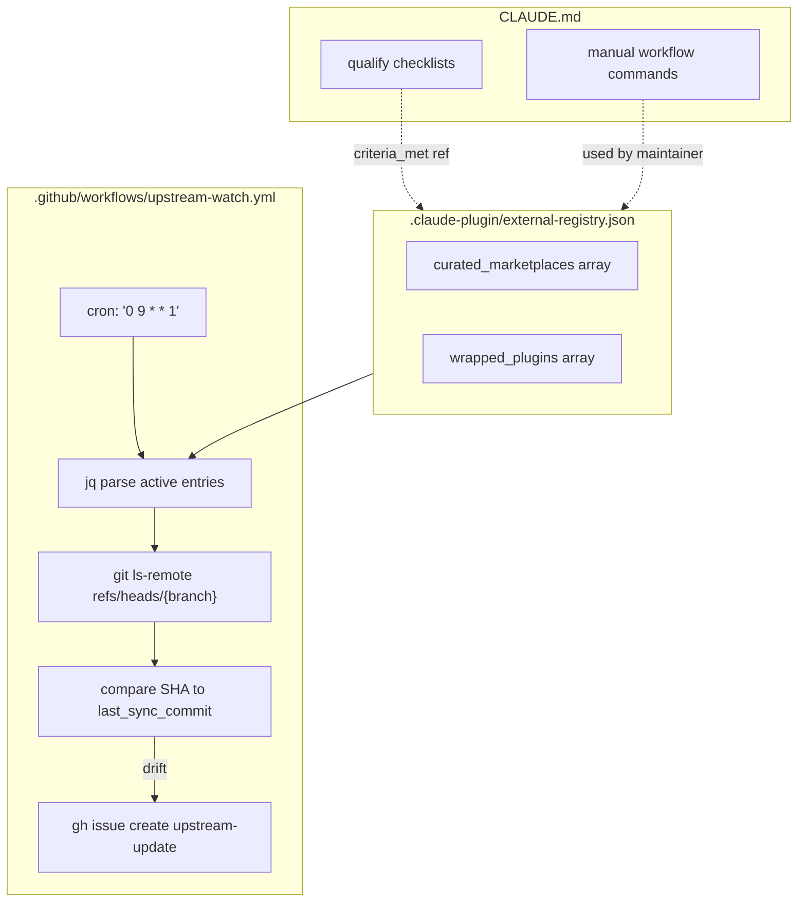
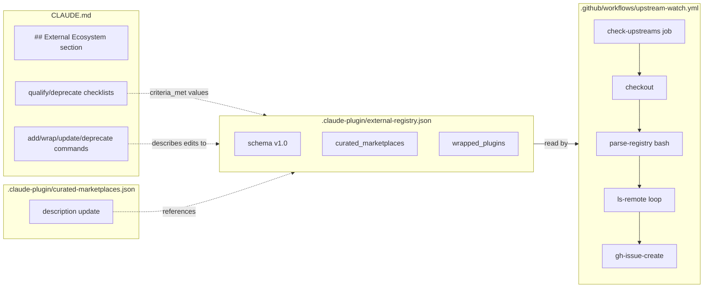

## Summary

Create the registry schema (`external-registry.json`) and CI drift-detection workflow (`upstream-watch.yml`) that form the framework for managing external Claude Code plugins. Update CLAUDE.md with decision criteria for all three plugin cases. Implementation is lean (2 new files, 2 edits) but the GHA workflow requires careful bash scripting.

---

## Architecture

### Data flow



### File × function map



---

## Agents

| Agent | Tasks | Files |
|-------|-------|-------|
| devops | T1, T3, T4 | `.claude-plugin/external-registry.json`, `.github/workflows/upstream-watch.yml`, `.claude-plugin/curated-marketplaces.json` |
| doc-writer | T2 | `CLAUDE.md` |
| tester | T5 | validates T1–T4 outputs |

---

## Consistency Report

| Metric | Value |
|--------|-------|
| Success criteria covered | 7/7 |
| Slices covered | S1, S2 |
| Uncovered criteria | none |
| Untraced tasks | none |

---

## Micro-Tasks

### Slice S1 — Registry schema + CLAUDE.md

---

**T1** [devops] `[P]`
**Create `.claude-plugin/external-registry.json`**
File: `.claude-plugin/external-registry.json`

```json
{
  "$schema": "https://roxabi.dev/schemas/external-registry.schema.json",
  "version": "1.0",
  "description": "Registry of all external Claude Code plugin sources endorsed or vendored by Roxabi. Source of truth for upstream URLs, sync state, and curation status.",
  "curated_marketplaces": [],
  "wrapped_plugins": []
}
```

Schema notes (inline comments for maintainer reference — add as `_schema` key or top-level comment block):
- `curated_marketplaces[].name` — identifier, kebab-case
- `curated_marketplaces[].source` — GitHub repo URL (no .git suffix)
- `curated_marketplaces[].added` — ISO date
- `curated_marketplaces[].last_checked_commit` — HEAD SHA at last CI check
- `curated_marketplaces[].criteria_met` — array: `["marketplace_json","install_mechanism","maintained_90d","quality_content","<50pct_overlap"]`
- `curated_marketplaces[].status` — `active | deprecated`
- `curated_marketplaces[].notes` — free text
- `wrapped_plugins[].plugin` — plugin directory name (matches `external/<name>`)
- `wrapped_plugins[].upstream_url` — `.git` URL for subtree; repo URL for copy
- `wrapped_plugins[].upstream_branch` — e.g. `main`
- `wrapped_plugins[].upstream_path` — subdirectory within repo (copy strategy only, e.g. `skills/vercel-cli`)
- `wrapped_plugins[].last_sync_commit` — SHA of upstream HEAD at last sync
- `wrapped_plugins[].last_sync_date` — ISO date
- `wrapped_plugins[].subtree_prefix` — `external/<name>` (subtree strategy only)
- `wrapped_plugins[].sync_strategy` — `subtree | copy`
- `wrapped_plugins[].status` — `active | drift_detected | deprecated`
- `wrapped_plugins[].added` — ISO date
- `wrapped_plugins[].notes` — free text; attribution, license, conflict notes

Verify: `cat .claude-plugin/external-registry.json | jq .version` → `"1.0"`
Time: 5 min | Difficulty: 1 | Spec trace: SC-1, SC-2, SC-3 | Phase: GREEN

---

**T2** [doc-writer] `[P]`
**Add `## External Ecosystem` section to `CLAUDE.md`**
File: `CLAUDE.md`

Add after the existing `## Forking an Upstream Plugin` section. Content:

```markdown
## External Ecosystem

Roxabi endorses and vendors external Claude Code plugins via two mechanisms. The registry
`.claude-plugin/external-registry.json` is the source of truth for all external sources.

### Directory convention

| Directory | Contents |
|-----------|----------|
| `plugins/` | Native Roxabi plugins — built and owned by Roxabi |
| `external/` | Curated/vendored external plugins — sourced from upstream repos |

Both appear in `.claude-plugin/marketplace.json` so users install them the same way.

### Case 1 — Curated Marketplace

An external repo that is itself a proper plugin marketplace (has `marketplace.json`, versioned
installs, works with `claude plugin marketplace add <url>`). Users install from it directly.

**Qualify if ALL:**
- [ ] Ships `marketplace.json` with versioned plugins
- [ ] Has working install mechanism (`claude plugin marketplace add <url>`)
- [ ] Last commit ≤ 90 days ago
- [ ] Reviewed skills with clear descriptions + trigger phrases
- [ ] < 50% overlap with native Roxabi plugins

**To add:**
1. Verify criteria above manually
2. Add entry to `.claude-plugin/external-registry.json` under `curated_marketplaces`
3. Sync to `.claude-plugin/curated-marketplaces.json`

### Case 2 — Wrapped Plugin

A raw skill repo (SKILL.md files, no install mechanism) vendored into `external/`. Two strategies:

**Copy strategy** (for flat SKILL.md repos — simpler, no merge conflicts):
```bash
# 1. Copy files
cp -r <upstream-skill-dir>/ external/<name>/
# 2. Record upstream SHA
SHA=$(git ls-remote <repo-url>.git refs/heads/main | awk '{print $1}')
# 3. Add to external-registry.json: sync_strategy: "copy", last_sync_commit: "$SHA"
# 4. Add to marketplace.json: "source": "./external/<name>"
```

**Subtree strategy** (for plugins with meaningful directory structure):
```bash
git subtree add --prefix=external/<name> <url>.git <branch> --squash
# Add to external-registry.json: sync_strategy: "subtree", subtree_prefix: "external/<name>"
# Add to marketplace.json: "source": "./external/<name>"
```

**Qualify if ALL:**
- [ ] High-quality SKILL.md (clear instructions, scoped triggers)
- [ ] Last commit ≤ 90 days ago
- [ ] Fills a gap not covered by native plugins
- [ ] Compatible license (MIT, Apache 2.0, etc.)
- [ ] Upstream author notified/credited in README

**To update (copy strategy):**
```bash
SHA=$(git ls-remote <repo-url>.git refs/heads/main | awk '{print $1}')
cp -r <upstream-skill-dir>/ external/<name>/
# Update external-registry.json: last_sync_commit, last_sync_date
```

**To update (subtree strategy):**
```bash
git subtree pull --prefix=external/<name> <url>.git <branch> --squash
# Update external-registry.json: last_sync_commit, last_sync_date
```

### Case 3 — Deprecation

**Trigger if ANY:**
- Upstream archived/deleted with no suitable replacement
- > 12 months since last commit (any commit)
- Superseded by a better native or external alternative
- License changed to incompatible terms

**To deprecate:**
1. Set `status: deprecated` in `external-registry.json` entry
2. Remove from `marketplace.json` (wrapped) or `curated-marketplaces.json` (curated)
3. Optionally `git rm -r external/<name>` (wrapped only)
4. Add deprecation date + reason to `notes` field

### Upstream drift detection

CI runs weekly (Mondays 09:00 UTC) and on manual dispatch. When upstream has new commits
vs `last_sync_commit`, it opens a GitHub issue labelled `upstream-update`. Review the diff
and decide: update, skip, or deprecate. **CI never auto-merges.**

Trigger manually: GitHub Actions → Upstream Watch → Run workflow.
```

Verify: `grep -c "Qualify if ALL" CLAUDE.md` → `2` (one per case)
Time: 8 min | Difficulty: 2 | Spec trace: SC-7 | Phase: GREEN

---

**RED-GATE S1:** Both T1 + T2 must pass verify commands before proceeding to S2.

```bash
cat .claude-plugin/external-registry.json | jq .version   # → "1.0"
grep -c "Qualify if ALL" CLAUDE.md                         # → 2
```

---

### Slice S2 — CI upstream watch

---

**T3** [devops]
**Create `.github/workflows/upstream-watch.yml`**
File: `.github/workflows/upstream-watch.yml`

```yaml
name: Upstream Watch

on:
  schedule:
    - cron: '0 9 * * 1'  # Mondays 09:00 UTC
  workflow_dispatch:

permissions:
  contents: read
  issues: write

jobs:
  check-upstreams:
    runs-on: ubuntu-latest
    steps:
      - uses: actions/checkout@de0fac2e4500dabe0009e67214ff5f5447ce83dd  # v6

      - name: Check upstream drift
        env:
          GH_TOKEN: ${{ secrets.GITHUB_TOKEN }}
        run: |
          set -euo pipefail
          REGISTRY=".claude-plugin/external-registry.json"

          if [ ! -f "$REGISTRY" ]; then
            echo "No external-registry.json found — nothing to check"
            exit 0
          fi

          DRIFT_COUNT=0

          # --- Wrapped plugins ---
          WRAPPED=$(jq -r '
            .wrapped_plugins[]
            | select(.status == "active")
            | [.plugin, .upstream_url, .upstream_branch, .last_sync_commit, (.upstream_path // "")]
            | @tsv
          ' "$REGISTRY" 2>/dev/null || echo "")

          if [ -z "$WRAPPED" ]; then
            echo "No active wrapped plugins to check"
          else
            while IFS=$'\t' read -r plugin url branch last_commit upstream_path; do
              echo "Checking wrapped: $plugin ($url @ $branch)"
              current=$(git ls-remote --refs "$url" "refs/heads/$branch" 2>/dev/null | awk '{print $1}')

              if [ -z "$current" ]; then
                echo "  WARNING: could not reach $url — skipping"
                continue
              fi

              if [ "$current" != "$last_commit" ]; then
                echo "  DRIFT: $plugin — $last_commit → $current"
                DRIFT_COUNT=$((DRIFT_COUNT + 1))

                BODY="## Upstream drift detected: \`$plugin\`

          | Field | Value |
          |-------|-------|
          | Plugin | \`external/$plugin\` |
          | Upstream | \`$url\` |
          | Branch | \`$branch\` |
          | Old SHA | \`$last_commit\` |
          | New SHA | \`$current\` |"

                if [ -n "$upstream_path" ]; then
                  BODY="$BODY
          | Path | \`$upstream_path\` (note: SHA is repo HEAD, not path-specific) |"
                fi

                BODY="$BODY

          ### Next steps
          1. Review upstream changes: \`$url/compare/$last_commit...$current\`
          2. If changes are relevant: update via \`sync_strategy\` (\`subtree pull\` or re-copy)
          3. Update \`last_sync_commit\` and \`last_sync_date\` in \`external-registry.json\`
          4. Close this issue once resolved

          > This issue was opened automatically by the Upstream Watch workflow. CI does not auto-merge."

                gh issue create \
                  --title "upstream drift: $plugin" \
                  --body "$BODY" \
                  --label "upstream-update" \
                  --repo "$GITHUB_REPOSITORY" || echo "  WARNING: failed to create issue for $plugin"
              else
                echo "  OK: $plugin is current ($current)"
              fi
            done <<< "$WRAPPED"
          fi

          # --- Curated marketplaces ---
          CURATED=$(jq -r '
            .curated_marketplaces[]
            | select(.status == "active")
            | [.name, .source, (.last_checked_commit // "")]
            | @tsv
          ' "$REGISTRY" 2>/dev/null || echo "")

          if [ -z "$CURATED" ]; then
            echo "No active curated marketplaces to check"
          else
            while IFS=$'\t' read -r name source last_commit; do
              echo "Checking curated: $name ($source)"
              url="${source%.git}.git"
              current=$(git ls-remote --refs "$url" HEAD 2>/dev/null | awk '{print $1}')

              if [ -z "$current" ]; then
                echo "  WARNING: could not reach $url — skipping"
                continue
              fi

              if [ -z "$last_commit" ] || [ "$current" != "$last_commit" ]; then
                echo "  UPDATE: $name — ${last_commit:-new} → $current"
                DRIFT_COUNT=$((DRIFT_COUNT + 1))

                gh issue create \
                  --title "upstream drift: $name (curated marketplace)" \
                  --body "## Curated marketplace updated: \`$name\`

          | Field | Value |
          |-------|-------|
          | Marketplace | [$name]($source) |
          | Old SHA | \`${last_commit:-none}\` |
          | New SHA | \`$current\` |

          Review the upstream changelog and update \`last_checked_commit\` in \`external-registry.json\` once verified." \
                  --label "upstream-update" \
                  --repo "$GITHUB_REPOSITORY" || echo "  WARNING: failed to create issue for $name"
              else
                echo "  OK: $name is current ($current)"
              fi
            done <<< "$CURATED"
          fi

          echo "Done. $DRIFT_COUNT drift(s) detected."
```

Verify: `yamllint .github/workflows/upstream-watch.yml` (or `cat` + visual check for YAML validity)
Time: 10 min | Difficulty: 3 | Spec trace: SC-4, SC-5, SC-6 | Phase: GREEN

---

**T4** [devops] `[P]`
**Update `.claude-plugin/curated-marketplaces.json` description**
File: `.claude-plugin/curated-marketplaces.json`

Update description to reference the registry as authoritative source:

```json
{
  "version": "1.0",
  "description": "Curated external plugin marketplaces endorsed by Roxabi. Source of truth: .claude-plugin/external-registry.json — this file mirrors the curated_marketplaces array for Claude Code runtime discovery. Install via: claude plugin marketplace add <source>.",
  "marketplaces": []
}
```

Verify: `cat .claude-plugin/curated-marketplaces.json | jq .description` → contains "external-registry.json"
Time: 2 min | Difficulty: 1 | Spec trace: SC-3 | Phase: GREEN

---

**T5** [tester]
**Validate registry schema + workflow syntax**

```bash
# 1. Registry is valid JSON with correct top-level shape
jq '{version, arrays: {cm: (.curated_marketplaces | type), wp: (.wrapped_plugins | type)}}' \
  .claude-plugin/external-registry.json
# Expected: {"version":"1.0","arrays":{"cm":"array","wp":"array"}}

# 2. Workflow is valid YAML
python3 -c "import yaml; yaml.safe_load(open('.github/workflows/upstream-watch.yml'))" && echo "YAML OK"

# 3. Workflow has required triggers
grep -E "cron|workflow_dispatch" .github/workflows/upstream-watch.yml | wc -l
# Expected: ≥ 2

# 4. Workflow uses GITHUB_TOKEN (not PAT)
grep "GITHUB_TOKEN" .github/workflows/upstream-watch.yml
# Expected: match found

# 5. Workflow checks refs/heads/ not bare HEAD for wrapped plugins
grep "refs/heads" .github/workflows/upstream-watch.yml
# Expected: match found

# 6. CLAUDE.md has both qualify checklists
grep -c "Qualify if ALL" CLAUDE.md
# Expected: 2

# 7. CLAUDE.md has deprecation section
grep "Deprecation\|deprecate" CLAUDE.md | wc -l
# Expected: ≥ 3
```

Time: 5 min | Difficulty: 1 | Spec trace: SC-1 through SC-7 | Phase: GREEN

---

**RED-GATE S2:** All T3–T5 verify commands must pass before implementation is complete.
