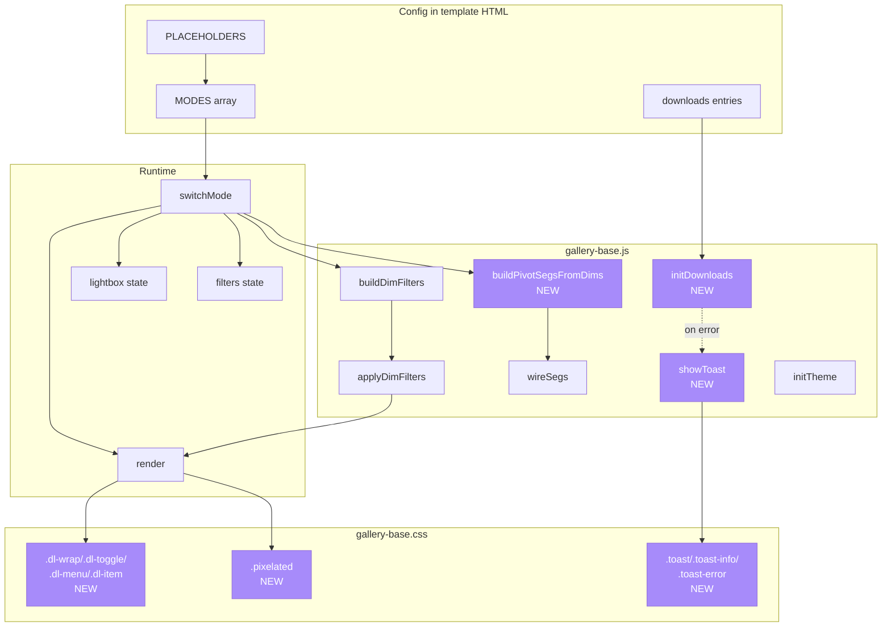
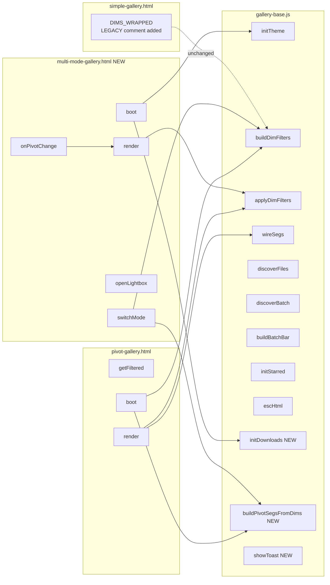

## Summary

Promote four PI Buddy patterns (multi-mode layout, downloads dropdown, pixel-art rendering, dynamic pivot seg buttons) into `forge-gallery` as first-class helpers + a new template, without breaking any of the 4 existing templates. Single PR, 7 slices, ~27 micro-tasks.

## Architecture

### Data flow — runtime helpers + template consumers



### File × Function map



## Bootstrap Context

From analysis (file: `artifacts/analyses/73-forge-gallery-multi-mode-analysis.mdx`):

- **Critical finding**: `buildDimFilters`/`applyDimFilters` are already implicitly dual-API — 3 of 4 templates already pass objects. Line 57 + 114 of gallery-base.js just call `dim.fn(item)` agnostically. The "dual-API" deliverable is mostly JSDoc clarification.
- **Reference implementation**: `~/.roxabi/forge/pi-buddy/prompt-gallery.html` (757 lines) has working versions of `switchMode`, `buildPivotSegs`, download dropdown, pixel-rendering. Port faithfully.
- **Top 3 risks** (from analysis):
  1. Mode-switch filter state corruption (stale-key bug) → mitigated by atomic 8-step sequence
  2. CSP blocks JSZip CDN → mitigated by `showToast` + visible error feedback
  3. `DIMS_WRAPPED` copy-paste hazard in simple-gallery → mitigated by LEGACY comment + README note
- **Test environment**: Chromium 124+ on Linux (canonical)
- **No existing test coverage** for gallery-base.js — manual render check + follow-up issue for unit tests

## Agents

| Agent | Slices | Task count | Key files |
|-------|--------|-----------|-----------|
| `frontend-dev` | 1, 2, 3, 4 | ~16 | gallery-base.js, gallery-base.css, pivot-gallery.html, multi-mode-gallery.html, simple-gallery.html |
| `doc-writer` | 5 | 8 | README.md, SKILL.md |
| `devops` | 6 | 3 | sync-plugins.sh (run), follow-up issue |
| `tester` | 3.5 | 1 | manual browser smoke test |

## Consistency Report

- **Spec criteria covered:** 43/43 (100%) — every `- [ ]` in spec maps to ≥1 micro-task
- **Uncovered criteria:** 0
- **Untraced tasks:** 0 (every task has a `Spec trace: SC-*` field)
- **Exemptions:** none

## Slice DAG

```
V1 (foundation) ─┬─> V2 (pivot refactor) ─┐
                 └─> V3 (multi-mode) ─────┴─> V3.5 (smoke gate) ─┬─> V4 (legacy comment)
                                                                 ├─> V5 (docs)          [P]
                                                                 └─> V6 (sync + follow-up)
```

Legend: `[P]` = parallel-safe after V3.5 gate.

---

## Micro-Tasks

### V1 — Shared runtime foundation

**Agent:** `frontend-dev` · **Phase:** GREEN + RED-GATE · **Slice:** V1

#### T1.1 — Add `initDownloads` helper to gallery-base.js

- **File:** `plugins/forge/references/gallery-templates/gallery-base.js`
- **Code skeleton:**
  ```js
  /**
   * Initialize a downloads dropdown with async handlers and error toasts.
   * @param {Object} config
   * @param {string} config.dropdownId  - .dl-wrap container
   * @param {string} config.toggleId    - .dl-toggle button
   * @param {string} config.menuId      - .dl-menu panel
   * @param {Array<{id, label, hint, handler: () => Promise<void>|void}>} config.entries
   */
  function initDownloads(config) { /* wire toggle + entries + data-loading + try/catch/showToast */ }
  ```
- **Verify:** `grep -n 'function initDownloads' plugins/forge/references/gallery-templates/gallery-base.js`
- **Expected:** Single match, line number reported
- **Estimate:** 8 min
- **Difficulty:** 3
- **Spec trace:** SC-1, SC-2 (Slice 1), N1 (breadboard)

#### T1.2 — Add `buildPivotSegsFromDims` helper

- **File:** same
- **Code skeleton:**
  ```js
  /**
   * Rebuild innerHTML of col/row seg bars from a DIMS object.
   * Auto-prepends "None" button. Resets active state to "None".
   * @param {Object} dims
   * @param {string} colBarId
   * @param {string} rowBarId
   * @param {(axis: 'col'|'row', dimKey: string) => void} onChange
   */
  function buildPivotSegsFromDims(dims, colBarId, rowBarId, onChange) { /* ... */ }
  ```
- **Verify:** `grep -n 'function buildPivotSegsFromDims' plugins/forge/references/gallery-templates/gallery-base.js`
- **Expected:** Single match
- **Estimate:** 6 min
- **Difficulty:** 3
- **Spec trace:** SC-1 (Slice 1), N2 (breadboard)

#### T1.3 — Add `showToast` helper

- **File:** same
- **Code skeleton:**
  ```js
  /**
   * Show a transient toast message. Auto-dismiss after duration ms.
   * @param {string} message
   * @param {'info'|'error'} [variant='info']
   * @param {number} [duration=3000]
   */
  function showToast(message, variant = 'info', duration = 3000) { /* ... */ }
  ```
- **Verify:** `grep -n 'function showToast' plugins/forge/references/gallery-templates/gallery-base.js`
- **Expected:** Single match
- **Estimate:** 5 min
- **Difficulty:** 2
- **Spec trace:** SC-1 (Slice 1), SC-7, SC-8, SC-9 (toast variants), N3 (breadboard)

#### T1.4 — Clarify dual-API contract in `buildDimFilters` + `applyDimFilters` JSDoc

- **File:** same
- **Change:** Add `@remarks` block to both functions explicitly stating:
  > This function is dual-API. `dim.fn` receives whatever type `items` contains — typically filename strings OR structured item objects. Callers choose the representation; the library is type-agnostic. See README.md §"Items-as-objects vs filename-strings".
- **Verify:** `grep -c '@remarks' plugins/forge/references/gallery-templates/gallery-base.js`
- **Expected:** `2` (one per function)
- **Estimate:** 4 min
- **Difficulty:** 1
- **Spec trace:** SC-3, SC-4

#### T1.5 — Add CSS utilities to gallery-base.css

- **File:** `plugins/forge/references/gallery-templates/gallery-base.css`
- **New classes:** `.pixelated`, `.dl-wrap`, `.dl-toggle`, `.dl-menu`, `.dl-item`, `.dl-menu.open`, `.dl-item .dl-hint`, `.toast`, `.toast-info`, `.toast-error`
- **Source:** Lift from `~/.roxabi/forge/pi-buddy/prompt-gallery.html` (look for `.dl-wrap` block) + add `.pixelated { image-rendering: pixelated }`
- **Verify:**
  ```bash
  for c in pixelated dl-wrap dl-toggle dl-menu dl-item toast toast-info toast-error; do
    grep -q "\\.${c}\\b" plugins/forge/references/gallery-templates/gallery-base.css && echo "OK: $c" || echo "MISS: $c"
  done
  ```
- **Expected:** All 8 classes report OK
- **Estimate:** 6 min
- **Difficulty:** 2
- **Spec trace:** SC-4, SC-5 (Slice 1)

#### T1.6 — RED-GATE: Slice 1 smoke + lint

- **Files:** scratch `/tmp/gallery-smoke.html` calling new helpers in isolation
- **Actions:**
  1. Create scratch HTML loading gallery-base.{css,js}, calling `initDownloads` + `buildPivotSegsFromDims` + `showToast('test', 'info')` + `showToast('err', 'error', 5000)`
  2. Open in Chromium 124+, verify: dropdown opens, segs build from sample DIMS, toasts appear and dismiss at expected timings
  3. Run `bun lint plugins/forge/references/gallery-templates/gallery-base.js`
- **Verify:**
  ```bash
  cd ~/projects/roxabi-plugins && bun lint plugins/forge/references/gallery-templates/gallery-base.js 2>&1 | tail -3
  ```
- **Expected:** Lint passes (exit 0, no errors); browser console shows no errors; all 3 helpers demonstrate expected behavior
- **Estimate:** 10 min
- **Difficulty:** 2
- **Phase:** RED-GATE
- **Spec trace:** SC-6, SC-7, SC-8, SC-9

---

### V2 — pivot-gallery refactor (depends on V1)

**Agent:** `frontend-dev` · **Phase:** REFACTOR + RED-GATE · **Slice:** V2

#### T2.1 — Capture baseline seg snapshot

- **File:** (none — record in task log)
- **Action:** Open current `pivot-gallery.html` in Chromium, devtools console:
  ```js
  JSON.stringify(Array.from(document.querySelectorAll('#colSegs .seg, #rowSegs .seg')).map(b => [b.dataset.v, b.className.trim(), b.textContent.trim()]))
  ```
- **Verify:** Store output as baseline in task comment (paste into plan log)
- **Expected:** Non-empty JSON array of tuples
- **Estimate:** 3 min
- **Difficulty:** 1
- **Spec trace:** SC-11 (semantic seg equality)

#### T2.2 — Remove hardcoded seg HTML; insert buildPivotSegsFromDims call

- **File:** `plugins/forge/references/gallery-templates/pivot-gallery.html`
- **Change:** Delete the 6 inner `<button class="seg" data-v="...">` elements from `#colSegs` and `#rowSegs` containers (lines ~87–99). Containers remain. Add in the script block near the existing `wireSegs('colSegs', ...)` call:
  ```js
  buildPivotSegsFromDims(DIMS, 'colSegs', 'rowSegs', (axis, key) => {
    if (axis === 'col') colDim = key; else rowDim = key;
    render();
  });
  ```
- **Remove:** the old `wireSegs('colSegs', ...)` and `wireSegs('rowSegs', ...)` calls (now handled inside buildPivotSegsFromDims)
- **Verify:**
  ```bash
  grep -c 'class="seg" data-v=' plugins/forge/references/gallery-templates/pivot-gallery.html
  ```
- **Expected:** Count equals only the Sort segs left (3 buttons for score-desc/score-asc/name). Col/Row seg literals gone.
- **Estimate:** 8 min
- **Difficulty:** 3
- **Spec trace:** SC-10, SC-11

#### T2.3 — RED-GATE: Verify semantic seg equality + no console errors

- **File:** (verification only)
- **Actions:**
  1. Open refactored `pivot-gallery.html` in Chromium 124+ (serve via `python3 -m http.server` from the templates dir with sample data)
  2. Run the same seg-snapshot JS from T2.1
  3. Compare to baseline — must be identical
  4. Click a Col axis, a Row axis, verify matrix renders
  5. Check console for errors
- **Verify:** JSON.stringify outputs match character-for-character; console.error count = 0
- **Expected:** Pass
- **Estimate:** 6 min
- **Difficulty:** 2
- **Phase:** RED-GATE
- **Spec trace:** SC-11, SC-12, SC-13

---

### V3 — multi-mode-gallery template (depends on V1; parallel with V2)

**Agent:** `frontend-dev` · **Phase:** GREEN + RED-GATE · **Slice:** V3 · `[P]` with V2

#### T3.1 — Create template skeleton with placeholders

- **File:** `plugins/forge/references/gallery-templates/multi-mode-gallery.html` (new)
- **Content:** HTML5 doctype, head with `{{TITLE}}`, `{{DATE}}`, `{{COLOR}}`, `{{ACCENT_COLOR}}`, `{{SUBTITLE}}` placeholders; diagram-meta block; link to `gallery-base.css`; basic layout scaffold; body sections for header / mode bar / toolbar / gallery / lightbox
- **Verify:**
  ```bash
  for p in TITLE DATE COLOR ACCENT_COLOR SUBTITLE; do
    grep -q "{{${p}}}" plugins/forge/references/gallery-templates/multi-mode-gallery.html && echo "OK: $p" || echo "MISS: $p"
  done
  ```
- **Expected:** All 5 placeholders report OK
- **Estimate:** 6 min
- **Difficulty:** 2
- **Spec trace:** SC-15, SC-19

#### T3.2 — Write MODES array config with 3-mode PI Buddy example

- **File:** same
- **Code skeleton:**
  ```js
  /* ══════════════════════════════════════════════════════════════════
     CUSTOMISE: MODES — one entry per dataset/mode.
     Each mode owns its own DIMS + item-building function.
     Items are objects ({file, dir, label, ...custom}) — dual-API.
     Reference impl: ~/.roxabi/forge/pi-buddy/prompt-gallery.html
     ══════════════════════════════════════════════════════════════════ */
  const MODES = [
    { id: 'mode1', label: 'Mode 1', dims: { /* ... */ }, buildItems: () => [/* ... */] },
    // Add more mode entries
  ];
  ```
- **Verify:** `grep -c "const MODES = \\[" plugins/forge/references/gallery-templates/multi-mode-gallery.html`
- **Expected:** `1`
- **Estimate:** 10 min
- **Difficulty:** 3
- **Spec trace:** SC-16, SC-17

#### T3.3 — Implement atomic switchMode() 8-step sequence

- **File:** same
- **Code skeleton:**
  ```js
  function switchMode(newMode) {
    activeMode = newMode;           // 1
    filters = {};                    // 2 — reset stale keys
    colDim = 'none';                 // 3
    rowDim = 'none';                 // 4
    visibleItems = [];               // 5 — reset lightbox state
    buildPivotSegsFromDims(MODES.find(m=>m.id===activeMode).dims, 'colSegs', 'rowSegs', onPivotChange); // 6
    document.getElementById('filterBar').innerHTML = ''; // clear before rebuild
    buildDimFilters(currentItems(), MODES.find(m=>m.id===activeMode).dims, filters, 'filterBar', render); // 7
    render();                        // 8
  }
  ```
- **Verify:** `grep -n 'function switchMode' plugins/forge/references/gallery-templates/multi-mode-gallery.html && grep -c -E '^\s*(activeMode =|filters = \{\}|colDim =|rowDim =|visibleItems =|buildPivotSegsFromDims|buildDimFilters|render\(\))' plugins/forge/references/gallery-templates/multi-mode-gallery.html`
- **Expected:** Function defined; ≥8 matches for the 8 atomic-sequence lines
- **Estimate:** 8 min
- **Difficulty:** 4
- **Spec trace:** SC-18

#### T3.4 — Implement render() with flat/grouped/pivot modes

- **File:** same
- **Source:** lift pattern from `~/.roxabi/forge/pi-buddy/prompt-gallery.html` (see `renderFlatCards`, `renderMatrixCell`, `groupByDim`, main `render` fn)
- **Verify:** `grep -c -E 'function (render|renderFlatCards|renderMatrixCell|groupByDim)' plugins/forge/references/gallery-templates/multi-mode-gallery.html`
- **Expected:** `4`
- **Estimate:** 12 min
- **Difficulty:** 4
- **Spec trace:** SC-20

#### T3.5 — Wire mode tab bar + toolbar + initDownloads + pixelated class

- **File:** same
- **Changes:**
  - Mode tab bar HTML with click handlers calling `switchMode`
  - Toolbar with empty `#colSegs`, `#rowSegs`, sort segs, size buttons, search input
  - `#filterBar` container
  - Downloads dropdown HTML (`.dl-wrap`, `.dl-toggle`, `.dl-menu`)
  - Call `initDownloads({ dropdownId, toggleId, menuId, entries: [/* CUSTOMISE */] })` on boot
  - Image grid uses `class="thumb pixelated"` when `MODES[activeMode].pixelated === true`
- **Verify:**
  ```bash
  grep -c -E '(initDownloads|dl-toggle|dl-menu|class="thumb pixelated)' plugins/forge/references/gallery-templates/multi-mode-gallery.html
  ```
- **Expected:** ≥4 matches
- **Estimate:** 10 min
- **Difficulty:** 3
- **Spec trace:** SC-17

#### T3.6 — Add inline PI Buddy reference comments

- **File:** same
- **Changes:** Add `/* Reference impl: ~/.roxabi/forge/pi-buddy/prompt-gallery.html */` comments at the top of: MODES config, switchMode, render, initDownloads config, lightbox state handling
- **Verify:** `grep -c "Reference impl: ~/.roxabi/forge/pi-buddy" plugins/forge/references/gallery-templates/multi-mode-gallery.html`
- **Expected:** ≥5
- **Estimate:** 3 min
- **Difficulty:** 1
- **Spec trace:** SC-17

#### T3.7 — RED-GATE: template opens in Chromium with zero console errors

- **Action:** Serve templates dir, open `multi-mode-gallery.html` in Chromium 124+. Check console.
- **Verify:** Devtools console → 0 error entries
- **Expected:** Pass
- **Estimate:** 3 min
- **Difficulty:** 1
- **Phase:** RED-GATE
- **Spec trace:** SC-20

---

### V3.5 — Smoke test gate (depends on V3) — BLOCKS V4, V5, V6

**Agent:** `tester` · **Phase:** RED-GATE · **Slice:** V3.5

#### T3.5.1 — Stale-key bug check + lightbox state check

- **Action:**
  1. Configure a test instance of `multi-mode-gallery.html` with 2 modes where Mode B has a dim key NOT in Mode A (e.g. A = `{rarity, stage}`, B = `{rarity, class, level}`)
  2. Load gallery; Mode A active by default
  3. Apply a filter on `stage` (Mode A only dim)
  4. Click Mode B tab
  5. Verify: Mode B shows its **full item set** (not zero items)
  6. Open lightbox on Mode A item; close; switch to Mode B; open lightbox → `lbIndex` valid for Mode B
  7. Check console: zero errors throughout
- **Verify:**
  - Stats counter shows N/N after mode switch (not 0/N)
  - `console.error` count = 0
  - Lightbox image loads successfully after cross-mode navigation
- **Expected:** All pass
- **Estimate:** 10 min
- **Difficulty:** 3
- **Phase:** RED-GATE (blocking)
- **Spec trace:** SC-21, SC-22, SC-23, SC-24

---

### V4 — Legacy comment on simple-gallery (depends on V3.5) `[P]`

**Agent:** `frontend-dev` · **Phase:** REFACTOR · **Slice:** V4

#### T4.1 — Add LEGACY comment + verify unchanged render

- **File:** `plugins/forge/references/gallery-templates/simple-gallery.html`
- **Change:** Insert 3-line comment block above line 211 (`const DIMS_WRAPPED = {}`):
  ```js
  /* LEGACY WORKAROUND — items-as-objects are the preferred pattern.
     This wrapper dates from before the dual-API contract was formalized.
     See README §"Items-as-objects vs filename-strings" for the modern approach. */
  ```
- **Verify:**
  ```bash
  grep -B1 'const DIMS_WRAPPED' plugins/forge/references/gallery-templates/simple-gallery.html | head -3
  ```
- **Expected:** Comment lines visible above DIMS_WRAPPED; template still parses (open in Chromium → render check)
- **Estimate:** 3 min
- **Difficulty:** 1
- **Spec trace:** SC-25, SC-26

---

### V5 — Docs (depends on V3.5) `[P]`

**Agent:** `doc-writer` · **Phase:** GREEN · **Slice:** V5

#### T5.1 — Add multi-mode-gallery.html row to README templates table

- **File:** `plugins/forge/references/gallery-templates/README.md`
- **Change:** Add row to the `| Template | When to use | Size | Key features |` table (lines ~95–100)
  ```
  | `multi-mode-gallery.html` | Multi-dataset galleries (modes/tabs) with per-mode dimensions | ~20K | Mode tab bar, per-mode DIMS, dynamic pivot segs, downloads dropdown, items-as-objects |
  ```
- **Verify:** `grep -c 'multi-mode-gallery.html' plugins/forge/references/gallery-templates/README.md`
- **Expected:** ≥1
- **Estimate:** 2 min
- **Difficulty:** 1
- **Spec trace:** SC-27

#### T5.2 — Write "Items-as-objects vs filename-strings" subsection

- **File:** same
- **Change:** Add new `##` subsection with 2 worked examples — one filename-string DIMS (from pivot-gallery), one item-object DIMS (from multi-mode-gallery). Explain when to pick each.
- **Verify:** `grep -c 'Items-as-objects vs filename-strings' plugins/forge/references/gallery-templates/README.md`
- **Expected:** `1`
- **Estimate:** 8 min
- **Difficulty:** 2
- **Spec trace:** SC-28

#### T5.3 — Write "Incremental upgrade path" subsection with stale-key warning

- **File:** same
- **Change:** New `##` subsection with numbered 5-step migration (pivot-gallery → multi-mode). Include the full `switchMode()` atomic 8-step code block + explicit warning about the stale-key bug (filters must reset before segs rebuild).
- **Verify:** `grep -c 'Incremental upgrade path' plugins/forge/references/gallery-templates/README.md && grep -c 'stale-key' plugins/forge/references/gallery-templates/README.md`
- **Expected:** Both `1`
- **Estimate:** 10 min
- **Difficulty:** 2
- **Spec trace:** SC-29, SC-30

#### T5.4 — Write "Dynamic pivot seg construction" subsection

- **File:** same
- **Change:** New subsection documenting `buildPivotSegsFromDims(dims, colBarId, rowBarId, onChange)` signature + example call from multi-mode-gallery
- **Verify:** `grep -c 'Dynamic pivot seg construction' plugins/forge/references/gallery-templates/README.md`
- **Expected:** `1`
- **Estimate:** 4 min
- **Difficulty:** 1
- **Spec trace:** SC-31

#### T5.5 — Write "Downloads dropdown helper" subsection with CSP directive

- **File:** same
- **Change:** New subsection documenting `initDownloads` signature + `data-loading` attribute convention + required CSP: `script-src 'self' https://cdn.jsdelivr.net`
- **Verify:** `grep -c 'Downloads dropdown helper' plugins/forge/references/gallery-templates/README.md && grep -c 'cdn.jsdelivr.net' plugins/forge/references/gallery-templates/README.md`
- **Expected:** Both ≥1
- **Estimate:** 6 min
- **Difficulty:** 2
- **Spec trace:** SC-32, SC-36

#### T5.6 — Write "Pixel-art rendering" subsection

- **File:** same
- **Change:** Short subsection documenting `.pixelated` class + when to use (sprite galleries, NEAREST-scale downsamples)
- **Verify:** `grep -c 'Pixel-art rendering' plugins/forge/references/gallery-templates/README.md`
- **Expected:** `1`
- **Estimate:** 3 min
- **Difficulty:** 1
- **Spec trace:** SC-33

#### T5.7 — Update SKILL.md template picker + items-as-objects guidance

- **File:** `plugins/forge/skills/forge-gallery/SKILL.md`
- **Changes:**
  - Add `multi-mode-gallery.html` row to Phase 2 template picker table
  - Add a ≥3-sentence paragraph titled "When to use items-as-objects vs filename-strings"
- **Verify:**
  ```bash
  grep -c 'multi-mode-gallery.html' plugins/forge/skills/forge-gallery/SKILL.md
  grep -c 'items-as-objects' plugins/forge/skills/forge-gallery/SKILL.md
  ```
- **Expected:** Both ≥1
- **Estimate:** 5 min
- **Difficulty:** 1
- **Spec trace:** SC-34, SC-35

---

### V6 — Cache sync + follow-up issue (depends on V3.5) `[P]`

**Agent:** `devops` · **Phase:** GREEN + RED-GATE · **Slice:** V6

#### T6.1 — Run sync-plugins.sh --local

- **Action:** `cd ~/projects/roxabi-plugins && ./sync-plugins.sh --local`
- **Verify:** Exit code 0; grep stderr for errors
- **Expected:** Exit 0, no stderr errors
- **Estimate:** 3 min
- **Difficulty:** 1
- **Spec trace:** SC-38

#### T6.2 — Verify cache propagation

- **Action:**
  ```bash
  ls ~/.claude/plugins/cache/roxabi-marketplace/forge/*/references/gallery-templates/multi-mode-gallery.html
  ls ~/.claude/plugins/cache/roxabi-marketplace/forge/*/references/gallery-templates/gallery-base.{js,css}
  ```
- **Verify:** All files present
- **Expected:** 3 file paths printed
- **Estimate:** 2 min
- **Difficulty:** 1
- **Spec trace:** SC-39

#### T6.3 — File follow-up issue + run CI checks

- **Action:**
  1. `gh issue create --title "test(forge-gallery): add unit tests for gallery-base.js helpers" --body "Follow-up from #73 — add unit tests for buildDimFilters, applyDimFilters, buildPivotSegsFromDims, initDownloads, showToast. forge plugin currently has zero test coverage. Use happy-dom + bun:test." --label "test"`
  2. `cd ~/projects/roxabi-plugins && bun lint && bun typecheck && bun test`
- **Verify:**
  - Follow-up issue URL returned
  - All 3 CI commands exit 0
- **Expected:** Pass
- **Estimate:** 6 min
- **Difficulty:** 2
- **Spec trace:** SC-40, SC-41, SC-42, SC-43

---

## Total

- **27 micro-tasks** across 7 slices
- **~2h40m** estimated work time (sum of task estimates)
- **4 agents** involved (frontend-dev, doc-writer, devops, tester)
- **1 PR**, 1 branch, 1 worktree

## Parallelization notes

- V2 and V3 can proceed in parallel after V1 lands (both depend only on the new helpers from V1)
- V4, V5, V6 can all proceed in parallel after V3.5 gate passes (3 different agents, 3 different file sets)
- Max concurrent work: 3 agents during V4/V5/V6 phase
