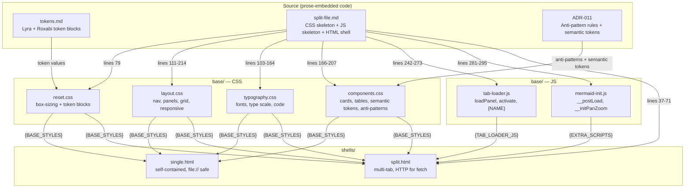
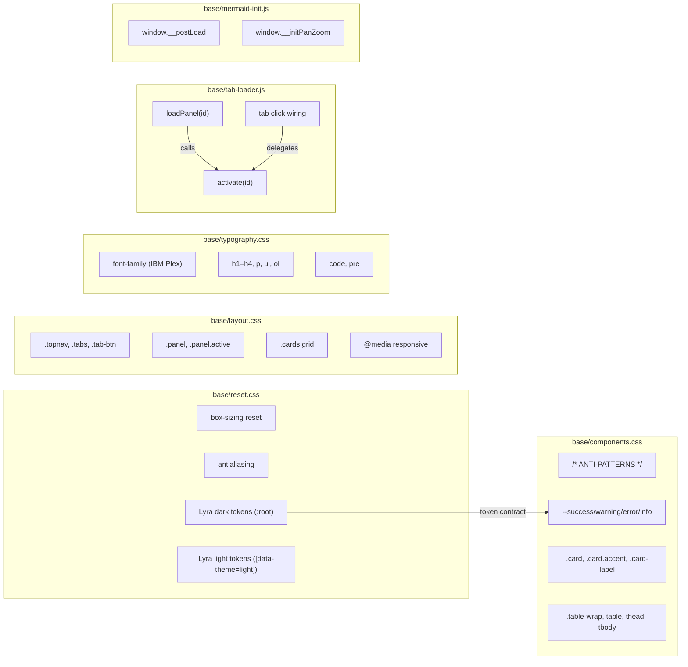

## Summary

Extract forge's prose-embedded CSS/JS from `tokens.md` and `split-file.md` into 8 actual code files (`base/` × 6 + `shells/` × 2) so skills read and inline verbatim. Single frontend-dev agent, 2 slices, all V1 tasks parallel.

## Architecture

### Data Flow

### File × Function Map

## Bootstrap Context

From [epic analysis](../analyses/forge-design-system-evolution-analysis.mdx): Shape B selected — full design system extraction (base/ + aesthetics/ + components/ + shells/). This plan implements the foundation slice (S1–S3: base/ + shells/ only). Gallery system (`gallery-base.css/js`) is the proven model — same pattern: actual code files Claude reads and copies verbatim.

## Agents

| Agent | Task count | Files |
|-------|-----------|-------|
| frontend-dev | 9 | reset.css, layout.css, typography.css, components.css, tab-loader.js, mermaid-init.js, single.html, split.html |

## Consistency Report

- Criteria covered: 14/14
- Uncovered criteria: none
- Tasks without spec backing: none
- Gold plating exemptions applied: 0

## Micro-Tasks

### Slice V1: base/ layer

#### Task 1: Create reset.css — token blocks + box-sizing reset [P] → frontend-dev
- **File:** `plugins/forge/references/base/reset.css`
- **Snippet:** `*, *::before, *::after { box-sizing: border-box; margin: 0; padding: 0 }` + `:root, [data-theme="dark"] { --bg: #0a0a0f; ... }` + `[data-theme="light"] { ... }`
- **Verify:** `test -f plugins/forge/references/base/reset.css && grep -q 'data-theme="light"' plugins/forge/references/base/reset.css` (ready)
- **Expected:** File exists with both dark and light token blocks
- **Time:** 5 min | **Difficulty:** 2
- **Traces:** SC-1, SC-9 | **Phase:** GREEN

#### Task 2: Create layout.css — nav, panels, grid, responsive [P] → frontend-dev
- **File:** `plugins/forge/references/base/layout.css`
- **Snippet:** `.topnav { position: sticky; ... }` + `.panel { display: none; ... }` + `.cards { display: grid; ... }` + `@media (max-width: 768px) { ... }`
- **Verify:** `test -f plugins/forge/references/base/layout.css && grep -q '.topnav' plugins/forge/references/base/layout.css && grep -q '@media' plugins/forge/references/base/layout.css` (ready)
- **Expected:** File exists with .topnav, .panel, .cards, responsive breakpoint
- **Time:** 5 min | **Difficulty:** 2
- **Traces:** SC-2, SC-9 | **Phase:** GREEN

#### Task 3: Create typography.css — fonts, type scale, code blocks [P] → frontend-dev
- **File:** `plugins/forge/references/base/typography.css`
- **Snippet:** `/* Preconnect: https://fonts.googleapis.com */` + `body { font-family: 'IBM Plex Sans', system-ui, sans-serif; ... }` + `h1 { ... }` + `code { ... }` + `pre { ... }`
- **Verify:** `test -f plugins/forge/references/base/typography.css && grep -q 'IBM Plex Sans' plugins/forge/references/base/typography.css` (ready)
- **Expected:** File exists with IBM Plex Sans font-family, heading/paragraph/code styles
- **Time:** 5 min | **Difficulty:** 2
- **Traces:** SC-3, SC-9 | **Phase:** GREEN

#### Task 4: Create components.css — cards, tables, semantic tokens, anti-patterns [P] → frontend-dev
- **File:** `plugins/forge/references/base/components.css`
- **Snippet:** `/* FORGE ANTI-PATTERNS — DO NOT USE ... */` + `:root { --success: #34d399; --success-dim: rgba(52,211,153,0.12); ... }` + `.card { ... }` + `.table-wrap { ... }`
- **Verify:** `test -f plugins/forge/references/base/components.css && grep -q 'ANTI-PATTERNS' plugins/forge/references/base/components.css && grep -q '\-\-success' plugins/forge/references/base/components.css` (ready)
- **Expected:** File exists with anti-pattern block, semantic tokens, card/table styles
- **Time:** 8 min | **Difficulty:** 3
- **Traces:** SC-4, SC-9, SC-10, SC-14 | **Phase:** GREEN

#### Task 5: Create tab-loader.js — loadPanel, activate, tab wiring [P] → frontend-dev
- **File:** `plugins/forge/references/base/tab-loader.js`
- **Snippet:** `function loadPanel(id) { ... fetch('tabs/{NAME}/tab-' + id + '.html') ... }` + `function activate(id) { ... }` + tab click wiring + first-tab auto-load
- **Verify:** `test -f plugins/forge/references/base/tab-loader.js && grep -q '{NAME}' plugins/forge/references/base/tab-loader.js && ! grep -q 'THEME_KEY' plugins/forge/references/base/tab-loader.js` (ready)
- **Expected:** File exists with {NAME} placeholder, no theme toggle code
- **Time:** 5 min | **Difficulty:** 2
- **Traces:** SC-5 | **Phase:** GREEN

#### Task 6: Create mermaid-init.js — __postLoad + __initPanZoom [P] → frontend-dev
- **File:** `plugins/forge/references/base/mermaid-init.js`
- **Snippet:** `window.__postLoad = async function (id, panel) { ... mermaid.render(...) ... }` + optional `window.__initPanZoom = function (container) { ... }`
- **Verify:** `test -f plugins/forge/references/base/mermaid-init.js && grep -q '__postLoad' plugins/forge/references/base/mermaid-init.js` (ready)
- **Expected:** File exists with __postLoad function, no {NAME} placeholder
- **Time:** 5 min | **Difficulty:** 2
- **Traces:** SC-6 | **Phase:** GREEN

#### RED-GATE: Verify base/ layer → frontend-dev
- **Verify:** `cat plugins/forge/references/base/reset.css plugins/forge/references/base/layout.css plugins/forge/references/base/typography.css plugins/forge/references/base/components.css > /tmp/forge-base-concat.css && echo "concatenation ok"` (ready)
- **Expected:** CSS concatenation in order produces no errors
- **Phase:** RED-GATE

### Slice V2: shells/

#### Task 7: Create single.html — self-contained diagram shell [P] → frontend-dev
- **File:** `plugins/forge/references/shells/single.html`
- **Snippet:** `<!DOCTYPE html>` + diagram-meta markers + `{BASE_STYLES}` + `{AESTHETIC_STYLES}` + theme toggle inline JS (~15 lines) + `{CONTENT}` + `{EXTRA_SCRIPTS}`
- **Verify:** `test -f plugins/forge/references/shells/single.html && grep -q '{BASE_STYLES}' plugins/forge/references/shells/single.html && grep -q '{CONTENT}' plugins/forge/references/shells/single.html && grep -q 'diagram:title' plugins/forge/references/shells/single.html` (ready)
- **Expected:** Valid HTML with all 13 placeholders, diagram-meta markers, theme toggle inline
- **Time:** 8 min | **Difficulty:** 3
- **Traces:** SC-7 | **Phase:** GREEN

#### Task 8: Create split.html — multi-tab shell [P] → frontend-dev
- **File:** `plugins/forge/references/shells/split.html`
- **Snippet:** `<!DOCTYPE html>` + diagram-meta markers + `{BASE_STYLES}` + `{AESTHETIC_STYLES}` + theme toggle inline JS (before tab-loader) + `{TABS}` nav + `{PANELS}` containers + `{TAB_LOADER_JS}` + `{EXTRA_SCRIPTS}`
- **Verify:** `test -f plugins/forge/references/shells/split.html && grep -q '{TAB_LOADER_JS}' plugins/forge/references/shells/split.html && grep -q '{TABS}' plugins/forge/references/shells/split.html && grep -q 'diagram:title' plugins/forge/references/shells/split.html` (ready)
- **Expected:** Valid HTML with all 15 placeholders, diagram-meta markers, theme toggle before tab-loader
- **Time:** 8 min | **Difficulty:** 3
- **Traces:** SC-8 | **Phase:** GREEN

### Validation

#### Task 9: Cross-file validation sweep → frontend-dev
- **File:** (cross-file)
- **Snippet:** Verify: CSS concatenation order valid, no hardcoded colors, gallery-templates/ unchanged, traceability
- **Verify:** `grep -rn '#[0-9a-fA-F]\{3,8\}' plugins/forge/references/base/*.css | grep -v 'var(' | grep -v '/\*' | grep -v ':root' | grep -v 'data-theme' | grep -v 'rgba' | head -5` (ready)
- **Expected:** No output (all colors use CSS custom properties or are in token declaration blocks)
- **Time:** 5 min | **Difficulty:** 2
- **Traces:** SC-11, SC-12, SC-13, SC-14 | **Phase:** REFACTOR
- **Dependencies:** T1–T8

## Task IDs

<!-- Generated by /plan. Used by /implement to resume tasks on session restart. -->
- T1: 9 — Create reset.css — token blocks + box-sizing reset
- T2: 10 — Create layout.css — nav, panels, grid, responsive
- T3: 11 — Create typography.css — fonts, type scale, code blocks
- T4: 12 — Create components.css — cards, tables, semantic tokens, anti-patterns
- T5: 13 — Create tab-loader.js — loadPanel, activate, tab wiring
- T6: 14 — Create mermaid-init.js — __postLoad + __initPanZoom
- RED-GATE V1: 15 — Verify base/ layer
- T7: 16 — Create single.html — self-contained diagram shell
- T8: 17 — Create split.html — multi-tab shell
- T9: 18 — Cross-file validation sweep
