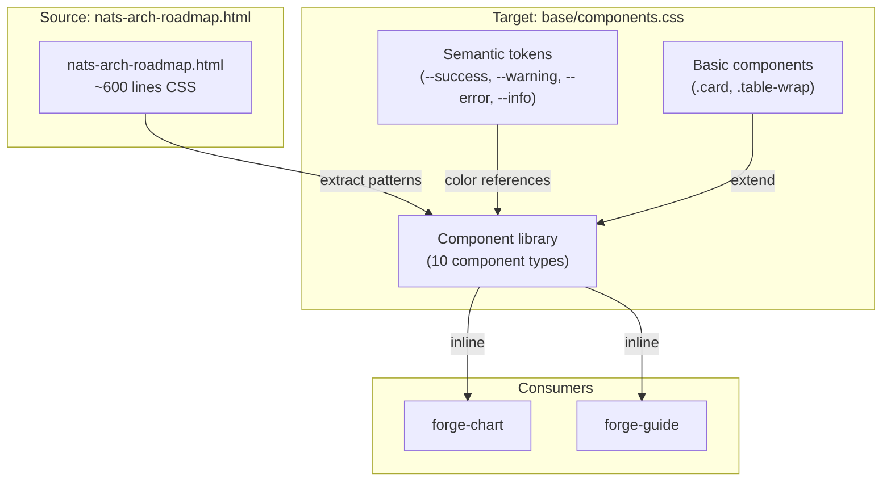
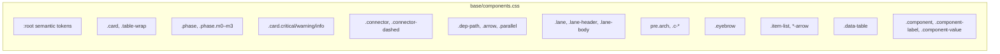

## Summary

Extend `base/components.css` with 10 component types (phase badges, severity cards, connectors, dependency paths, lanes, architecture blocks, eyebrows, item lists, data tables, component boxes). Single frontend-dev agent, 5 parallel slices, all target one file.

## Architecture

### Data Flow



### File × Function Map



## Bootstrap Context

From [forge-design-system-evolution-analysis](../analyses/forge-design-system-evolution-analysis.mdx): Shape B selected — full design system extraction (base/ + aesthetics/ + components/ + shells/). This plan implements S7 (component library), which depends on S1 (base/ layer) already complete (#78 merged).

Reference patterns extracted from `~/.roxabi/forge/lyra/visuals/nats-arch-roadmap.html`:

| Component | Source lines |
|-----------|--------------|
| `.card.m0–m3` | 373–376 |
| `.arch-wrap`, `.arch-diagram`, `pre.arch` | 419–498 |
| `.data-table` | 473–505 |
| `.item-list`, arrow variants | 594–606 |
| `.lane`, `.lane-header`, `.lane-body` | 609–635 |
| `.dep-path`, `.arrow`, `.parallel` | 635–647 |

## Agents

| Agent | Task count | Files |
|-------|-----------|-------|
| frontend-dev | 6 | plugins/forge/references/base/components.css |

## Consistency Report

- Criteria covered: 14/14
- Uncovered criteria: none
- Tasks without spec backing: none
- Gold plating exemptions applied: 0

## Micro-Tasks

### Slice V1: Phase + Severity

#### Task 1: Add phase badge classes [P] → frontend-dev
- **File:** `plugins/forge/references/base/components.css`
- **Snippet:**
  ```css
  /* ── Phase Badges ── */
  .phase {
    display: inline-block; padding: 0.125rem 0.5rem;
    font-size: 0.6875rem; font-weight: 700; text-transform: uppercase;
    letter-spacing: 0.05em; border-radius: 4px;
  }
  .phase.m0 { background: var(--success-dim); color: var(--success); }
  .phase.m1 { background: var(--warning-dim); color: var(--warning); }
  .phase.m2 { background: var(--info-dim); color: var(--info); }
  .phase.m3 { background: rgba(192,132,252,0.12); color: #c084fc; }
  ```
- **Verify:** `grep -q '\.phase\.m0' plugins/forge/references/base/components.css` (ready)
- **Expected:** Phase badge classes with semantic color references
- **Time:** 3 min | **Difficulty:** 2
- **Traces:** SC-1, U1–U5 | **Phase:** GREEN

#### Task 2: Add severity card classes [P] → frontend-dev
- **File:** `plugins/forge/references/base/components.css`
- **Snippet:**
  ```css
  /* ── Severity Cards ── */
  .card.critical { border-left: 3px solid var(--error); }
  .card.warning  { border-left: 3px solid var(--warning); }
  .card.info     { border-left: 3px solid var(--info); }
  ```
- **Verify:** `grep -q '\.card\.critical' plugins/forge/references/base/components.css` (ready)
- **Expected:** Severity card variants with colored left borders
- **Time:** 2 min | **Difficulty:** 1
- **Traces:** SC-2, U6–U8 | **Phase:** GREEN

### Slice V2: Lane + Dep-path

#### Task 3: Add lane container classes [P] → frontend-dev
- **File:** `plugins/forge/references/base/components.css`
- **Snippet:**
  ```css
  /* ── Lane Containers ── */
  .lane { display: flex; flex-direction: column; border: 1px solid var(--border); border-radius: 6px; overflow: hidden; }
  .lane-header { padding: 0.5rem 0.75rem; font-size: 0.75rem; font-weight: 600; text-transform: uppercase; letter-spacing: 0.05em; }
  .lane-header.green-h  { background: var(--success-dim); color: var(--success); border-bottom: 1px solid rgba(52,211,153,0.2); }
  .lane-header.amber-h  { background: var(--warning-dim); color: var(--warning); border-bottom: 1px solid rgba(251,191,36,0.2); }
  .lane-header.cyan-h   { background: var(--info-dim); color: var(--info); border-bottom: 1px solid rgba(96,165,250,0.2); }
  .lane-header.purple-h { background: rgba(192,132,252,0.12); color: #c084fc; border-bottom: 1px solid rgba(192,132,252,0.2); }
  .lane-header.red-h    { background: var(--error-dim); color: var(--error); border-bottom: 1px solid rgba(248,113,113,0.2); }
  .lane-body { padding: 0.75rem; }
  ```
- **Verify:** `grep -q '\.lane-header' plugins/forge/references/base/components.css` (ready)
- **Expected:** Lane container with colored header variants
- **Time:** 4 min | **Difficulty:** 3
- **Traces:** SC-5, U13–U15 | **Phase:** GREEN

#### Task 4: Add dependency path classes [P] → frontend-dev
- **File:** `plugins/forge/references/base/components.css`
- **Snippet:**
  ```css
  /* ── Dependency Paths ── */
  .dep-path { display: flex; align-items: center; gap: 0.5rem; font-size: 0.875rem; color: var(--text-muted); }
  .dep-path .arrow    { color: var(--warning); font-weight: 700; }
  .dep-path .parallel { color: var(--info); font-weight: 700; }
  ```
- **Verify:** `grep -q '\.dep-path' plugins/forge/references/base/components.css` (ready)
- **Expected:** Dependency path with arrow and parallel symbols
- **Time:** 2 min | **Difficulty:** 1
- **Traces:** SC-4, U11–U12 | **Phase:** GREEN

### Slice V3: Arch + Eyebrow

#### Task 5: Add architecture block classes [P] → frontend-dev
- **File:** `plugins/forge/references/base/components.css`
- **Snippet:**
  ```css
  /* ── Architecture Blocks ── */
  pre.arch {
    font-family: 'IBM Plex Mono', 'JetBrains Mono', monospace;
    font-size: 0.8125rem; line-height: 1.5;
    background: var(--surface); border: 1px solid var(--border);
    border-radius: 6px; padding: 1rem;
    overflow-x: auto; white-space: pre;
  }
  .c-green  { color: var(--success); }
  .c-amber  { color: var(--warning); }
  .c-cyan   { color: var(--info); }
  .c-red    { color: var(--error); }
  .c-purple { color: #c084fc; }
  .c-dim    { color: var(--text-dim); }
  .c-bright { color: var(--text); }
  ```
- **Verify:** `grep -q 'pre\.arch' plugins/forge/references/base/components.css && grep -q '\.c-green' plugins/forge/references/base/components.css` (ready)
- **Expected:** Architecture block with colored text classes
- **Time:** 4 min | **Difficulty:** 2
- **Traces:** SC-6, U16–U23 | **Phase:** GREEN

#### Task 6: Add eyebrow header class [P] → frontend-dev
- **File:** `plugins/forge/references/base/components.css`
- **Snippet:**
  ```css
  /* ── Eyebrow Headers ── */
  .eyebrow {
    font-size: 0.6875rem; font-weight: 700;
    text-transform: uppercase; letter-spacing: 0.1em;
    color: var(--text-dim); margin-bottom: 0.25rem;
  }
  ```
- **Verify:** `grep -q '\.eyebrow' plugins/forge/references/base/components.css` (ready)
- **Expected:** Eyebrow header with uppercase mono styling
- **Time:** 2 min | **Difficulty:** 1
- **Traces:** SC-7, U24 | **Phase:** GREEN

### Slice V4: Item-list + Data-table

#### Task 7: Add item list classes [P] → frontend-dev
- **File:** `plugins/forge/references/base/components.css`
- **Snippet:**
  ```css
  /* ── Item Lists ── */
  .item-list { list-style: none; padding-left: 0; margin: 0.5rem 0; }
  .item-list li { display: flex; align-items: baseline; gap: 0.375rem; }
  .item-list li::before { content: "→"; color: var(--warning); font-weight: 700; flex-shrink: 0; }
  .item-list li.green-arrow::before  { color: var(--success); }
  .item-list li.red-arrow::before    { color: var(--error); }
  .item-list li.cyan-arrow::before   { color: var(--info); }
  .item-list li.amber-arrow::before  { color: var(--warning); }
  ```
- **Verify:** `grep -q '\.item-list' plugins/forge/references/base/components.css` (ready)
- **Expected:** Item list with colored arrow variants
- **Time:** 3 min | **Difficulty:** 2
- **Traces:** SC-8, U25–U29 | **Phase:** GREEN

#### Task 8: Add data table class [P] → frontend-dev
- **File:** `plugins/forge/references/base/components.css`
- **Snippet:**
  ```css
  /* ── Data Tables ── */
  table.data-table { width: 100%; border-collapse: collapse; }
  table.data-table th {
    background: var(--surface); color: var(--text-dim);
    font-size: 0.6875rem; text-transform: uppercase; letter-spacing: 0.06em;
    padding: 0.5rem 0.75rem; text-align: left;
    border-bottom: 1px solid var(--border);
    position: sticky; top: 3rem;
  }
  table.data-table td {
    padding: 0.5rem 0.75rem; border-bottom: 1px solid var(--border);
    color: var(--text-muted); font-size: 0.875rem;
  }
  table.data-table tr:last-child td { border-bottom: none; }
  table.data-table tr:nth-child(even) td { background: rgba(255,255,255,0.02); }
  [data-theme="light"] table.data-table tr:nth-child(even) td { background: rgba(0,0,0,0.025); }
  table.data-table tr:hover td { background: rgba(255,255,255,0.04); }
  [data-theme="light"] table.data-table tr:hover td { background: rgba(0,0,0,0.04); }
  table.data-table td.num { font-family: 'IBM Plex Mono', monospace; font-variant-numeric: tabular-nums; text-align: right; }
  ```
- **Verify:** `grep -q '\.data-table' plugins/forge/references/base/components.css` (ready)
- **Expected:** Data table with sticky header, alternating rows, hover, monospace numbers
- **Time:** 5 min | **Difficulty:** 3
- **Traces:** SC-9, U30–U31 | **Phase:** GREEN

### Slice V5: Connector + Component-box

#### Task 9: Add connector classes [P] → frontend-dev
- **File:** `plugins/forge/references/base/components.css`
- **Snippet:**
  ```css
  /* ── Connectors ── */
  .connector {
    height: 1px; background: var(--border);
    margin: 0.5rem 0; flex-shrink: 0;
  }
  .connector-dashed {
    height: 1px; background: transparent;
    border-top: 1px dashed var(--border);
    margin: 0.5rem 0; flex-shrink: 0;
  }
  ```
- **Verify:** `grep -q '\.connector' plugins/forge/references/base/components.css` (ready)
- **Expected:** Solid and dashed connector lines
- **Time:** 2 min | **Difficulty:** 1
- **Traces:** SC-3, U9–U10 | **Phase:** GREEN

#### Task 10: Add component box classes [P] → frontend-dev
- **File:** `plugins/forge/references/base/components.css`
- **Snippet:**
  ```css
  /* ── Component Boxes ── */
  .component {
    display: inline-flex; flex-direction: column;
    border: 1px solid var(--border); border-radius: 4px;
    background: var(--surface); min-width: 80px;
  }
  .component-label {
    font-size: 0.625rem; font-weight: 700;
    text-transform: uppercase; letter-spacing: 0.08em;
    color: var(--text-dim); padding: 0.25rem 0.5rem;
    border-bottom: 1px solid var(--border);
    background: rgba(255,255,255,0.02);
  }
  .component-value {
    font-family: 'IBM Plex Mono', monospace;
    font-size: 0.8125rem; color: var(--text);
    padding: 0.375rem 0.5rem;
  }
  ```
- **Verify:** `grep -q '\.component-label' plugins/forge/references/base/components.css` (ready)
- **Expected:** Blueprint-style component box with label and value
- **Time:** 3 min | **Difficulty:** 2
- **Traces:** SC-10, U32–U34 | **Phase:** GREEN

### Validation

#### Task 11: Cross-file validation sweep → frontend-dev
- **File:** (cross-file)
- **Snippet:** Verify: no hardcoded colors, transitions ≤0.15s, all semantic tokens referenced correctly
- **Verify:** `grep -rn '#[0-9a-fA-F]\{3,8\}' plugins/forge/references/base/components.css | grep -v 'var(' | grep -v '/\*' | grep -v ':root' | grep -v 'data-theme' | grep -v 'rgba' | head -5` (ready)
- **Expected:** No output (all colors use CSS custom properties or are in token declaration blocks)
- **Time:** 3 min | **Difficulty:** 2
- **Traces:** SC-11, SC-12 | **Phase:** REFACTOR
- **Dependencies:** T1–T10

## Task IDs

<!-- Generated by /plan. Used by /implement to resume tasks on session restart. -->
- T1: 9 — Add phase badge classes
- T2: 10 — Add severity card classes
- T3: 11 — Add lane container classes
- T4: 12 — Add dependency path classes
- T5: 13 — Add architecture block classes
- T6: 14 — Add eyebrow header class
- T7: 15 — Add item list classes
- T8: 16 — Add data table class
- T9: 17 — Add connector classes
- T10: 18 — Add component box classes
- T11: 19 — Cross-file validation sweep
