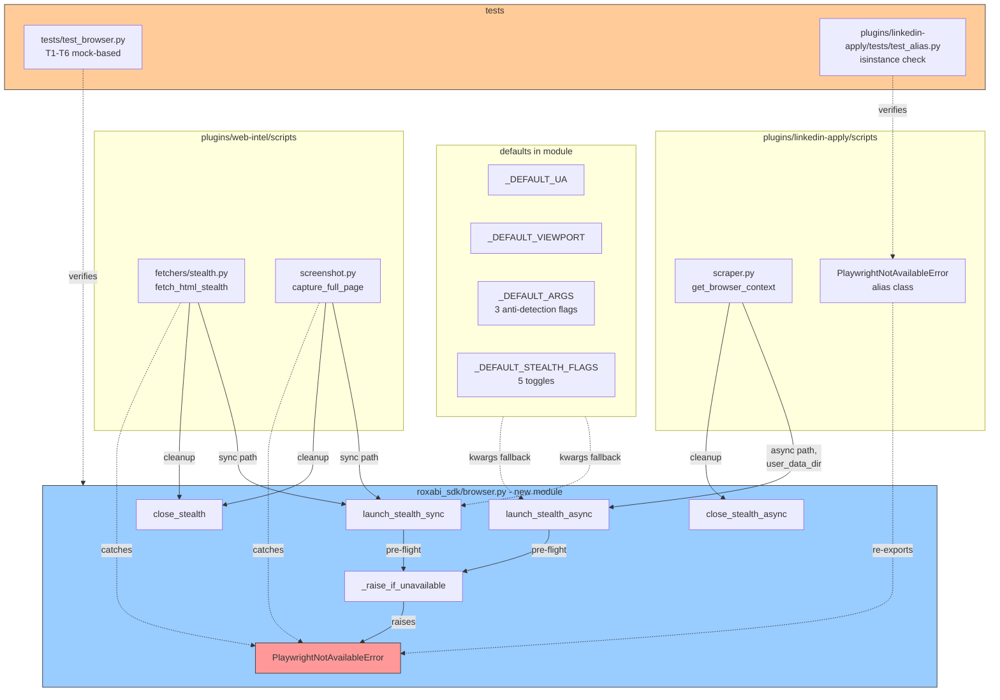
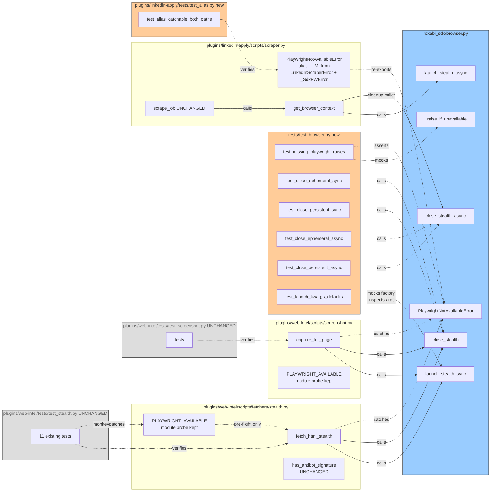

## Summary

Extract duplicated `playwright + playwright-stealth` bootstrap from three call sites (web-intel × 2 sync, linkedin-apply × 1 async) into a new `roxabi_sdk/browser.py` module. Along the way, fix two latent bugs the analysis surfaced: the broken `stealth.use_async(...).start()` call in `linkedin-apply/scraper.py:306` (doesn't exist in `playwright-stealth==2.0.2`) and the missing anti-detection launch args in web-intel's two launches.

## Architecture

### Data flow



### File × function map



## Bootstrap Context

From the analysis at `artifacts/analyses/93-extract-browser-bootstrap-analysis.mdx`:

| Fact | Reference |
|---|---|
| `playwright-stealth==2.0.2` is installed in web-intel's `[twitter]` extra | `plugins/web-intel/pyproject.toml` |
| `Stealth().use_async(async_playwright())` returns `AsyncWrappingContextManager` with **no `.start()` method** in 2.0.2 — empirically verified | Analysis Divergence 1 |
| `Stealth().apply_stealth_{sync,async}(page_or_context)` is the documented v2 API that works for every context shape | Analysis Settled Decision 4 |
| `context.browser is None` for persistent contexts; returns `Browser` instance for ephemeral — verified against Playwright source | Architect review of analysis |
| `sync-plugins.sh` at lines 72 and 157 already rsyncs `roxabi_sdk/` into every plugin cache dir — **no sync-infra changes needed** | `sync-plugins.sh` |
| `linkedin-apply` has no `pyproject.toml`; dep declared via README install instructions | `plugins/linkedin-apply/README.md` |
| `PlaywrightNotAvailableError` exists today at `plugins/linkedin-apply/scripts/scraper.py:184` as a `LinkedInScraperError` subclass | — |
| `PLAYWRIGHT_AVAILABLE` monkeypatch at `plugins/web-intel/tests/test_stealth.py:104` must continue to work unchanged | Settled Decision + spec SC-5 |

## Agents

| Agent | Task count | Files |
|---|---|---|
| backend-dev | 14 | `roxabi_sdk/browser.py`, `plugins/web-intel/scripts/fetchers/stealth.py`, `plugins/web-intel/scripts/screenshot.py`, `plugins/linkedin-apply/scripts/scraper.py` |
| tester | 10 | `tests/test_browser.py`, `plugins/linkedin-apply/tests/test_alias.py`, verification commands |

24 micro-tasks total across V0–V4 + post-slice gates.

## Consistency Report

- **Acceptance criteria covered:** 19 / 19
- **Untraced tasks:** 0
- **Uncovered criteria:** 0
- **Exemptions:** none

| SC | Covered by |
|---|---|
| SC-1 (module with exports) | T1.2, T1.3, T1.4, T1.5, T1.7 |
| SC-2 (RuntimeError + install hint in message) | T1.2 + T1.6(T1) |
| SC-3 (test_browser.py T1–T6 green) | T1.1, T1.6 |
| SC-4 (web-intel stealth.py imports SDK) | T2.1 |
| SC-5 (test_stealth.py unchanged, 11 green) | T2.2, T2.3 |
| SC-6 (screenshot.py imports SDK) | T3.1 |
| SC-7 (test_screenshot.py green) | T3.2 |
| SC-8 (screenshot CLI smoke PNG) | T3.3 |
| SC-9 (get_browser_context ≤ 10 lines) | T4.3 |
| SC-10 (alias catchability via isinstance) | T4.1, T4.2 |
| SC-11 (AttributeError path removed, grep 0) | T4.3, T4.4 |
| SC-12 (both launchers pass 3 anti-detection args) | T1.3, T1.6(T6) |
| SC-13 (LinkedIn smoke JSON in PR) | T4.5 |
| SC-14 (non-bootstrap grep counts match) | T5.4 |
| SC-15 (bun test/lint/typecheck) | T5.1 |
| SC-16 (sync-plugins.sh unmodified) | T5.5 |
| SC-17 (import guard without playwright) | T5.2 |
| SC-18 (packaging — import from repo + cache) | T5.3 |
| SC-19 (probe output in PR) | T0.1 |

## Micro-Tasks

### V0 — Pre-implementation behavior-equivalence gate

> Confirms `apply_stealth_sync(context)` produces the same patched-navigator surface as `use_sync(page)`. If it fails, **stop** — no code is written yet and the spec must be revised.

**T0.1 [GREEN-GATE]** — Write + run the behavior-equivalence probe
- File: `/tmp/probe_93.py` (scratch — NOT committed)
- Snippet:
  ```python
  # Two runs of the same 4 probes against about:blank
  from playwright.sync_api import sync_playwright
  from playwright_stealth import Stealth

  PROBES = [
      "navigator.webdriver",
      "navigator.plugins.length",
      "navigator.languages",
      "typeof window.chrome",
  ]

  def run(apply_to_context: bool) -> dict:
      with sync_playwright() as p:
          browser = p.chromium.launch(headless=True)
          ctx = browser.new_context()
          if apply_to_context:
              Stealth().apply_stealth_sync(ctx)
              page = ctx.new_page()
          else:
              page = ctx.new_page()
              Stealth().use_sync(page)
          page.goto("about:blank")
          out = {k: page.evaluate(k) for k in PROBES}
          browser.close()
          return out

  a = run(apply_to_context=True)
  b = run(apply_to_context=False)
  print("apply_to_context:", a)
  print("use_sync(page):  ", b)
  for k in PROBES:
      assert a[k] == b[k], f"MISMATCH on {k}: {a[k]!r} vs {b[k]!r}"
  print("PASS")
  ```
- Verify: `cd plugins/web-intel && uv run --extra twitter python /tmp/probe_93.py`
- Expected: prints two dicts with identical values on all four keys, followed by `PASS`
- Agent: backend-dev
- Spec trace: SC-19 + pre-impl gate
- Slice: V0
- Phase: GREEN-GATE
- Difficulty: 2
- Parallel: N
- On fail: **STOP**, return to spec, pick different stealth idiom

---

### V1 — SDK module + tests

**T1.1 [RED]** — Write `tests/test_browser.py` with 6 failing stubs
- File: `tests/test_browser.py` (new)
- Snippet:
  ```python
  """Tests for roxabi_sdk.browser — mock-based, no live Playwright."""
  import pytest
  from unittest.mock import MagicMock, AsyncMock

  def test_missing_playwright_raises_typed_error(monkeypatch):
      pytest.fail("not implemented")
  def test_close_stealth_ephemeral_closes_browser():
      pytest.fail("not implemented")
  def test_close_stealth_persistent_closes_context():
      pytest.fail("not implemented")
  @pytest.mark.asyncio
  async def test_close_stealth_async_ephemeral_awaits_close():
      pytest.fail("not implemented")
  @pytest.mark.asyncio
  async def test_close_stealth_async_persistent_awaits_close():
      pytest.fail("not implemented")
  def test_launch_kwargs_defaults_applied(monkeypatch):
      pytest.fail("not implemented")
  ```
- Verify: `pytest tests/test_browser.py -v 2>&1 | tail -20`
- Expected: `6 failed` with all failures showing "not implemented"
- Agent: tester
- Spec trace: SC-3, T1–T6
- Slice: V1 | Phase: RED | Difficulty: 1 | Parallel: N

**RED-GATE T1.GATE** — V1 RED must be red before any GREEN
- Verify: `pytest tests/test_browser.py -v 2>&1 | grep -c "FAILED"` returns `6`
- Spec trace: phase invariant
- Slice: V1 | Phase: RED-GATE | Difficulty: 1 | Parallel: N

**T1.2 [GREEN]** — Create `roxabi_sdk/browser.py` scaffold: `PlaywrightNotAvailableError` + `_raise_if_unavailable` + defaults
- File: `roxabi_sdk/browser.py` (new)
- Snippet:
  ```python
  """Stealth-patched Chromium launcher for Roxabi plugins.

  See artifacts/specs/93-extract-browser-bootstrap-spec.mdx for the contract.
  """
  from __future__ import annotations
  from typing import TYPE_CHECKING

  __all__ = [
      "PlaywrightNotAvailableError",
      "launch_stealth_sync",
      "launch_stealth_async",
      "close_stealth",
      "close_stealth_async",
  ]

  _INSTALL_HINT = (
      "playwright or playwright-stealth not installed. Install with: "
      "uv sync --extra twitter && uv run playwright install chromium "
      "(or: pip install playwright playwright-stealth && playwright install chromium)"
  )

  class PlaywrightNotAvailableError(RuntimeError):
      """Raised when playwright/playwright-stealth cannot be imported."""

  def _raise_if_unavailable() -> None:
      try:
          import playwright  # noqa: F401
          import playwright_stealth  # noqa: F401
      except ImportError as exc:
          raise PlaywrightNotAvailableError(f"{_INSTALL_HINT} ({exc})") from exc

  _DEFAULT_UA = (
      "Mozilla/5.0 (Windows NT 10.0; Win64; x64) "
      "AppleWebKit/537.36 (KHTML, like Gecko) "
      "Chrome/120.0.0.0 Safari/537.36"
  )
  _DEFAULT_VIEWPORT = {"width": 1280, "height": 900}
  _DEFAULT_LAUNCH_ARGS = [
      "--disable-blink-features=AutomationControlled",
      "--no-first-run",
      "--no-default-browser-check",
  ]
  _DEFAULT_STEALTH_FLAGS = dict(
      navigator_webdriver=True,
      chrome_runtime=True,
      navigator_plugins=True,
      navigator_permissions=True,
      webgl_vendor=True,
  )
  ```
- Verify: `python -c "from roxabi_sdk.browser import PlaywrightNotAvailableError, _raise_if_unavailable; print(PlaywrightNotAvailableError.__mro__)"`
- Expected: mro shows `(PlaywrightNotAvailableError, RuntimeError, Exception, BaseException, object)`
- Agent: backend-dev
- Spec trace: N5, N6, SC-2
- Slice: V1 | Phase: GREEN | Difficulty: 2 | Parallel: N
- Blocked by: T1.GATE

**T1.3 [GREEN] [P]** — Implement `launch_stealth_sync`
- File: `roxabi_sdk/browser.py`
- Snippet:
  ```python
  def launch_stealth_sync(
      *,
      user_data_dir: str | None = None,
      headless: bool = True,
      user_agent: str | None = None,
      viewport: dict | None = None,
      locale: str = "en-US",
      stealth_flags: dict | None = None,
      launch_args: list[str] | None = None,
  ):
      _raise_if_unavailable()
      from playwright.sync_api import sync_playwright
      from playwright_stealth import Stealth

      ua = user_agent or _DEFAULT_UA
      vp = viewport or _DEFAULT_VIEWPORT
      la = launch_args if launch_args is not None else _DEFAULT_LAUNCH_ARGS
      sf = stealth_flags if stealth_flags is not None else _DEFAULT_STEALTH_FLAGS

      pw = sync_playwright().start()
      try:
          if user_data_dir is not None:
              import os
              os.makedirs(user_data_dir, exist_ok=True)
              ctx = pw.chromium.launch_persistent_context(
                  user_data_dir=user_data_dir,
                  headless=headless,
                  viewport=vp,
                  locale=locale,
                  user_agent=ua,
                  args=la,
              )
          else:
              browser = pw.chromium.launch(headless=headless, args=la)
              ctx = browser.new_context(user_agent=ua, viewport=vp, locale=locale)
          Stealth(**sf).apply_stealth_sync(ctx)
          page = ctx.pages[0] if ctx.pages else ctx.new_page()
          return pw, ctx, page
      except Exception:
          pw.stop()
          raise
  ```
- Verify: `pytest tests/test_browser.py::test_launch_kwargs_defaults_applied -v` (after T1.6 fills the test)
- Expected: PASS once T1.6 lands; intermediate verify: `python -c "import inspect; from roxabi_sdk.browser import launch_stealth_sync; print(list(inspect.signature(launch_stealth_sync).parameters))"` prints `['user_data_dir', 'headless', 'user_agent', 'viewport', 'locale', 'stealth_flags', 'launch_args']`
- Agent: backend-dev
- Spec trace: N1, SC-1, SC-12
- Slice: V1 | Phase: GREEN | Difficulty: 4 | Parallel: Y (with T1.4)
- Blocked by: T1.2

**T1.4 [GREEN] [P]** — Implement `launch_stealth_async` (async mirror of T1.3)
- File: `roxabi_sdk/browser.py`
- Snippet:
  ```python
  async def launch_stealth_async(
      *,
      user_data_dir: str | None = None,
      headless: bool = True,
      user_agent: str | None = None,
      viewport: dict | None = None,
      locale: str = "en-US",
      stealth_flags: dict | None = None,
      launch_args: list[str] | None = None,
  ):
      _raise_if_unavailable()
      from playwright.async_api import async_playwright
      from playwright_stealth import Stealth

      ua = user_agent or _DEFAULT_UA
      vp = viewport or _DEFAULT_VIEWPORT
      la = launch_args if launch_args is not None else _DEFAULT_LAUNCH_ARGS
      sf = stealth_flags if stealth_flags is not None else _DEFAULT_STEALTH_FLAGS

      pw = await async_playwright().start()
      try:
          if user_data_dir is not None:
              import os
              os.makedirs(user_data_dir, exist_ok=True)
              ctx = await pw.chromium.launch_persistent_context(
                  user_data_dir=user_data_dir,
                  headless=headless,
                  viewport=vp,
                  locale=locale,
                  user_agent=ua,
                  args=la,
              )
          else:
              browser = await pw.chromium.launch(headless=headless, args=la)
              ctx = await browser.new_context(user_agent=ua, viewport=vp, locale=locale)
          Stealth(**sf).apply_stealth_async(ctx)
          page = ctx.pages[0] if ctx.pages else await ctx.new_page()
          return pw, ctx, page
      except Exception:
          await pw.stop()
          raise
  ```
  **Event-loop note:** this function must run inside the caller's existing event loop. It does **not** call `asyncio.run()` and does **not** use `asyncio.get_event_loop()`. Callers like linkedin-apply already have a running loop.
- Verify: `python -c "import inspect, asyncio; from roxabi_sdk.browser import launch_stealth_async; assert asyncio.iscoroutinefunction(launch_stealth_async)"`
- Expected: no output (assertion passes)
- Agent: backend-dev
- Spec trace: N2, SC-1, SC-12
- Slice: V1 | Phase: GREEN | Difficulty: 4 | Parallel: Y (with T1.3)
- Blocked by: T1.2

**T1.5 [GREEN]** — Implement `close_stealth` and `close_stealth_async`
- File: `roxabi_sdk/browser.py`
- Snippet:
  ```python
  def close_stealth(playwright, context) -> None:
      try:
          browser = context.browser
          if browser is not None:
              browser.close()
          else:
              context.close()
      finally:
          playwright.stop()

  async def close_stealth_async(playwright, context) -> None:
      try:
          browser = context.browser
          if browser is not None:
              await browser.close()
          else:
              await context.close()
      finally:
          await playwright.stop()
  ```
- Verify: `python -c "from roxabi_sdk.browser import close_stealth, close_stealth_async; import asyncio; assert not asyncio.iscoroutinefunction(close_stealth); assert asyncio.iscoroutinefunction(close_stealth_async); print('OK')"`
- Expected: prints `OK`
- Agent: backend-dev
- Spec trace: N3, N4, SC-1
- Slice: V1 | Phase: GREEN | Difficulty: 2 | Parallel: N
- Blocked by: T1.3, T1.4

**T1.6 [GREEN]** — Fill in `test_browser.py` assertions with `MagicMock`/`AsyncMock`, make all 6 tests green
- File: `tests/test_browser.py`
- Snippet (key shape — mock the factory so no real Playwright runs):
  ```python
  def test_missing_playwright_raises_typed_error(monkeypatch):
      from roxabi_sdk import browser
      def boom():
          raise browser.PlaywrightNotAvailableError(browser._INSTALL_HINT)
      monkeypatch.setattr(browser, "_raise_if_unavailable", boom)
      with pytest.raises(browser.PlaywrightNotAvailableError) as excinfo:
          browser.launch_stealth_sync()
      msg = str(excinfo.value).lower()
      assert "playwright" in msg
      assert "uv sync" in msg or "pip install" in msg

  def test_close_stealth_ephemeral_closes_browser():
      from roxabi_sdk.browser import close_stealth
      pw = MagicMock()
      ctx = MagicMock()
      ctx.browser = MagicMock()  # truthy → ephemeral
      close_stealth(pw, ctx)
      ctx.browser.close.assert_called_once()
      ctx.close.assert_not_called()
      pw.stop.assert_called_once()

  def test_close_stealth_persistent_closes_context():
      from roxabi_sdk.browser import close_stealth
      pw = MagicMock()
      ctx = MagicMock()
      ctx.browser = None  # persistent
      close_stealth(pw, ctx)
      ctx.close.assert_called_once()
      pw.stop.assert_called_once()

  # async versions use AsyncMock with await assertions

  def test_launch_kwargs_defaults_applied(monkeypatch):
      # Mock sync_playwright().start() to return a chain of MagicMocks.
      # Invoke launch_stealth_sync() with no args, then inspect the recorded
      # call to chromium.launch(args=...) and assert the 3 default args are present,
      # and the new_context call was made with viewport=_DEFAULT_VIEWPORT etc.
      ...
  ```
- Verify: `pytest tests/test_browser.py -v`
- Expected: `6 passed`
- Agent: tester
- Spec trace: SC-3, T1–T6
- Slice: V1 | Phase: GREEN | Difficulty: 4 | Parallel: N
- Blocked by: T1.3, T1.4, T1.5

**T1.7 [REFACTOR]** — Final pass on `roxabi_sdk/browser.py`: module docstring, `__all__` completeness check, type hints with string forwards for `Playwright`/`BrowserContext`/`Page`
- File: `roxabi_sdk/browser.py`
- Verify: `python -c "from roxabi_sdk.browser import launch_stealth_sync, launch_stealth_async, close_stealth, close_stealth_async, PlaywrightNotAvailableError; print('OK')"` prints `OK`. Also: `pytest tests/test_browser.py -v` still all 6 green.
- Agent: backend-dev
- Spec trace: SC-1
- Slice: V1 | Phase: REFACTOR | Difficulty: 1 | Parallel: N
- Blocked by: T1.6

---

### V2 — web-intel/fetchers/stealth.py migration

**T2.1 [GREEN]** — Swap imports in `stealth.py`; keep `PLAYWRIGHT_AVAILABLE` module probe independent
- File: `plugins/web-intel/scripts/fetchers/stealth.py`
- Change: Replace lines 80–92 (playwright + stealth import guards) with:
  ```python
  from roxabi_sdk.browser import (
      launch_stealth_sync,
      close_stealth,
      PlaywrightNotAvailableError,
  )

  try:
      import playwright  # noqa: F401
      PLAYWRIGHT_AVAILABLE = True
  except ImportError:
      PLAYWRIGHT_AVAILABLE = False

  try:
      import playwright_stealth  # noqa: F401
      PLAYWRIGHT_STEALTH_AVAILABLE = True
  except ImportError:
      PLAYWRIGHT_STEALTH_AVAILABLE = False
  ```
  Note: keep the two `PLAYWRIGHT_*_AVAILABLE` flags because `test_stealth.py:104` patches `PLAYWRIGHT_AVAILABLE` directly. **Do not wire these flags to `_raise_if_unavailable`** — they serve different roles.
- Verify: `python -c "from plugins.web_intel.scripts.fetchers import stealth; assert hasattr(stealth, 'PLAYWRIGHT_AVAILABLE'); assert hasattr(stealth, 'launch_stealth_sync')"` (adjust import path if needed, or use `sys.path.insert`)
- Agent: backend-dev
- Spec trace: S1a, S1c, SC-4
- Slice: V2 | Phase: GREEN | Difficulty: 2 | Parallel: N
- Blocked by: T1.7

**T2.2 [GREEN]** — Replace `fetch_html_stealth` launch block (lines 156–183) with SDK call
- File: `plugins/web-intel/scripts/fetchers/stealth.py`
- Change: body of `fetch_html_stealth` becomes:
  ```python
  if not PLAYWRIGHT_AVAILABLE:
      msg = (
          "playwright not installed — install with "
          "`uv sync --extra twitter && uv run playwright install chromium`"
      )
      logger.info("Stealth fallback unavailable: %s", msg)
      return None, msg

  is_valid, err = validate_url_ssrf(url)
  if not is_valid:
      msg = f"SSRF validation rejected URL: {err}"
      logger.warning("Stealth fetch refused: %s", msg)
      return None, msg

  pw = ctx = None
  try:
      try:
          pw, ctx, page = launch_stealth_sync()
      except PlaywrightNotAvailableError as exc:
          return None, str(exc)

      page.goto(url, timeout=timeout_ms, wait_until="domcontentloaded")
      page.wait_for_timeout(POST_LOAD_WAIT_MS)
      html = page.content()

      for marker in CF_CHALLENGE_MARKERS:
          if marker in html:
              msg = f"still blocked by anti-bot challenge after stealth retry ({marker!r})"
              logger.info("Stealth fetch: %s", msg)
              return None, msg
      return html, None
  except Exception as exc:
      msg = f"{type(exc).__name__}: {exc}"
      logger.warning("Stealth fetch failed for %s: %s", url, msg)
      return None, msg
  finally:
      if pw is not None and ctx is not None:
          try:
              close_stealth(pw, ctx)
          except Exception:
              pass
  ```
- Verify: `cd plugins/web-intel && uv run --extra twitter pytest tests/test_stealth.py -v`
- Expected: `11 passed`, no test file modified
- Agent: backend-dev
- Spec trace: S1b, SC-5
- Slice: V2 | Phase: GREEN | Difficulty: 3 | Parallel: N
- Blocked by: T2.1

**T2.3 [VERIFY]** — Confirm `test_stealth.py` was not touched
- Verify: `git diff staging -- plugins/web-intel/tests/test_stealth.py | wc -l` returns `0`
- Expected: `0`
- Agent: tester
- Spec trace: SC-5
- Slice: V2 | Phase: REFACTOR | Difficulty: 1 | Parallel: N
- Blocked by: T2.2

---

### V3 — web-intel/screenshot.py migration (parallel with V2)

**T3.1 [GREEN] [P]** — Swap imports in `screenshot.py`, same pattern as T2.1
- File: `plugins/web-intel/scripts/screenshot.py`
- Verify: `python -c "from plugins.web_intel.scripts import screenshot; assert hasattr(screenshot, 'PLAYWRIGHT_AVAILABLE'); assert hasattr(screenshot, 'launch_stealth_sync')"`
- Agent: backend-dev
- Spec trace: S2a, SC-6
- Slice: V3 | Phase: GREEN | Difficulty: 2 | Parallel: Y (with V2)
- Blocked by: T1.7

**T3.2 [GREEN]** — Replace `capture_full_page` launch block (lines 96–113) with SDK call
- File: `plugins/web-intel/scripts/screenshot.py`
- Change: body becomes:
  ```python
  if not PLAYWRIGHT_AVAILABLE:
      return (
          False,
          "Playwright not installed. "
          "Run: uv sync --extra twitter && uv run playwright install chromium",
      )

  is_valid, err = validate_url_ssrf(url)
  if not is_valid:
      return False, f"URL rejected by SSRF validation: {err}"

  pw = ctx = None
  try:
      try:
          pw, ctx, page = launch_stealth_sync()
      except PlaywrightNotAvailableError as exc:
          return False, str(exc)
      page.goto(url, timeout=timeout_ms, wait_until="domcontentloaded")
      page.wait_for_timeout(POST_LOAD_WAIT_MS)
      page.screenshot(path=output_path, full_page=True)
      return True, output_path
  except Exception as exc:
      return False, f"Screenshot failed: {exc}"
  finally:
      if pw is not None and ctx is not None:
          try:
              close_stealth(pw, ctx)
          except Exception:
              pass
  ```
- Verify: `cd plugins/web-intel && uv run --extra twitter pytest tests/test_screenshot.py -v`
- Expected: all tests pass
- Agent: backend-dev
- Spec trace: S2b, S2c, SC-7
- Slice: V3 | Phase: GREEN | Difficulty: 3 | Parallel: N (within V3)
- Blocked by: T3.1

**T3.3 [VERIFY]** — CLI smoke: screenshot example.com
- Verify: `cd plugins/web-intel && uv run --extra twitter python scripts/screenshot.py https://example.com /tmp/shot_93.png && ls -la /tmp/shot_93.png`
- Expected: exit 0, file size > 1KB
- Agent: tester
- Spec trace: SC-8
- Slice: V3 | Phase: REFACTOR | Difficulty: 1 | Parallel: N
- Blocked by: T3.2

---

### V4 — linkedin-apply migration + latent bug fix

**T4.1 [RED]** — Write alias catchability test
- File: `plugins/linkedin-apply/tests/test_alias.py` (new)
- Snippet:
  ```python
  """Ensures PlaywrightNotAvailableError alias is catchable from both hierarchies."""
  import sys
  from pathlib import Path

  _plugin_root = str(Path(__file__).resolve().parents[1])
  if _plugin_root not in sys.path:
      sys.path.insert(0, _plugin_root)

  from scripts.scraper import PlaywrightNotAvailableError, LinkedInScraperError
  from roxabi_sdk.browser import PlaywrightNotAvailableError as SdkPWError

  def test_alias_is_catchable_as_linkedin_error():
      exc = PlaywrightNotAvailableError("test msg")
      assert isinstance(exc, LinkedInScraperError)

  def test_alias_is_catchable_as_sdk_error():
      exc = PlaywrightNotAvailableError("test msg")
      assert isinstance(exc, SdkPWError)

  def test_alias_has_url_attribute_none():
      # MRO resolves __init__ to LinkedInScraperError.__init__(message, url=None)
      exc = PlaywrightNotAvailableError("test msg")
      assert exc.url is None
  ```
- Verify: `cd plugins/linkedin-apply && pytest tests/test_alias.py -v`
- Expected: `2 failed` — `test_alias_is_catchable_as_sdk_error` fails because the current local class does not inherit from SDK error (proof this is a RED phase)
- Agent: tester
- Spec trace: SC-10
- Slice: V4 | Phase: RED | Difficulty: 2 | Parallel: N
- Blocked by: T1.7

**RED-GATE T4.GATE** — V4 RED must be red before any GREEN
- Verify: `cd plugins/linkedin-apply && pytest tests/test_alias.py::test_alias_is_catchable_as_sdk_error 2>&1 | grep -c FAILED` returns `1`
- Slice: V4 | Phase: RED-GATE | Difficulty: 1 | Parallel: N

**T4.2 [GREEN] [P]** — Create `PlaywrightNotAvailableError` alias with multiple inheritance
- File: `plugins/linkedin-apply/scripts/scraper.py`
- Change: Replace lines 184–187 with:
  ```python
  # Import SDK error for alias back-compat (see spec #93 S3a).
  # MRO is left-first so __init__ resolves to LinkedInScraperError.__init__(message, url=None) —
  # browser-bootstrap errors will carry self.url=None, which is harmless but non-obvious.
  from roxabi_sdk.browser import PlaywrightNotAvailableError as _SdkPWError

  class PlaywrightNotAvailableError(LinkedInScraperError, _SdkPWError):
      """Alias for SDK PlaywrightNotAvailableError + LinkedInScraperError hierarchy.

      Allows both `except PlaywrightNotAvailableError` and
      `except LinkedInScraperError` clauses to catch it. self.url will be None
      for errors raised by the SDK launcher.
      """
  ```
- Verify: `cd plugins/linkedin-apply && pytest tests/test_alias.py -v`
- Expected: `3 passed`
- Agent: backend-dev
- Spec trace: S3a, SC-10
- Slice: V4 | Phase: GREEN | Difficulty: 2 | Parallel: Y (with T4.3 — different function in the file)
- Blocked by: T4.GATE

**T4.3 [GREEN] [P]** — Replace `get_browser_context` body with SDK call (fixes latent AttributeError)
- File: `plugins/linkedin-apply/scripts/scraper.py`
- Change: Replace lines 284–321 (entire body of `get_browser_context`) with:
  ```python
  async def get_browser_context(
      headless: bool = False,
  ) -> tuple[Any, "BrowserContext"]:
      """Create a stealth-patched persistent browser context for LinkedIn.

      Delegates to roxabi_sdk.browser.launch_stealth_async with the LinkedIn
      profile directory. Returns (playwright, context) — caller owns lifecycle
      and must call close_stealth_async() when done.

      Raises:
          PlaywrightNotAvailableError: If playwright or playwright-stealth
              is not installed (catchable as LinkedInScraperError too).
      """
      from roxabi_sdk.browser import (
          launch_stealth_async,
          PlaywrightNotAvailableError as _SdkPWError,
      )
      try:
          pw, ctx, _page = await launch_stealth_async(
              user_data_dir=LINKEDIN_PROFILE_DIR,
              headless=headless,
          )
      except _SdkPWError as exc:
          raise PlaywrightNotAvailableError(str(exc)) from exc
      logger.info("Browser context created with stealth mode")
      return pw, ctx
  ```
- Verify: function body is ≤ 20 lines counting the docstring and ≤ 10 lines of executable code; `grep -c "use_async\|\.start()" plugins/linkedin-apply/scripts/scraper.py` returns `0`
- Expected: grep count 0
- Agent: backend-dev
- Spec trace: S3b, S3c, SC-9, SC-11
- Slice: V4 | Phase: GREEN | Difficulty: 3 | Parallel: Y (with T4.2)
- Blocked by: T4.GATE

**T4.4 [VERIFY]** — Grep assertion: `use_async` / `.start()` paths fully removed
- Verify: `grep -c "use_async\|\.start()" plugins/linkedin-apply/scripts/scraper.py` returns `0`
- Expected: `0`
- Agent: tester
- Spec trace: SC-11
- Slice: V4 | Phase: REFACTOR | Difficulty: 1 | Parallel: N
- Blocked by: T4.3

**T4.5 [MANUAL]** — LinkedIn smoke test
- Manual steps:
  1. Confirm `~/.config/linkedin_browser_profile` has an active LinkedIn session (log in once in headed mode if stale).
  2. Run: `cd plugins/linkedin-apply && python scripts/scraper.py <known-good-linkedin-job-url>`
  3. Confirm JSON output contains non-null `job_id`, `title`, `company`.
  4. Paste full JSON into PR description under `### LinkedIn smoke` heading.
- Verify: Human attestation only — reviewer re-reads pasted output.
- Expected: JSON with non-null `job_id`, `title`, `company`; no redirect to `/login` or `/authwall`; no `AttributeError` in stderr.
- Agent: manual (human)
- Spec trace: SC-13
- Slice: V4 | Phase: REFACTOR | Difficulty: 2 | Parallel: N
- Blocked by: T4.3, T4.4

---

### Post-slice gates

**T5.1 [VERIFY]** — Full CI gates pass
- Verify: `bun test && bun lint && bun typecheck`
- Expected: all three exit 0
- Agent: tester
- Spec trace: SC-15
- Phase: REFACTOR | Difficulty: 1 | Parallel: N
- Blocked by: T2.3, T3.3, T4.5

**T5.2 [VERIFY]** — Import guard: SDK error importable without playwright
- Verify: In a venv without playwright, run `python -c "from roxabi_sdk.browser import PlaywrightNotAvailableError; print('OK')"`. (Alternative if no clean venv: temporarily rename the playwright install dir, run, restore.)
- Expected: prints `OK`
- Agent: tester
- Spec trace: SC-17
- Phase: REFACTOR | Difficulty: 2 | Parallel: N
- Blocked by: T1.7

**T5.3 [VERIFY]** — Packaging / sync verification
- Verify:
  1. `python -c "import roxabi_sdk.browser; print(roxabi_sdk.browser.__name__)"` at repo root → `roxabi_sdk.browser`
  2. Run `./sync-plugins.sh --local`
  3. `ls ~/.claude/plugins/cache/roxabi-marketplace/web-intel/*/roxabi_sdk/browser.py` → file exists in every semver/hash cache dir
- Expected: module imports + file present in every cache dir
- Agent: tester
- Spec trace: SC-18
- Phase: REFACTOR | Difficulty: 1 | Parallel: N
- Blocked by: T5.1

**T5.4 [VERIFY]** — Non-bootstrap grep counts match pre-refactor
- Verify:
  ```bash
  git show staging:plugins/web-intel/scripts/fetchers/stealth.py | grep -c 'ANTIBOT_STATUS_CODES\|CF_CHALLENGE_MARKERS\|MIN_USEFUL_CONTENT_LENGTH\|has_antibot_signature'
  grep -c 'ANTIBOT_STATUS_CODES\|CF_CHALLENGE_MARKERS\|MIN_USEFUL_CONTENT_LENGTH\|has_antibot_signature' plugins/web-intel/scripts/fetchers/stealth.py
  # Two counts must be equal

  git show staging:plugins/linkedin-apply/scripts/scraper.py | grep -c 'SELECTORS\|check_login\|try_selector\|human_delay'
  grep -c 'SELECTORS\|check_login\|try_selector\|human_delay' plugins/linkedin-apply/scripts/scraper.py
  # Two counts must be equal
  ```
- Expected: counts match for both files
- Agent: tester
- Spec trace: SC-14
- Phase: REFACTOR | Difficulty: 1 | Parallel: N
- Blocked by: T2.2, T4.3

**T5.5 [VERIFY]** — `sync-plugins.sh` unmodified
- Verify: `git diff staging -- sync-plugins.sh` returns empty
- Expected: empty diff
- Agent: tester
- Spec trace: SC-16
- Phase: REFACTOR | Difficulty: 1 | Parallel: N
- Blocked by: T5.1

## Task IDs

<!-- Generated by /plan. Used by /implement to resume tasks on session restart. -->

- T0.1: 13 — Behavior-equivalence probe (V0 GREEN-GATE)
- T1.1: 14 — Write test_browser.py RED stubs (V1 RED)
- T1.GATE: 15 — Verify V1 RED phase (V1 RED-GATE)
- T1.2: 16 — Scaffold roxabi_sdk/browser.py (V1 GREEN)
- T1.3: 17 — Implement launch_stealth_sync (V1 GREEN) [P]
- T1.4: 18 — Implement launch_stealth_async (V1 GREEN) [P]
- T1.5: 19 — Implement close_stealth helpers (V1 GREEN)
- T1.6: 20 — Fill test_browser.py assertions (V1 GREEN)
- T1.7: 21 — Polish browser.py module (V1 REFACTOR)
- T2.1: 22 — Swap imports in stealth.py (V2 GREEN)
- T2.2: 23 — Migrate fetch_html_stealth (V2 GREEN)
- T2.3: 24 — Verify test_stealth.py unchanged (V2 REFACTOR)
- T3.1: 25 — Swap imports in screenshot.py (V3 GREEN) [P]
- T3.2: 26 — Migrate capture_full_page (V3 GREEN)
- T3.3: 27 — Screenshot CLI smoke (V3 REFACTOR)
- T4.1: 28 — Write alias catchability RED test (V4 RED)
- T4.GATE: 29 — Verify V4 RED phase (V4 RED-GATE)
- T4.2: 30 — Create alias class (V4 GREEN) [P]
- T4.3: 31 — Migrate get_browser_context + fix AttributeError (V4 GREEN) [P]
- T4.4: 32 — Grep assertion for removed paths (V4 REFACTOR)
- T4.5: 33 — LinkedIn manual smoke (V4 REFACTOR)
- T5.1: 34 — Full CI gates (POST REFACTOR)
- T5.2: 35 — Import guard without playwright (POST REFACTOR)
- T5.3: 36 — Packaging + sync verification (POST REFACTOR)
- T5.4: 37 — Non-bootstrap grep counts match (POST REFACTOR)
- T5.5: 38 — sync-plugins.sh unmodified (POST REFACTOR)
