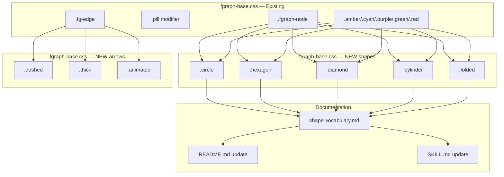
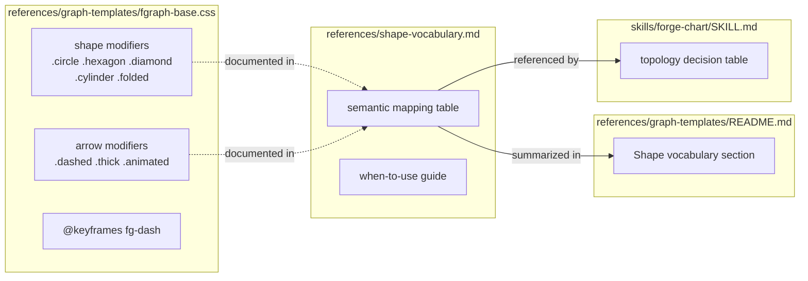

## Summary

Extend `fgraph-base.css` with 5 shape modifiers (circle, hexagon, diamond, cylinder, folded) and 3 arrow modifiers (dashed, thick, animated) as CSS primitives composable with all existing tones/content. Then create `shape-vocabulary.md` and update README + SKILL.md so Claude picks the right shape during generation.

## Architecture

### Data Flow



### File x Function Map



## Agents

| Agent | Task count | Files |
|-------|-----------|-------|
| doc-writer | 10 | fgraph-base.css, shape-vocabulary.md, README.md, SKILL.md |

## Consistency Report

- Criteria covered: 13/13
- Uncovered criteria: none
- Tasks without spec backing: none
- Gold plating exemptions applied: 0

## Micro-Tasks

### Slice V1: Circle + arrow modifiers

#### Task 1: Add `.circle` shape modifier [P] → doc-writer
- **File:** `plugins/forge/references/graph-templates/fgraph-base.css`
- **Snippet:**
  ```css
  .fgraph-node.circle {
    border-radius: 50%;
    aspect-ratio: 1;
    --w: 14%;
    display: flex;
    flex-direction: column;
    align-items: center;
    justify-content: center;
    text-align: center;
    padding: 12px;
  }
  ```
- **Verify:** `grep -q 'fgraph-node.circle' plugins/forge/references/graph-templates/fgraph-base.css` (ready)
- **Expected:** Match found — `.circle` modifier exists
- **Time:** 3 min | **Difficulty:** 1
- **Traces:** SC-4 (S4) | **Phase:** GREEN

#### Task 2: Add `.dashed` and `.thick` arrow modifiers [P] → doc-writer
- **File:** `plugins/forge/references/graph-templates/fgraph-base.css`
- **Snippet:**
  ```css
  .fgraph-edges .fg-edge.dashed { stroke-dasharray: 4 3; }
  .fgraph-edges .fg-edge.thick  { stroke-width: 2.8; }
  ```
- **Verify:** `grep -q 'fg-edge.dashed' plugins/forge/references/graph-templates/fgraph-base.css && grep -q 'fg-edge.thick' plugins/forge/references/graph-templates/fgraph-base.css` (ready)
- **Expected:** Both matches found
- **Time:** 2 min | **Difficulty:** 1
- **Traces:** SC-6, SC-7 (A1, A2) | **Phase:** GREEN

#### Task 3: Add `.animated` arrow modifier with `@keyframes` → doc-writer
- **File:** `plugins/forge/references/graph-templates/fgraph-base.css`
- **Snippet:**
  ```css
  .fgraph-edges .fg-edge.animated {
    stroke-dasharray: 8 4;
    animation: fg-dash 1s linear infinite;
  }
  @keyframes fg-dash { to { stroke-dashoffset: -12; } }
  ```
- **Verify:** `grep -q 'fg-dash' plugins/forge/references/graph-templates/fgraph-base.css` (ready)
- **Expected:** Match found — keyframes and animated class exist
- **Time:** 2 min | **Difficulty:** 1
- **Traces:** SC-8 (A3) | **Phase:** GREEN

### Slice V2: Hexagon + diamond (clip-path shapes)

#### Task 4: Add `.hexagon` shape modifier with `::before` border → doc-writer
- **File:** `plugins/forge/references/graph-templates/fgraph-base.css`
- **Snippet:**
  ```css
  .fgraph-node.hexagon {
    clip-path: polygon(25% 0%, 75% 0%, 100% 50%, 75% 100%, 25% 100%, 0% 50%);
    background: var(--bg-card);
    border: none;
    position: relative;
    text-align: center;
    padding: 16px 20px;
  }
  .fgraph-node.hexagon::before {
    content: '';
    position: absolute;
    inset: -2px;
    clip-path: polygon(25% 0%, 75% 0%, 100% 50%, 75% 100%, 25% 100%, 0% 50%);
    background: var(--border-bright);
    z-index: -1;
  }
  /* tone overrides for hexagon ::before */
  .fgraph-node.hexagon.amber::before  { background: var(--amber); }
  .fgraph-node.hexagon.cyan::before   { background: var(--cyan); }
  .fgraph-node.hexagon.purple::before { background: var(--purple); }
  .fgraph-node.hexagon.green::before  { background: var(--green); }
  .fgraph-node.hexagon.red::before    { background: var(--red); }
  .fgraph-node.hexagon:hover::before  { inset: -3px; }
  ```
- **Verify:** `grep -q 'fgraph-node.hexagon' plugins/forge/references/graph-templates/fgraph-base.css` (ready)
- **Expected:** Match found
- **Time:** 5 min | **Difficulty:** 3
- **Traces:** SC-2 (S2) | **Phase:** GREEN

#### Task 5: Add `.diamond` shape modifier with `::before` border → doc-writer
- **File:** `plugins/forge/references/graph-templates/fgraph-base.css`
- **Snippet:**
  ```css
  .fgraph-node.diamond {
    clip-path: polygon(50% 0%, 100% 50%, 50% 100%, 0% 50%);
    background: var(--bg-card);
    border: none;
    --w: 18%;
    text-align: center;
    padding: 20px 16px;
  }
  .fgraph-node.diamond::before {
    content: '';
    position: absolute;
    inset: -2px;
    clip-path: polygon(50% 0%, 100% 50%, 50% 100%, 0% 50%);
    background: var(--border-bright);
    z-index: -1;
  }
  /* tone + hover same pattern as hexagon */
  ```
- **Verify:** `grep -q 'fgraph-node.diamond' plugins/forge/references/graph-templates/fgraph-base.css` (ready)
- **Expected:** Match found
- **Time:** 4 min | **Difficulty:** 3
- **Traces:** SC-3 (S3) | **Phase:** GREEN

### Slice V3: Cylinder + folded (pseudo-element shapes)

#### Task 6: Add `.cylinder` shape modifier → doc-writer
- **File:** `plugins/forge/references/graph-templates/fgraph-base.css`
- **Snippet:**
  ```css
  .fgraph-node.cylinder {
    border-radius: 0;
    border: none;
    background: transparent;
    padding: 18px 10px 12px;
    text-align: center;
    position: relative;
  }
  .fgraph-node.cylinder::before,
  .fgraph-node.cylinder::after {
    content: '';
    position: absolute;
    left: 0; right: 0;
    height: 20%;
    border-radius: 50%;
    background: var(--bg-card);
    border: 1.5px solid var(--border-bright);
  }
  .fgraph-node.cylinder::before { top: 0; z-index: 1; }
  .fgraph-node.cylinder::after  { bottom: 0; }
  /* body fill between caps */
  ```
- **Verify:** `grep -q 'fgraph-node.cylinder' plugins/forge/references/graph-templates/fgraph-base.css` (ready)
- **Expected:** Match found
- **Time:** 5 min | **Difficulty:** 3
- **Traces:** SC-1 (S1) | **Phase:** GREEN

#### Task 7: Add `.folded` shape modifier → doc-writer
- **File:** `plugins/forge/references/graph-templates/fgraph-base.css`
- **Snippet:**
  ```css
  .fgraph-node.folded {
    clip-path: polygon(0% 0%, calc(100% - 14px) 0%, 100% 14px, 100% 100%, 0% 100%);
    border: none;
    background: var(--bg-card);
    position: relative;
    text-align: center;
  }
  .fgraph-node.folded::before { /* border layer */ }
  .fgraph-node.folded::after  { /* corner triangle */ }
  ```
- **Verify:** `grep -q 'fgraph-node.folded' plugins/forge/references/graph-templates/fgraph-base.css` (ready)
- **Expected:** Match found
- **Time:** 5 min | **Difficulty:** 3
- **Traces:** SC-5 (S5) | **Phase:** GREEN

### Slice V4: Documentation

#### Task 8: Create `shape-vocabulary.md` reference doc [P] → doc-writer
- **File:** `plugins/forge/references/shape-vocabulary.md` (new)
- **Snippet:**
  ```markdown
  # Shape Vocabulary
  | Shape | Class | Semantic | When to use |
  |-------|-------|----------|-------------|
  | Rounded rect | (default) | Service, process, generic | Default for any node |
  | Pill | .pill | Bus, broker, router | Central hub in radial |
  | Cylinder | .cylinder | Database, storage, queue | Data persistence |
  | Hexagon | .hexagon | Agent, worker, autonomous | AI agents, background jobs |
  | Diamond | .diamond | Decision, gate, conditional | Routing, branching |
  | Circle | .circle | Event, trigger, start/end | Signals, lifecycle points |
  | Folded | .folded | File, config, document | Static assets, configs |
  ```
- **Verify:** `test -f plugins/forge/references/shape-vocabulary.md && grep -q 'hexagon' plugins/forge/references/shape-vocabulary.md` (ready)
- **Expected:** File exists with shape table
- **Time:** 5 min | **Difficulty:** 2
- **Traces:** SC-11 (D1) | **Phase:** GREEN

#### Task 9: Update `README.md` with shape vocabulary section [P] → doc-writer
- **File:** `plugins/forge/references/graph-templates/README.md`
- **Snippet:** Add `### Shape vocabulary` section after `### Primitives` table with shape table + link to `shape-vocabulary.md`
- **Verify:** `grep -q 'Shape vocabulary' plugins/forge/references/graph-templates/README.md` (ready)
- **Expected:** Section exists
- **Time:** 4 min | **Difficulty:** 2
- **Traces:** SC-12 (D2) | **Phase:** GREEN

#### Task 10: Update `forge-chart/SKILL.md` topology decision table → doc-writer
- **File:** `plugins/forge/skills/forge-chart/SKILL.md`
- **Snippet:** Add shape guidance row: "When generating fgraph nodes, use shape modifiers to match node semantics: `.cylinder` for DBs, `.hexagon` for agents..."
- **Verify:** `grep -q 'shape-vocabulary' plugins/forge/skills/forge-chart/SKILL.md` (ready)
- **Expected:** Reference to shape vocabulary exists
- **Time:** 3 min | **Difficulty:** 2
- **Traces:** SC-13 (D3) | **Phase:** GREEN

## Task IDs

<!-- Generated by /plan. Used by /implement to resume tasks on session restart. -->
- T1: 10 — Add .circle shape modifier to fgraph-base.css
- T2: 11 — Add .dashed and .thick arrow modifiers
- T3: 12 — Add .animated arrow modifier with @keyframes
- T4: 13 — Add .hexagon shape modifier with ::before border
- T5: 14 — Add .diamond shape modifier with ::before border
- T6: 15 — Add .cylinder shape modifier
- T7: 16 — Add .folded shape modifier
- T8: 17 — Create shape-vocabulary.md reference doc
- T9: 18 — Update README.md with shape vocabulary section
- T10: 19 — Update forge-chart SKILL.md topology decision table
