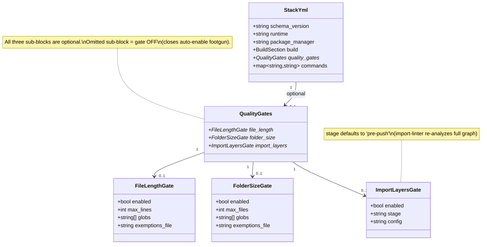
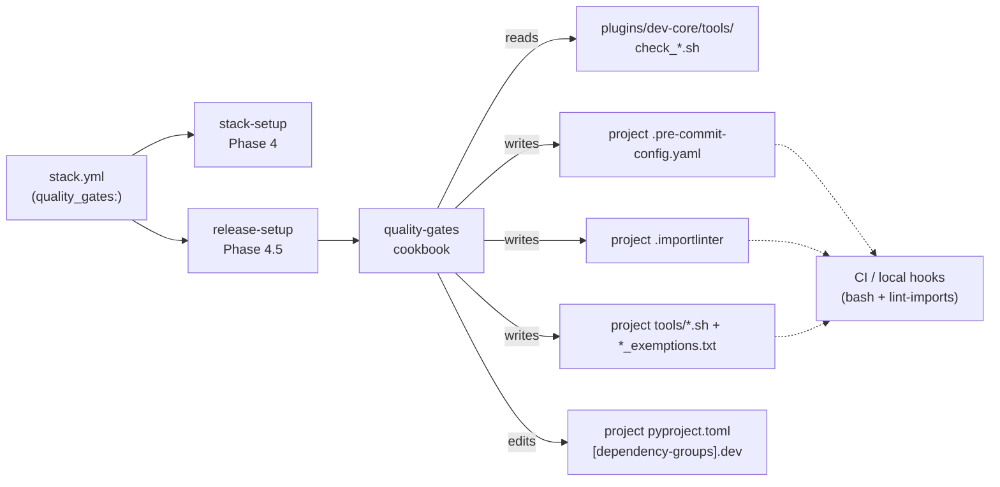

## Context

**Source:** GitHub issue [Roxabi/roxabi-plugins#114](https://github.com/Roxabi/roxabi-plugins/issues/114).
**Promoted from:** [analysis](../analyses/114-quality-gates-analysis.mdx) (Shape 1 — release-setup cookbook).
**Frame:** [frame](../frames/114-quality-gates-frame.mdx).

The frame and analysis established:

- Three code-hygiene guards (file-length, folder-size, import-layers) exist in `lyra` only; nothing in `stack.yml` declares them
- Canonical home for the two shell scripts is `plugins/dev-core/tools/`
- `/init` must install guards on a fresh Python repo with zero manual follow-up
- `/release-setup --force` must be idempotent on repos with 0, partial, or full guards
- Cross-repo normalization (voiceCLI, imageCLI, lyra, llmCLI) is filed as child issues, not executed here

This spec specifies exactly what gets built in the roxabi-plugins PR.

## Goal

A Python repo where `.claude/stack.yml` contains `quality_gates:` gets the three guards installed and kept in sync by `/release-setup --force`, reading from a single canonical source under `plugins/dev-core/tools/`.

## Users

| Primary | Scaffolds or updates Roxabi Python repos via `/init` or `/release-setup --force` |
| Secondary | Lands in an existing Roxabi Python repo and expects identical guardrails across all of them |
| CI | Executes `lint-imports` and the two shell scripts as pre-commit / pre-push hooks |

## Expected Behavior

Narrative walkthroughs of the canonical flows.

### Flow 1 — Fresh Python repo via `/init`

1. Developer runs `/init` in an empty Python repo with `pyproject.toml`.
2. `/stack-setup` detects `runtime: python` (via `uv` marker in `pyproject.toml`), writes `.claude/stack.yml` that includes a full `quality_gates:` section — all three sub-blocks present, all `enabled: true`, default thresholds.
3. `/release-setup` runs next in the chain. Phase 4.5 reads `quality_gates:`, detects all three sub-blocks enabled, invokes the `quality-gates` cookbook.
4. Cookbook, in order:
   a. Copies `plugins/dev-core/tools/check_file_length.sh` → project `tools/check_file_length.sh` (chmod +x).
   b. Copies `plugins/dev-core/tools/check_folder_size.sh` → project `tools/check_folder_size.sh` (chmod +x).
   c. Creates `tools/file_exemptions.txt` and `tools/folder_exemptions.txt` if absent, with header comment documenting the `<path> <issue-url>` line format (single-space separator).
   d. Runs `uv add --group dev import-linter` (atomic `pyproject.toml` + `uv.lock` update). Skipped if already declared; no raw `uv sync` — see Decision D3 below.
   e. Writes `.importlinter` as an active config with all contracts commented (see §Scaffold contents below). `lint-imports` on this file exits 0.
   f. Parses `.pre-commit-config.yaml` via Python stdlib `yaml` (see D2); inserts three new hooks (`check-file-length`, `check-folder-size`, `import-layers`) immediately after the `id: typecheck` entry in the existing `repo: local` block. `import-layers` gets `stages: [pre-push]` by default.
5. Final state: `.pre-commit-config.yaml` has six hooks in order: `lint → typecheck → check-file-length → check-folder-size → import-layers (pre-push) → license`. Three guards are wired, exemption files are empty, `.importlinter` has `[importlinter]` active but all contracts commented.

### Flow 2 — Re-run `/release-setup --force` on a lyra-like repo (full state)

`lyra` already has all three guards wired: its own scripts in `tools/`, its own `.importlinter` with 5 active contracts, its own `.pre-commit-config.yaml` with 7 hooks.

1. Developer runs `/release-setup --force` on `lyra`.
2. Cookbook overwrites `tools/check_file_length.sh` and `tools/check_folder_size.sh` with the canonical content from `plugins/dev-core/tools/` (project local exemption files are preserved — different files).
3. Cookbook parses `.pre-commit-config.yaml`; detects all three `id`s present. Under `--force`, re-stamps each hook's `entry:` path so it references the just-updated project-local path (in practice the path string may not change, but the cookbook verifies and normalizes).
4. Cookbook leaves `.importlinter` alone (never rewritten once it exists; project-owned regardless of contract state — see Decision D1).
5. Cookbook leaves each hook's `stages:` list alone (respects existing values; new `stage:` values in `stack.yml` govern only fresh insertions — see Decision D4).
6. `/release-setup --force` reports: `Quality gates ✅ Re-stamped from canonical (2 scripts updated, 3 hooks verified, .importlinter preserved)`.

### Flow 3a — First run on a mid-state repo (llmCLI pattern)

A repo whose `.pre-commit-config.yaml` has `lint → typecheck → gitleaks → license`, no guards, no `tools/*.sh`, no `.importlinter`.

1. Developer runs `/release-setup` (no `--force`).
2. Cookbook detects all three `id`s missing. Missing is not a collision, so without `--force` it still installs them: copies scripts, seeds exemption files, `uv add --group dev import-linter`, writes `.importlinter` scaffold, inserts three hooks after `id: typecheck`.
3. Final state: `lint → typecheck → check-file-length → check-folder-size → import-layers (pre-push) → gitleaks → license`. Insertion anchor is `id: typecheck` (tool-agnostic; no dependence on `gitleaks` vs `trufflehog` naming).

### Flow 3b — Re-run on the same mid-state repo with local edits

Continuing from Flow 3a — developer has since manually edited `tools/check_file_length.sh` (e.g. `MAX=250`).

1. Developer runs `/release-setup` (still no `--force`).
2. Cookbook sees all three `id`s present. Compares `tools/check_file_length.sh` against the canonical copy, detects drift.
3. Prints drift warning: `WARN: tools/check_file_length.sh differs from canonical (plugins/dev-core/tools/). Run /release-setup --force to re-stamp.` No file is touched.
4. Running with `--force` at this point overwrites the local edit. Acceptable because `--force` is explicit.

### Flow 4 — Non-Python repo (roxabi-plugins itself)

1. `.claude/stack.yml` in roxabi-plugins has `runtime: bun`, no `quality_gates:` section (stack-setup only seeds it when `runtime == python`).
2. `/release-setup --force` Phase 4.5 reads stack.yml, sees no `quality_gates:` key, returns immediately: `Quality gates ⏭ Skipped (no quality_gates: section)`. No file is touched.

## Data Model & Consumers

### Schema types



### Consumer map



### Consumer summary

| Consumer | When | Status |
|---|---|---|
| stack-setup Phase 4 | On `/init` or `/stack-setup`, `runtime == python` | this issue |
| release-setup Phase 4.5 | On `/init` (via chain) or `/release-setup --force` | this issue |
| quality-gates cookbook | Dispatched by release-setup Phase 4.5 | this issue |
| Pre-commit runner (local + CI) | Every commit / push | this issue |
| `/checkup` drift verifier | Standalone `/checkup` invocation | future (out of scope) |

Read/write topology is captured in the consumer-map flowchart above; the table tracks timing and ownership only.

## Decisions Locked

| ID | Decision | Rationale |
|---|---|---|
| D1 | `.importlinter` is never rewritten once it exists — regardless of contract state (scaffold-only vs active) or `--force` | Layer topology is project-owned. Cookbook's concern is the *scaffold* on first install; subsequent evolution belongs to the project |
| D2 | YAML parsing tool for `.pre-commit-config.yaml` and `pyproject.toml`: Python stdlib `yaml` (invoked via `uv run python -c` or `python3 -c`) | Only portable option confirmed present on Pop!_OS + Ubuntu Server; `yq`, `dasel` not installed. `pyproject.toml` uses TOML (`tomllib` in stdlib 3.11+) |
| D3 | Installing `import-linter`: `uv add --group dev import-linter` (atomic pyproject + uv.lock), not `uv sync --group dev` | `uv sync` without `--locked` can rewrite `uv.lock`, creating CI divergence. `uv add` updates both files deterministically |
| D4 | Under `--force`, existing hook `stages:` lists in `.pre-commit-config.yaml` are never overwritten. `stack.yml` `stage:` governs only fresh insertions | Preserves project overrides (e.g. lyra currently has `import-layers` at pre-commit; `--force` does not flip it to pre-push) |
| D5 | Phase 4.5 is added to release-setup in Slice 3. Before Slice 3 lands, `stack.yml` may contain an inert `quality_gates:` block (Slice 2 only) | Inert-block tolerance is explicit: release-setup pre-Slice-3 simply doesn't know about the section, so no-ops silently |
| D6 | `enabled: false` on a previously-installed gate is a no-op — neither installs nor removes files/hooks | Removal is a separate operation the user performs manually. Prevents destructive surprises from a config flip |

## `.importlinter` scaffold contents

The cookbook writes `.importlinter` as an active (working) config with commented contracts. This is the precise content:

```ini
[importlinter]
root_packages =
    {PROJECT_PACKAGE_NAME}
include_external_packages = False

# ── Contracts ────────────────────────────────────────────────────────────────
# Uncomment and edit when you have defined your layer topology.
# Reference: https://import-linter.readthedocs.io/en/stable/contract_types.html
#
# [importlinter:contract:clean-architecture-layers]
# name = Clean architecture layers (example — replace with your topology)
# type = layers
# layers =
#     {PROJECT_PACKAGE_NAME}.bootstrap
#     {PROJECT_PACKAGE_NAME}.adapters
#     {PROJECT_PACKAGE_NAME}.core
```

`{PROJECT_PACKAGE_NAME}` is resolved by reading `[project].name` from `pyproject.toml`, falling back to the first entry under `[tool.uv.workspace].packages` if absent, or the single directory under `src/` if both are absent.

With `[importlinter]` header + `root_packages` set and zero active contracts, `lint-imports` exits 0 (verified against import-linter behavior: "no contracts" is a valid state, not an error).

## Breadboard

### Affordances

`stack.yml` schema:

| ID | Element | Handler | Data |
|---|---|---|---|
| S1 | `quality_gates:` top-level key | `release-setup` Phase 4.5 reader | YAML map of three gate sub-blocks |
| S2 | `quality_gates.file_length.{enabled,max_lines,globs,exemptions_file}` | cookbook `install_file_length` | Written by stack-setup on python runtime |
| S3 | `quality_gates.folder_size.{enabled,max_files,globs,exemptions_file}` | cookbook `install_folder_size` | Written by stack-setup on python runtime |
| S4 | `quality_gates.import_layers.{enabled,stage,config}` | cookbook `install_import_layers` | `stage` defaults to `pre-push` |

Cookbook (`plugins/dev-core/skills/release-setup/cookbooks/quality-gates.md`):

| ID | Element | Handler | Data |
|---|---|---|---|
| N1 | Phase 4.5 entry guard | `runtime == python` ∧ `quality_gates:` section present → continue; else skip | Reads `.claude/stack.yml` |
| N2 | Canonical source check | Verify `${CLAUDE_PLUGIN_ROOT}/tools/check_file_length.sh` and `check_folder_size.sh` exist | Cookbook refuses to proceed if canonical missing |
| N3 | Script install + drift detect | Copy canonical → project `tools/`; `chmod +x`; under `--force`, overwrite; without `--force`, compare via `diff`; if differs, print drift warning and leave file | Per-gate |
| N4 | Exemption seed | Create `tools/file_exemptions.txt` and `tools/folder_exemptions.txt` if absent, with header documenting `<path> <issue-url>` format and space-separator. Never overwrite existing content | Idempotent |
| N5 | Import-linter dep | `uv add --group dev import-linter` via Bash (atomic pyproject+lock). Skip if already in `[dependency-groups].dev` | Reads `pyproject.toml` via `tomllib`; no `uv sync` invocation |
| N6 | `.importlinter` scaffold | Write `.importlinter` only if absent. Never overwrite, regardless of `--force` or contract state (D1) | Populates `{PROJECT_PACKAGE_NAME}` from `pyproject.toml` |
| N7 | Hook merge algorithm | Parse `.pre-commit-config.yaml` via Python stdlib `yaml` (D2); locate first `repo: local` block; for each of 3 hooks: if `id:` exists, skip (or re-stamp `entry:` under `--force`, preserving `stages:` per D4); else insert immediately after `id: typecheck` entry | Fallback: if no `id: typecheck`, DP(A) asks user: insert at end of `repo: local` block (default) \| abort |
| N8 | Summary line | `Quality gates ✅ Configured (N installed / N re-stamped / N skipped)` or `⏭ Skipped (no quality_gates: section)` | Appears in Phase 5 ledger |

User-facing CLI entry points:

| ID | Element | Handler | Data |
|---|---|---|---|
| U1 | `/init` on fresh Python repo | Chains `/env-setup` → `/github-setup` → `/ci-setup` → `/release-setup` | `release-setup` Phase 4.5 runs |
| U2 | `/release-setup` (no args) | Reads stack.yml, runs all 5 phases | Phase 4.5 idempotent on partial state |
| U3 | `/release-setup --force` | Same, with force-re-stamp behavior | Re-stamps scripts + hook `entry:`, preserves `.importlinter` and hook `stages:` |
| U4 | `/stack-setup` on Python repo | Writes stack.yml including `quality_gates:` block | Does not touch files outside `.claude/` |

## Slices

Each slice leaves the repo in a shippable state and has a clear mergeable-alone story.

| # | Slice | Delivers | Affordances |
|---|---|---|---|
| 1 | **Canonical scripts + schema docs** | `plugins/dev-core/tools/check_file_length.sh`, `check_folder_size.sh` (copies from lyra, exec permissions, 1-line header `# Canonical source: plugins/dev-core/tools/ — do not edit project-side copies directly`); `plugins/dev-core/stack.yml.example` documents `quality_gates:` section with commentary on all three sub-blocks and default behavior | S1, S2, S3, S4 |
| 2 | **stack-setup seeds quality_gates for Python repos** | `stack-setup/SKILL.md` Phase 4 template, when `runtime == python`, includes full `quality_gates:` block (all three sub-blocks present, `enabled: true`, default thresholds). README updated | U4 |
| 3 | **quality-gates cookbook + release-setup dispatch** | `plugins/dev-core/skills/release-setup/cookbooks/quality-gates.md` with full N1–N8 algorithm including `.importlinter` scaffold content, YAML parse strategy (D2), `uv add` (D3), `stages:` preservation (D4), drift detection. `release-setup/SKILL.md` adds Phase 4.5 dispatch line. README updated | N1–N8, U1, U2, U3 |
| 4 | **Smoke tests for canonical flows** | Manual smoke-test checklist in the cookbook: (a) fresh Python scratch → expected final state; (b) llmCLI-pattern mid-state → insertion after `typecheck`; (c) lyra-pattern full-state `--force` → entries re-stamped, `.importlinter` preserved, `stages:` preserved; (d) mid-state with local edit + no `--force` → drift warning, no change; (e) `id: typecheck` absent → DP(A) fallback exercised. Results pasted into PR description | — (validates 1–3) |
| 5 | **Documentation sweep** | `plugins/dev-core/README.md` lists quality gates in feature table; grep `docs/CREATE-PLUGIN-GUIDE.md` for `stack.yml` — if present, `quality_gates:` added to the example snippet; else a one-line check comment in the PR description confirming it was intentionally skipped (no file edit) | — |

Slice 1 is a no-behavior-change foundation: scripts in dev-core + schema docs. Mergeable alone.
Slice 2 needs Slice 1 for the schema-docs reference. Mergeable alone — Decision D5 covers the inert-block case (release-setup pre-Slice-3 doesn't know about the section, so silent no-op).
Slice 3 is where behavior change lands. Needs Slices 1 and 2 to exercise correctly.
Slice 4 is a validation slice. Needs Slice 3 merged.
Slice 5 is docs cleanup. Independent; merge anytime after Slice 3.

## Success Criteria

Binary pass/fail items. Each maps to a specific slice.

**Slice 1 — Canonical scripts + schema docs**

- [ ] `plugins/dev-core/tools/check_file_length.sh` exists, is executable, and `diff --unified` against `/home/mickael/projects/lyra/tools/check_file_length.sh` contains exactly one added line beginning with `# Canonical source:` and zero other changes
- [ ] `plugins/dev-core/tools/check_folder_size.sh` exists, is executable, and `diff --unified` against `/home/mickael/projects/lyra/tools/check_folder_size.sh` contains exactly one added line beginning with `# Canonical source:` and zero other changes
- [ ] `plugins/dev-core/stack.yml.example` contains a `quality_gates:` section with all three sub-blocks; each sub-block has `enabled`, the per-gate threshold, `globs` (for length/size) or `stage`+`config` (for import_layers), and `exemptions_file` (for length/size); top-level comment explains absent-section = off, absent-sub-block = off

**Slice 2 — stack-setup seeds**

- [ ] Running `/stack-setup` against a Python scratch project produces a `.claude/stack.yml` that includes the full `quality_gates:` block with all three sub-blocks, each `enabled: true`
- [ ] Running `/stack-setup` against a Bun project (roxabi-plugins-like) produces a `.claude/stack.yml` with NO `quality_gates:` section

**Slice 3 — cookbook + dispatch**

- [ ] `plugins/dev-core/skills/release-setup/cookbooks/quality-gates.md` exists and specifies the N1–N8 algorithm explicitly, including: canonical-source check, per-gate install, drift-detection branch, `uv add --group dev` (D3), `.importlinter` scaffold content with `[importlinter]` header + `root_packages`, hook-merge via Python stdlib `yaml` (D2), insertion anchor `id: typecheck`, idempotency under `--force` vs without, `stages:` preservation (D4)
- [ ] `plugins/dev-core/skills/release-setup/SKILL.md` Phase 4.5 dispatch line reads the cookbook, gates on `runtime == python` and `quality_gates:` present
- [ ] A `.importlinter` containing only the scaffold `[importlinter]` header + `root_packages` + commented contracts, when executed via `uv run lint-imports`, exits 0
- [ ] Removing `tools/file_exemptions.txt` and running `tools/check_file_length.sh` on a clean repo does not produce an error — the script's `[ ! -f "$EXEMPT_FILE" ] && return 1` guard in `is_exempt()` falls through to "not exempt" and the check continues normally

**Slice 4 — smoke tests** (each pasted as checklist output in the PR description)

- [ ] **Case a — fresh scratch Python repo:** `/init` produces `.pre-commit-config.yaml` with exactly these hooks in order: `lint → typecheck → check-file-length → check-folder-size → import-layers (stages: [pre-push]) → license`
- [ ] **Case b — llmCLI-pattern mid-state** (`lint → typecheck → gitleaks → license`): `/release-setup` inserts the three new hooks immediately after `typecheck`; final order `lint → typecheck → check-file-length → check-folder-size → import-layers → gitleaks → license`
- [ ] **Case c — lyra-pattern full-state:** `/release-setup` (no `--force`) is a no-op (stdout: "all three hooks present, no changes"); `/release-setup --force` re-stamps script contents and hook `entry:` paths but leaves `.importlinter` and hook `stages:` unchanged
- [ ] **Case d — mid-state with local edit:** after Case a, manually edit `tools/check_file_length.sh` (change MAX to 250), run `/release-setup` (no `--force`); stdout contains "drift", no file is modified
- [ ] **Case e — `id: typecheck` absent:** on a `.pre-commit-config.yaml` that has only `id: lint`, `/release-setup` presents a DP(A) offering "insert at end of `repo: local` block" as the default; accepting the default produces a valid final file

**Slice 5 — docs**

- [ ] `plugins/dev-core/README.md` contains a row/line mentioning `quality_gates` with a one-line description and a link to the cookbook path
- [ ] `docs/CREATE-PLUGIN-GUIDE.md` either contains `quality_gates:` in the schema example, or the PR description contains a one-line note confirming the guide was grepped for `stack.yml` and does not include schema examples

## Edge Cases

| Case | Handling |
|---|---|
| `quality_gates:` present but all sub-blocks have `enabled: false` | Phase 4.5 logs `Quality gates ⏭ All gates disabled`, installs nothing, removes nothing (D6) |
| Gate previously installed, then flipped to `enabled: false` | No-op per D6. Files, hooks, and `.importlinter` all remain. Removal is a manual user action, not a cookbook concern |
| User customized `tools/check_file_length.sh` (e.g. MAX=250) and runs `/release-setup` without `--force` | Drift warning printed (Flow 3b). No file changed |
| User customized and runs `/release-setup --force` | Canonical overwrites project copy. User's customization is lost. Acceptable because `--force` is explicit |
| `.importlinter` already exists with active contracts (lyra) | Cookbook never rewrites `.importlinter` — D1 applies regardless of state or `--force` |
| `pyproject.toml` has `import-linter` pinned at a specific version | `uv add --group dev import-linter` is a no-op when the dep is already declared (any version); version is not changed |
| `pyproject.toml` has no `[dependency-groups]` section | `uv add --group dev import-linter` creates it automatically (verified uv behavior) |
| No `id: typecheck` hook in `.pre-commit-config.yaml` | Cookbook DP(A): **Insert at end of `repo: local` block** (default) \| **Abort**. Covered by Slice 4 Case e |
| Multiple `repo:` blocks in `.pre-commit-config.yaml` | Cookbook targets the first `repo: local` block; if none exists, creates one at the top of `repos:` |
| Python repo without `uv` (plain pip) | `uv add` fails; cookbook prints warning and instructs user to install `import-linter` manually. Hook wiring still proceeds; hooks will fail at pre-commit time until the dep is installed, which is visible to the user |
| Target repo pins `pre-commit` to a version older than 2.4.0 (no `stages: [pre-push]` support) | Very rare; cookbook does not probe pre-commit version. If encountered, the hook will error out at pre-push time; documented in cookbook edge notes |

## Open Questions

Carried over from analysis, decided inline:

1. **Re-stamp lyra's scripts on first `/release-setup --force` against lyra?** Decided **yes**: dev-core is canonical; drift correction is the whole point. Recorded in N3 and Flow 2.
2. **Default `stage: pre-push` for `import-layers` — flip lyra's existing `pre-commit` stage?** Decided **no auto-flip** (D4). `--force` re-stamps `entry:` paths but respects existing `stages:` values.

Both answered. Zero `[NEEDS CLARIFICATION]` markers remain.

## Pre-check Summary

- Testable criteria: all 16 success-criteria items are binary (pass/fail). ✓
- No dangling refs: every affordance (S1–S4, N1–N8, U1–U4) is referenced in ≥1 slice. ✓
- Ambiguity budget: 0 `[NEEDS CLARIFICATION]` items. ✓
- Slice coverage: S/N/U affordances all appear in slices 1–3. ✓
- Edge completeness: 11 edge cases enumerated with handling. ✓

Pre-check: 5/5 pass.
