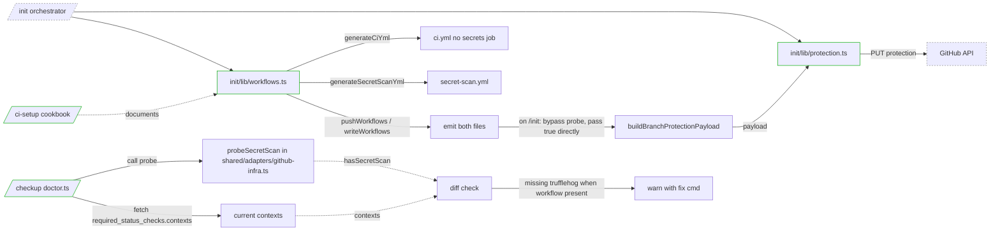

## Context

Source frame: `artifacts/frames/118-trufflehog-workflow-align-frame.mdx`.

Lyra PR [#836](https://github.com/Roxabi/lyra/pull/836) (issue #803) split TruffleHog out of `ci.yml` into a standalone `.github/workflows/secret-scan.yml`. dev-core's `/init` still emits the old embedded `secrets:` job inside `ci.yml`, and `BRANCH_PROTECTION_PAYLOAD` hardcodes `contexts: ['ci']` — omitting `trufflehog`. `/checkup` does not flag the divergence when a repo has been hand-migrated.

Reference workflow (fetch in plan if needed): `https://raw.githubusercontent.com/Roxabi/lyra/staging/.github/workflows/secret-scan.yml` — pinned `trufflesecurity/trufflehog@47e7b7cd74f578e1e3145d48f669f22fd1330ca6` (v3.94.3), `actions/checkout@de0fac2e4500dabe0009e67214ff5f5447ce83dd` (v6), `--only-verified`, `cancel-in-progress: false`, `push` + `pull_request` + `workflow_dispatch` on `[main, staging]`, `permissions: { contents: read }`, `timeout-minutes: 5`.

**Check-name verification (2026-04-21):** Lyra's actual branch protection uses bare contexts `['ci', 'trufflehog']` — confirmed via `gh api repos/Roxabi/lyra/branches/staging/protection`. Job IDs become check names when the job has no overriding `name:` field. This spec therefore targets bare `['ci', 'trufflehog']`.

## Goal

`/init` produces standalone `secret-scan.yml` with branch protection auto-including `trufflehog`; `/checkup` detects and offers to fix drift on repos where the workflow exists but the required-contexts list is stale.

## Users

- **Primary:** dev-core skill authors + developers running `/init` on fresh repos or `/checkup` on existing repos.
- **Secondary:** all repos previously bootstrapped with old-pattern `ci.yml` (lyra, voiceCLI, imageCLI, idna, forge, intel, roxabi-plugins itself) — they must converge on re-run.

## Expected Behavior

**Scenario 1: fresh repo, `/init` from scratch.**
`/init` → `ci-setup` writes `ci.yml` without `secrets:` job + new `secret-scan.yml` → `github-setup` probes Contents API, finds `secret-scan.yml` → applies branch protection with `contexts: ['ci', 'trufflehog']`.

**Scenario 2: existing repo, no secret-scan.yml yet, re-run `/init`.**
Same as Scenario 1. Old inline `secrets:` job is overwritten when `ci.yml` is regenerated. `secret-scan.yml` created. Branch protection re-patched to include `trufflehog`.

**Scenario 3: existing repo, `secret-scan.yml` already present, re-run.**
- Plain `/init` — `pushWorkflowFile` probes existing file; if reference content differs, updates to the canonical version (current `pushWorkflowFile` behavior is PUT-with-sha, which is the accepted idempotent path). If user has local customizations and wants to preserve them, they run `/init --skip-workflows` or `/ci-setup` only after.
- `/init --force` — always overwrites both files with generated content. No prompt.
- Branch protection re-applied with `contexts: ['ci', 'trufflehog']` — since `/init` just pushed the workflow, `hasSecretScan` is passed as `true` directly (no separate probe — avoids write/read race, see Scenario 4 for the probe path).

**Scenario 4: existing repo, `secret-scan.yml` present but branch protection stale, `/checkup`.**
Doctor reuses `probeSecretScan` (from `github-infra.ts`) to check the remote workflows list → sees `secret-scan.yml` → fetches `required_status_checks.contexts` per protected branch via `gh api repos/{owner}/{repo}/branches/{branch}/protection/required_status_checks` → if `trufflehog` missing, emits `warn` with a copy-pasteable fix: `gh api PATCH repos/{owner}/{repo}/branches/{branch}/protection/required_status_checks -f 'contexts[]=ci' -f 'contexts[]=trufflehog' -F strict=true` (PATCH on the sub-endpoint `/required_status_checks` is the GitHub-supported partial update; full-resource `PUT` on `/protection` remains unchanged).

**Scenario 5: repo without secret-scan.yml (user opted out of scanning at `/init`).**
`buildBranchProtectionPayload({ hasSecretScan: false })` returns `contexts: ['ci']` only. `/checkup` reports `trufflehog` as not required — consistent with absent workflow. No false-positive warnings.

**Scenario 6: probe fails (network error, 404 on `.github/workflows/` missing, auth issue).**
Non-fatal: probe returns `hasSecretScan: false` on any non-200 response. `/init` continues with `contexts: ['ci']`; user can re-run later. Error logged to stderr but does not halt the pipeline.

**Scenario 7: `/checkup` on a protected-branch-less repo.**
Existing doctor behavior: `checkBranchProtection` emits `skip` if the branch does not exist (`doctor.ts:401`). This spec leaves that path untouched. Drift detector only runs when protection exists on at least one branch.

## Data Model & Consumers

### Data Structures

```mermaid
classDiagram
  class BranchProtectionOpts {
    +hasSecretScan: boolean
  }
  class BranchProtectionPayload {
    +required_status_checks: StatusChecks
    +enforce_admins: false
    +restrictions: null
  }
  class StatusChecks {
    +strict: true
    +contexts: string[]
  }
  class WorkflowProbe {
    +workflowsPresent: Set~string~
    +hasSecretScan(): boolean
  }
  class SecretScanYml {
    +name: "Secret Scan"
    +jobId: "trufflehog"
    +actionSha: string
    +checkoutSha: string
    +triggers: [push, pull_request, workflow_dispatch]
    +concurrency: Concurrency
  }
  class Concurrency {
    +group: "secret-scan-${ref}"
    +cancel-in-progress: false
  }

  BranchProtectionOpts --> BranchProtectionPayload : buildBranchProtectionPayload()
  BranchProtectionPayload --> StatusChecks
  WorkflowProbe ..> BranchProtectionOpts : produces hasSecretScan
  SecretScanYml --> Concurrency
```

### Consumer Map



### Consumer Summary

| Consumer | Fields / artifacts | When | Status |
|---|---|---|---|
| `init/lib/workflows.ts` | generates `ci.yml` (no `secrets:`) + `secret-scan.yml` | on `/init` or `/ci-setup` run | this issue |
| `init/lib/protection.ts` | probes Contents API → calls `buildBranchProtectionPayload` | during branch protection step of `/init` | this issue |
| `shared/adapters/github-infra.ts` | exposes `buildBranchProtectionPayload(opts)` + `STANDARD_WORKFLOWS` incl. `secret-scan.yml` | imported by init + checkup | this issue |
| `checkup/doctor.ts` | reads required contexts + probes workflow → emits drift warning | on `/checkup` run | this issue |
| `ci-setup/cookbooks/scanning.md` | documents the standalone pattern for humans | reference during skill invocation | this issue |

## Breadboard

### N\* — Nouns (artifacts, modules)

| ID | Name | Path |
|---|---|---|
| N1 | `workflows.ts` | `plugins/dev-core/skills/init/lib/workflows.ts` |
| N2 | `github-infra.ts` | `plugins/dev-core/skills/shared/adapters/github-infra.ts` |
| N3 | `protection.ts` | `plugins/dev-core/skills/init/lib/protection.ts` |
| N4 | `doctor.ts` | `plugins/dev-core/skills/checkup/doctor.ts` |
| N5 | `scanning.md` | `plugins/dev-core/skills/ci-setup/cookbooks/scanning.md` |
| N6 | config.test.ts | `plugins/dev-core/skills/shared/__tests__/config.test.ts` |
| N7 | protection.test.ts | `plugins/dev-core/skills/init/__tests__/protection.test.ts` |

### S\* — Signals (functions, data)

| ID | Signal | Lives in | Notes |
|---|---|---|---|
| S1 | `generateSecretScanYml()` | N1 | new — returns YAML matching lyra reference |
| S2 | `generateCiYml(opts)` | N1 | modified — strips `secrets:` job |
| S3 | `buildBranchProtectionPayload({ hasSecretScan })` | N2 | new function — replaces const |
| S4 | `STANDARD_WORKFLOWS` | N2 | modified — adds `secret-scan.yml` |
| S5 | `probeSecretScan(owner, repo, token?)` | N2 | new helper — Contents API probe on `.github/workflows/secret-scan.yml`; returns `false` on any non-200 (404, 403, 5xx, network error). Lives in `github-infra.ts` so both `protection.ts` and `doctor.ts` can import without cross-layer dependency. |
| S8 | `TRUFFLEHOG_ACTION_SHA` + `CHECKOUT_ACTION_SHA` | N1 | new named exports — pinned SHAs for the two actions used by `secret-scan.yml`. `scanning.md` references them by literal value with version comments for human readers. |
| S6 | `pushWorkflows / writeWorkflows` | N1 | modified — emit `secret-scan.yml` |
| S7 | doctor `checkBranchProtection` | N4 | enhanced — cross-checks contexts vs workflow presence |

### U\* — User touchpoints

| ID | Touchpoint | Handler |
|---|---|---|
| U1 | `/init` on fresh repo | S6 emits both files, S5→S3 applies dynamic protection |
| U2 | `/init --force` on migrated repo | Idempotent — S5 sees existing workflow, S3 includes `trufflehog` |
| U3 | `/checkup` on drifted repo | S7 reports stale contexts + fix cmd |
| U4 | `/ci-setup` re-run standalone | Same as U1 (ci-setup owns the workflows step) |

### Wiring

```
U1/U2 → init orchestrator → workflows.ts (S2+S1+S6) → .github/workflows/{ci.yml, secret-scan.yml}
                         → protection.ts (S5 → S3) → gh api branch protection PUT
U3   → checkup doctor → probe + contexts fetch → S7 report
U4   → ci-setup → same path as U1 workflows step
```

## Slices

| # | Slice | Delivers | Depends on | Demo |
|---|---|---|---|---|
| 1 | **Workflow split** | S1, S2, S4, S6, S8 — ci.yml stops emitting `secrets:` job, new `generateSecretScanYml` function, `TRUFFLEHOG_ACTION_SHA` + `CHECKOUT_ACTION_SHA` named exports, both files pushed, STANDARD_WORKFLOWS includes `secret-scan.yml` | — | `writeWorkflows` writes 4 files (ci + auto-merge + pr-title + secret-scan) on bun stack; generated `secret-scan.yml` byte-equals lyra reference modulo the two pinned SHA constants |
| 2 | **Dynamic branch protection** | S3, S5 — `buildBranchProtectionPayload(opts)` in `github-infra.ts`, `probeSecretScan(owner, repo)` in `github-infra.ts`, `protection.ts` calls `buildBranchProtectionPayload({ hasSecretScan: true })` directly on the `/init` path (no read-after-write race); probe used only by `/checkup`; unit tests for both branches of payload builder + probe 404/200 paths | Slice 1 (needs `secret-scan.yml` in `STANDARD_WORKFLOWS`) | Unit tests: `buildBranchProtectionPayload({hasSecretScan:true})` → contexts `['ci','trufflehog']`; `false` → `['ci']`; `probeSecretScan` returns `false` on mocked 404 |
| 3 | **Checkup drift detector** | S7 — `checkBranchProtection` in `doctor.ts` rewritten: fetches `required_status_checks.contexts` per protected branch via dedicated sub-endpoint call, cross-references `probeSecretScan` result, emits `warn` with copy-pasteable `gh api PATCH repos/{repo}/branches/{branch}/protection/required_status_checks` command when drift detected. Existing "unprotected"/"skip-when-branch-missing" behavior preserved | Slice 2 | Run `bun doctor.ts --json` against a drifted repo → doctor section contains warn entry with PATCH fix cmd; against a consistent repo → pass; against an unprotected branch → skip |
| 4 | **Cookbook + SKILL.md + reference links** | N5 rewrite — `scanning.md` documents standalone workflow + literal pinned SHA values (copied from S8 named exports) with version comments; `ci-setup/SKILL.md` references `scanning.md` for the secret-scan step; no reference to `secrets:` embedded job anywhere in dev-core docs | Slice 1 (needs constants in place) | `grep -r "secrets:" plugins/dev-core/skills/**/*.md` → no matches describing an in-`ci.yml` job; `ci-setup/SKILL.md` contains a link to or inline reference of `cookbooks/scanning.md` |

Order: 1 → 2 → 3 → 4. Slices 1–3 land in a single PR (tight coupling through tests); slice 4 can piggyback.

## Success Criteria

- [ ] `generateSecretScanYml()` output equals the Lyra reference workflow with only the two values `TRUFFLEHOG_ACTION_SHA` and `CHECKOUT_ACTION_SHA` substituted; assert via a snapshot test that diffs to zero non-SHA lines.
- [ ] `TRUFFLEHOG_ACTION_SHA` and `CHECKOUT_ACTION_SHA` are exported named constants in `workflows.ts`.
- [ ] `generateCiYml()` no longer contains a `secrets:` job — verified by absence of string `secrets:` under `jobs:` in its output.
- [ ] `pushWorkflows` and `writeWorkflows` emit `secret-scan.yml` alongside `ci.yml` / `auto-merge.yml` / `pr-title.yml`.
- [ ] `STANDARD_WORKFLOWS` includes `'secret-scan.yml'`.
- [ ] `buildBranchProtectionPayload({ hasSecretScan: true })` returns `contexts: ['ci', 'trufflehog']` (order preserved).
- [ ] `buildBranchProtectionPayload({ hasSecretScan: false })` returns `contexts: ['ci']`.
- [ ] `probeSecretScan(owner, repo)` lives in `shared/adapters/github-infra.ts` (not `init/lib/`) so `checkup/doctor.ts` can import it without cross-layer dependency.
- [ ] `probeSecretScan` returns `false` on non-200 responses (404, 403, 5xx, network error) and does not throw.
- [ ] `protection.ts` calls `buildBranchProtectionPayload({ hasSecretScan: true })` directly on the `/init` path after a successful `pushWorkflows`, bypassing the read-after-write race; the standalone `probeSecretScan` is reserved for `/checkup` and for ad-hoc `protection.ts` runs where the workflow state is unknown.
- [ ] Unit tests in `shared/__tests__/config.test.ts` cover both branches of `buildBranchProtectionPayload`.
- [ ] Unit tests in `shared/__tests__/` cover `probeSecretScan` 200-present and 404-absent paths via mocked `fetch` / `gh api`.
- [ ] Unit tests in `init/__tests__/protection.test.ts` cover the direct-`hasSecretScan`-true path (plus one legacy re-exported constant compatibility test removed or updated).
- [ ] `checkup/doctor.ts:checkBranchProtection` emits `warn` when `secret-scan.yml` is present but `trufflehog` is missing from `required_status_checks.contexts` on any protected branch, with a copy-pasteable `gh api PATCH .../required_status_checks` command in the detail.
- [ ] `checkup/doctor.ts` emits `pass` when state is consistent (both present or both absent).
- [ ] `checkup/doctor.ts` preserves the existing `skip` behavior for branches that do not exist.
- [ ] `ci-setup/cookbooks/scanning.md` describes the standalone workflow pattern and references the literal `TRUFFLEHOG_ACTION_SHA` / `CHECKOUT_ACTION_SHA` values; contains no reference to a `secrets:` job inside `ci.yml`.
- [ ] `ci-setup/SKILL.md` contains a reference (link or inline mention) to `cookbooks/scanning.md` for the secret-scan step.
- [ ] Re-running `/init --force` on a repo that already has both `secret-scan.yml` and `contexts: ['ci','trufflehog']` converges without duplicating contexts or changing payload values (idempotent).
- [ ] `bun run test` passes across `plugins/dev-core/skills/{init,shared,checkup}`.
- [ ] `bun run typecheck` passes.
- [ ] `bun run lint` (biome) passes.

## Open Questions

None resolved by the spec revision:
- Check-name format (`bare 'trufflehog'` vs `'Secret Scan / trufflehog'`) — **verified** on 2026-04-21 via `gh api repos/Roxabi/lyra/branches/staging/protection`; actual contexts are bare.
- SHA constant location — **decided**: named exports in `workflows.ts`; `scanning.md` copies literal values (discipline, not mechanism).
- `probeSecretScan` location — **decided**: `shared/adapters/github-infra.ts` (shared between `init/lib/protection.ts` and `checkup/doctor.ts`).
- `/init` read-after-write race — **decided**: `protection.ts` bypasses the probe on the `/init` path; passes `hasSecretScan: true` directly after successful push.
- PATCH vs PUT in fix cmd — **decided**: PATCH on `/protection/required_status_checks` sub-endpoint (partial update); matches issue body's own suggestion.

Remaining ambiguity: whether plain `/init` (no `--force`) should soft-skip updating an existing `secret-scan.yml` on the remote. Currently `pushWorkflowFile` always updates with sha. Recommendation: leave current behavior (always-update) to avoid special-casing; `scanning.md` documents "re-running `/init` updates to the reference version — move custom content into a separate workflow if needed." The plan can revisit if it becomes a real blocker.
