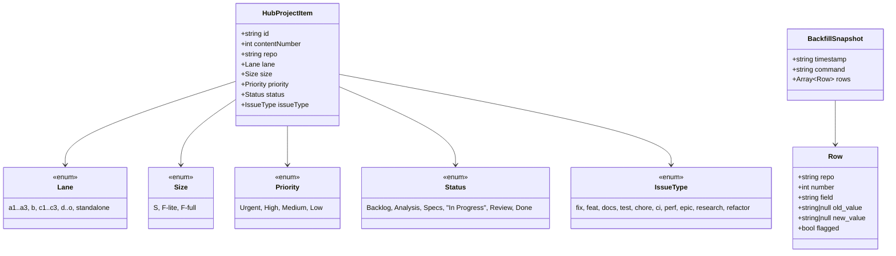
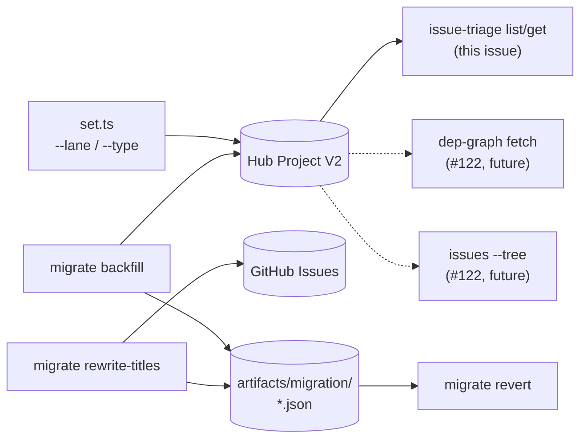

## Context

Promoted from `artifacts/analyses/121-dual-write-migration-analysis.mdx` (Shape B — approved 2026-04-22 after product-lead + architect concurrence). Parent spec `artifacts/specs/119-issue-taxonomy-migration-spec.mdx` §Phases 3–5.

Deviation from parent spec: "dual-write" is renamed **soak window** because `set.ts` never wrote legacy labels — there is no legacy path to parallel. The soak is a 7-day burn-in of the new Lane+Type write paths under normal triage load. All other exit criteria from the parent spec phases 3+4+5 are preserved.

Enrolled repos corrected: **7**, not 8. `Roxabi/2ndBrain` is local-only (per `~/projects/CLAUDE.md`) and is excluded.

## Goal

After this slice lands and its soak + migration runs complete, every open issue across the 7 enrolled repos has `Lane`, `Size`, `Priority`, `issueType` populated in the hub project; no open title matches `^(feat|fix|refactor|docs|test|chore|ci|perf)(\(.+\))?:`; and snapshot JSONs in `artifacts/migration/` make the entire migration reversible.

## Users

- **Primary:** `dev-core:issue-triage` users (the human operator running `bun triage.ts set N --lane X --type feat` and `bun triage.ts migrate backfill`).
- **Secondary:** Migration reviewer (Mickael) — approves `flagged.txt` and the title-rewrite dry-run snapshot before live runs. Owns the gate between S3/S4 and between S5 dry-run/live.
- **Tertiary:** `#122` (cutover + guardrail) — depends on hub project fields being complete.
- **Quaternary:** `lyra/scripts/dep-graph` — once #122 flips its read path, completeness of the hub fields is load-bearing.

## Expected Behavior

**Write path change.** `bun triage.ts set <N>` gains two optional flags:

- `--lane <L>` where `L ∈ LANE_OPTIONS` (20 values from `hub-bootstrap.ts`). Calls `updateField(itemId, LANE_FIELD_ID, LANE_OPTIONS[L])`.
- `--type <T>` where `T ∈ {fix,feat,docs,test,chore,ci,perf,epic,research,refactor}`. Calls `updateIssueIssueType(issueNodeId, typeId)` via a new adapter export.

Both are additive; omission preserves today's behavior. Invalid value → `process.exit(1)` with the valid set listed (same pattern as `--size`).

**Soak window.** After the `set.ts` change merges to staging and is deployed across the 7 repos' triage runners, 7 wall-clock days of normal triage activity must elapse before backfill runs. Soak exit = new fields populated on every issue triaged in that window, zero error logs from `updateField`/`updateIssueIssueType` for those 7 days.

**Backfill.** `bun triage.ts migrate backfill [--repo OWNER/REPO | --all] [--dry-run] [--snapshot path]` walks every open issue across the selected repos and applies:

1. If hub field is already set → skip (idempotent).
2. `graph:lane/<X>` label → `Lane`.
3. `size:<Y>` label → `Size` via `LEGACY_LABEL_MAP` (e.g., `size:M → F-lite`).
4. `P{0-3}-<name>` label (lyra only) → `Priority` via map (`P0-* → Urgent`, `P1-* → High`, `P2-* → Medium`, `P3-* → Low`).
5. Title prefix `^(feat|fix|…)\(.+\)?:` → `issueType`. No match → flag.
6. Emit `artifacts/migration/backfill-snapshot-<YYYYMMDD-HHMM>.json` + `artifacts/migration/flagged-<YYYYMMDD-HHMM>.txt`.

Dry-run prints a diff table, writes no mutations, still emits the snapshot for review.

**Title rewrite.** `bun triage.ts migrate rewrite-titles [--repo OWNER/REPO | --all] [--dry-run]` strips the conventional-commit prefix from every open issue title via `gh issue edit`. Snapshot JSON (`rewrite-snapshot-<ts>.json`) records `{repo, number, old_title, new_title}`.

**Revert.** `bun triage.ts migrate revert --snapshot <path>` reads either snapshot kind and undoes the mutations:

- Project field writes (`Lane`, `Size`, `Priority`) → clear via `updateField(itemId, fieldId, null)` (the existing adapter accepts null to clear).
- `issueType` writes → call `updateIssueIssueType(issueNodeId, null)`. The GraphQL mutation accepts a null `issueTypeId` to remove the type (verified in pre-impl spike; if the API rejects null, revert must restore to `old_value` recorded in the snapshot row — adapter wraps this semantics).
- Title writes → `gh issue edit <N> --title "<old_title>"`.

Idempotent: re-running revert on an already-reverted snapshot logs skip per row, no errors.

**Schema audit.** `bun triage.ts migrate audit-schema` is a first-class subcommand (routed independently, not only invoked as a pre-flight hook inside `backfill`). It queries `gh project field-list 23 --owner Roxabi` and asserts:

1. `Size` field exists and its option IDs match `SIZE_OPTIONS` in `config-helpers.ts`.
2. `Lane` field exists and its 20 option IDs match `LANE_OPTIONS`.
3. `Priority` + `Status` fields exist with matching option sets (covered by existing constants).

Any mismatch → exit 1 with a diff and reconciliation instructions. `backfill` invokes `audit-schema` as a pre-flight and aborts on failure; the operator may also run it standalone.

**Language note.** Parent spec (#119) described Phase 4/5 as Python scripts under `scripts/migrate/`. This slice implements them in TypeScript inside the `issue-triage` skill (per Shape B). Justification is in `artifacts/analyses/121-…` §Fit Check — unchanged exit criteria, simpler ownership, reuse of existing adapters.

## Data Model & Consumers

### Hub project field model



### Consumer map



### Consumer summary

| Consumer | Fields consumed | When | Status |
|---|---|---|---|
| `issue-triage list/get` | Lane, Size, Priority, Status, issueType | Every triage read | This issue |
| `dep-graph fetch.py` | Lane, Size, Priority, Milestone | Build time | Future (#122) |
| `dev-core:issues --tree` | Lane, Status, parent/sub edges | Query time | Future (#122) |
| `migrate revert` | Snapshot rows | Manual rollback | This issue |

## Breadboard

### Affordances

| ID | Affordance | Handler | Data read | Data written |
|---|---|---|---|---|
| N1 | `set <N> --lane L` | `set.ts:applyLane` | `LANE_OPTIONS`, item id | `projectV2.Lane` |
| N2 | `set <N> --type T` | `set.ts:applyType` | type id map from org | `issue.issueType` |
| N3 | `migrate backfill` | `migrate.ts:backfill` | labels, title, existing fields | Lane/Size/Priority/issueType + snapshot |
| N4 | `migrate rewrite-titles` | `migrate.ts:rewriteTitles` | titles | title + snapshot |
| N5 | `migrate revert --snapshot P` | `migrate.ts:revert` | snapshot JSON | inverse of N3 or N4 |
| N6 | `migrate audit-schema` | `migrate.ts:auditSchema` | live project field-list | stdout diff |
| U1 | `--dry-run` flag | shared helper | — | stdout only |
| U2 | Snapshot writer | `migrate.ts:writeSnapshot` | rows | `artifacts/migration/*.json` |
| U3 | `LEGACY_LABEL_MAP` | constant in `migrate.ts` | — | — |
| U4 | `updateIssueIssueType` export | `github-adapter.ts` | — | GraphQL mutation |
| U5 | `LANE_FIELD_ID` + `LANE_OPTIONS` | `config-helpers.ts` | — | — |

### Wiring

```
bun triage.ts set N --lane L --type T
  → parseArgs → applyProjectFields → applyLane(N1) → updateField(LANE_FIELD_ID)
                                   → applyType(N2) → updateIssueIssueType(U4)

bun triage.ts migrate backfill --repo R --dry-run
  → auditSchema(N6) → listOpenIssues(R) → foreach issue:
      read existing fields (skip if set)
      map labels via U3 → proposed values
      U1 ? print diff : updateField + updateIssueIssueType
      append row to snapshot (U2)

bun triage.ts migrate revert --snapshot P
  → load snapshot → foreach row: inverse mutation
```

## Slices

| # | Slice | Affordances | Demo |
|---|---|---|---|
| S1 | **Write-path extension** | N1, N2, U4, U5 | `bun triage.ts set 127 --lane c1 --type feat` updates hub + org issueType; `--help` lists new flags |
| S2 | **Soak + monitoring** | (S1 deployed) | 7 days of normal triage on staging-deployed skill; zero errors in `set.ts` invocations across 7 repos |
| S3 | **Schema audit + backfill dry-run** | N3, N6, U1, U2, U3 | `bun triage.ts migrate backfill --repo Roxabi/roxabi-plugins --dry-run` prints diff table, writes snapshot, no mutations |
| S4 | **Backfill live** | N3, N6 | Serial per-repo: `bun triage.ts migrate backfill --repo <R>` for each of 7 repos (order: roxabi-plugins → lyra → other 5 parallel-safe but run serially for clean per-repo diff). `flagged.txt` reviewed before the next repo starts |
| S5 | **Title rewrite** | N4, U1, U2 | `migrate rewrite-titles --all --dry-run` → human review → live run → snapshot committed |
| S6 | **Revert path** | N5 | Test-only: run backfill on a scratch issue, revert via snapshot, verify fields cleared |

Slices S1, S2, S3, S6 land in the PR. S4 and S5 are **operational runs after merge**, not code changes — tracked in the PR body as a post-merge checklist.

## Success Criteria

### Code (ship in PR)

- [ ] `set.ts` accepts `--lane <L>` with validation against `LANE_OPTIONS`; invalid → exit 1 with valid set listed
- [ ] `set.ts` accepts `--type <T>` with validation against the 10 org issue types; invalid → exit 1 with valid set listed
- [ ] `--lane` and `--type` are additive; existing calls without them behave identically (regression test)
- [ ] `config-helpers.ts` exports `LANE_FIELD_ID`, `LANE_OPTIONS`
- [ ] `migrate audit-schema` run once during implementation; result recorded in PR body; `config-helpers.ts:DEFAULT_SIZE_OPTIONS` updated to exactly match the live `Size` option set; `audit-schema` subsequently passes with zero diff
- [ ] `github-adapter.ts` exports `updateIssueIssueType(issueNodeId, typeId)` wrapper
- [ ] `lib/migrate.ts` implements `backfill`, `rewriteTitles`, `revert`, `auditSchema` with `--dry-run` on all three mutating commands
- [ ] `triage.ts` routes `migrate <backfill|rewrite-titles|revert|audit-schema>` as four first-class subcommands (each callable independently)
- [ ] `LEGACY_LABEL_MAP` constant covers: `graph:lane/*` → Lane; `size:S`, `size:M`, `size:L`, `size:XL` → Size; `P0-*`, `P1-*`, `P2-*`, `P3-*` → Priority; conventional-commit title prefix → issueType. **Unit test asserts each listed key maps to the expected value** and that unknown keys emit to `flagged.txt`
- [ ] Snapshot JSON written for every non-dry-run backfill or rewrite run; path format `artifacts/migration/{backfill|rewrite}-snapshot-<YYYYMMDD-HHMM>.json`
- [ ] `migrate revert --snapshot P` is idempotent and logs which rows were inverted vs already-reverted
- [ ] Unit tests: `set.test.ts` covers `--lane` and `--type` (valid, invalid, additive); `migrate.test.ts` covers dry-run, idempotency, flagged.txt emission, revert round-trip
- [ ] `SKILL.md` documents `--lane`, `--type`, `migrate <subcmd>` with examples
- [ ] `references/issue-taxonomy.md` patched: enrolled repos 8 → 7; note on size-schema reconciliation
- [ ] `bun run typecheck && bun run test && bunx biome check --write` all clean

### Operational (post-merge, tracked in PR body)

- [ ] 7-day soak elapses with zero `updateField`/`updateIssueIssueType` error logs across 7 repos
- [ ] **Soak parity check (parent-spec gate):** at soak-end, a `migrate backfill --dry-run --soak-check` pass against issues triaged during the window returns zero field divergences between the values `set.ts` wrote and the values currently in the hub project (asserts write path is stable + no out-of-band drift)
- [ ] `migrate audit-schema` returns 0 diff before backfill starts
- [ ] Backfill dry-run per repo; snapshot committed; `flagged.txt` reviewed and resolved (pass: all flagged rows explicitly accepted or fixed)
- [ ] Backfill live per repo (serial order); follow-up `backfill --dry-run` returns 0 proposed mutations per repo (pass condition)
- [ ] GraphQL query `projectV2.items where Lane IS NULL OR Size IS NULL OR issueType IS NULL` **returns 0 results** across 7 repos
- [ ] Title rewrite dry-run reviewed by migration reviewer; live run completed across 7 repos
- [ ] `gh issue list --search "^(feat|fix|refactor|docs|test|chore|ci|perf)(\(.+\))?:" --state open` **returns 0 rows** across 7 repos
- [ ] Both snapshot JSONs committed to `artifacts/migration/`

### Gate

- [ ] `#122` unblocked: dep-graph reader and `dev-core:issues` read paths can assume field completeness on open issues

## Resolved decisions

1. **`area:*` labels on lyra — untouched.** `migrate` does not read, delete, or map them. They remain a lyra-local convention orthogonal to taxonomy.
2. **Backfill CLI — serial only, no `--all` flag in v1.** Every invocation requires `--repo OWNER/REPO`. Natural human pause between repos enforces per-repo `flagged.txt` review. `--all` can be added later if wanted.

## Open questions

1. **[L × L] Snapshot commit granularity** — one commit per repo, or one commit per migration run listing all repos? Operational, post-merge, non-blocking. [suggested: one commit per run]
