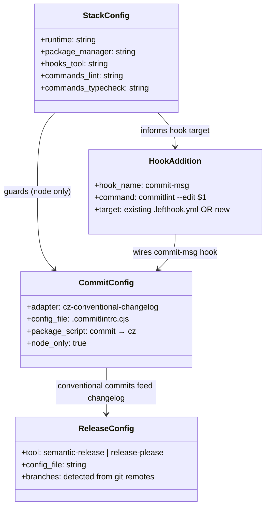
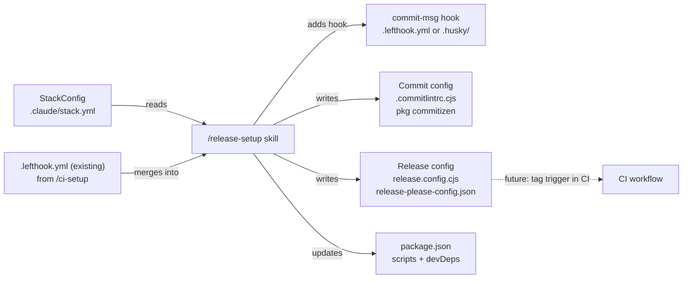

## Context

Promoted from `artifacts/frames/13-project-setup-skill-frame.mdx` (approved 2026-03-11).

The dev-core `/init` skill sets up the Claude Code workflow (CI/CD, GitHub project, pre-commit hooks for
code quality) but leaves commit discipline and release automation unconfigured. This spec defines a new
`/release-setup` sub-skill added to dev-core, invoked after `/ci-setup` in `/init`'s Phase 3 orchestration
block, and independently callable as a standalone skill.

---

## Goal

Add a `/release-setup` sub-skill to dev-core that configures commit standards (Commitizen + conventional
commits, Node/TS only), hook additions (commit-msg hook wired into existing Lefthook config or fresh
install), and release automation (semantic-release or Release Please) for Node/TS, Python, and monorepo
projects — wired into `/init` and independently callable.

---

## Users

- **Primary:** Developers running `/init` on a new Node/TS, Python, or monorepo project who want commit
  standards and automated releases set up without manual configuration.
- **Secondary:** Existing dev-core users who ran `/init` before this skill existed and want to add
  release discipline to an already-configured project via `/ release-setup` standalone.

---

## Expected Behavior

1. User runs `/init` (or `/release-setup` standalone).
2. Skill reads `.claude/stack.yml` to detect runtime, package manager, and whether a hook runner is
   already present (`.lefthook.yml` / `.husky/`).
3. Skill asks three per-component questions (each independently skippable):
   - **Hook runner** — if no runner exists: Lefthook | Husky | Skip. If `.lefthook.yml` already exists
     (e.g. from `/ci-setup`): only the commit-msg hook addition is offered.
   - **Commit standards** — Commitizen + commitlint (Node/TS only) | Skip. Skipped automatically
     for Python projects with an informational note.
   - **Release automation** — semantic-release | Release Please | Skip.
4. Each component is applied independently. Existing config files are detected per-component at start;
   the component is skipped (displayed as `⏭ Already configured`) unless `--force` is passed.
5. Generated files are displayed in a summary table. The skill does NOT auto-commit — following the
   sub-skill pattern, it displays the files for the user to review and commit.
6. When invoked via `/init`, this runs as a fourth `skill:` call in Phase 3 (after `ci-setup`), and
   `/init` Phase 4 report is updated to include a `/release-setup` re-run entry.

---

## Data Model & Consumers

| Consumer | Fields consumed | When | Status |
|----------|----------------|------|--------|
| `/release-setup` | runtime, package_manager, hooks.tool, commands.lint, commands.typecheck | Skill execution | This issue |
| `/init` Phase 3 | — (delegates to `/release-setup`) | After `ci-setup` skill call | This issue |
| `/init` Phase 4 report | — (adds `/release-setup` re-run entry) | Report display | This issue |
| CI workflow (`ci.yml`) | release config file presence | Trigger on tag | Future |

---

## Breadboard

### Phase 0 — Pre-check (per-component idempotency)

| Affordance | Handler | Data |
|-----------|---------|------|
| ¬`.claude/stack.yml` ∃ | Warn: "stack.yml not found" + AskUserQuestion: **Run `/env-setup` first** \| **Proceed manually** | — |
| Check `.lefthook.yml` ∃ | `has_hook_runner = true` → hook phase offers merge only | boolean |
| Check `.husky/` ∃ | `has_hook_runner = true` | boolean |
| Check `.commitlintrc.cjs` ∃ | `has_commits = true` → skip commits phase (display ⏭) unless `--force` | boolean |
| Check `release.config.cjs` ∃ ∨ `release-please-config.json` ∃ | `has_releases = true` → skip releases phase unless `--force` | boolean |
| `--force` present | Override all `has_*` guards → re-run all components | boolean |

### Phase 1 — Stack Detection

| Affordance | Handler | Data |
|-----------|---------|------|
| Read `.claude/stack.yml` | `detect_stack()` | runtime, package_manager, hooks.tool, commands.lint, commands.typecheck |
| Detect existing hook runner | `detect_hook_runner()` → check file existence | has_lefthook, has_husky |
| Detect branches | `git branch -r \| grep -E 'staging\|develop\|main\|master'` → infer default + release branches | branch_list |

### Phase 2 — Hook Runner

| Affordance | Handler | Data |
|-----------|---------|------|
| `has_hook_runner = false` → AskUserQuestion: **Lefthook** \| **Husky** \| **Skip** | `install_hook_runner()` | choice |
| `has_hook_runner = true` (`.lefthook.yml` ∃) | Skip install; only add commit-msg hook in Phase 3 if Commitizen chosen | note displayed |
| Lefthook chosen, Node/TS | Install `lefthook`, generate `.lefthook.yml` with pre-commit phase (lint + typecheck from stack.yml commands) | `.lefthook.yml` |
| Lefthook chosen, Python | Install `lefthook`, generate `.lefthook.yml` pointing to `pre-commit run --all-files` | `.lefthook.yml` + `.pre-commit-config.yaml` skeleton |
| Python `.pre-commit-config.yaml` | Skeleton: `repos: [{repo: local, hooks: [{id: ruff, language: python, entry: ruff check}, {id: mypy, language: python, entry: mypy}]}]` | `.pre-commit-config.yaml` |
| Husky chosen | Install `husky`, run `husky init`, generate `.husky/pre-commit` with lint + typecheck | `.husky/pre-commit` |
| Either chosen + Node | Install `lint-staged`, add config to `package.json` | `package.json` |
| Skip | D⏭("Hook runner") | — |

### Phase 3 — Commit Standards (Node/TS only)

| Affordance | Handler | Data |
|-----------|---------|------|
| `runtime == python` | D⏭("Commit standards — Python not supported, skip") | — |
| AskUserQuestion: **Commitizen + commitlint** \| **Skip** | `setup_commits()` | choice |
| Chosen | Install `commitizen`, `@commitlint/cli`, `@commitlint/config-conventional` | `package.json` devDeps |
| Chosen | Generate `.commitlintrc.cjs`: `module.exports = {extends: ['@commitlint/config-conventional']}` | `.commitlintrc.cjs` |
| Chosen | Add `"commit": "cz"` script to `package.json` | `package.json` scripts |
| Lefthook ∃ (new or existing) | Add `commit-msg` entry to `.lefthook.yml`: `run: commitlint --edit {1}` | `.lefthook.yml` |
| Husky ∃ | Generate `.husky/commit-msg`: `npx --no -- commitlint --edit $1` | `.husky/commit-msg` |
| Skip | D⏭("Commit standards") | — |

### Phase 4 — Release Automation

| Affordance | Handler | Data |
|-----------|---------|------|
| AskUserQuestion: **semantic-release** \| **Release Please** \| **Skip** | `setup_releases()` | choice |
| Either chosen | Use `branch_list` from Phase 1 to populate branches config; default to `main` if only one branch found | branches array |
| semantic-release | Install `semantic-release` + plugins (`@semantic-release/git`, `@semantic-release/changelog`), generate `release.config.cjs` | `release.config.cjs` |
| semantic-release | Add `"release": "semantic-release"` script | `package.json` scripts |
| Release Please | Generate `release-please-config.json` (package type from runtime) + `.release-please-manifest.json` | both files |
| Skip | D⏭("Release automation") | — |

### Phase 5 — Summary (no auto-commit)

| Affordance | Handler | Data |
|-----------|---------|------|
| Display generated files table | `✅ Generated` / `⏭ Skipped` per component | — |
| Suggest commit | Display: `git add <files> && git commit -m "chore: add release setup"` | — |
| Package install failure | Catch non-zero exit → display error + `⚠️ {component} install failed — check network/lockfile` + continue to next component | error message |

---

## Slices

| # | Slice | Affordances | Demo |
|---|-------|-------------|------|
| S1 | Hook runner setup | Phase 0 pre-check + Phase 1 detection + Phase 2 (Lefthook or Husky + lint-staged) | Run `/release-setup`, choose Lefthook, skip commits+releases → `.lefthook.yml` generated, summary shown |
| S2 | Commit standards | Phase 3 (Commitizen + commitlint + hook wiring into existing or new runner) | Run `/release-setup`, choose Lefthook + Commitizen → `.commitlintrc.cjs` + commit-msg added to `.lefthook.yml` |
| S3 | Release automation | Phase 4 (semantic-release or Release Please, branches from git) | Run `/release-setup`, choose releases → `release.config.cjs` with detected branches |
| S4 | `/init` integration | Add `skill: "release-setup"` call in `/init` Phase 3; update Phase 4 report table and Next steps block | Running `/init` end-to-end reaches release-setup prompts automatically |

---

## Success Criteria

- [ ] Running `/release-setup` on a Node/TS (bun) project with no existing hook runner and choosing Lefthook generates `.lefthook.yml` with a pre-commit phase running the `lint` and `typecheck` commands from `stack.yml`
- [ ] Running `/release-setup` on a Python project and choosing Lefthook generates `.lefthook.yml` invoking `pre-commit run --all-files` and a `.pre-commit-config.yaml` skeleton with ruff and mypy hooks
- [ ] Running `/release-setup` on a project that already has `.lefthook.yml` (e.g. from `/ci-setup`) does NOT reinstall or replace it — only adds the `commit-msg` hook entry when Commitizen is chosen
- [ ] Choosing Commitizen on a Node/TS project generates `.commitlintrc.cjs` with `@commitlint/config-conventional` and adds `"commit": "cz"` to `package.json` scripts
- [ ] Choosing Commitizen on a Python project skips the step and displays `⏭ Commit standards — Python not supported`
- [ ] Choosing semantic-release generates `release.config.cjs` with a `branches` array derived from `git branch -r` (defaults to `['main']` if only one remote branch detected)
- [ ] Choosing Release Please generates `release-please-config.json` and `.release-please-manifest.json`
- [ ] Running `/release-setup` on a project that already has `.commitlintrc.cjs` skips that component with `⏭ Already configured` — unless `--force` is passed, in which case it regenerates
- [ ] Running `/init` invokes `/release-setup` after `/ci-setup` in Phase 3, and `/init` Phase 4 report includes a `/release-setup` re-run entry
- [ ] When a package install step fails (non-zero exit), the skill logs `⚠️ {component} install failed` and continues to the next component rather than aborting
