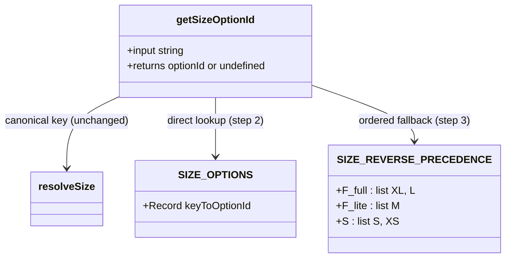
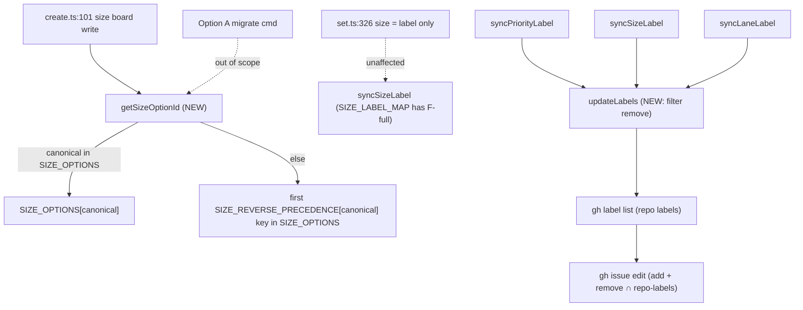

## Context

Source: `artifacts/frames/177-align-canonical-size-names-frame.mdx` (approved).
Scope locked at frame: **Option B (runtime reverse-alias resolution) + label-sync side bug**. Option A (board-mutating `migrate rename-size-options`) is out of scope.

> Grounding note: the issue body's symbols/lines (`getSizeOptionId`, `SIZE_ALIASES`, `syncLabel`, `runGh`, `dev-core/0.3.0/...`, `set.ts:326-330` size-on-board) are **stale** — they predate the current tree. Every fact below was verified by reading the worktree on 2026-05-30.

### Verified facts (current tree)

**1. The Size *board field* is written at exactly ONE site — `create.ts`.**
`create.ts:101-109`:
```ts
if (opts.size) {
  const canonical = resolveSize(opts.size)
  if (!(canonical && SIZE_OPTIONS[canonical])) {
    console.error('Error: Invalid size'); process.exit(1)   // ← the bug
  }
  await updateField(itemId, SIZE_FIELD_ID, SIZE_OPTIONS[canonical])
}
```
On a legacy board, `SIZE_OPTIONS` keys are `XS/S/M/L/XL`; `resolveSize('F-full')` returns canonical `'F-full'`; `SIZE_OPTIONS['F-full']` is `undefined` → `Error: Invalid size` and exit 1. **This is the issue's core repro.**

**2. `set.ts` does NOT write the Size board field at all.**
`applyProjectFields` (`set.ts:166-187`) handles only `status / priority / type`. Size in `set.ts` is handled at `set.ts:326-331` and only syncs a *label*:
```ts
if (opts.size) {
  const canonical = resolveSize(opts.size)
  if (canonical) { await syncSizeLabel(opts.issueNumber, canonical); ... }
}
```
`syncSizeLabel` uses `SIZE_LABEL_MAP` (`config-helpers.ts:276-280`), keyed by **canonical** (`S→size:S`, `F-lite→size:F-lite`, `F-full→size:F-full`). Since `resolveSize` returns canonical, `set --size F-full` → `SIZE_LABEL_MAP['F-full']` = `size:F-full` resolves fine, independent of board options. **No `Invalid size` bug exists in `set.ts`** → `set.ts` size path is untouched by this fix.

**3. `resolveSize`** (`config-helpers.ts:191-210`) already implements `a29b5e6` precedence (project `SIZE_OPTIONS` first → canonical → inline legacy alias). There is **no** `SIZE_ALIASES` constant; the legacy arm is inline (`if upper === 'XS'/'M'/'L'/'XL'`). `resolveSize` is the `a29b5e6`-sensitive function and is **left untouched** (see Out of Scope).

**4. Label sibling-removal side bug — chokepoint is `updateLabels`.**
`syncPriorityLabel` / `syncSizeLabel` / `syncLaneLabel` (`github-infra.ts:119-167`) compute `stale = <all family labels> \ {target}` and call `updateLabels(issue, [target], stale)`, inside a `try/catch` that only **logs a warning** (non-fatal to the process, but the desired label is lost). `updateLabels` (`github-adapter.ts:639-644`) issues a **single atomic** call:
```ts
const args = ['gh','issue','edit',String(issueNumber),'--repo',GITHUB_REPO]
if (add.length) args.push('--add-label', add.join(','))
if (remove.length) args.push('--remove-label', remove.join(','))
await run(args)   // run() throws on non-zero exit
```
`PRIORITY_LABELS_SET = {P0-critical, P1-high, P2-medium, P3-low}`. If a repo lacks any one sibling (e.g. `P0-critical`), `gh issue edit` fails the whole call → the `--add-label target` never applies → only a warning is logged. No "list existing repo labels first" check exists. Fixing `updateLabels` fixes all three families at once.

**5. Tests.** `__tests__/create.test.ts` + `__tests__/set.test.ts` mock `config-helpers` and `github-infra`, so neither the real `resolveSize`/size-id path nor `updateLabels` filtering is exercised. `resolveSize-legacy-schema.test.ts` (bun:test) + `resolve.test.ts` (vitest) cover `resolveSize` only. Runner: `vitest run` (`bun run test`). New tests: pure unit tests for the new helper + for `updateLabels` remove-filtering.

## Goal

Canonical size names (`S` / `F-lite` / `F-full`) write the correct Size board option on legacy XS/S/M/L/XL boards (no board mutation), and label sync (priority/size/lane) never drops the desired label because a sibling label is absent from the repo.

Presentation drift is **accepted, not fixed**: `--size F-full` maps to the board's `XL` option, so the board UI shows `XL` while CLI/labels report `F-full`.

## Users

- **Primary:** anyone running `/dev`, `/issue-triage`, or `triage.ts create --size <canonical>` against a board still on the legacy schema (currently `Roxabi/lyra`).
- **Secondary:** maintainers carrying per-board `dev-core.yml` stopgap alias keys (removable after this ships); boards generated by `/init` from legacy templates; any repo missing one of the four priority labels (priority sync currently silently no-ops there).

## Expected Behavior

**Size resolution — NEW `getSizeOptionId(input)` helper in `config-helpers.ts`:**
1. `canonical = resolveSize(input)` (unchanged function — preserves `a29b5e6`).
2. If `canonical && SIZE_OPTIONS[canonical]` → return it (happy path: canonical-on-canonical board; legacy-on-legacy board).
3. **Reverse fallback:** if `SIZE_OPTIONS[canonical]` is `undefined`, walk `SIZE_REVERSE_PRECEDENCE[canonical]` (NEW ordered constant) and return the id of the **first legacy key present in `SIZE_OPTIONS`**:
   - `F-full` → `['XL', 'L']`  *(prefer the larger legacy bucket)*
   - `F-lite` → `['M']`
   - `S` → `['S', 'XS']`  *(defensive — a legacy board's `S` already returns at step 2; kept for totality + the `XS`-only board)*
4. Else → `undefined` → caller emits the existing `Error: Invalid size`.

`create.ts:101-109` is rewired to: `const optionId = getSizeOptionId(opts.size); if (!optionId) { console.error('Error: Invalid size'); process.exit(1) } ; await updateField(itemId, SIZE_FIELD_ID, optionId)`. The size *label* still comes from `resolveSize` (create.ts already calls `syncSizeLabel` separately — unchanged).

**Label sync — fix in `updateLabels` (`github-adapter.ts:639`, single chokepoint for all three families):**
Before issuing the edit, list the repo's labels once (`gh label list`) and **filter `remove` to the labels that actually exist in the repo**. A sibling absent from the repo is dropped from the remove set (not an error) so the atomic `gh issue edit` succeeds and `--add-label` applies. A failure of `gh label list` itself, or of the edit for any other reason, still propagates (caller's existing `try/catch` logs it) — only the missing-*sibling* case is now tolerated.

## Data Model & Consumers





| Consumer | Reads/calls | When | Status |
|---|---|---|---|
| `create.ts:101` size board write | `getSizeOptionId(size)` | issue create w/ `--size` | this issue |
| `set.ts:326` size path | `resolveSize` → `syncSizeLabel` (label only) | `set --size` | unaffected (already works) |
| `syncPriorityLabel` | `updateLabels` | `set --priority` | fixed via `updateLabels` |
| `syncSizeLabel` | `updateLabels` | create/set size | fixed via `updateLabels` |
| `syncLaneLabel` | `updateLabels` | `set --lane` | fixed via `updateLabels` |
| `migrate rename-size-options` | board option rename | future | out of scope (not yet filed) |

## Breadboard

| ID | Affordance | Handler | Data |
|---|---|---|---|
| N1 | `getSizeOptionId(input)` — NEW helper: `resolveSize` + direct lookup + reverse-precedence fallback | `config-helpers.ts` (new export) | `SIZE_OPTIONS`, `SIZE_REVERSE_PRECEDENCE` |
| N2 | `SIZE_REVERSE_PRECEDENCE` — NEW ordered constant (canonical → ordered legacy keys) | `config-helpers.ts` (new export) | — |
| N3 | `create.ts` size board write calls `getSizeOptionId` instead of inline `SIZE_OPTIONS[resolveSize(...)]` | `create.ts:101` | N1 |
| N4 | `updateLabels` filters `remove` to repo-existing labels (one `gh label list`) before the edit | `github-adapter.ts:639` | repo label list |

Wiring: N2 feeds N1 step-3. N1 consumed by N3 (the single board-write site). N4 independent (label chokepoint, fixes all three `sync*` families). N1+N2+N3 → S1; N4 → S2.

## Out of Scope

- **Option A** `migrate rename-size-options` (board option-rename GraphQL command) — separable board-ops tool; **not yet filed** → create a successor issue.
- Board option mutation / GraphQL write-back of any kind.
- **`resolveSize` refactor** (de-duping its inline legacy-alias arm into a constant) — deliberately untouched to protect `a29b5e6`; the reverse path lives entirely in the new `getSizeOptionId` + `SIZE_REVERSE_PRECEDENCE`.
- **`set.ts` writing the Size board field** — `set --size` currently updates only the label; adding board-field write to `set.ts` is a separate pre-existing gap, not this issue.
- Priority *option* canonicalization (canonicals already match legacy boards).
- Lane field option semantics.
- **Presentation drift** (board shows `XL` while CLI/labels show `F-full`) — accepted, not corrected.
- Live cross-repo validation against the real lyra board (needs board access) — proven here by unit tests over a pure `{XS,S,M,L,XL}` option map.

## Slices

| # | Slice | Affordances | Demo |
|---|---|---|---|
| S1 | `getSizeOptionId` helper + reverse precedence + rewire `create.ts` | N1, N2, N3 | `triage create --size F-full` against a mocked legacy board (`{XS,S,M,L,XL}`) writes the `XL` option id; no `Invalid size`; canonical & legacy boards unchanged |
| S2 | Repo-label-aware `updateLabels` | N4 | `updateLabels(issue, [target], [missing, present])` issues an edit whose `--remove-label` contains only `present`; `--add-label target` applies; a missing sibling does not abort |
| S3 | Tests + docs | — | new tests green for S1+S2; `plugins/dev-core/skills/issue-triage/SKILL.md` size table + `--size` flag refs (create/set) and plugin `README.md` document canonical-on-legacy + presentation drift |

## Success Criteria

- [ ] `getSizeOptionId('F-full')` with `SIZE_OPTIONS = {XS,S,M,L,XL}` returns `SIZE_OPTIONS['XL']` (not `undefined`).
- [ ] `getSizeOptionId('F-lite')` with a legacy board returns `SIZE_OPTIONS['M']`.
- [ ] `getSizeOptionId('S')` with a legacy board returns `SIZE_OPTIONS['S']`; with a board having only `XS` (no `S`), returns `SIZE_OPTIONS['XS']`.
- [ ] `F-full` precedence: with both `L` and `XL`, returns the `XL` id; with only `L`, returns the `L` id.
- [ ] **Anti-regression (`a29b5e6`)**: `getSizeOptionId('XS')` on a legacy board returns the `XS` id (not the `S` id); on a canonical board (`{S,F-lite,F-full}`) `S`/`F-lite`/`F-full` return their direct ids — identical to pre-change.
- [ ] `getSizeOptionId('bogus')` returns `undefined`; `create --size bogus` still emits `Error: Invalid size` and exits non-zero.
- [ ] **Stopgap removable**: with a `size_options_json` of only the five legacy keys (no `F-lite`/`F-full` alias entries), `getSizeOptionId('F-lite')` and `getSizeOptionId('F-full')` resolve correctly — lyra's `dev-core.yml` stopgap alias keys are no longer required.
- [ ] `updateLabels(issue, [target], remove)` where `remove` contains a repo-missing label issues a `gh issue edit` whose `--remove-label` excludes the missing label, includes the present ones, and includes `--add-label target` — no thrown error.
- [ ] `updateLabels` still surfaces a non-missing-sibling failure (e.g. `gh label list` fails) rather than silently succeeding.
- [ ] New tests cover: `getSizeOptionId` S/F-lite/F-full on a legacy board, `F-full` `L`-vs-`XL` precedence, `XS` anti-regression, unknown→undefined, and `updateLabels` remove-filtering (missing tolerated, present removed, target added).
- [ ] `SKILL.md` size guidelines table + `--size` flag descriptions (`create` and `set`) and plugin `README.md` list canonical names as accepted on legacy boards and note presentation drift.
- [ ] `bun run test`, `bun run typecheck`, `bun run lint` all pass.

## Edge Cases

| Case | Handling |
|---|---|
| Board has both `L` and `XL` | `XL` before `L` for `F-full` (deterministic via `SIZE_REVERSE_PRECEDENCE`) |
| `--size F-full` but board has neither `L` nor `XL` | fallback exhausts → `undefined` → `Invalid size` (board can't represent it) |
| Empty `SIZE_OPTIONS` (`{}`) | `getSizeOptionId` → `undefined` (unchanged; no project board) |
| `updateLabels` with empty `remove` | no `--remove-label`; add-only (unchanged) |
| Sibling exists in repo but not on the issue | kept in remove set; `gh issue edit --remove-label` no-ops it (already tolerant) |
| `gh label list` fails | surface the error — do **not** proceed with an empty repo-label set (would wrongly drop all removals) |
| `set --size <invalid>` | unchanged — label-only path; `resolveSize` returns undefined → no label synced, no crash |
| Mixed test runners (bun:test vs vitest) | new tests follow the file they extend; `bun run test` (vitest) must stay green |
