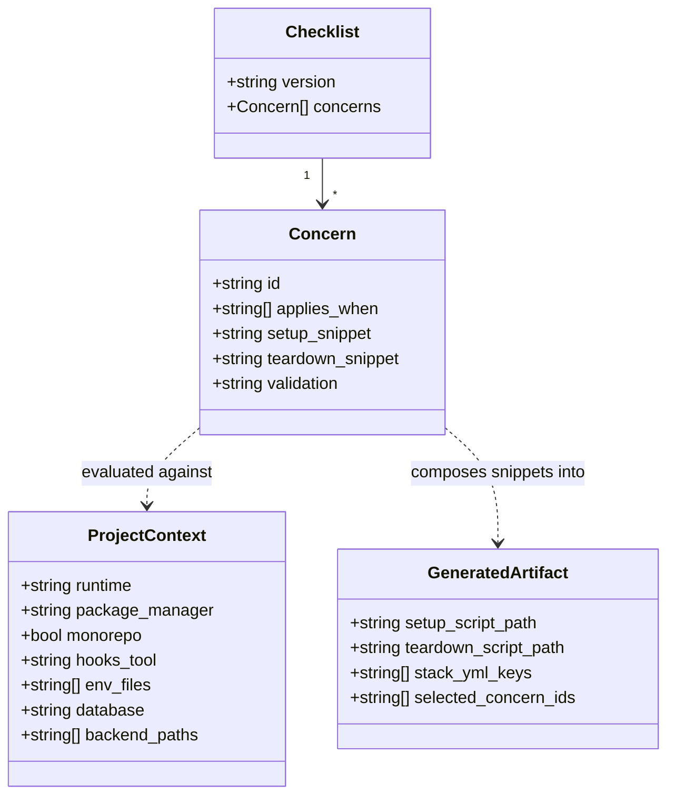
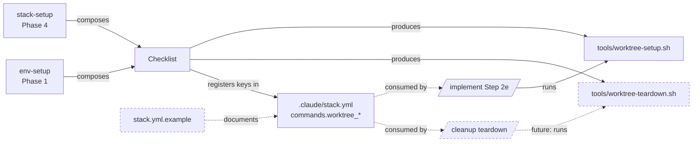

## Context

Promoted from [frame #178](../frames/178-worktree-setup-scaffold-frame.mdx). Frame established: every dev-core project hits per-runtime worktree friction (Python/uv: broken Pyright; Node/Bun: missing `node_modules` + wrong hooksPath + missing `.env`); `/implement` Step 2e already consumes `{commands.worktree_setup}` but `stack-setup` and `env-setup` never populate it. Solution: a versioned **checklist** of env-prep concerns, each carrying a **static bash snippet** + applicability rules. The scaffolder composes the matching snippets into `tools/worktree-setup.sh` per project. LLM involvement is bounded: it picks applicable concerns and orders them, but never generates shell logic free-form.

Reference implementations:
- `~/projects/lyra/tools/worktree-setup.sh` — uv symlink pattern (skip-real-dir / replace-symlink / skip-in-main)
- `~/projects/roxabi-boilerplate/CONTRIBUTING.md` + `scripts/prepare.sh` — bun install + lefthook `core.hooksPath` fix

**Invocation-semantics note:** `roxabi-boilerplate/scripts/prepare.sh` runs today via `bun install` postinstall (every install, including CI). This work re-homes the equivalent logic into a **worktree-creation post-hook** invoked once via `/implement` Step 2e (`commands.worktree_setup`). The boilerplate `prepare.sh` itself is out of scope to migrate — this spec only ships the scaffolder; project owners decide if they want to fold legacy postinstall logic into the new hook later.

## Goal

`/init` (and standalone `/stack-setup`) detects runtime+package-manager, composes a tailored `tools/worktree-setup.sh` + `tools/worktree-teardown.sh` from a static-snippet checklist, and registers both hooks in `.claude/stack.yml`, so every subsequent `git worktree add` / `/dev #N` lands in a working environment.

## Users

- **Primary:** developer running `/init` (or `/stack-setup` standalone) on a new dev-core project. Pain felt every time they spawn a worktree afterward.
- **Secondary:** developer on an existing dev-core project (already has `.claude/stack.yml`) who hits the friction and runs `/env-setup` to retrofit the hook.
- **Future contributor:** wants to add a new checklist concern (e.g. Docker volume reset, Rust `target/`) without touching skill code.

## Expected Behavior

### Walkthrough A — fresh init (primary)

1. User runs `/init` on a new Python+uv repo. `/init` calls `/stack-setup`.
2. `stack-setup` Phase 2 detects `runtime=python pm=uv`. Already does this today — unchanged.
3. **NEW in Phase 4:** before writing `stack.yml`, scaffolder reads `references/worktree-setup-checklist.md` → for each concern, evaluates `applies_when` against ProjectContext (runtime=python, pm=uv, monorepo=false, hooks_tool=lefthook, env_files=[.env], database=false) → collects matching concern snippets in declared order.
4. Scaffolder assembles the script body from `setup_snippet` blocks of selected concerns. LLM may only: (a) re-order independent concerns, (b) generate inline glue comments. It **may not** rewrite a concern's `setup_snippet`.
5. **Preview gate:** scaffolder echoes a summary: `Worktree-setup scaffold preview — Python/uv project · 4 concerns: env-files, uv-venv-symlink, lefthook-hookspath-fix, install-warmup`. Then user choice **Write scripts** | **Show diff** | **Abort**.
6. Write: `tools/worktree-setup.sh` + `tools/worktree-teardown.sh` (executable: `chmod +x`).
7. Generated `.claude/stack.yml` includes:
   ```yaml
   commands:
     # ...
     worktree_setup: tools/worktree-setup.sh
     worktree_teardown: tools/worktree-teardown.sh
   ```
8. User later runs `/dev #42`. `/implement` Step 2e expands `{commands.worktree_setup} 42` and runs it inside the new worktree. Imports resolve. Hooks point at the right path. Done.

### Walkthrough B — retrofit existing project (secondary)

1. User on a project that already has `.claude/stack.yml` runs `/env-setup`.
2. **NEW in Phase 1:** after the existing stack.yml check, env-setup detects `commands.worktree_setup` is absent AND `runtime ∈ {python, bun, node}` AND `tools/worktree-setup.sh` does not exist. Surfaces user choice **Scaffold worktree-setup hook now** | **Skip**.
3. Scaffold → delegates to the same scaffolder used by `/stack-setup` Phase 4 (preview gate included). Writes the two scripts, edits `commands:` in `.claude/stack.yml` to add both keys.
4. Skip → no-op, continues with remaining Phase 1 steps. No re-prompt on subsequent runs (state inferred from σ + filesystem).

### Walkthrough C — re-run safety (idempotency)

1. User re-runs `/stack-setup` (without `--force`). `tools/worktree-setup.sh` already exists.
2. Scaffolder skips silently. Reports `worktree-setup.sh   ⏭ Already present`.
3. With `--force`: user choice **Regenerate** (overwrite both scripts + re-write stack.yml keys) | **Keep existing** | **Abort**.

### Walkthrough D — adding a checklist concern (future contributor)

1. Contributor wants to add "Neon DB branching" concern. Opens `references/worktree-setup-checklist.md`.
2. Appends one entry:
   ```yaml
   - id: neon-db-branch
     applies_when: ["database=neon"]
     setup_snippet: |
       N="$1"; [ -d apps/api ] && (cd apps/api && bun run db:branch:create --force "$N") || true
     teardown_snippet: |
       N="$1"; [ -d apps/api ] && (cd apps/api && bun run db:branch:drop --force "$N") || true
     validation: "exit 0 when N missing; never errors fatally"
   ```
3. No skill code change. Next `/stack-setup` run incorporates the new concern automatically when `ProjectContext.database == "neon"`.

## Data Model & Consumers

### Data structure



Frozen: `Checklist` + `Concern` schemas (changes require skill bump). Mutable: `concerns[]` (additive entries, no schema change).

### Consumer map



Dashed = future/documentation-only.

### Consumer summary

| Consumer | Reads | When | Status |
|---|---|---|---|
| `/stack-setup` Phase 4 | Checklist, ProjectContext | `/init` ∨ `/stack-setup` on new project | This issue |
| `/env-setup` Phase 1 | Checklist, ProjectContext, σ | `/env-setup` on existing project | This issue |
| `/implement` Step 2e | `commands.worktree_setup` from σ | every worktree creation | Already wired |
| `/cleanup` | `commands.worktree_teardown` from σ | worktree disposal | Key registered, consumer wiring out of scope |

## Breadboard

### Affordances

| ID | Element | Type | Handler |
|---|---|---|---|
| U1 | Scaffold-on-init preview + user choice (write/diff/abort) | user choice in `/stack-setup` Phase 4 | scaffolder |
| U2 | Retrofit-existing user choice (scaffold/skip) | user choice in `/env-setup` Phase 1 | env-setup → scaffolder |
| U3 | Regenerate-on-force user choice | user choice when `--force` ∧ file exists | scaffolder idempotency branch |
| U4 | Scaffold summary echo (concern IDs, runtime, file paths) | terminal output | scaffolder before & after write |
| U5 | Retrofit-skip no-op (no state stored, re-prompts on next run only if condition re-evaluates true) | silent | env-setup |
| N1 | `references/worktree-setup-checklist.md` | reference doc with static snippets | read by N2 |
| N2 | Scaffolder logic (compose+write) | shared between `/stack-setup` ∧ `/env-setup` | inline in `stack-setup` Phase 4, called from `env-setup` Phase 1 |
| N3 | `stack.yml.example` updated with hook keys + comment | template | reference for new projects, documents N1's existence |
| S1 | `tools/worktree-setup.sh` (in user repo) | generated executable, shellcheck-clean | written by N2 |
| S2 | `tools/worktree-teardown.sh` (in user repo) | generated executable, shellcheck-clean | written by N2 |
| S3 | `commands.worktree_setup` / `worktree_teardown` keys in σ | YAML edit | written by N2 |

### Wiring

- U1 → U4 (preview) → N2 → {S1, S2, S3}
- U2 → U4 (preview) → N2 → {S1, S2, S3}
- U3 → N2 (regenerate branch) → {S1, S2, S3}
- U5 → no-op (no persistence)
- N2 reads N1 (checklist) + ProjectContext (from Phase 2 detection)
- N3 ships alongside skill changes; users opening `stack.yml.example` see the hook keys documented even if they never run the wizard

## Slices

| # | Slice | Demo | Note |
|---|---|---|---|
| 1 | **Checklist + template** — write `references/worktree-setup-checklist.md` with seed concerns (env-files, uv-venv-symlink, bun-install-warmup, npm-install-warmup, lefthook-hookspath-fix, neon-db-branch placeholder) + an "extending the checklist" section with a worked Concern entry. Update `stack.yml.example` to expose `commands.worktree_setup` + `commands.worktree_teardown` keys with explanatory comments. | `cat references/worktree-setup-checklist.md` ∧ `grep worktree_ stack.yml.example` | Review milestone, not a standalone product demo — runtime consumers ship in Slice 2 |
| 2 | **stack-setup scaffolder (Phase 4)** — when `runtime ∈ {python, bun, node}` AND scripts absent (or `--force`), evaluate ProjectContext against checklist, compose tailored `tools/worktree-setup.sh` + `tools/worktree-teardown.sh` from selected concern snippets, register both `commands.worktree_*` keys in generated σ. Preview gate (U1+U4) before write. Idempotency branch (U3) on `--force`. | `/stack-setup` on a test fixture (`/tmp/test-py-uv-repo/`) → preview shown, scripts written, σ has keys, generated `worktree-setup.sh` is shellcheck-clean and symlinks `.venv` correctly when worktree spawned |
| 3 | **env-setup retrofit (Phase 1)** — detect σ ∃ ∧ runtime ∈ scope ∧ `commands.worktree_setup` ∄ ∧ `tools/worktree-setup.sh` ∄ → surface user choice **Scaffold now** \| **Skip** → on Scaffold, call same scaffolder + edit σ to add the two keys. | `/env-setup` on a test fixture (`/tmp/test-bun-repo-no-hook/`) → prompt fires → on accept, σ updated + scripts written, shellcheck-clean |

## Success Criteria

- [ ] **SC1** — `plugins/dev-core/stack.yml.example` adds `commands.worktree_setup` + `commands.worktree_teardown` keys with comments explaining purpose and pointing at the checklist
- [ ] **SC2** — `plugins/dev-core/references/worktree-setup-checklist.md` exists with concerns for: env files copy, install command, virtualenv strategy (uv symlink), node_modules strategy (bun install, npm install), git hooksPath fix (lefthook in worktrees), Neon DB branch placeholder. Each concern entry contains `id`, `applies_when`, `setup_snippet`, `teardown_snippet`, `validation`. File includes an "extending the checklist" section with a worked example entry.
- [ ] **SC3** — `plugins/dev-core/skills/stack-setup/SKILL.md` Phase 4 detects `runtime ∈ {python, bun, node}`, evaluates ProjectContext against the checklist, and selects ≥1 concern per applicable runtime; writes `tools/worktree-setup.sh` + `tools/worktree-teardown.sh` (executable: `chmod +x`) and emits the two `commands.worktree_*` keys in the generated σ
- [ ] **SC4 (script safety contract — setup)** — scaffolded `worktree-setup.sh` satisfies: (a) skip when target dir (`.venv`/`node_modules`) is a real directory, (b) replace stale symlinks, (c) `exit 0` when invoked inside the main checkout (detect via `git rev-parse --git-dir` ≠ `git rev-parse --git-common-dir`)
- [ ] **SC5 (script safety contract — teardown)** — scaffolded `worktree-teardown.sh` satisfies: (a) only removes artifacts the matching setup created (symlinks, scratch dirs), (b) never touches files outside the invoked worktree, (c) `exit 0` when invoked inside the main checkout
- [ ] **SC6** — scaffolded scripts pass `shellcheck -S warning` with zero errors (validates the static-snippet composition produced syntactically valid bash)
- [ ] **SC7** — scaffolder echoes a preview before writing: lists detected runtime + selected concern IDs + target file paths; user must choose **Write** / **Show diff** / **Abort** via user choice
- [ ] **SC8** — re-running `/stack-setup` without `--force` and scripts present → silent skip; with `--force` → present choice prompt before overwriting
- [ ] **SC9** — `plugins/dev-core/skills/env-setup/SKILL.md` Phase 1 detects the retrofit condition and surfaces user choice **Scaffold now** | **Skip**; on Scaffold, calls the shared scaffolder and edits σ in place to add both keys
- [ ] **SC10** — running the scaffolder against `runtime=python pm=uv hooks=lefthook database=none` produces a script whose **selected concern IDs** include `env-files`, `uv-venv-symlink`, `lefthook-hookspath-fix`; running against `runtime=bun pm=bun hooks=lefthook monorepo=true database=neon` produces selected IDs including `env-files`, `bun-install-warmup`, `lefthook-hookspath-fix`, `neon-db-branch`. (Concrete reproducibility check — replaces the previous `~lyra/~boilerplate` approximation.)

## Design Constraints (¬falsifiable, but load-bearing)

- **Extension by data, not by code.** Adding a new concern requires only appending one entry to `references/worktree-setup-checklist.md` (id, applies_when, setup_snippet, teardown_snippet, validation). No edits to `stack-setup`/`env-setup` SKILL.md. The worked example in SC2 demonstrates this; the constraint itself is an architectural invariant, not a runtime check.
- **LLM scope bounded.** The model may select + order concerns and write inline glue comments. It may not rewrite a concern's `setup_snippet` or generate shell logic outside the snippets defined in the checklist. Determinism comes from the static snippet store; SC6 (shellcheck-clean) backstops it.
