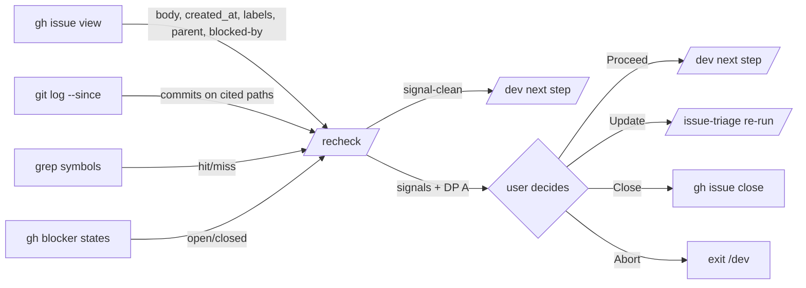

## Context

Promoted from frame [`artifacts/frames/181-add-recheck-phase-frame.mdx`](../frames/181-add-recheck-phase-frame.mdx).

`/dev` jumps from `triage → frame` (or `triage → implement` for S-tier) without verifying the issue is still relevant. Aged issues silently produce stale work. Decisions captured in conversation: standalone `/recheck` skill, no skip-logic, informative-when-clean / blocking-when-signals (user choice Proceed | Update | Close | Abort), positioned between `triage` and `frame`.

## Goal

Add a `/recheck` skill that runs between `triage` and `frame` in `/dev`, detects issue staleness via deterministic drift signals, and blocks the pipeline via user choice when any signal fires.

## Users

- **Primary:** developers running `/dev #N` on aged issues, especially S-tier (no gates).
- **Secondary:** standalone callers (`/recheck #N` outside `/dev` for ad-hoc validation).

## Expected Behavior

1. User runs `/dev #181` on an issue created 3 weeks ago.
2. After `/issue-triage` completes, `/dev` invokes `/recheck #181`.
3. `/recheck` reads issue body + metadata via `gh issue view` (created_at, body, parent/blocked-by links).
4. Runs 3 drift checks in parallel (deterministic, no LLM):
   - **git-drift:** `git log --since=<issue.created_at>` on paths/files cited in issue body → count commits.
   - **symbol-drift:** grep symbols/error-strings cited in body → flag missing (symbol no longer in tree → likely renamed/removed → premise may be invalid).
   - **dep-drift:** `gh issue view <blocker> --json state` for each `blocked-by` → flag any now closed. **Semantics:** closed blocker = signal regardless of meaning (could be "ready to proceed, re-verify scope" OR "this issue is now moot"). user choice surfaces the ambiguity; user decides.
5. If all checks clean → print `Issue still relevant.` (one line) + return silently. `/dev` proceeds to next step. **No artifact written** (per frame Out-of-Scope: no recheck-log artifact).
6. If any signal fires → present `## Drift Signals` summary (signal kind + evidence per signal) + user choice:
   - **Proceed anyway** — `/dev` continues, no mutation.
   - **Update issue first** — re-invoke `/issue-triage`, then re-run `/recheck` exactly once. If signals still fire after re-triage, user choice re-presents with **Update** removed (force a terminal decision; no infinite loop).
   - **Close as resolved/obsolete** — `gh issue close N --reason completed` + abort `/dev` (Step 7 marks task `cancelled`).
   - **Abort** — exit `/dev` cleanly, no issue mutation.

State tracking: `Σ.recheck` is session-only (`Σ_s`), like `validate` and `ci-watch` — no on-disk artifact means re-running `/dev #N` in a new session re-runs `/recheck`. Acceptable: deterministic checks are cheap and fresh state is more valuable than skip-on-resume.

Standalone `/recheck #N` outside `/dev`: same flow, but on signal-clean path prints richer summary (signals checked + counts); on signal-fire path uses identical user choice **minus** the **Update issue first** option (no `/dev` context to loop back into — user re-runs `/issue-triage` manually instead).

## Data Model & Consumers

### Data shape (in-memory only)

`RecheckResult` is ephemeral — built during `/recheck` execution, consumed by the user choice prompt, then discarded:

- `issue_number: int`
- `signals: Signal[]` — empty array on clean path
- `blocking: bool` — `true` iff `signals` non-empty

Each `Signal`:
- `kind: "git-drift" | "symbol-missing" | "dep-resolved"`
- `description: string` — one-line summary for user choice
- `evidence: string[]` — commit shas, missing symbol names, closed blocker numbers

No persistence: per frame Out-of-Scope, no `artifacts/rechecks/` is written.

### Consumer map



### Consumer summary

| Consumer | Fields consumed | When | Status |
|---|---|---|---|
| `/dev` Step 5 walker | `RecheckResult.blocking` | After triage, before frame | this issue |
| User user choice prompt | `RecheckResult.signals[]` | On signal fire | this issue |
| Standalone caller | full `RecheckResult` (stdout only) | `/recheck #N` outside `/dev` | this issue |

## Breadboard

### Affordances

| ID | Affordance | Type | Handler | Data in | Data out |
|---|---|---|---|---|---|
| U1 | `/recheck #N` standalone invoke | Skill entry | parse-args | N | issue context |
| U2 | `/dev` pipeline step | Pipeline hook | invoke-recheck | N from Σ | RecheckResult |
| U3 | user choice Proceed/Update/Close/Abort | User decision | apply-decision | signals[] | next-action |
| N1 | gh issue fetch | gh-cli | gh issue view N --json ... | N | body, created_at, labels, parent, blocked-by |
| N2 | git-drift check | bash | git log --since=<ts> -- <paths> | created_at, paths | commit count |
| N3 | symbol-drift check | bash | grep -r <symbol> | symbols | hit/miss |
| N4 | dep-drift check | gh-cli | gh issue view <blocker> --json state | blocker N | open/closed |
| S1 | signals summary print | output | format-signals | RecheckResult | stdout markdown |

### Wiring

```
U1 ──┐
     ├─→ N1 ──┬─→ N2 ──┐
U2 ──┘        ├─→ N3 ──┼─→ aggregate → if blocking: S1+U3 → apply-decision
              └─→ N4 ──┘                else: S1 (one-liner) → return
```

S2 (artifact write) intentionally absent — frame Out-of-Scope.

## Slices

| # | Slice | Demo | Independence |
|---|---|---|---|
| 1 | **Standalone `/recheck` skill** — SKILL.md + drift checks (N1+N2+N3+N4) + signals format (S1) + user choice (U3, 3 options in standalone mode). Callable as `/recheck #N`. ¬`/dev` integration. | `/recheck #181` runs end-to-end on a real issue, prints signals, accepts DP choice. | Demo-able without touching `/dev`. |
| 2 | **`/dev` pipeline integration** — Edit `dev/SKILL.md` (Σ entry, STEPS array, no-skip logic, invocation map row, Tier Skip Matrix row, Phases summary, scan-state.sh recheck output). | Run `/dev #181` (or any test issue) and observe `recheck` step fires between `triage` and `frame`. | Builds on Slice 1; doesn't change `/recheck` itself. |
| 3 | **Docs + index** — `plugins/dev-core/skills/recheck/README.md`, root `README.md` skill table row, optional `plugin.json` skill listing if applicable. | Skill index renders new entry; README explains drift signals + DP outcomes. | Pure docs; independent of code. |

## Success Criteria

- [ ] `/recheck #N` exists as a standalone callable skill (file `plugins/dev-core/skills/recheck/SKILL.md` with valid frontmatter — `name: recheck`, description, allowed-tools).
- [ ] `/recheck #N` invocation against a real GitHub issue completes in **<5s** end-to-end (deterministic checks, parallel where possible) — matches frame constraint.
- [ ] When no drift signal fires, `/recheck` prints exactly one informational line (form: `Issue still relevant.` in pipeline mode; richer summary in standalone mode) and exits cleanly with no on-disk artifact.
- [ ] When any drift signal fires in pipeline mode, `/recheck` presents user choice with exactly 4 options: Proceed anyway | Update issue first | Close as resolved/obsolete | Abort.
- [ ] In standalone mode (`/recheck #N` outside `/dev`), the signal-fire user choice presents exactly 3 options (Proceed | Close | Abort — no Update).
- [ ] `/dev #N` Step 1 (scan-state.sh) emits a `recheck=<state>` line; Σ map records `recheck` as session-only (`Σ_s`, no artifact-based persistence).
- [ ] `/dev #N` Step 5 walker visits `recheck` immediately after `triage` and immediately before `frame`.
- [ ] `/dev` skip logic returns `false` for `recheck` for every tier (S, F-lite, F-full) — no path skips it. Tier Skip Matrix in `dev/SKILL.md` shows `recheck` row with `run` in all three tier columns.
- [ ] **Update issue first** re-invokes `/issue-triage` then re-runs `/recheck` exactly once. If signals still fire on second run, user choice re-presents **without** the Update option (forces terminal decision; no infinite loop).
- [ ] Selecting **Close as resolved/obsolete** invokes `gh issue close N --reason completed` and `/dev` aborts (no further steps run, task marked cancelled).
- [ ] `plugins/dev-core/skills/recheck/README.md` documents the 3 drift signal types and both DP option sets (pipeline 4-option, standalone 3-option).
- [ ] Root `README.md` skill index includes the new `recheck` row.
- [ ] **Premise validation (post-ship integration check):** Across the first ≥3 `/dev` runs on issues aged >7 days (post-merge), at least one run produces a non-clean recheck (signal fires) — confirms the feature is doing real work and not always silent. Tracked manually for the first month; if 0/N runs fire signals after 3 months, revisit per frame failure-mode.

## Pre-check

Self-applied:

| Check | Status | Note |
|---|---|---|
| Testable criteria | ✓ | Each `- [ ]` is binary; the premise-validation criterion is a deferred integration check, falsifiable per frame failure-mode. |
| No dangling refs | ✓ | U1/U2/U3, N1–N4, S1 all appear in Slice 1 or 2. S2 removed (frame Out-of-Scope). |
| Ambiguity budget | ✓ | 0 `[NEEDS CLARIFICATION]` items. |
| Slice coverage | ✓ | Every affordance maps to ≥1 slice (U1+U3+N1–N4+S1 → Slice 1; U2 → Slice 2). |
| Edge completeness | ✓ | user choice covers 4 outcomes in pipeline, 3 in standalone; signal-clean path explicit; loop bound capped at 1 Update iteration; dep-drift semantics explicit. |
