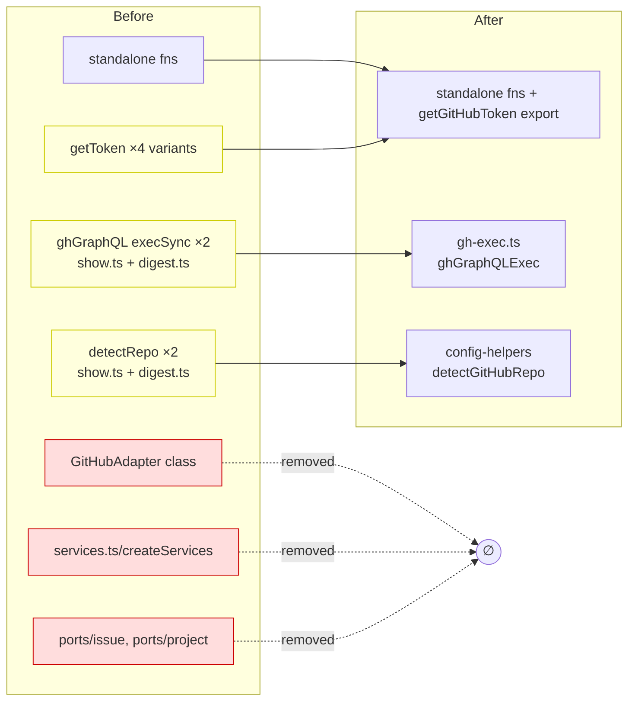

## Context

Source: [frame](../frames/192-consolidate-github-auth-adapter-frame.mdx) + consumer-map exploration of `plugins/dev-core`.

GitHub access logic in `dev-core` is reimplemented up to 5×. Four bounded dedup tasks (D1–D4). The crux (D2) is an N×2 wrong-axis duplication: a `GitHubAdapter` class **and** a parallel set of standalone functions both implement the same GitHub operations.

**Verified ground truth (exploration):**

- `GitHubAdapter` class (`github-adapter.ts:59-348`) is **dead in production**. Its only importers are `adapters/services.ts:20` (inside `createServices()`, which has **zero callers**) and `__tests__/adapters.test.ts` (structural conformance test). No skill/command/tool reaches it.
- All **8** real production consumers import the **standalone functions** from `github-adapter.ts` (`dashboard.ts`, `fetch-github.ts`, `fetch-git.ts`, `update.ts`, `create.ts`, `list.ts`, `migrate.ts`, `set.ts`).
- → "drop class, keep standalone" (issue D2) is confirmed safe.

## Goal

One canonical implementation per GitHub-access concern (token, adapter API, GraphQL-exec, repo-detect) — zero re-implementations across `dev-core`, with **no behavioral change** to live call sites.

## Users

- **Primary:** dev-core maintainers — a GitHub-access change touches one site, not 2–5.
- **Secondary:** plugin consumers — fewer drift bugs, consistent auth behavior.

## Expected Behavior

Pure refactor. Before/after, every existing command + skill behaves identically. The only observable differences are internal: a single `getGitHubToken()` export, a single `ghGraphQLExec()` helper, removal of dead class code, and reuse of `detectGitHubRepo()`.

### D1 — canonical token resolution

Today four near-identical token resolvers exist (env `GITHUB_TOKEN` → `gh auth token` fallback):

| Site | Form | On missing token |
|------|------|------------------|
| `github-adapter.ts:359` `getToken()` | module-private, **cached** | throws `GITHUB_TOKEN env var required (or gh auth login for local dev)` |
| `github-adapter.ts:73` class `getToken()` | class-private | throws (same) — removed with the class (D2) |
| `cli/commands/issues.ts:15` `resolveToken()` | inline IIFE | throws `Not authenticated. Run: gh auth login or set GITHUB_TOKEN env var` |
| `cli/lib/github-discovery.ts:18` | inline IIFE (no fn) | throws (same as above) |
| `skills/issues/lib/fetch-workflow.ts:20` `getGitHubToken()` | named | returns `''` (graceful — caller returns `[]`) |

**Resolution:** export one canonical, cached `getGitHubToken(): string` from `github-adapter.ts` that **throws** on missing token. Migrate the three external sites to import it. The one graceful caller (`fetch-workflow.ts`) keeps its non-throwing contract by wrapping the canonical call in `try/catch` returning `''` — preserving the `[]` outcome. Canonical error message standardized to the existing adapter message.

**Out of scope (noted):** `cli/commands/issues.ts` also has a local `ghGraphQL(query, token)` helper (token passed as a parameter, with its own inline auth-header construction). This is a *different* shape from both the fetch-based `ghGraphQL` and the execSync `ghGraphQLExec` (D3) and is **not** in the issue's D1–D4 list. Left untouched here; flag as a follow-up dedup candidate (it builds its own `Authorization` header rather than reusing `authHeaders`).

### D2 — drop the dead GitHubAdapter class

Keep the standalone functions (the live API). Remove the dead class and the hexagonal scaffolding reachable **only** through it:

- Remove `GitHubAdapter` class from `github-adapter.ts` (file stays — standalone fns + `parseProjectFields` export remain). Drop now-unused imports (`Issue`, `IssueFilters`, `IssuePort`, `ProjectPort`).
- Remove `adapters/services.ts` (`createServices()` — zero callers).
- Remove `ports/issue.ts` + `ports/project.ts` (orphaned once class + services gone).
- Update `__tests__/adapters.test.ts` — drop `GitHubAdapter` conformance blocks, keep `EnvConfigAdapter`. Update `__tests__/domain.test.ts` — drop `IssuePort`/`ProjectPort` type references.

**Out of scope (config axis, not GitHub-adapter duplication):** `ConfigPort` / `ports/config.ts` / `EnvConfigAdapter` (`env-config.ts`) stay as-is. They are not reached only through the class — `EnvConfigAdapter` has its own test block in `adapters.test.ts` and `env-config.ts` imports `ConfigPort` directly. **Known post-condition:** once `services.ts` (the only code that instantiates `EnvConfigAdapter` in any wiring) is deleted, `EnvConfigAdapter` + `ports/config.ts` + `env-config.ts` become production-dead (test-only). Cleanup of that config-axis dead code is **deferred — out of scope here**, documented so a reviewer reads it as intentional, not a missed deletion. Each deletion in this issue is grep-verified for zero remaining importers before removal during implement.

### D3 — extract shared `ghGraphQLExec`

`show.ts:27` and `digest.ts:33` hold byte-identical `ghGraphQL(query)` helpers (`execSync` + tmpfile + `gh api graphql --input`, query-only, auth delegated to `gh` CLI). This is a **different** execution model from the fetch-based `ghGraphQL` in `github-adapter.ts` (token + typed variables) — they are **not** interchangeable.

**Resolution:** extract the shared execSync/tmpfile helper into `skills/issues/lib/gh-exec.ts` as `ghGraphQLExec(query: string): unknown`; both `show.ts` and `digest.ts` import it. The fetch-based `ghGraphQL` export is untouched. (Tmpfile name prefix unified; no behavior change.)

### D4 — reuse `detectGitHubRepo()`

`show.ts:19` and `digest.ts:44` hold identical local `detectRepo(): { owner, repo }` using `gh repo view --json nameWithOwner`. `config-helpers.detectGitHubRepo(): string` (returns `owner/repo`) already exists with richer 3-tier resolution (yaml → env → git remote).

**Resolution:** delete both local `detectRepo`; at each call site use `const [owner, repo] = detectGitHubRepo().split('/')`. Strictly more robust, behavior-compatible.

## Data Model & Consumers

### Before → After (module surface)

### Consumer summary

| Consumer | Depends on | Change | Status |
|----------|-----------|--------|--------|
| 8 standalone-fn importers (`set.ts`, `create.ts`, `migrate.ts`, `list.ts`, `dashboard.ts`, `update.ts`, `fetch-github.ts`, `fetch-git.ts`) | standalone exports | none | this issue (unaffected) |
| `cli/commands/issues.ts`, `cli/lib/github-discovery.ts` | local token resolver | import canonical `getGitHubToken` | this issue (D1) |
| `skills/issues/lib/fetch-workflow.ts` | local `getGitHubToken` (graceful) | import canonical + try/catch wrap | this issue (D1) |
| `skills/issues/show.ts`, `skills/issues/digest.ts` | local `ghGraphQL` + `detectRepo` | import `ghGraphQLExec` + `detectGitHubRepo` | this issue (D3, D4) |
| `adapters/services.ts`, `__tests__/adapters.test.ts`, `__tests__/domain.test.ts` | `GitHubAdapter` + ports | removed / updated | this issue (D2) |

## Breadboard

Affordances = consolidated exports and their wiring.

| ID | Affordance (export) | Location (after) | Wired to |
|----|---------------------|------------------|----------|
| N1 | `getGitHubToken(): string` (cached, throws) — backs the private `authHeaders()` | `github-adapter.ts` | issues.ts, github-discovery.ts, fetch-workflow.ts, standalone fetch fns |
| N3 | `ghGraphQLExec(query): unknown` | `skills/issues/lib/gh-exec.ts` (new) | show.ts, digest.ts |
| N4 | `detectGitHubRepo(): string` | `config-helpers.ts` (existing) | show.ts, digest.ts |
| N5 | standalone fns (`getItemId`, `updateField`, …) | `github-adapter.ts` | 8 existing consumers (unchanged) |

(`authHeaders()` stays a private impl detail of N1 — not an independent affordance, so no slice owns it directly; it is exercised transitively via N1 + N5.)

Removed: `GitHubAdapter` class, `services.ts`, `ports/issue.ts`, `ports/project.ts`.

## Slices

Independently shippable; each leaves the tree green (`typecheck` + `test`).

| # | Slice | Blocked by | Files | Demo / proof |
|---|-------|-----------|-------|--------------|
| S1 | **D1** canonical token | — | `github-adapter.ts` (export `getGitHubToken`), `cli/commands/issues.ts`, `cli/lib/github-discovery.ts`, `skills/issues/lib/fetch-workflow.ts` | grep finds 1 token resolver def; smoke: `issues` CLI lists, workflow-fetch returns rows |
| S2 | **D2** drop class | **S1** | `github-adapter.ts` (remove class + `Issue`/`IssueFilters`/`IssuePort`/`ProjectPort` imports), del `services.ts`, `ports/issue.ts`, `ports/project.ts`, edit `adapters.test.ts` + `domain.test.ts` | `grep "class GitHubAdapter"` → ∅; `grep -c "EnvConfigAdapter"` in `adapters.test.ts` unchanged (that describe block preserved verbatim — only `GitHubAdapter` blocks removed); typecheck + test green |
| S3 | **D3** extract gh-exec | — | new `skills/issues/lib/gh-exec.ts`, `skills/issues/show.ts`, `skills/issues/digest.ts` | grep finds 1 `ghGraphQLExec` def, 0 local execSync `ghGraphQL` in show/digest; smoke: `issues show <N>` + `digest` render identically |
| S4 | **D4** reuse detectGitHubRepo | — | `skills/issues/show.ts`, `skills/issues/digest.ts` | `grep "function detectRepo"` → ∅ in show/digest; repo detection unchanged |

**Lane / ordering constraints (mandatory):**
- **Lane A = one agent owns S1 then S2 sequentially** — both rewrite `github-adapter.ts`; S2 removes the class only after S1's `getGitHubToken` export lands. S1 and S2 are **not** independent (shared file + ordering dep).
- **Lane B = one agent owns S3 + S4** — both edit `show.ts` + `digest.ts`; no inter-dependency, but same-file pair → single owner avoids merge conflicts.
- Lane A ∥ Lane B (disjoint file sets).

## Success Criteria

- [ ] `grep -rn 'gh auth token' plugins/dev-core --include='*.ts'` returns exactly **one** resolver definition (`getGitHubToken` in `github-adapter.ts`); the 3 external dup sites import it.
- [ ] `getGitHubToken` is exported from `github-adapter.ts`, cached, and throws on missing token; `fetch-workflow.ts` preserves its non-throwing `''` contract via wrap.
- [ ] `grep -rn 'class GitHubAdapter' plugins/dev-core` returns **zero** matches; `services.ts`, `ports/issue.ts`, `ports/project.ts` are deleted.
- [ ] No remaining importer references `GitHubAdapter`, `createServices`, `IssuePort`, or `ProjectPort` (grep ∅, excluding deleted files).
- [ ] `skills/issues/lib/gh-exec.ts` exists exporting `ghGraphQLExec`; `show.ts` + `digest.ts` import it; no local `ghGraphQL` execSync helper remains in either.
- [ ] No local `detectRepo` remains in `show.ts`/`digest.ts`; both use `detectGitHubRepo()`.
- [ ] `ConfigPort` / `EnvConfigAdapter` / `ports/config.ts` are untouched (out of scope).
- [ ] `bun run typecheck` passes.
- [ ] `bun run test` passes (adapter + domain tests updated, not just deleted).
- [ ] `bunx biome check` clean on all changed files.
- [ ] No behavioral change — **verified by the per-slice manual smoke checks** (Slices "Demo / proof" column), since no automated e2e exists: S1 → `issues` CLI + workflow-fetch; S3/S4 → `issues show <N>` + `digest`; S2 → typecheck + unit suite green with `EnvConfigAdapter` coverage retained. This criterion is met when every slice's smoke check passes, not by an automated assertion.
